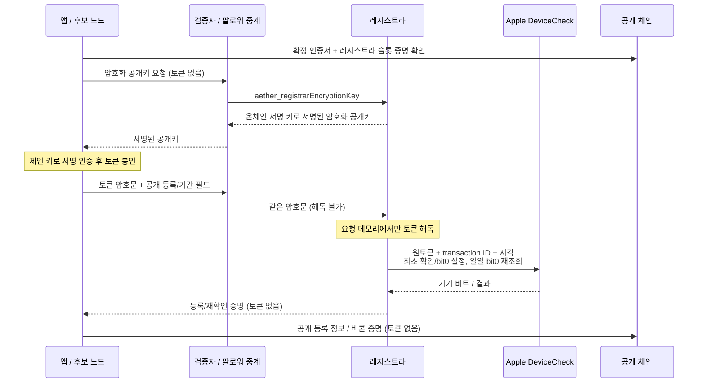

# 14. 투표 노드 등록 기준

투표 노드 후보가 되려면 레지스트라의 등록 증명이 필요합니다. 이 문서는 레지스트라가 무엇을 확인하고 무엇을 거부하는지 공개합니다(12-launch-plan.md 결정 기록 "레지스트라", 13-protocol-2.md §4). 코드: `crates/node/src/devicecheck.rs`(레지스트라), `contracts/src/CommitteeRegistry.sol`(온체인 기록), `crates/execution/src/registry.rs`.

## 1. 원칙

- **무료입니다.** 레지스트라는 돈을 받지 않습니다. 등록 트랜잭션도 블록이 혼잡하지 않으면 수수료가 0입니다(R1′).
- **기계적입니다.** 사람이 심사하지 않습니다. 아래 조건을 모두 채우면 등록되고, 하나라도 어기면 거부됩니다. 신원·국적·잔액은 묻지 않습니다.
- **기기 1대 = 투표 키 1개.** Mac 여러 대를 가진 사람은 여러 후보를 가질 수 있습니다. 대신 Mac마다 따로 등록해야 합니다.
- 레지스트라는 후보 풀의 입구만 지킵니다. 블록 확정, 송금, 체인 정지, 추첨 결과에는 권한이 없습니다.

## 2. 절차

1. Aether 앱이 Apple DeviceCheck 토큰을 만듭니다. 이 토큰은 Apple이 서명하고, 그 Mac과 우리 팀의 앱에 묶여 있습니다.
2. 앱(또는 `aether` CLI)이 체인에서 인증한 레지스트라의 암호화 키로 토큰을 암호화하고 RPC `aether_registerDevice`로 보냅니다: **암호화된 토큰**, 운영자 주소, 투표 키(ed25519), iroh 노드 ID, 생존 신호 계정(beaconer), 소유 증명 서명. 중계하는 검증자·팔로워는 토큰 원문을 받지 않습니다(2″절).
3. 레지스트라가 3절을 확인하고, 통과하면 P-256 등록 증명(r, s)을 돌려줍니다. 서명 대상은 `sha256(abi.encode(chainid, CommitteeRegistry 주소, 운영자, 투표 키, 노드 ID, beaconer))`입니다.
4. 운영자 지갑이 이 증명을 담아 `CommitteeRegistry.register`를 호출합니다. 호출한 주소가 그 후보의 운영자가 됩니다. 컨트랙트가 증명을 레지스트라 공개키로 검증합니다(P256VERIFY). 잔액이 없어 이 호출에 수수료를 낼 수 없으면 4′의 무료 등록 레인으로 같은 등록을 합니다.
5. 그 뒤 노드는 에포크마다 beaconer 계정으로 생존 신호를 보냅니다. 추첨 자격은 07-consensus.md "열린 위원회"를 따릅니다.

## 2′. 무료 등록 레인 (G2, 2026-09-29)

처음 지갑을 깔면 잔액이 0이라 4절의 호출조차 못 하는 순간이 있습니다. 등록은 언제나 무료여야 하므로, 등록 항목을 거래 대신 **블록 페이로드의 무수수료 항목**으로 싣습니다(비콘 답과 같은 방식, [22-gas-pool.md](22-gas-pool.md) 2층).

- 앱의 절차는 같습니다: 증명을 받아(`aether_registerDevice`) 그대로 `prepare_register_node`에 넣으면, 노드가 `aether_status`의 `free_registration`을 보고 무료 경로를 골라 **운영자 지갑이 서명할 메시지**(체인 ID, 레지스트리 주소, 등록 내용 전부, 레인 논스, 만료)를 돌려줍니다. `submit_signed`가 항목을 `aether_sendRegistration`으로 보내고, 제안자가 다음 블록에 싣습니다. 수수료도 잔액도 필요 없습니다.
- 운영자 지갑 서명이 있어야 합니다(도메인 분리). 증명을 주워 남의 등록을 중계할 수는 없고, 항목은 운영자별 논스로 정확히 한 번 소비됩니다.
- 블록이 확정되면 항목 해시로 가스 0 영수증이 나와, 앱의 기존 `receipt` 폴링이 그대로 돌아갑니다.
- node_rewards 제네시스 플래그가 켠 네트워크에서만 켜집니다(테스트넷 7780 규칙 불변).

## 2″. DeviceCheck 토큰의 종단간 암호화와 일일 재확인 (R18)

QUIC/TLS만으로는 요청을 처리하는 검증자로부터 원문을 숨길 수 없으므로, 토큰 자체를 앱·후보 노드에서 먼저 암호화합니다. 중계 노드가 알 수 있는 것은 암호문과 등록/재확인에 필요한 공개 필드입니다. 원토큰을 해독할 수 있는 서버는 현재 레지스트라뿐입니다.

1. 앱은 신뢰하는 배포본의 `network.json`에 있는 **레지스트라 서명 공개키 pin**을 먼저 요구합니다. `CommitteeRegistry` 저장 슬롯 0·1의 키를 같은 상태 높이의 EIP-7864 증명 + 위원회 확정 인증서로 확인한 뒤, 이 pin과 정확히 같은 P-256 점인지 비교합니다. pin 누락·잘못된 점·불일치에서는 토큰을 보내지 않습니다. 빈 블록에는 체인 ID가 없을 수 있고 여러 체인이 위원회 키를 공유할 수 있으므로, 확정 인증서만으로 원격 응답이 다른 레지스트라를 선택할 수 없게 합니다. 위원회 키·체인 ID·인증서의 시각·높이 검증도 유지합니다. 후보 노드의 일일 재확인은 자신이 제네시스부터 검증한 확정 상태의 동일 슬롯을 사용합니다.
2. `aether_registrarEncryptionKey([])`는 `{version, chain_id, public_key, signature}`를 반환합니다. 레지스트라가 프로세스 메모리에 만든 별도 P-256 암호화 공개키에 기존 온체인 레지스트라 키가 도메인 분리 서명합니다. 클라이언트는 1에서 확인한 공개키로 서명을 검증한 뒤에만 토큰을 암호화합니다. 서명 전용 Secure Enclave 헬퍼는 이 키 바인딩 메시지만 서명하며 토큰이나 암호화 비밀키를 받지 않습니다.
3. 토큰은 P-256 ECDH → SHA-256 ANSI X9.63 KDF → ChaCha20-Poly1305로 봉인합니다. 요청마다 새로운 임시 비밀키·nonce를 사용합니다. 인증 데이터에는 체인 ID, 정규 RPC 메서드명, **토큰 뒤의 공개 매개변수 전부**, 수신·임시 공개키와 nonce가 포함됩니다. 다른 운영자·키·노드·beaconer·기간·소유 서명·체인·메서드로 옮긴 암호문은 해독되지 않습니다.
4. 최초 등록의 매개변수는 `[envelope, operator, validator_key, node_id, beaconer, ownership]`, 일일 재확인은 `[envelope, validator_key, period, ownership]`입니다. `envelope`는 `{version, recipient, ephemeral, nonce, ciphertext}`이며 바이트 필드는 hex입니다. 중계 RPC도 원문 문자열·잘못된 envelope·8 KiB를 넘는 토큰에 해당하는 암호문을 **상위 노드에 전달하기 전에** 거부합니다. 원문으로 다시 보내는 호환 경로는 없습니다.
5. 레지스트라는 현재 온체인 서명 키가 자신의 키인지 다시 확인하고, 토큰을 요청 메모리에서 해독하여 Apple의 `query_two_bits`로 확인합니다. 최초 등록 때만 `update_two_bits`로 bit0를 설정합니다. 이미 등록된 키의 동일 바인딩에 대한 재발급은 Apple 호출 없이 처리합니다. node_rewards 네트워크의 일일 재확인은 새 토큰으로 bit0를 다시 조회하며 매일 레지스트라→Apple 전송이 발생합니다. Apple 요청에는 토큰 외 임의 transaction ID와 요청 시각이 포함됩니다.
6. 암호화 비밀키는 디스크에 저장하지 않고 레지스트라 프로세스가 끝날 때 사라집니다. 재시작으로 예전 수신 키가 사라지면 클라이언트는 새 서명된 키를 인증하고 **새 암호문으로** 최대 두 번 시도합니다. 인증 실패, 온체인 키 교체·중지, 잘못된 인증서·증명에서는 원문 전송 없이 실패합니다. Apple 오류 본문은 토큰을 되돌려 보낼 수 있으므로 RPC·노드 로그에 전달하지 않고 오류 범주/HTTP 상태만 반환합니다.

`aether candidate-register`는 `--network <network.json>` 또는 `<data>/network.json`의 위원회·레지스트라 서명 키 pin으로 동일하게 슬롯을 인증합니다. pin 없이 실제 토큰을 보내지 않습니다. 공개 개발용 위원회와 개발 레지스트라 pin은 명시적인 `--devnet`에서만 쓸 수 있고, 이 모드는 가짜 토큰 `dev`만 허용합니다. **레지스트라 키를 위원회가 교체한 뒤에는 신뢰하는 경로로 배포된 `network.json` pin을 갱신해야 다음 실제 토큰을 보낼 수 있습니다.** 이전 pin과 새 확정 슬롯이 다르면 계속 거부하며 원격 RPC가 pin을 자동으로 바꾸는 경로는 없습니다.

회귀 검증은 `crates/node/src/devicecheck_privacy_tests.rs`에서 실제 `handle_remote_value` → `Upstream` HTTP 요청 JSON을 캡처합니다. 최초·일일 성공, 암호문·공개 필드 변조, 다른/만료 키, 원문·과대 입력 거부를 확인합니다. Apple이 원토큰을 오류 본문에 되돌려주는 경우도 별도 테스트로 확인합니다. `crates/ffi/src/lib.rs`의 등록 개인정보 테스트는 실제 지갑 요청 생성 함수의 JSON과 레지스트라 저장 증명 변조 거부를 검사합니다.

## 3. 레지스트라가 확인하는 것

| 조건 | 확인 방법 |
|---|---|
| 소유 증명 | 요청이 등록하려는 투표 키 자신의 ed25519 서명이어야 합니다(네임스페이스 `aether-candidate-ownership`, 3절의 서명 대상과 같은 데이터). 남의 투표 키를 선점할 수 없습니다. |
| 노드 ID | 32바이트가 유효한 iroh 노드 ID여야 합니다. |
| DeviceCheck 토큰 | Apple이 이 토큰을 유효하다고 답해야 합니다. 진짜 Apple 기기와 우리 팀 앱에서 나온 토큰만 통과합니다. |
| 기기당 1회 | Apple의 기기별 비트(재설치해도 남음)로 이 Mac이 이미 등록했는지 봅니다. 처음이면 비트를 켭니다. |
| 같은 키의 재등록 | 이미 등록한 투표 키는 처음과 같은 운영자·노드 ID·beaconer로만 다시 증명을 받습니다. 이때는 DeviceCheck를 다시 부르지 않습니다. |

## 4. 체인이 거는 한도

- **에포크당 신규 등록 16건**(`MAX_PER_EPOCH`). 프로토콜 2부터 CommitteeRegistry v2에 적용됩니다. 레지스트라 키를 도난당해도 후보 풀을 한꺼번에 채울 수 없습니다. **무료 등록 레인이 같은 에포크 수를 공유**합니다(같은 저장 슬롯): 두 경로를 합쳐 16건이고, 17번째는 레인이든 컨트랙트든(`TooManyThisEpoch`) 다음 에포크를 기다립니다. 레인에는 블록당 4건 상한이 따로 있습니다(항목당 P-256 검증 2회).
- **무료 등록 레인의 결정성**: 레인 항목의 서명·논스·만료·에포크 수 검증은 모두 순수 계산이라, 하나라도 틀린 항목을 실은 블록은 무효입니다(노드별로 스킵하지 않음).
- 테스트넷 7780은 기존 최소 streak(기본 24에포크)와 가동률 95%를 유지합니다. 새 제네시스(`node_rewards`와 이력 v2)의 레지스트리 v3에서는 등록 후 최소 24에포크가 지난 뒤, 최근 4에포크 중 3에포크 이상에서 비콘 절반 이상에 답하고 최근 6에포크에 **예고하지 않은** 저응답이 없어야 합니다. 현재 시간대의 온체인 가용성 프로필도 50% 이상이어야 합니다(아직 관측하지 않은 시간대는 허용). 한 번에 바뀌는 자리는 기존처럼 1/3 미만이며 운영자 좌석 상한도 유지합니다.
- **레지스트라 키 교체:** 위원회가 임계 서명한 업그레이드에 `registrar` 필드를 넣으면, 활성화 블록에서 키가 바뀝니다. 창업자가 없어지거나 키를 도난당했을 때 씁니다. 레지스트라 혼자서는 키를 바꿀 수 없습니다.
- **등록 중지:** `registrar`를 0으로 두면 어떤 증명도 검증되지 않아 새 등록이 멈춥니다. 이미 등록한 후보는 그대로 남습니다.

## 5. 체인에 기록되는 것

- 후보마다: 운영자 주소, 투표 키, 노드 ID, beaconer 주소, 등록 에포크, 마지막 생존 신호 에포크, streak, 놓친 에포크 수.
- 레지스트리 v3에서는 후보 번호마다 마지막 예고 상태(블록 높이와 떠남/돌아옴)를 별도로 기록합니다. 투표 키가 서명한 무료 비콘도 같은 상태를 기록합니다. 서명은 적용할 블록 높이에 묶여 오래된 퇴장 신호를 다시 쓸 수 없습니다. 최근 안정성·당일 예고 수면 시간은 보상 저장소의 별도 슬롯에 둡니다.
- 이벤트: `Registered(index, operator, validatorKey, nodeId)`, `Beacon(index, epoch, streak)`.
- 레지스트라 공개키와 에포크별 등록 수. 무료 등록 레인은 같은 후보 단어를 쓰고, 운영자별 레인 논스만 태그 슬롯에 따로 더합니다(컨트랙트 슬롯과 겹치지 않음).
- **공개 체인에 기록하지 않는 것:** DeviceCheck 토큰과 암호문, 기기 식별 정보, IP 주소. 위의 주소·키·등록 및 생존 이력은 공개 체인과 과거 블록·아카이브에 남습니다. 노드를 끄거나 후보에서 빠져도 이미 공개된 이력을 회수·삭제할 수 없습니다.

### 레지스트라와 로컬 앱의 보유 범위

| 데이터 | 위치·목적 | 실제 보유 / 삭제 범위 |
|---|---|---|
| DeviceCheck 원토큰 | 생성한 Mac, 레지스트라의 Apple 요청 메모리, Apple | 레지스트라는 원토큰을 파일에 저장하지 않습니다. 앱은 일일 재확인용 토큰을 로컬 `devicecheck-token` 파일(0600)에 쓰고 시작 시·매시간 새 값으로 덮어씁니다. 파일은 삭제·덮어쓰기 전까지 남습니다. Apple 측 보유는 Apple의 처리 범위이며 레지스트라의 삭제로 없어지지 않습니다. |
| 레지스트라 암호화 비밀키 | 레지스트라 프로세스 메모리 | 프로세스 종료까지. 저장 파일 없음. |
| 투표 키 → 등록 시각·운영자·노드 ID·beaconer 바인딩 | 레지스트라의 `registrations.json`; 같은 키의 재발급과 일일 재확인 자격 확인 | 자동 만료·30일 파기 없음. 삭제 가능한 서비스 파일이지만 운영자 검토가 필요하며 삭제 후 일일 재확인이 거부될 수 있습니다. 이 파일 삭제는 체인 이력이나 Apple bit0를 지우지 않습니다. |
| 등록 진행 중 토큰 해시 | 레지스트라 메모리; 동시 동일 토큰 요청 제한 | 요청이 끝나면 제거. |
| 성공한 재확인의 투표 키·토큰 해시·기간 | 레지스트라 메모리; 같은 기간 중복 제한 | 다음 성공 시 현재와 직전 두 기간만 남기도록 정리. 프로세스 종료 시 전부 사라짐. 원토큰·별도 감사 로그 파일은 없음. |

등록 애플리케이션 코드는 IP 접속 기록을 이 파일들에 저장하지 않습니다. 네트워크 종료점은 통신 상대 IP를 볼 수 있으므로 이 사실을 “IP가 누구에게도 보이지 않는다”는 뜻으로 해석하지 않습니다. 삭제 가능한 레지스트라 서비스 데이터의 삭제는 개인정보 처리방침의 연락 경로로 운영자에게 요청합니다.

### 예고 퇴장과 복귀 (새 제네시스)

앱은 잠자기·전원 종료 직전과 배터리 전환 시 로컬 노드에 `leaving`을 요청하고, 깨어나거나 전원이 돌아오면 `back`을 요청합니다. 노드는 등록된 투표 키로 체인 ID·다음 블록 높이·상태에 서명하여 수수료 없는 비콘 경로로 보냅니다. 레지스트리는 마지막 떠남 높이를 복귀 뒤에도 보관하여 같은 에포크에 복귀한 경우까지 예고 수면으로 판정합니다. 긴 예고 수면 뒤 돌아와 답하면 streak는 이어지고 놓친 에포크를 더하지 않습니다. 예고한 후보는 추첨에서 빠지고, 예고한 위원은 다음 에포크 경계에서 조기 교체 대상이 됩니다. 일반 조기 교체 상한은 그대로이며, 4~5석에서는 예고 퇴장에 한해 남은 옛 위원이 정족수를 채울 수 있으므로 한 자리까지 인계합니다(무단 이탈은 기존처럼 교체하지 않음). **잠자기 직전에 신호를 보냈어도 블록 확정과 인계가 끝나기 전에는 좌석이 남아 있습니다.** 따라서 모든 위원이 동시에 잠들어도 멈추지 않는다는 보장은 아닙니다. 앱이 꺼져 신호를 보낼 수 없었던 이탈은 기존 무응답 경로로 처리합니다.

배터리에서 노드를 멈추도록 설정한 경우에도, 이미 배석된 Mac은 인계로 자리에서 내려올 때까지 노드를 계속 실행합니다. 강제 잠자기나 즉시 종료는 인계를 기다릴 수 없으므로 남은 위원들이 정족수를 유지해야 합니다.

## 6. 거부 사유

레지스트라(RPC 오류 메시지):

| 사유 | 메시지 |
|---|---|
| 투표 키 서명이 없거나 틀림 | `not signed by the voting key being registered` |
| 노드 ID가 iroh ID가 아님 | `device token rejected by Apple: node id is not a valid iroh id` |
| Apple이 토큰을 거부 | `device token rejected by Apple: …` |
| 이 Mac이 이미 등록함, 또는 등록된 키를 다른 운영자·노드·beaconer로 다시 요청 | `this Mac already has a registered node` |
| Apple 서버 오류 | `DeviceCheck: …` (나중에 다시 시도) |
| 원문 토큰·잘못된/과대 암호문 | `param 0 must be a bounded encrypted DeviceCheck token` / `invalid encrypted DeviceCheck token` |
| 수신 키가 레지스트라 재시작으로 사라짐 | `registrar encryption key expired; fetch a fresh authenticated key` |
| 암호문·요청 필드 변조 | `encrypted DeviceCheck token could not be authenticated` |
| 이 노드가 레지스트라가 아님 | `this node does not register devices` |

컨트랙트(`register` 되돌림):

| 사유 | 오류 |
|---|---|
| 이미 등록된 투표 키 | `Known` |
| 증명이 지금 레지스트라 키로 검증되지 않음(다른 체인·다른 운영자 주소로 제출, 키 교체·중지 이후 등) | `BadAttestation` |
| 이번 에포크 등록 16건이 참 | `TooManyThisEpoch` (다음 에포크에 다시) |

## 7. 한계

- 레지스트라는 지금 창업자가 운영합니다(DeviceCheck 키 .p8이 필요). 레지스트라가 등록을 거부하면 새 후보가 들어올 수 없습니다. 이 경우의 대응은 위원회 업그레이드로 키를 바꾸는 것입니다.
- **레지스트라 키 침해(F-06, 감사 2026-10-05).** 등록 증명은 단일 P-256 키의 서명입니다. 그 키가 도난·남용되면 공격자가 조종하는 후보(운영자·투표 키·노드 ID)를 계속 후보 풀에 심을 수 있습니다 — 에포크당 16건 한도는 속도를 늦출 뿐 막지 못하고, 최종 의결권 선정은 별도의 합의 규칙이라 즉시 자금이 나가는 사고는 아닙니다. 그래도 운영 통제가 필요합니다: (1) 레지스트라의 발급을 상시 모니터링하여 낯선 운영자의 급증·비정형 패턴에 경보, (2) 4절의 위원회 키 교체로 폐기·순환하는 절차를 사고 전에 리허설, (3) 사고 런북(발견 → `registrar`를 0으로 두어 등록 중지 → 키 교체 → 재개)을 문서로 둡니다. 새 제네시스 전에는 임계 승인 발급이나 한정·모니터링 발급으로 구조를 바꾸는 방안을 검토합니다.
- 운영자는 지갑 주소로 구분합니다. Mac 여러 대와 주소 여러 개를 가진 한 사람은 운영자 상한을 피할 수 있습니다. 막는 것은 DeviceCheck(Mac 1대 = 1표)와 교체 속도 제한입니다.
- 로컬 devnet(`--dev-registrar`)은 Apple 확인 없이 모든 기기를 등록합니다. testnet과 mainnet에서는 쓰지 않습니다.
