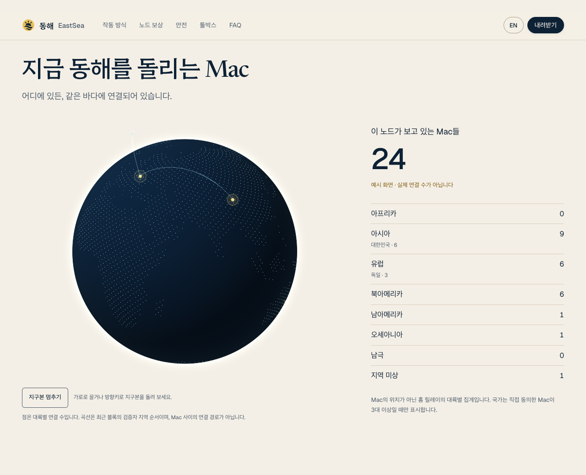
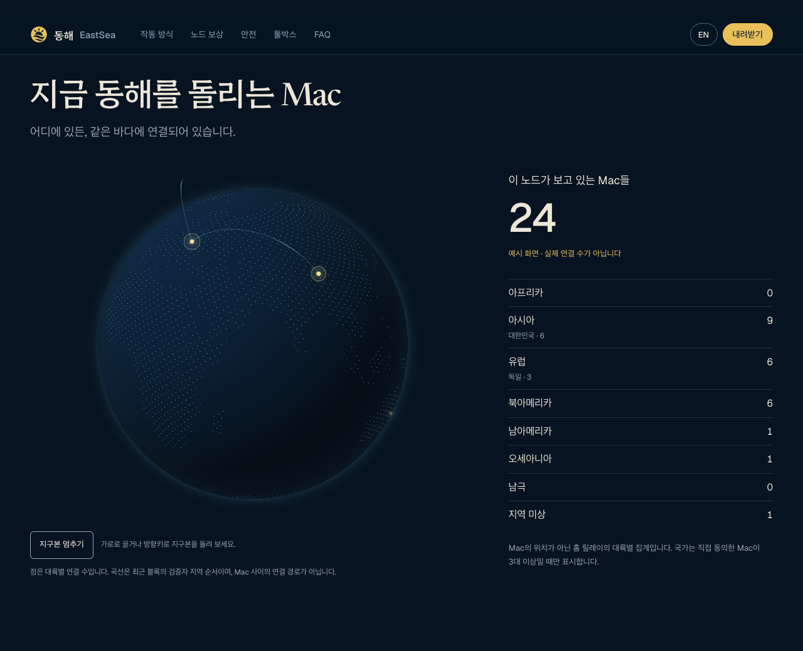
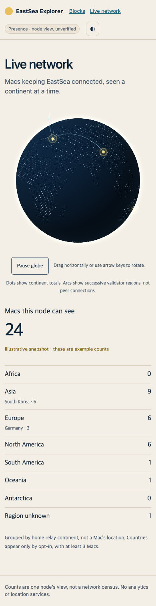
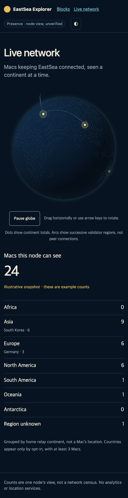
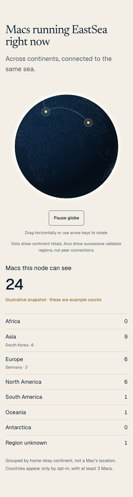
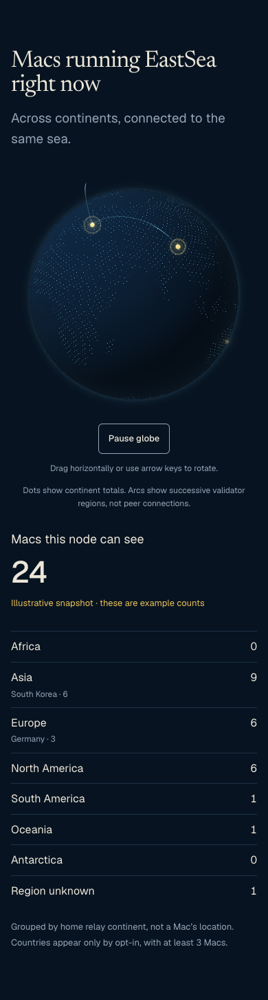
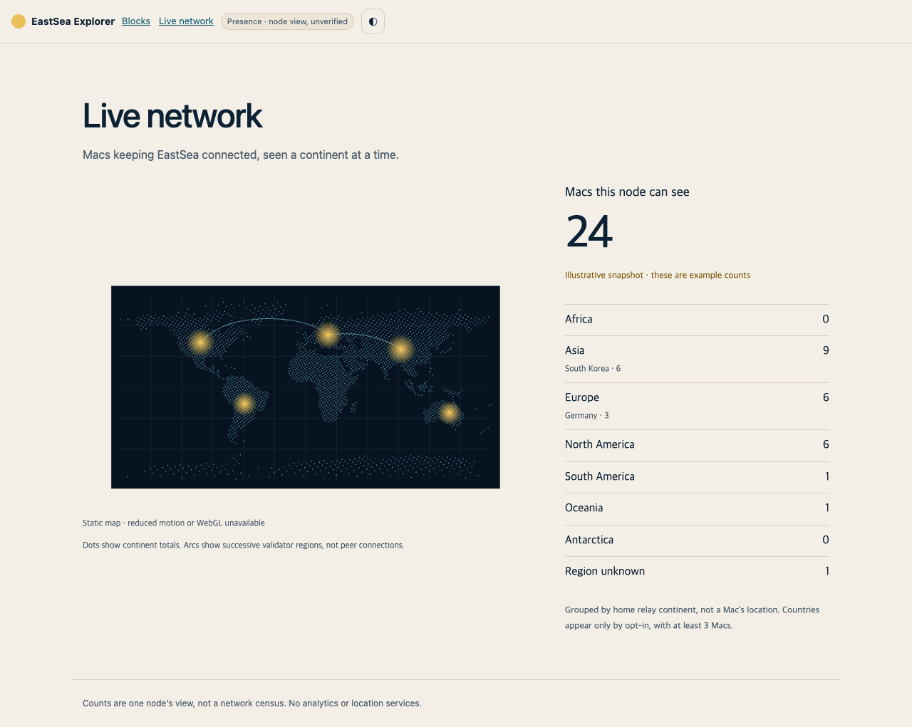
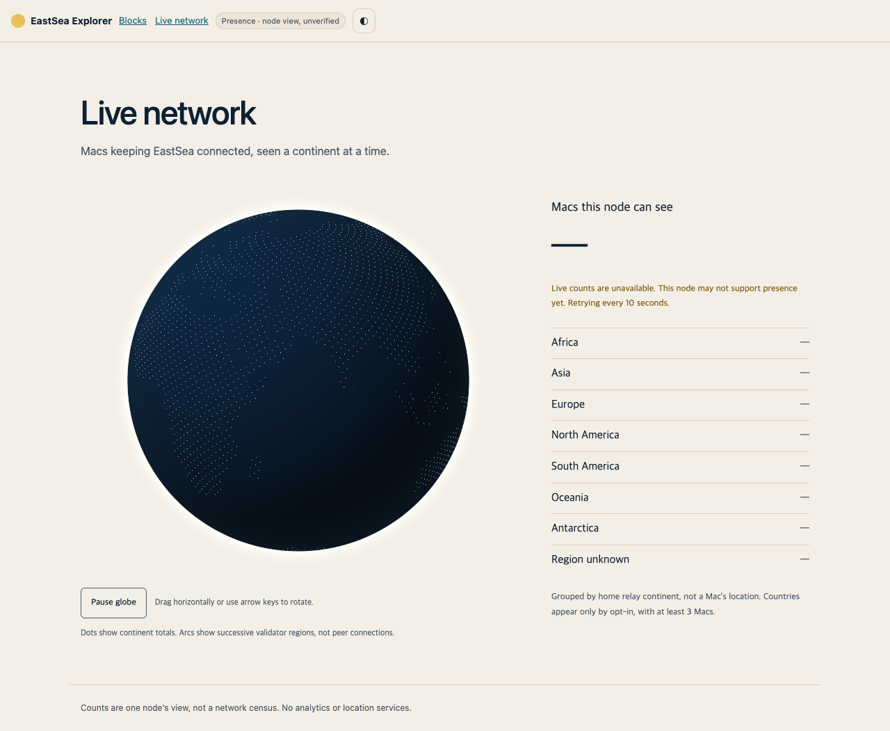
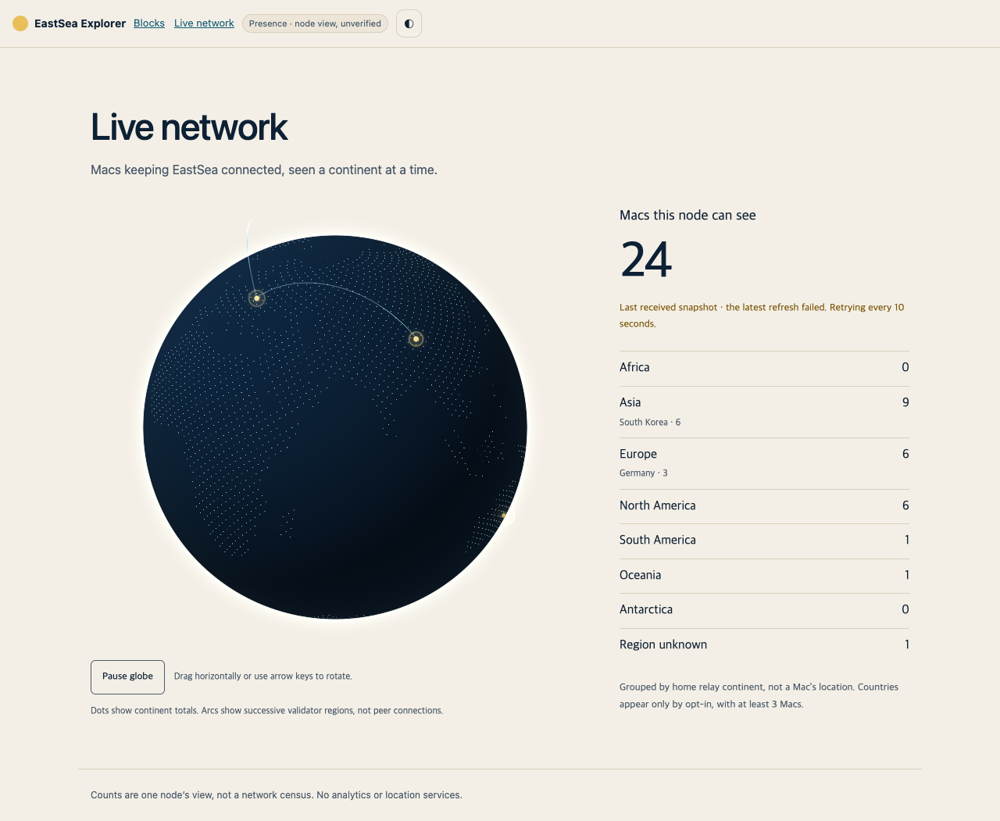

# Readable live network globe — continuous Quality, v3 (0.7.4)

Owner: `codex/live-globe`. Presence producer: sibling `codex/live-peers`.
This is the public aggregate contract. The producer must adopt v3 and
`quality_version: 1` before the lead enables live data. This lane changes only
web code, fixtures, tests and documentation; it performs no deployment or
installed-app/testnet changes.

## Readability and disclosure

The opening view centers the largest group within the most populated known
continent, including session jitter; today's snapshot opens toward Korea/Asia. Thin Natural Earth coastlines,
10,385 high-contrast land dots, a faint 30-degree graticule and an atmosphere rim
make the globe readable. It rotates slowly at 0.025 radians/second. Dragging,
keyboard input, pulse selection and list interaction hold rotation until
10 seconds of inactivity. A retained selection does not prevent the idle
timeout; manual pause persists until resumed.

Each disjoint country or continent-only bucket gets one pulse at its bundled
representative centroid, with bounded session jitter. A country pulse appears
only when that country has at least three Macs within its home-relay continent;
the remaining Macs share a separate continent pulse. Korea 3 plus Asia 1 is
therefore four Macs, never a country subset overlaid on a four-Mac pulse.
Pulse diameter follows a bounded square-root count scale. Color is the group's
population-weighted mean Quality, interpolated continuously from the theme's
accent to success color. There is no founder core, independent ring share,
identity bonus, named tier or count of Macs in a named quality band. Founder
Macs use exactly the same score and presentation as every other Mac. The site's
existing FAQ disclosure of founder allocation remains unchanged.

The legend is one gradient with only these endpoint labels:

- **New** / **새로 합류**
- **Long, steady operation** / **오래·성실하게 운영**

Its size caption is **Dot size = Macs connected; countries at 3 Macs, otherwise
continents** / **점 크기 = 연결된 Mac 수, 3대 이상은 국가별 · 나머지는 대륙별**.
Country entries and continent totals have a smooth density strip and a mean
tick on this same gradient. The strip uses 21 peak-normalized samples
interpolated between neighboring storage bins; it conveys spread, not tier
counts. Its accessible text gives the mean and occupied numerical range.

Continent rows include country subtotals and report the population-weighted
mean of all their Macs. Country rows select their own pulses. Hovering/tapping
a pulse or list row highlights the linked surface; keyboard users can focus
region buttons, move among populated rows and rotate the canvas. Behind-the-globe
pulses are hidden and their rows explicitly say **Far side of globe · highlighted
here** / **지구본 뒷면 · 목록에서 확인**. Unknown continent-only buckets remain in
the list without an invented position. Labels are measured outside the animation
loop, clamped to the stage and spaced to avoid collisions. Crowded static maps
use a taller stage.

## Today's manual snapshot

The supplied snapshot is dated **2026-10-08** and labeled **Today’s actual setup
(not live)** / **오늘 기준 실제 구성 (실시간 아님)**: Asia **4 Macs**, Korea **3**;
validators **4**; wallet nodes **3**; reserve keys **3 standby, 0 seated**.
The supplied operating durations are **152, 24, 10 and 9 hours**. Uptime/missed
and accepted-proof measurements were not supplied. The fixture therefore uses
only the conservative `0.65 × T` time component (`U = P = 0` means unknown
evidence here, not measured failed operation), rather than inventing misses or
proofs. These are manual connected-snapshot lower bounds, not freshly queried
on-chain quality measurements or independently verified contiguous beacon hours.

| Supplied duration | Conservative quality | Floored millionth units |
| --- | --- | --- |
| 152 hours | 0.12370533696080536 | 123705 |
| 24 hours | 0.021309534686696163 | 21309 |
| 10 hours | 0.008965374116454459 | 8965 |
| 9 hours | 0.008074429678977072 | 8074 |

The fixture arranges the first three durations in KR's three-Mac bucket and
9 hours in Asia's remaining one-Mac bucket. This is the supplied/inferred manual
layout used for the dated example, not a live country assignment discovered
from addresses or a claim about physical location. It yields KR `score_sum:
153979`, the remainder `8074`, and a four-Mac mean of `162053 / 4 / 1000000`.
No addresses or individual presence records are published. No recent block
events are fabricated. The former 24-Mac example remains only in
`apps/explorer/test/fixtures/presence-example.json` for regression coverage.
A failed live request never substitutes these fixture counts.

## Quality gradient

Continuous quality model: `quality_version: 1`.

The pure reference implementation is `apps/explorer/live-globe/quality.js`.
Quality is a real-valued score in `[0, 1]`, not a rank, age tier, balance score,
proof-volume competition, identity privilege or consensus/reward weight.
For a reconstructed successful-beacon segment:

```text
onlineHours  = successful segment epochs × epochHours
absenceEpochs = max(0, finalizedEpoch - 1 - lastSuccessfulEpoch)
absentHours   = absenceEpochs × epochHours
observedEpochs = lastSuccessfulEpoch - firstSegmentEpoch + 1 + absenceEpochs
U = successful segment epochs / observedEpochs
P = distinct accepted-proof epochs matching successful segment epochs
    / successful segment epochs
T = 1 - exp(-onlineHours / 720)
Q = clamp(T × (0.65 + 0.25 × U + 0.10 × U × P)
          × 2^(-absentHours / 72), 0, 1)
```

Time is dominant: the maturity time constant is **720 hours (30 days)**;
uptime contributes up to **0.25**, and accepted-proof coverage adds at most
**0.10**, scaled by uptime. Repeated proofs in one epoch cannot increase `P`
past its single successful-epoch contribution or make `P > 1`. A Mac with no
actual successful beacons scores zero. Registration's initial registry
`streak = 1` is not a beacon hour. All durations must be finite and nonnegative;
`epochHours` must be positive, epochs must be nonnegative safe integers and
`U`/`P` must lie in `[0, 1]`.

The producer reconstructs successful epochs from actual validated beacon
answers in finalized chain evidence. One or more accepted answers identify a
successful epoch; twelve answers in one epoch still earn one epoch of time.
Only completed epochs `registeredEpoch <= n < finalizedEpoch` count. Deduplicate
and sort them, then walk backward from the last successful epoch. A hole of
**24 missing hours or more** starts a new segment at the later success; shorter
holes remain in the same segment and reduce `U`. Use the chain's epoch duration,
not an assumption that every network's epoch lasts one hour. Registration age,
process uptime, self-reported presence and announced availability cannot create
beacon credit.

Absence has a **72-hour half-life**, while currently absent epochs also remain
in `U`'s denominator. A long absence decays the score while the Mac is away;
on return its earlier segment is excluded, so old maturity and proofs cannot
instantly restore the old score. This applies equally to announced sleep: the
registry intentionally preserves some announced-sleep streaks, but that
registry word is not sufficient quality evidence. Time, uptime and proof
coverage always refer to the same reconstructed segment and finalized snapshot.

A complete beacon/uptime observation window is a producer prerequisite.
Current registry/beacon words alone do not establish the historical segment;
new answers overwrite the current beacon record. Missing history must not be
interpreted as successful continuous operation. Retain/reconstruct finalized
beacon evidence internally, or use only defensible conservative evidence;
do not manufacture maturity from registration or a preserved registry streak.

Proof coverage comes only from accepted `aether_rewards` records with
`kind: "proof"`. Convert the acceptance **`height`** to its epoch, not the
`proven` block height; filter to this same segment's successful beacon epochs
and deduplicate. Amount, fees, retries, locally generated/unaccepted proofs and
multiple payouts in the same epoch do not add credit. Rewards are indexed by
payout address, and one address can serve several Macs. The producer must bind
accepted proofs to the particular Mac internally; it must not repeat one
operator's proof credit across all their Macs. If that binding is unavailable,
use `P = 0`. Histories can begin late or be truncated by RPC limits; a short
`aether_rewards` page is not proof of complete history. Missing proof/uptime
coverage uses conservative defaults, not invented measurements.

These derivations are producer responsibilities. The frontend validates and
renders the aggregate contract; it does not independently verify its chain
evidence or act as a consensus verifier. Re-deriving the score requires reading
the finalized chain independently, with complete observation-window evidence
and the required per-Mac proof attribution. No individual evidence is added to
the public presence response.

## RPC contract (v3)

Request: `{"jsonrpc":"2.0","id":1,"method":"aether_presence","params":[]}`.
The configured public read gateway must allowlist this read-only method.
Today's aggregate `result` has this exact shape:

```json
{
  "schema_version": 3,
  "scope": "node",
  "quality_version": 1,
  "total": 4,
  "roles": {
    "validator": { "count": 4 },
    "wallet": { "count": 3 },
    "candidate": { "count": 0 },
    "follower": { "count": 0 }
  },
  "versions": { "0.7.4": 4 },
  "reserve_keys": { "standby": 3, "seated": 0 },
  "regions": [
    {
      "continent": "asia", "country": "KR", "count": 3,
      "quality": {
        "score_sum": 153979,
        "histogram": [2, 0, 1, 0, 0, 0, 0, 0, 0, 0, 0, 0, 0, 0, 0, 0, 0, 0, 0, 0]
      }
    },
    {
      "continent": "asia", "count": 1,
      "quality": {
        "score_sum": 8074,
        "histogram": [1, 0, 0, 0, 0, 0, 0, 0, 0, 0, 0, 0, 0, 0, 0, 0, 0, 0, 0, 0]
      }
    }
  ],
  "recent_blocks": []
}
```

- Counts, heights, `score_sum` and histogram entries are nonnegative safe JSON
  integers, including every cumulative sum. Region buckets are disjoint and
  their counts sum to `total`. Every region requires `quality`; its histogram
  has exactly **20 equal-width numerical storage bins**, whose counts sum to
  that region's population. These bins have no names or tier semantics.
- Quantize each `Q` exactly once: `units = floor(Q × 1000000)`. Sum these units
  for `score_sum`; use `min(19, floor(units / 50000))` for the histogram index,
  placing `Q = 1` in the last bin. Validate both feasible score bounds from
  the occupied bins and population consistency. Reject invalid values or
  overflowing cumulative counts/sums; do not silently clamp malformed data.
  A group's mean is `score_sum / count / 1000000` (zero for an empty group),
  not an unweighted average of bucket means.
- Required role names are `validator`, `wallet`, `candidate`, `follower`, each
  with count only and each at most `total`. Roles may overlap on a Mac, so
  they are not summed to determine total. Versions sum to `total`; their keys
  are semver release strings at most 64 characters, not arbitrary messages.
  Founder fields and founder identity tables are not part of v3.
- `reserve_keys.standby` and `.seated` count configured reserve validator keys
  in those states, not extra Macs or wallet nodes. Their sum must be safe.
  Standby keys do not inflate active validators; a seated key's host is
  counted through normal Mac/role aggregation.
- `continent` is one of `africa`, `asia`, `europe`, `north_america`,
  `south_america`, `oceania`, `antarctica`, `unknown`. It comes from the Mac's
  home iroh relay, never IP geolocation, and approximates relay placement
  rather than the person's physical location. Unmapped/no relay is `unknown`.
- `country` is optional uppercase ISO 3166-1 alpha-2. Merge country entries
  within their continent **before** testing **k=3**, adding population,
  `score_sum` and every histogram bin. Below three Macs, omit the country
  code and merge all those quantities into the continent-only bucket before
  transmission. The browser repeats folding defensively; it cannot retract
  a small country already exposed by the producer. Country and continent
  buckets remain disjoint even though list rows also show continent totals.
- `recent_blocks` is optional (default `[]`), at most eight entries, oldest
  first. Each is `{ "height": safeInteger, "continent": continentCode }`.
  Omit unavailable regions. Arcs join consecutive known validator continents
  and show block-region sequence, not measured node-to-node traffic. Never
  synthesize arcs for a live or manual snapshot.
- Browser limits remain 1,024 raw region buckets, 128 versions and eight
  recent blocks. No IPs, relay URLs, cities, coordinates, peer/node identifiers,
  wallet addresses, timestamps, hashes, arbitrary strings or individual
  presence records belong to this public model. Unknown fields are not copied
  into the normalized model. RPC/transport errors are never echoed by the page.

### Country acquisition and privacy limits

The producer/app integration contract obtains the country from
`Locale.current.region`, **on by default**. Its first-launch notice is exactly:

> 지구본에 내 나라를 표시해요. 설정에서 끌 수 있어요.

English:

> Your country is shown on the globe; you can turn it off in Settings

Turning country sharing off in Settings omits the code; the Mac remains in its
continent-only aggregate. No IP lookup or location request is used. Region
settings are user-controlled and do not prove residence or physical location.
This web/docs lane documents that handoff; it does not modify the installed
Mac app or assert that its notice/Settings implementation shipped here.

Country k=3 limits **country disclosure**, not metric indistinguishability.
Small continent-only aggregates may imply a unique Mac's score, and sparse
histograms or differences between aggregate snapshots can reveal more about
individual operation. Even a three-Mac country can occupy three distinct bins.
Do not claim formal anonymity or that aggregate-only quality prevents those
inferences. The response supplies no addresses, keys, participant identifiers,
precise positions or individual presence records, and country is not
cross-tabulated by role/version.

### Producer integration gate

The interim response's individual `nodes`, `observer` identifiers and singleton
`by_country` entries must not be served to this page. The producer must emit v3,
`quality_version: 1`, complete quality summaries and country k=3 folding before
exposure. Internal signed presence/gossip, chain evidence and per-Mac proof
bindings stay internal. The consumer rejects v1/v2/interim schemas and unknown
quality versions; it never interprets missing quality as established operation.
This is a producer handoff, not a claim that browser filtering can retract
identifiers or forbidden country buckets already transmitted.

## Shared module and runtime

Canonical ES modules live in `apps/explorer/live-globe/`; byte-identical site
copies are generated by `scripts/sync-live-globe.mjs`. Both surfaces serve
committed local assets without a build or CDN. Explorer uses `#/network`,
caption **Macs this node can see**, and the Settings public read gateway.
The site's Korean/English section and `site/live-network.json` remain intact.
Only `aether_presence` is polled, every 10 seconds, without credentials or
referrers; no peer/committee/individual method is called.

Centroids, coastlines and graticules are internal bundled artwork, never
positions supplied by presence. Session jitter is bounded to 0.035 radians
per axis, in memory only and stable across mounts in one page. Its key includes
the home-relay continent and optional country. Country pulses use the bundled
country anchors; continent-only pulses use continent anchors. No new dependency
or external asset request is introduced.

Reduced motion and WebGL failure use the static map with the same labeled
pulses and text equivalent. GPU context loss switches to the map; restoration
rebuilds buffers without losing counts or quality. Animation, CSS pulses and
polling stop in hidden tabs or outside the viewport. Resuming visibility
requests fresh presence. Loading, unavailable, stale and empty states remain
explicit.

## Artwork sources and redistribution notices

Land artwork is generated from the bundled public-domain
[Natural Earth 110m land](https://www.naturalearthdata.com/downloads/110m-physical-vectors/110m-land/)
archive, SHA-256
`1926c621afd6ac67c3f36639bb1236134a48d82226dc675d3e3df53d02d2a3de`.
`scripts/generate-globe-land.py` uses the standard library, verifies this digest,
samples 36,000 equal-area sphere positions and retains 10,385 land dots.
It exports 5,057 coastline segments, subdivided below two degrees, omitting
artificial dateline closure edges. The archive stays in `tmp/`; committed
`land.js` contains only finite unit-sphere artwork.

The **249** representative country anchors in `countries.js` are adapted from
Google's [DSPL canonical countries.csv](https://raw.githubusercontent.com/google/dspl/master/samples/google/canonical/countries.csv),
with missing modern ISO entries supplemented from
[mledoze/countries](https://github.com/mledoze/countries). Adaptation selects
country-code/coordinate fields, orders them as `[longitude, latitude]` and
combines the supplemental anchors. They are approximate artwork positions,
not measured participant locations; no source is fetched at runtime.

Attribution: **Google Inc.**, DSPL canonical country data; **mledoze/countries
contributors**, World countries database. Google DSPL's repository uses
[BSD-3-Clause](https://github.com/google/dspl/blob/master/LICENSE).
The supplement uses the
[Open Database License 1.0](https://github.com/mledoze/countries/blob/master/LICENSE).
The combined country-anchor table is a derived database, made available in
`apps/explorer/live-globe/countries.js` with source attribution under
[ODbL 1.0](https://opendatacommons.org/licenses/odbl/1-0/); retain the source
notices when redistributing it. These source licenses concern country artwork,
not the private presence/evidence database.

Google DSPL redistribution notice:

```text
Copyright 2018, Google Inc.
All rights reserved.

Redistribution and use in source and binary forms, with or without
modification, are permitted provided that the following conditions are met:

1. Redistributions of source code must retain the above copyright
   notice, this list of conditions and the following disclaimer.
2. Redistributions in binary form must reproduce the above copyright
   notice, this list of conditions and the following disclaimer in the
   documentation and/or other materials provided with the distribution.
3. Neither the name of Google Inc. nor the names of its contributors may
   be used to endorse or promote products derived from this software
   without specific prior written permission.

THIS SOFTWARE IS PROVIDED BY THE COPYRIGHT HOLDERS AND CONTRIBUTORS
"AS IS" AND ANY EXPRESS OR IMPLIED WARRANTIES, INCLUDING, BUT NOT
LIMITED TO, THE IMPLIED WARRANTIES OF MERCHANTABILITY AND FITNESS FOR
A PARTICULAR PURPOSE ARE DISCLAIMED. IN NO EVENT SHALL THE COPYRIGHT
OWNER OR CONTRIBUTORS BE LIABLE FOR ANY DIRECT, INDIRECT, INCIDENTAL,
SPECIAL, EXEMPLARY, OR CONSEQUENTIAL DAMAGES (INCLUDING, BUT NOT
LIMITED TO, PROCUREMENT OF SUBSTITUTE GOODS OR SERVICES; LOSS OF USE,
DATA, OR PROFITS; OR BUSINESS INTERRUPTION) HOWEVER CAUSED AND ON ANY
THEORY OF LIABILITY, WHETHER IN CONTRACT, STRICT LIABILITY, OR TORT
(INCLUDING NEGLIGENCE OR OTHERWISE) ARISING IN ANY WAY OUT OF THE USE
OF THIS SOFTWARE, EVEN IF ADVISED OF THE POSSIBILITY OF SUCH DAMAGE.
```

## Verification

The quality-model unit suite passes **28/28** checks for continuous duration,
720-hour maturity, bounded proof credit, the supplied-hour lower bounds,
72-hour absence decay, short-hole uptime penalties, 24-hour reconstruction
reset including announced sleep, registration without a beacon, same-window
proof coverage/deduplication, future-evidence exclusion, exact quantization,
weighted means, overflow, feasible histogram bounds and continuous colors.
It performs no network queries.

Presence/component/renderer suites cover v3 validation, country folding with
quality mass preserved, identifier stripping, disjoint country/remainder
markers, bundled anchors, mean colors, density strips, local requests and
lifecycle behavior, country-button focus across refreshes, and selection without
delaying idle rotation. The combined explorer suite passes **127/127** tests;
**65** cover the globe and quality model. Canonical JavaScript including bundled
artwork and anchors is **181,413 bytes gzipped**, below the **300,000-byte**
budget. Module syntax checks, synchronized site copies, `git diff --check`, and
the Impeccable mechanical detector pass (no detector findings). No dependency
was added. This plain-JavaScript package has no separate lint/typecheck command.
Run from the repository root:

```sh
node scripts/sync-live-globe.mjs --check
npm --prefix apps/explorer test
```

The deterministic host checks behavior and geometry rather than browser
rasterization or GPU performance. It cannot establish shader compilation,
60-fps performance or the visual-verdict pass.

### Browser verification is pending

The fresh v3 browser attempt aborted installed headless Chrome with `SIGABRT`
before opening a page. The previous session also rejected a local HTTP listener
with `listen EPERM`; browser-skill had no reachable daemon. The offline runner
fulfills workspace files directly through Playwright interception, avoiding a
listener and all external requests, but
**this document has no fresh v3 screenshots, visual-verdict pass, accessibility
raster review or measured 60-fps result yet**. The previous renderer's result
from commit `1332e22` does not verify this change. The 60-fps target remains;
the runner's portable smoke floor is 30 fps, and its recorded frame rate must
be reviewed against the 60-fps target on the reference M1 Max.

The prepared offline runner covers eleven screenshots plus region marker
coverage, mobile label bounds/collisions, linked hover/tap, timed idle rotation,
local-only assets, language switching, WebGL/reduced motion, polling cadence,
hidden-tab lifecycle, stale/empty/unavailable responses and session jitter.
Run it in a host that permits headless Chrome, then copy successful output
into `docs/design/live-globe/` and replace the pending cells below:

```sh
mkdir -p tmp
TMPDIR="$(git -C . rev-parse --show-toplevel)/tmp" \
PLAYWRIGHT_MODULE=/path/to/existing/playwright \
node scripts/test-live-globe.mjs
```

The existing `docs/design/live-globe/` images are the **previous renderer**,
not evidence for v3. Preserved baselines are in `docs/design/live-globe-before/`.
Never substitute synthetic mock-host renders for browser screenshots.

## Before / after review matrix

The baseline is the 24-Mac illustrative setup at `1332e22`; the after render
will use the dated four-Mac actual setup. All eleven after images remain pending
because of the browser restriction above.

| Surface/state | Before (`1332e22`) | After (new renderer) |
| --- | --- | --- |
| Site Korean, light |  | Pending browser render |
| Site Korean, dark |  | Pending browser render |
| Explorer, light |  | Pending browser render |
| Explorer, dark |  | Pending browser render |
| Explorer mobile, light |  | Pending browser render |
| Explorer mobile, dark |  | Pending browser render |
| Site English mobile, light |  | Pending browser render |
| Site English mobile, dark |  | Pending browser render |
| Reduced-motion map |  | Pending browser render |
| Unavailable |  | Pending browser render |
| Stale snapshot |  | Pending browser render |
