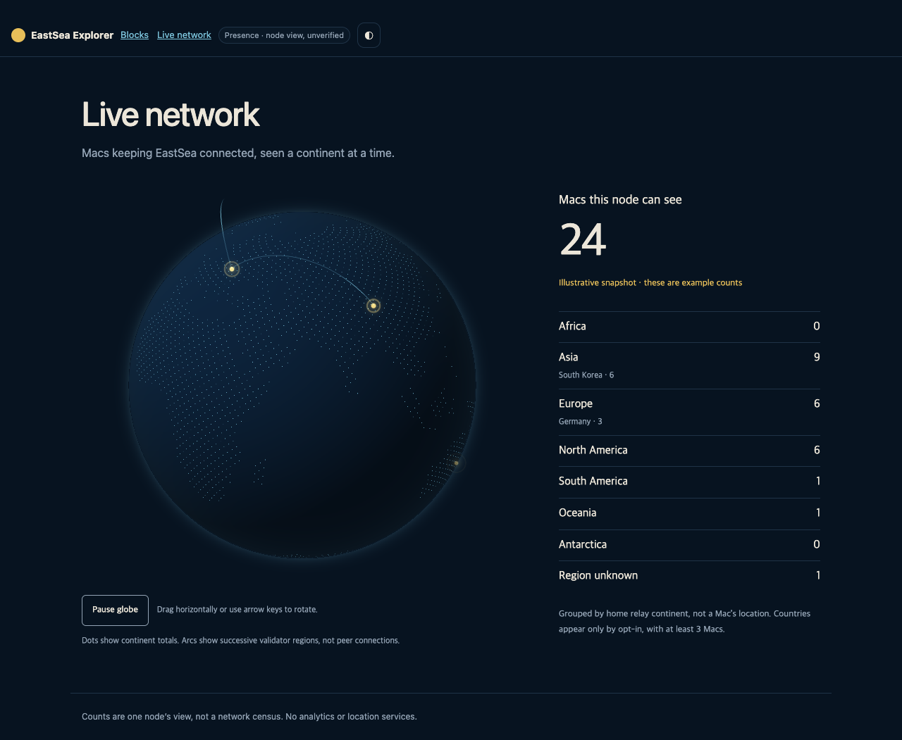

# Live network globe — 0.7.4

Owner: `codex/live-globe`. Presence producer: sibling `codex/live-peers`.
This is the shared RPC contract; the presence lane should read this file from
the live-globe worktree before implementing `aether_presence`.

## RPC contract (v1)

Request: `{"jsonrpc":"2.0","id":1,"method":"aether_presence","params":[]}`.
The configured public read gateway must allowlist this read-only method.
The JSON-RPC `result` is exactly:

```json
{
  "schema_version": 1,
  "scope": "node",
  "total": 24,
  "roles": { "validator": 6, "candidate": 3, "follower": 15 },
  "versions": { "0.7.4": 21, "0.7.3": 3 },
  "regions": [
    { "continent": "asia", "country": "KR", "count": 6 },
    { "continent": "asia", "count": 3 },
    { "continent": "europe", "country": "DE", "count": 3 },
    { "continent": "europe", "count": 3 },
    { "continent": "north_america", "count": 6 },
    { "continent": "south_america", "count": 1 },
    { "continent": "oceania", "count": 1 },
    { "continent": "unknown", "count": 1 }
  ],
  "recent_blocks": [
    { "height": 184231, "continent": "asia" },
    { "height": 184232, "continent": "europe" },
    { "height": 184233, "continent": "north_america" }
  ]
}
```

- All counts/heights are nonnegative safe JSON integers. `total` is the sum of
  the disjoint `regions` buckets. Global `roles` and `versions` totals each equal
  `total`; they are not cross-tabulated with countries. Roles are `validator`,
  `candidate`, and `follower` (the presence lane's native roles; zero allowed).
  Versions are semver release strings, at most 64 characters. The browser caps
  raw region buckets at 1,024, versions at 128, recent blocks at 8.
- `continent` is one of `africa`, `asia`, `europe`, `north_america`,
  `south_america`, `oceania`, `antarctica`, `unknown`. It comes from the node's
  **home iroh relay**, never IP geolocation; it approximates relay placement,
  not the person's physical location. Unmapped/no relay is `unknown`.
- `country` is an OPTIONAL uppercase ISO 3166-1 alpha-2 code, present only for
  explicit opt-in. Absence/null means continent-only. Before publishing, combine
  a country's opted-in entries; with fewer than **3**, omit that country's code
  and fold its count into its continent-only bucket. The browser repeats this
  folding defensively before rendering. Country codes below the threshold must
  never leave the RPC producer. Country totals are never split by role/version.
- `recent_blocks` is OPTIONAL (default `[]`), at most 8 entries, oldest first.
  Entries describe recent finalized validators' **continents only**, with no
  country, validator identifier, block hash, timestamp or peer edge. Omit an
  entry when its region is unavailable. Empty is honest; never synthesize arcs
  for a live response. Arcs join consecutive known validator continents and
  show a sequence of block regions, **not** measured node-to-node traffic.
- Do not return IPs, relay URLs, cities, coordinates, peer/node identifiers,
  wallet addresses or individual presence records. Do not include arbitrary
  strings/errors from presence records. JSON-RPC errors use the usual envelope.

### Presence-lane integration gate

The interim `codex/live-peers` implementation inspected on 2026-10-08 returns
`nodes` and `observer` identifiers from `aether_presence`; its `by_country`
includes singleton countries. **That interim response must not be served to
this page.** The public method must adopt the v1 aggregate result above and
enforce k=3 on the producer before exposing it through the gateway. Internal
signed presence/gossip records can remain internal. Consumer count panels in
the presence lane should read the new aggregate fields. The globe never calls
the peer/individual-record method or derives regions from an individual list.
The strict consumer rejects the interim schema; this is a coordinated producer
handoff, not a claim that client-side filtering can remove already-transmitted
identifiers. Verify this contract before the lead enables live public data.

## Shared component and privacy boundary

Canonical plain ES modules live in `apps/explorer/live-globe/`; the byte-identical
`site/live-globe/` bundle is copied by `scripts/sync-live-globe.mjs`. Both surfaces
serve committed static assets without a compile or CDN. Fixture values are
illustrative and explicitly labeled; a failed live request never falls back to
fixture counts. The wallet is deliberately outside this lane.

Each globe pulse represents a **continent total** and is anchored to its
fixed, locally defined continent centroid, with small deterministic jitter from
an ephemeral per-page-session seed and the continent code. No per-node markers
exist. Opted-in countries with at least 3 Macs may appear only in the text list;
they do not add finer positions on the globe. Unknown contributes to the honest
total/list and never receives an invented geographic marker.

The normalized public model contains only codes, counts, release strings and
block heights. Globe geometry and centroid vectors are internal bundled artwork,
never network parameters, DOM attributes, or location data about a node. The
session seed stays in memory and is never transmitted or stored.

Land artwork is sampled locally from [Natural Earth 110m land](https://www.naturalearthdata.com/downloads/110m-physical-vectors/110m-land/),
whose data is [public domain](https://www.naturalearthdata.com/about/terms-of-use/).
`scripts/generate-globe-land.py` uses only Python's standard library to read the
shapefile archive and create 2,594 equal-area land dots. The pinned downloaded
archive SHA-256 is
`1926c621afd6ac67c3f36639bb1236134a48d82226dc675d3e3df53d02d2a3de`.
The source archive stays in `tmp/`; committed `land.js` contains only static
unit-sphere artwork. This geography is not derived from any presence record.

## Surface behavior

- Explorer: `#/network`, caption **Macs this node can see**, public read gateway
  configured in Settings. This route only polls `aether_presence` every 10 s;
  it does not fetch peer lists, committees or node status.
- Site: **지금 동해를 돌리는 Mac** / **Macs running EastSea right now**, caption
  **이 노드가 보고 있는 Mac들** / **Macs this node can see**. There were no live
  widgets in the lane base; `site/live-network.json` configures the public RPC.
- Count and per-continent/country list accompany the canvas. Loading, unavailable,
  stale and zero results are explicit. Reduced motion uses a static map. Drag
  rotates the globe, with keyboard controls and pause available.
- Rotation/pulses stop outside the viewport and in hidden tabs. Hidden tabs also
  stop/abort polling; resuming requests a fresh snapshot. No third-party trackers,
  fonts, map requests or CDN scripts are added.

## Verification and screenshots

The ordinary offline explorer suite passes **77/77 tests** and includes `test/globe-presence.test.mjs`
(k=3, merging, totals, unknown fields, invalid counts/schema/codes, safe requests,
deterministic and bounded session jitter) and `test/live-globe.test.mjs`
(fixture, identical deployment copies, unit-sphere artwork, gzip budget).

`scripts/test-live-globe.mjs` is a real headless Chromium smoke using installed
Google Chrome and existing Playwright tooling. All public RPC calls are
intercepted with aggregate fixture envelopes; it never contacts a live node.
Normal fixture mode makes no external calls. It checks light/dark desktop and
mobile layouts, local assets only, language switching, country/continent lists,
WebGL, static reduced motion, mouse drag, arrow keys, pause, request whitelist,
10-second cadence, unavailable/zero/stale states and no raw server error echoes.

Measured on **Apple M1 Max**, macOS arm64, headless installed Google Chrome:
**60 fps over a 2-second visible sampling window**. Hidden-tab lifecycle was
explicitly dispatched for deterministic headless testing; during a 10.5-second
hidden interval the runner recorded **zero animation frames and zero polls**.
Resuming requested a fresh snapshot, then the next request followed at 10 s.
This proves animation/poll scheduling stops; whole-machine idle CPU percentage
and long thermal/battery runs were not measured. Real GPU context-loss and
restoration were also checked: static fallback then WebGL recovery, no page
errors. Canonical JS, including map artwork, is **39,148 bytes gzipped**;
the unit test enforces the requested 300 KB
ceiling. The browser also verifies that mounting the component again within the
same page preserves marker jitter. No three.js or dependency
was added; no Rust/Swift compile, installed app changes or deployment occurred.

Run from the repository root (artifacts stay in `tmp/live-globe/`):

```sh
mkdir -p tmp
node scripts/sync-live-globe.mjs --check
npm --prefix apps/explorer test
TMPDIR="$(git rev-parse --show-toplevel)/tmp" PLAYWRIGHT_MODULE=/path/to/playwright node scripts/test-live-globe.mjs
```

The title inherits the site's serif typography. A local 1,408-byte Hahmlet
supplement supplies `돌` (U+B3CC), absent from the incumbent subset, without
changing that shared font; the existing OFL license covers it. Only the new
section/mount, its stylesheet link and small style rules touch the site shell,
so the lead can retain them when merging the redesign lane.

### Fixture screenshots

These counts and block-region arcs are explicitly illustrative. All map/font
assets are local; no private node was queried for the images.

Explorer — light:


Explorer — dark:



Site — Korean light:


Site — Korean dark:


Mobile: [explorer light](live-globe/explorer-mobile-light.png),
[explorer dark](live-globe/explorer-mobile-dark.png),
[English site light](live-globe/site-mobile-light.png),
[English site dark](live-globe/site-mobile-dark.png).

Static alternative: [reduced-motion map](live-globe/explorer-reduced-motion.png).
Error states: [unavailable, no fake count](live-globe/explorer-unavailable.png),
[stale, explicitly labeled last snapshot](live-globe/explorer-stale.png).

Independent finish review: **94/100, pass**. All reviewed palette, status-text
contrast and control-border findings are resolved. Light status text measures
5.46:1 against the paper surface; the pause control border measures 6.10:1 in
light and 7.33:1 in dark. No open visual findings. Assistive-technology behavior
was not separately tested with a screen reader; the semantic text list provides
the data equivalent to the canvas.
