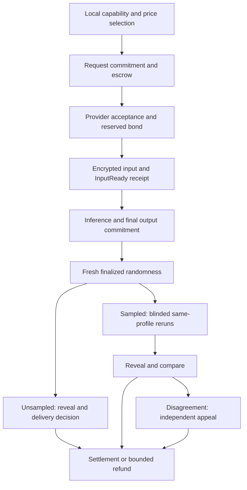

# 45. AI inference on EastSea Macs (2026-10-09)

**Status: not adopted.** This is a reference design only. The red-team review [mac-ai-redteam-2026-10-09](../research/mac-ai-redteam-2026-10-09.md) recommends **NO-GO** for a paid public inference marketplace and **LATER** for optional inference on the owner's own Mac. Nothing here is scheduled. Reopening requires the red team's gates (§8) and a new founder decision. No implementation or performance/security gate has passed. The founder asked on 2026-10-09: “이 블록체인 네트워크가 단순 스마트계약과 거래만 하는 네트워크면 자원낭비가 아닐까? ai model도 얹을 수 있나?”

Yes. A willing Mac can use spare Metal/unified-memory capacity for a requested model while EastSea settles payment and samples the result. Macs already perform useful Jolt/Metal block proving. Inference is a secondary, optional workload; spare capacity is not a reason to compromise validation, proving or the owner's normal use.

Evidence: [dated research and primary sources](../research/mac-inference-2026-10-09.md). Existing constraints: [resource limits](../ops/resource-limits.md), [post-launch change paths](30-post-launch-fixability.md), [public gas pool proposal](22-gas-pool.md), [agent payment rules](../../agents/skills/aether-wallet/SKILL.md). This document specifies new behavior; those links describe existing code or separately labeled proposals.

## 1. Decisions and assurance

| Decision | Reason and boundary |
| --- | --- |
| Whole-model **MLX** inference on one Mac | Avoid WAN layer-sharding latency, intermediate-data exposure and multi-provider failure for the first release |
| Begin with short 8B Q4 profiles; concurrency 1 | Published feasibility exists; node-safe capacity and reproducibility still need measurement |
| Identical certified execution profile for provider/checkers | Memory tier alone and temperature zero do not establish identical outputs |
| Salted output commitment, future-random sampled reruns | Bind one final result before the provider learns whether/who will check it |
| Explicit experimental **committee settlement** | Native MLX has no on-chain deterministic fraud-proof endpoint; a quorum is a trust assumption |
| Objective fault slashing; disputed correctness has a separate appeal policy | A pair of different hashes does not prove who is dishonest |
| Buyer-funded escrow, fixed job price, paid checking, bounded bonds | Avoid free-work spam, uncertain token-meter billing and uncollateralized concurrent exposure |
| Protocol fees go entirely to the **public pool** | No Pipln fee, revenue share, hosted inference, dispatcher, key broker or paid model registry |
| Local-only is the default for sensitive prompts | Ordinary Mac Secure Enclave does not hide MLX inputs from a remote Mac owner |

This service offers **specified-result assurance**, not proof that a particular GPU did work, a guarantee that the answer is true, or protection against prompt injection. Reusing valid cached tokens is permitted; forwarding plaintext to an executor outside the approved recipient set violates the disclosure policy even if the result matches. Hash checks cannot enforce that privacy policy against a dishonest owner. No new token, issuance subsidy, or reward for generating one's own inference jobs is introduced. Model execution does not enter every validator's block-execution path.

There is no paid public class until reproducibility, fresh randomness, independent-checker availability, escrow/pool integration and graceful-load gates pass. If those are missing, local inference and test-value experiments can still ship after mainnet. Do not relax a gate merely to advertise network inference.

## 2. Roles, capability and artifacts

**Requester** chooses the model, execution profile, input, disclosure policy and maximum total debit. **Provider** opts in, advertises capacity/price and posts a bond. **Checkers/appeal members** opt in separately, use the same execution profile, reserve bonds and receive fixed verification fees. **The chain** handles identities, commitments, draws, deadlines, signed decisions and funds. It does not load models or judge an answer's meaning.

Provider adverts are signed off-chain records with expiry, registered device identity, payment account, endpoint key, model/profile hashes, available memory budget, context/output caps, measured latency class, fixed prices and queue availability. The requester discovers them over peers, filters locally and chooses a quote by capability, all-in price and deadline. Cheapest compatible quote is an available local policy; tied choices can be randomized. No Pipln registry, hosted matching endpoint, preferred provider, sponsored placement or global reputation ranking is needed.

Separate **resource class** (RAM/headroom, context, loading/latency limits) from **execution class** (numerical behavior). A memory upgrade can change fit without proving arithmetic equivalence. A provider's signed chip/runtime description is a claim, not remote execution attestation. DeviceCheck constrains registered devices; it proves neither ownership independence nor model execution.

### Model manifest

`model_id` is SHA-256 of a versioned, canonical manifest. It binds tensor shard byte hashes and sizes, architecture/config, exact MLX quantization/group sizes, tokenizer/vocabulary, chat template, special/stop tokens and any adapter hashes. Names, URLs and Hugging Face branches are hints; they are never identity. Two conversions of the same advertised model are different artifacts.

The requester supplies/pins the hash; peers or the publisher can supply data. Verify every shard before admitting a job. Content addressing does not grant redistribution rights: include license/provenance identifiers and require the operator to choose models it can lawfully use/share. Models are data in bounded parsers, with no remote Python/code, plugins, filesystem access or automatic agent tool execution. An invalid/oversized manifest is rejected before model loading.

### Execution profile

`profile_id` binds model ID, runner/MLX build hashes, OS/Metal version, chip variant/kernel path, dtype/precision flags, batch/prefill shape, KV dtype/policy, and decoding. Initial decode is greedy argmax, temperature 0, stable documented tie-break by token ID, fixed seed, batch 1, fixed prefill chunking, fixed context/output limits and explicit stop/termination rules. Disable stochastic sampling, speculative decode, dynamic cross-job batching and shared prefix-cache reuse. A lower-precision/cache policy is another profile.

Publish signed conformance results and a versioned corpus across multiple Macs before a profile is enabled. Include near-tie prompts, long/short contexts, repeated cold/warm runs and generation boundaries. This is empirical qualification, not a universal bitwise guarantee. A runtime/OS change creates a new profile and withdraws the old advert; a job cannot silently change profiles mid-run. Unstable profiles remain local/test-only and never incur correctness slashes.

## 3. Job flow and state

Initial proposed workload limits are one job per provider, at most 4,096 total retained tokens, and at most 512 generated tokens for an 8B Q4 profile. They are conservative design parameters, not measured throughput commitments. Use a **fixed quoted price for those bounds**, avoiding unverified per-token metering in the first release.

1. **Prepare locally.** Tokenize/canonicalize the input under the pinned model, generate a unique job ID, fresh high-entropy input/output commitment salts and per-job encryption/receipt keys. The private input commitment binds the prompt, private settings, output salt and these public keys, salted with the secret input salt. Determine caps and disclosure budget. Quote discovery happens first, but the funded request is the authoritative job.
2. **Request + escrow (`OPEN`).** Record chain/domain/version, requester/refund account, selected provider identity, model/profile, salted input commitment, quote, total escrow, deadlines, verification policy and auditor-membership snapshot rule. A committed request binds private parameters without publishing the prompt. Pay no provider yet. If no provider accepts by the deadline, refund escrow; ordinary chain transaction fees remain spent.
3. **Accept (`ACCEPTED`).** Provider checks live load, model availability, eligible verifier capacity and quote expiry, then reserves this job's bond exposure. Acceptance pins the same immutable parameters. Client transfers the encrypted input only after verifying the provider endpoint key and final acceptance.
4. **Input availability (`INPUT_READY`).** Provider checks the input commitment, sizes and token bounds and signs an `InputReady` receipt binding job/input/model/profile. It accepts the obligation to retain and furnish those committed bytes to permitted future checkers through the dispute window, even if the client disconnects. Client non-delivery before this receipt times out with a refund, no provider dishonesty finding. After it, provider withholding is judged under the disclosed availability/committee policy.
5. **Run and commit (`RESULT_COMMITTED`).** Use only admitted spare capacity. Return an encrypted provisional stream to the requester, recording token IDs and termination metadata. Commit exactly one final output, output length and encrypted-result blob hash before the result deadline. A partial stream, preemption or interrupted draft is not a final commitment or a billable success.
6. **Sample after commitment.** Once a fresh seed and the final result commitment are final, derive the audit decision and checker draw from fixed domain-separated job identifiers. The provider cannot change its commitment or cancel after seeing the audit draw to escape its existing obligations. No seed/event means bounded expiry/refund, not acceptance of an unchecked sampled result.
7. **Check/reveal (`AUDITED` or `DISPUTED`).** Selected checkers accept bounded leases and get the committed input/profile. They rerun without seeing the provider's opened final digest, commit their own result, then open it. Compare canonical token IDs/termination digests. No quorum, missing evidence and a real mismatch are different outcomes (§4).
8. **Settle once (`SETTLED`, `REFUNDED` or `EXPIRED`).** Apply the preaccepted delivery/check/appeal decision, pay agreed work and refund unused reserves. Expiry, requester revocation and duplicate messages cannot create a second payout. Record the assurance label and actual audit outcome in the receipt.

Deadlines are finality-aware windows fixed in the quote, with bounded input, result, seed, checking, appeal and absolute job-expiry stages. Exact durations are set only after measurements; an initial total evidence-retention ceiling of **24 hours** is proposed. Daily-batch randomness may require a different openly quoted ceiling or make that class unavailable. Never silently extend privacy retention or lock escrow indefinitely.

An absolute quote-pinned expiry time takes precedence over incomplete stage deadlines and unassessed penalties. Evidence holders delete at that ceiling even if finality stops. After finality resumes beyond expiry, unfinished jobs follow the bounded refund policy; missing evidence/reveals caused solely by that outage incur no correctness/reveal penalty. Already-final penalties are not reversed. Paid activation requires an enforceable chain-time/clock-skew and outage rule implementing this precedence; block heights alone cannot enforce a wall-clock retention promise. Refund transactions still require a functioning chain. This timing policy remains a design gate, not a claim of current support.

Delivery matters separately from computation. Requester acceptance is a receipt signed by the per-job receipt key over the decrypted output and committed digest; funding binds that key to this job only, with no authority to spend further wallet funds or change the refund account. For sampled jobs, the committee also checks availability of the committed output encrypted to the requester's pinned key. It can make an agreed result available again through an authorized checker if delivery is disputed. Quorum availability attestations are committee evidence, not an on-chain proof that a human read the answer.

An unsampled job normally settles on requester acceptance. Refusal/timeout **cannot unilaterally refund completed work**: it triggers the reserved three-checker delivery/computation dispute path, with independent results committed before opening. The original post-result fresh round supplies the checker draw; any appeal uses a new round. Quorum-confirmed matching execution and available encrypted delivery allow payment without buyer acknowledgement; missing quorum/evidence follows the bounded unresolved policy. The extra checks fit `V_max` and the same nine-recipient ceiling. Reputation distinguishes buyer acknowledgement from independent checks. This dispute overhead is additional to the automatic-sampling calculation below.

## 4. Verification, randomness, bonds and disputes

### Output commitments and blind checking

Canonical encodings have fixed lengths/order and domain/version separation. Let `D` be the hash of job ID, request commitment, model/profile, final token-ID array, stop reason and a **shared secret output salt** supplied in the encrypted job input. Provider first publishes `C_provider = H(job_id, D, fresh_provider_nonce)`. Each checker independently publishes `C_i = H(job_id, D_i, fresh_checker_nonce)` before any `D` is opened. Openings reveal the digests/nonces so the contract can verify binding and compare digests; the secret output salt and raw tokens stay off chain. Commitments bind chain/contract/stage as well as job identity to prevent cross-chain/stage replay.

The encrypted output blob has its own byte hash; encryption randomness is not compared as if it were model output. Token IDs and a stop reason are canonical; displayed Unicode/whitespace is not an improvised normalization rule. Intermediate stream roots are explicitly a different stage, so successive chunks are not equivocation. Checkers validate that received plaintext/input salt matches the original input commitment before executing.

Blind commit/reveal reduces result copying. It cannot prevent the buyer/provider sharing an answer out of band, two checker identities sharing a machine, or a checker reproducing a correct digest without independently computing. Fresh nonces prove receipt freshness, not independent work. These are collusion limits, not solved properties.

### Fresh randomness is an activation gate

The current [Randomness contract](../../contracts/src/Randomness.sol) explicitly warns its epoch word may be known **several epochs ahead**, because it derives from an already-published threshold draw seed. A future epoch is not necessarily future entropy. Hashing that word with a job nonce leaves it predictable and allows salt/job grinding.

For paid sampling, snapshot eligible membership/weights and irreversibly finalize the provider commitment **before publication of a new unpredictable seed**. The job pins the eligible future draw/round and seed-publication boundary; clients cannot pick a favorable seed afterwards. Use separate domains for sampling/checker selection. A disputed appeal requires another fresh post-dispute round and an excluded-member draw, not a seed the provider could exploit before committing.

Two paths need subsequent validation: sealed batches committed before a genuinely new daily threshold draw (slower settlement), or a new per-round beacon published/verified through the normal post-mainnet upgrade path. Enforce publication ordering on chain; merely reading `randomness(future_epoch)` is insufficient. Reject unavailable/zero rounds, never substitute a block hash, timestamp, known draw or provider RNG. Threshold uniqueness reduces proposer grinding but does not remove committee early knowledge, withholding or censorship assumptions. **Neither a new beacon nor an enforceable paid-job batch protocol is implemented here.**

### Sampling policy and cost

Proposed steady-state example: sample fraction `q = 10%`, **three** full same-profile reruns and a 2-of-3 settlement quorum. New/low-history providers use higher checking, initially 100%; checking never falls below the profile's published floor. Auditors are drawn without replacement, excluding provider, requester and known shared operators/devices. No preferential Pipln seats. Require at least **ten eligible, available registered identities across distinct declared operator accounts** in a class before accepting these paid jobs, leaving room for a disjoint five-member appeal. This is an availability floor, not proof of ten independent humans.

Design calculation: three full reruns on 10% of jobs add `q × 3 = 30%` expected inference compute before appeals/loading, for approximately 1.30 provider-equivalent runs/job. A three-member majority is not an “at least one honest” rule. If adversarial eligible-class selection share is `a`, independent draws give majority capture `3a²(1-a)+a³`; at `a = 0.10`, that is 2.8%. With `q = 0.10`, the simple single-bad-job undetected/incorrect-acceptance model is `1-q+q×0.028 = 90.28%`. Sampling is primarily a repeated-incentive mechanism, weak assurance for a one-off critical answer.

These are illustrative calculations, not measured network security. Actual without-replacement draws, ownership correlation, adaptive bribery, cohort size and availability change the result. `a` is the adversarial share in the **specific model/profile auditor pool**, not the global Mac population. A bond cannot deter unbounded external damage. High-stakes requesters should use local execution or stronger explicitly chosen checking, and never interpret the receipt as factual truth.

### What can be slashed

| Evidence | Action and trust |
| --- | --- |
| Two valid contradictory **final result digests** signed/opened by one key for the same canonical job/stage | Objective equivocation proof; slash the reserved bounded protocol penalty. Different nonces committing the same digest, stream updates, retries under a new attempt ID and different stages are excluded |
| Failure to open a commitment by its fixed on-chain deadline | Contract can establish deadline failure; apply only the prequoted reveal penalty. This proves a protocol failure, not malicious model output |
| Hash mismatch between different machines | Hold settlement and investigate; no automatic correctness slash |
| Confirmed incorrect result under a preaccepted committee/appeal verdict | Bounded correctness slash **conditional on honest-majority committee settlement**, not a cryptographic fraud proof |
| Timeout, physical load preemption, client non-delivery or off-chain packet failure | Refund/cancel or availability record under the agreed state; do not label it objective model fraud |

First discrepancy triggers a reproducibility check under the exact frozen profile, using preserved off-chain evidence. A disagreeing party may initiate one bounded appeal; its maximum funding is fixed before the job. Draw five new eligible members after the disputed decisions commit, excluding original parties/checkers; require 3-of-5 signed decisions. The chain verifies membership, distinct signatures, job/evidence binding and deadlines. **It cannot verify the arithmetic correctness of those decisions.**

A reproducibility fault quarantines the profile locally for new jobs, refunds unresolved work and applies no correctness slash. Existing jobs retain their original timeout policy; no Pipln administrator can rewrite outcomes. No quorum or unavailable evidence terminates by the bounded unresolved/refund policy, with unused bond returned and no correctness finding. Paid class activation requires a measured false-mismatch policy; zero mismatches on a finite corpus is not a proof. The committee model must be explicitly accepted by both buyer and provider. A cryptographic VM/zkML arbitration endpoint is a later, separate design.

Providers and checkers reserve bond per unsettled job, including the maximum applicable penalty and their assigned dispute obligation. Available bond subtracts **all concurrent reservations**; pending work/withdrawals cannot reuse that collateral. Withdrawal waits for settlement/expiry. Exposure caps cover the sum of jobs, not just the largest quote. Honest checking earns a fixed fee whether it agrees or detects a fault; no winner bounty or reward proportional to slashed value.

For a cost-saving attacker, a necessary design check is expected detection probability × loss exceeding saved execution cost plus additional gains; it is not sufficient when arbitration/independence fails. Select actual bonds/rates only from measured costs and bounded exposure. A captured committee can falsely punish an honest provider: disclose this and keep pilot prices/bonds low.

## 5. Payment and the founder's public-pool rule

The requester funds `E_max = P + V_max + A_max + F_max`: fixed provider price, maximum initial-check budget, one bounded appeal reserve and maximum protocol fee. Ordinary chain gas/state fees are disclosed separately and follow existing chain rules. The job must be affordable at maximum verification/dispute cost; do not sell a low headline price while hiding the audit debit.

For successful settlement, `P` pays the provider; accepted check/appeal work pays the prequoted `V_actual + A_actual`; **100% of protocol fee `F_actual` goes to the public pool**; all unused escrow returns to the requester. Fees are bounded, integer-denominated and computed by pinned contract rules/quote, never a hosted billing service. No fee is owed on unperformed inference; honestly performed checking can still be paid on a refunded/disputed job. The refundable/earned amounts for each terminal state must be stated before funding.

There is **no Pipln fee, commission, treasury share, founder-controlled recipient or inference hosting**. Provider/checker payments compensate third-party requested work; they are not Pipln revenue or new block issuance. Self-dealing jobs receive no reputation credit beyond independent audit evidence and no subsidy, so volume/payment churn is not rewarded.

The [gas pool](22-gas-pool.md) is still a proposal, not an existing usable paymaster/address. Its current specified purpose is chain-fee sponsorship, not buying AI jobs. This design adds a future AI-fee funding source under the founder's instruction; it does not silently redirect existing DEX/chain fees, spend the pool on AI, or alter issuance. Before paid activation, the public-pool destination, code hash, fee acceptance and permissionless bounded spending rules must be deployed/agreed through the proper upgrade. If unavailable, paid jobs remain disabled; fees never accumulate in a temporary Pipln wallet.

Use an immutable/versioned escrow with no sweep, custody administrator, fee setter or privileged dispute bypass. Each job pins deployment/version and parameters. Fixes use new deployments for new jobs; old escrows retain bounded settlement/expiry. Credit and payout accounting must be atomic and pull-based so a recipient refusing funds cannot block other refunds. Slashed penalties follow the pinned refund/public-pool allocation, never a bounty: compensate a bounded proven loss if specified, with the remainder to the pool.

## 6. Privacy tiers and evidence availability

| Tier | Who sees inputs/output | Payment/checking and limits |
| --- | --- | --- |
| **Local-only** | Requester's Mac; its local software/OS remain trusted | No public job, provider, network audit or escrow; zero inference protocol fee. No prompt telemetry |
| **Network, disclosed to executors** | Chosen provider and drawn checkers/appeal members | Authenticated per-job encryption in transit/storage, explicit recipient/retention consent and committee policy. Mac owners can retain plaintext |
| **Future attested-confidential** | A supported attested computation boundary | Research-only. No ordinary-Mac/PCC-equivalent claim or current offering |

Initial network recipient budget is one provider, up to three checkers and five disjoint appeal members: **at most nine executing Macs**, disclosed before funding. No silent fan-out, public plaintext publication, unlimited checker replacement or public activation transcript. If this budget cannot settle a job, expire by the agreed policy. Result-only ciphertext storage peers need no decryption keys. Requester/provider retain original encrypted evidence until final settlement or the quoted ceiling; the provider furnishes committed input to drawn auditors after `InputReady`. No always-online requester or Pipln key broker is required.

Selected members receive per-recipient encrypted copies of the input and secret salts. Minimal evidence retention is necessary for checking/appeal; deleting it immediately after streaming would make disputes impossible. Retention ends after settlement/absolute expiry; disable raw logs, persistent cross-job prompt caches and payloads in crash reports. These are honest-software policies, **not enforceable confidentiality against a malicious Mac owner**. An unavailable or wrong input is distinguished from a mismatching execution and adjudicated under the disclosed committee assumptions.

On chain keep salted commitments, identities, bounds, prices, deadlines and decision digests. Do not reveal input/output salts or bodies in a dispute transaction. Metadata still links payer, provider, model, amounts, timings and audit events. A confidential prompt cannot be checked by an ordinary Mac without that executor receiving its contents. Never downgrade local-only to network on timeout or model-size failure; request a new explicit user choice.

Apple [Secure Enclave APIs](https://developer.apple.com/documentation/security/protecting-keys-with-the-secure-enclave) protect keys rather than general app/GPU inference. [PCC's 2024-06-10 architecture](https://security.apple.com/blog/private-cloud-compute/) and [2026-06-08 expansion](https://security.apple.com/blog/expanding-pcc/) are references for attestation, restricted execution and transparency, not facilities available to an ordinary EastSea Mac. Those sources were accessed 2026-10-09; future confidentiality requires its own supported CPU/GPU threat model and deployment evidence.

## 7. Graceful-load: the node keeps priority

Reuse [resource limits](../ops/resource-limits.md) and [resources.rs](../../crates/node/src/resources.rs) concepts rather than introduce another independent load policy. Today the prover is watched every two seconds, capped by physical footprint, stops new work under pressure/battery/disk conditions and waits five healthy minutes before resuming. This monitors proving; it does not already schedule MLX, certify GPU preemption or reserve all system memory.

The future inference sidecar has no validator/account keys, no node-data-folder writes and no model-triggered tools. A local coordinator grants a single GPU work lease: validation/consensus-sensitive work first, block proving next, then inference and its audits. Initially **prover and inference dispatch do not overlap**. CPU niceness is useful but not a Metal reservation or latency guarantee. An idle prover keeps its memory reservation.

Admission requires both physical-memory and Metal-working-set fit:

`tensors + KV_at_cap + loading/workspace_peak + allocator_margin <= physical_RAM - prover_peak_reserve - node_peak_reserve - OS/user_headroom`.

Use actual byte measurements and the owner's configured limits; history-cache budget is not total node memory, and a process cap can be overshot between watchdog samples. Account for every node/prover on the same host. Missing telemetry is no capacity, not unlimited headroom. Do not increase wired-memory limits, force swap, disable resource guards or reduce block-prover reserve to fit a larger model.

| Event | Inference action |
| --- | --- |
| Proof queued/running, catch-up, DKG/handoff or consensus latency alarm | Withdraw advert; stop admission; release GPU lease at bounded work boundary; cancel if safe pause cannot meet the existing job deadline |
| Memory warn, growing swap, thermal pressure, battery policy, low disk | Stop admission; release KV/model/allocator cache as required; follow existing system pause/recovery policy |
| Critical memory or stuck sidecar | Kill only inference first; preserve node/prover keys and data; refund incomplete work, apply no correctness finding |
| Owner uses GPU/changes settings, sleep/OS update | Withdraw capacity and drain/cancel; a signed lease does not entitle inference to impair the owner |
| Healthy again | Wait at least existing five-minute recovery interval, recheck reserves and re-advertise the correct profile |

Prefill/decode must use measured bounded dispatch chunks. Pause token emission alone does not free memory; clear KV, model and allocator caches or terminate the sidecar. GPU work already submitted may delay yielding: measure longest dispatch, cancellation acknowledgement and actual reclaimed-memory time. If those bounds threaten validation/proving, the profile cannot provide jobs. The two-second safety watchdog is insufficient as the normal proof-start handoff mechanism.

8 GB Macs are local/smaller-model candidates. 16 GB 8B requires tight measured admission; 24–64 GB are initial 8B candidates. **Default exclude 70B on 64 GB alongside reserved proving** despite standalone benchmarks. 96/128 GB+ are only later 70B candidates, with context and cache separately bounded. Small models also consume energy and heat; “idle” does not mean free capacity.

Preemption before a final commitment produces no provider success fee and a bounded refund/availability outcome. After committing, retain enough bounded evidence to finish disclosure/audit without holding the GPU. Repeated capacity over-advertising lowers availability reputation. Never prioritize an audit deadline over chain liveness; unavailable quorum uses the agreed expiry policy.

## 8. Agent integration and actual current limitations

Today [aether-agent tools](../../apps/agent/Sources/Tools.swift) provide balance, limits, payment dry runs and final receipts. [EastSeaAccount.sessionExecute](../../contracts/src/EastSeaAccount.sol) accepts empty-calldata native payments or strictly formed ERC-20 transfers; it **rejects arbitrary escrow/job calls**. Adding an MCP method alone cannot authorize `createJob(...)`. Secure Enclave protection also does not prevent a tricked agent spending within owner-approved limits.

A compatible first paid pilot can use an **immutable one-job escrow** deployed before funding, whose bytecode/hash/address and request terms the owner/client verifies. Its `receive` path accepts the exact native deposit, only from the pinned requester account, once; it opens only that prebound job and refunds only to that account. The owner approves that particular escrow as a payee with Touch ID; then ordinary `aether_send` can fund it within existing caps. Approving a factory is not approval of every child; new job addresses need approval. This is an inconvenient but narrow pilot path, not an existing deployed product.

General recurring compute calls need a later explicitly owner-approved, narrowly scoped account capability/new contract deployment: pin escrow code/address, allowed method, payer/provider policy, model/privacy/job caps and maximum native debit. Account fixes follow new deployment/redelegation, not an assumption that v2 already accepts calldata. Never obtain broad `ownerExecute` access for an autonomous agent or route payment directly to a provider to bypass escrow.

Proposed future read-only MCP tools cover model/profile discovery, complete quotes, remaining budget, job/assurance status and receipts. A future paid submission tool exposes `dry_run`, maximum total debit, model/profile and disclosure policy; names are proposals, not current tools. Before funding, check final balance, active session, approved payee, per-payment/24-hour caps, expiry and separate gas budget. The **gross escrow deposit**, including all checking/appeal/fee reserves, counts as spending; refunds do not restore daily allowance through a reuse loop.

Unapproved recipients, expired sessions or limits produce owner approval requests; do not split jobs, auto-renew, use alternate escrow addresses or retry around refusal. Payments are complete only when final/successful. Funding confirmation and inference completion are different receipts. Session revocation stops new jobs; it does not reverse an already-final escrow, and refund rights never depend on a still-active agent session. Treat model output as untrusted data; tool execution/payment needs the separate owner-authorized policy.

## 9. Sybil, collusion and reputation limits

- Existing registered-device identity and warm-up are useful admission friction, not one-person-one-vote. Multiple Macs and wallet addresses can share one owner; DeviceCheck is not an independent-auditor oracle. Do not inherit the consensus address cap as a proof of compute independence.
- Draw from the frozen compatible cohort; exclude known common devices/owners, cap declared-operator participation and weight per bonded device rather than purchased volume/reputation. Network/behavior signals can warn about shared ownership but cannot prove it.
- Reputation is derived from signed settled events and **independent audited** successes: availability, checked agreement, objective faults and bounded disputed outcomes, scoped to model/profile/version and decayed. Unsampled buyer endorsements/payment volume are not equivalent to checks. New identities start with conservative exposure and higher checking; never let reputation eliminate audits.
- Bonds, independent checker selection and reserved aggregate exposure raise costs; they do not stop an attacker owning a class, bribing a quorum, sacrificial identities, honest-then-cheat behavior or targeting an expensive single job. Small high-memory cohorts can be captured while most network Macs remain honest.
- Hiding/opening commitments reduces copying but does not prove independent computation. Provider/requester/auditor collusion, beacon withholding and deliberate availability failures remain risks. Cap value per job and per class; absence of a trustworthy eligible cohort means no paid class.

No Pipln-owned reputation oracle, arbitration desk, fallback validator or secret allowlist is introduced. Clients can compute facts locally and choose their own stricter policies. A signed quorum verdict is accurately labeled **committee-adjudicated**, and a checked result **sampled and re-executed**, never “cryptographically proven inference.”

## 10. On chain versus off chain

| On chain, bounded | Off chain |
| --- | --- |
| Registered identities/bond balances and reservations; class/profile commitment and eligibility snapshot | Capability adverts, discovery, price quotes, conformance/performance reports and hardware self-reports |
| Job/model/profile/input commitments, bounds, payer/provider, quote and funds | Model tensors, tokenizer files and full manifests fetched/checked by hash |
| Final blinded commitments, openings, ciphertext hashes and selected members | Prompts, token arrays/output bodies, salts, encryption keys, ciphertext payloads and retained evidence |
| Verifiable seed/round publication, deadlines, signatures and decision digests | MLX/Metal execution, reruns, numerical diagnosis and evidence exchange |
| Objective fault checks, accepted quorum decisions, fees/refunds and terminal receipt | Open client software; no hosted service required |

Every chain record is size/cost bounded; storage pricing follows current rules. Large blobs, weights, activations and per-token transactions are excluded. Nodes validate state transitions/signatures, not inference. A contract receipt can prove funds/decision recording without proving the decision's arithmetic truth. Data hashes do not establish availability; enforce bounded replica/availability duties and expiry under the chosen trust policy. Finality outages pause chain actions while the absolute privacy-retention ceiling still applies. Once certified chain time reaches expiry, expiry/refund takes precedence as specified in §3.

## 11. Phases and change paths

| Phase | Deliverable and explicit gate |
| --- | --- |
| **This lane** | Research/design and commit only; no implementation, builds or fleet experiments |
| **Mainnet launch** | Unchanged scope. No AI genesis allocation, guest change, mandatory model download, provider service or new dependency |
| **First post-mainnet upgrade, qualification** | Opt-in local MLX sidecar, common graceful-load coordinator, bounded 8B profiles, reproducibility/resource measurements and test-value escrow/audits |
| **Same upgrade's paid activation, conditional** | Public-pool destination deployed; reviewed immutable escrow; safe agent funding; fresh post-commit randomness; sufficient cohort; privacy/evidence/bond rules; below acceptance gates pass. Otherwise keep paid classes disabled |
| **Later** | 70B profiles, activation/TOPLOC experiments, deterministic VM/zkML arbitration or supported confidential inference, each with separate costs/security evidence. Owner-controlled local Exo-style clusters can be investigated independently |

Sidecar/load/MCP changes normally use the signed-app release path. Ordinary contracts deploy at new addresses with pinned hashes. If paid sampling needs new system randomness/fee routing, use the existing announced protocol-upgrade path (normal notice described in [design 30](30-post-launch-fixability.md)); do not create a new genesis or assume a client release changes consensus. Any future guest-compiled execution change requires the lead's new proving-program-ID and reproducible release gates. No such change is made here.

## 12. Future acceptance plan — not executed

| Gate | Evidence required before paid activation |
| --- | --- |
| Artifact/profile binding | Mutated tensors/tokenizer/template/adapter/quant/runtime rejected; same names with different bytes cannot share a profile; unsupported models never execute arbitrary code |
| Reproducibility | Multiple independent Macs per eligible profile, repeated cold/warm runs and near-tie/context/batch-path cases; measured mismatch rate/policy; version transition isolated. No correctness slashing on unqualified classes |
| Node protection | Baseline versus inference under proving/catch-up/handoff/owner load; no attributable consensus timeout; proposed p99 finality/proof latency regression ceiling 5%, and no sustained swap. Measure loading peaks, GPU dispatch/yield and reclaimed-memory deadlines; exact safe bounds still unverified |
| Randomness | Commitment finalized before fresh seed publication; known/future-epoch seed reuse, salt/job grinding, replay, missing round, withholding and appeal ordering handled without biased fallback |
| Commit/audit/dispute | Blind commit/reveal, canonical token/termination handling, wrong input and numerical fork separated, independent draw, fake/copying checker, unavailable quorum, five-member appeal and bounded expiry tested |
| Money/bonds | Job conservation `requester escrow deposits + actually debited slash transfers = work payouts + requester refunds + public-pool credits + remaining job escrow`; separate bond conservation `bond deposits = withdrawals + debited slashes + free bond + reserved unslashed bond`. Single settlement, concurrent reservations, recipient failure, expiry, caps and fee destination covered |
| Privacy/evidence | No plaintext or salts in chain/logs/crash reports; maximum nine authorized executing recipients; client offline audit succeeds; deliberate withholding expires under policy; prolonged finality outage respects absolute deletion and refund/no-outage-penalty precedence; no local-to-network fallback; retention cannot be marketed as owner-proof secrecy |
| Agents | Existing calldata rejection preserved; exact escrow receive/payee binding; gross deposit caps, gas, expiry, refusal, revoked session, refund and final receipt behavior tested; no approval bypass |
| Adversarial cohort | Multiple addresses/known shared operators, captured class, adaptive bribery, self-dealing reputation and unavailable auditors simulated; observed independence and attacker share remain explicit assumptions |

Remaining blockers are concrete: EastSea has no certified MLX fleet matrix, measured node-safe inference bounds, per-job fresh-randomness pipeline, deployed AI escrow/public-pool integration, proven expiry/retention integration, cryptographic arithmetic adjudicator or ordinary-Mac confidential inference. This proposal intentionally records those dependencies while keeping mainnet and the current proving program untouched.
