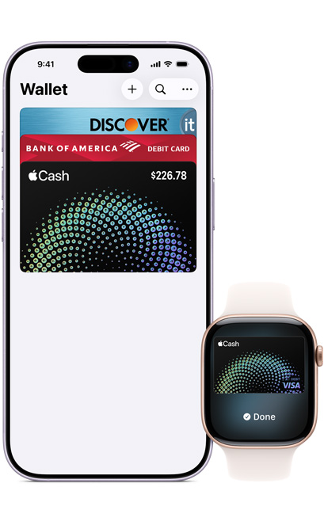
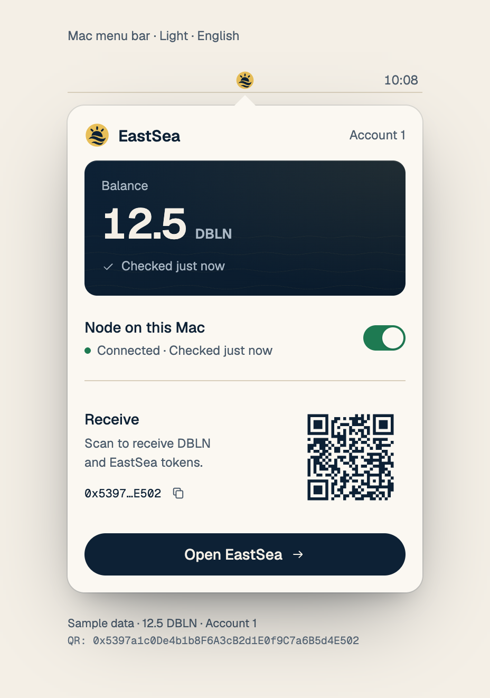
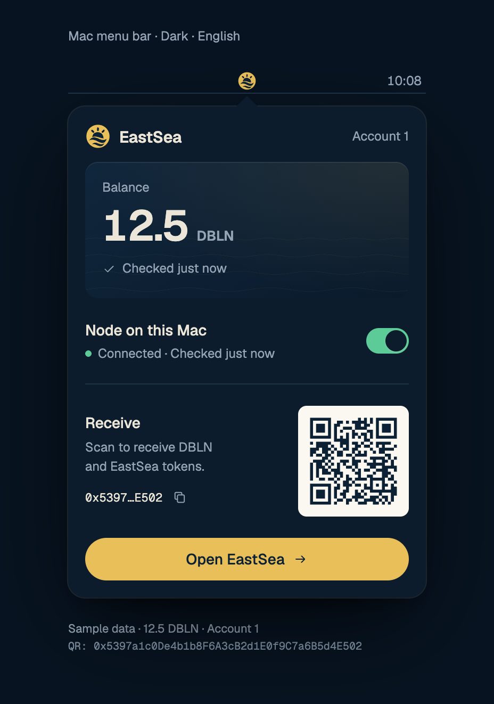
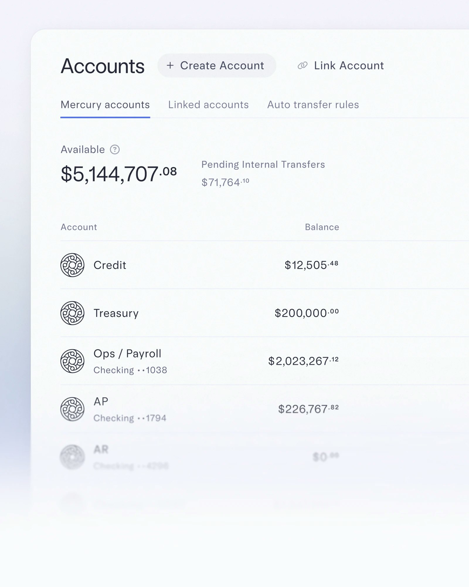
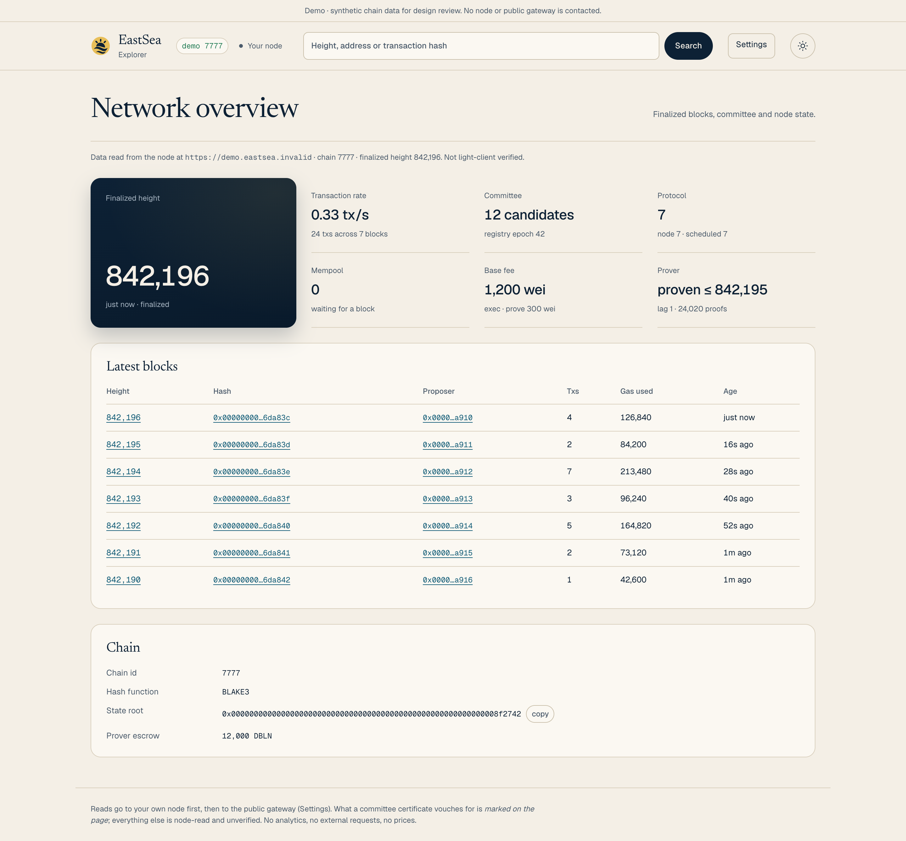
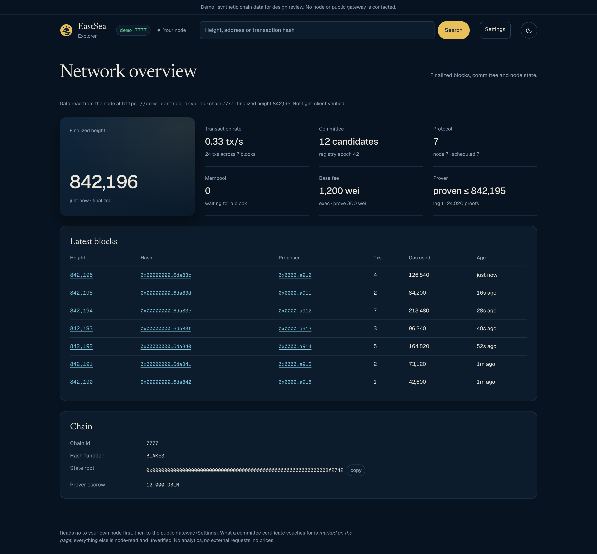
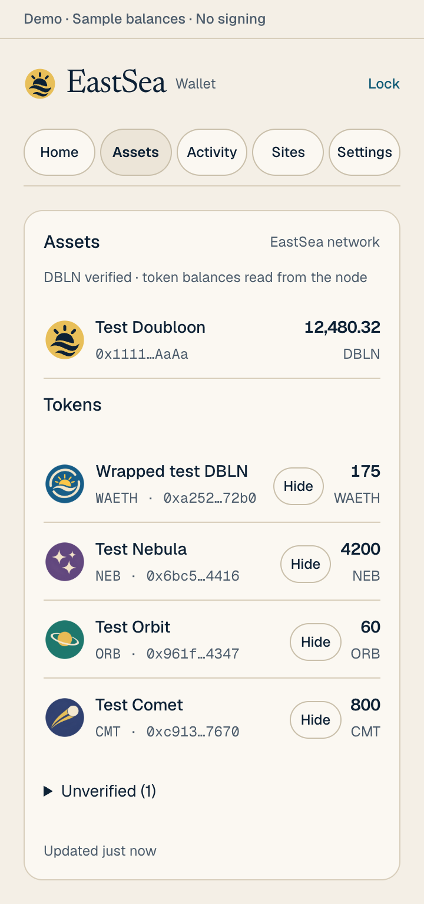
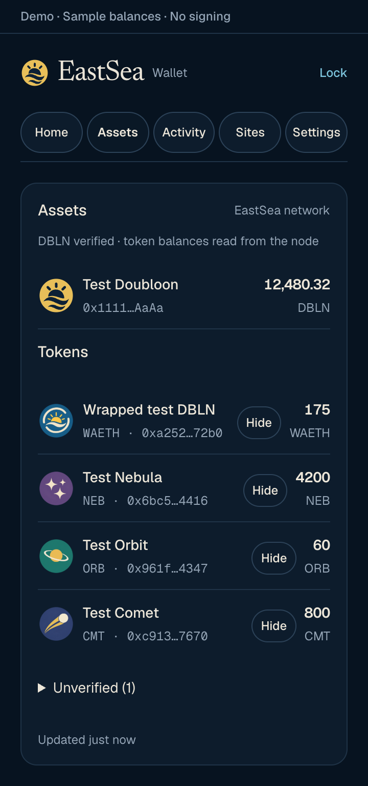
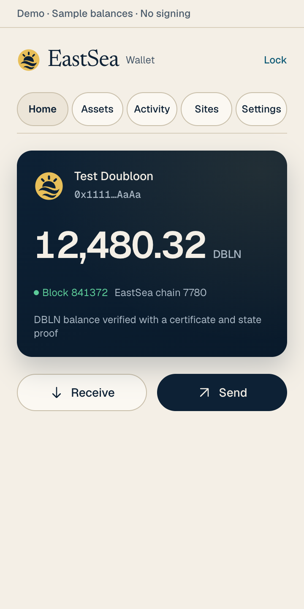
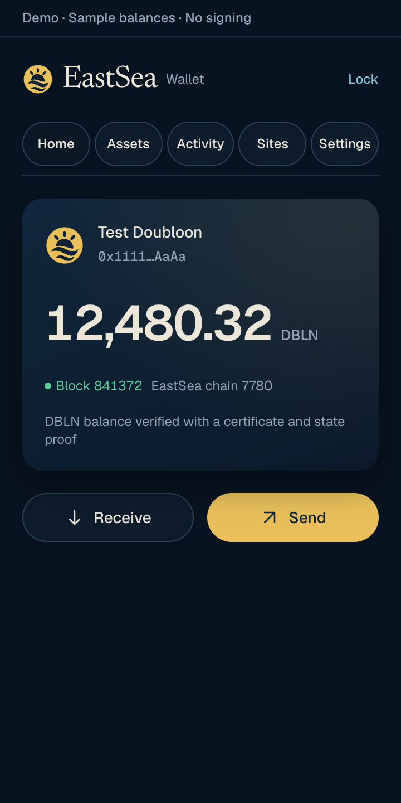

# EastSea 0.7.4 — phase 1 benchmark comparison

Reviewed 2026-10-08. These three references are already in [benchmark.md](benchmark.md), §§1.5, 1.7 and 1.9. EastSea takes their hierarchy, rhythm and restraint into its own navy plate, engraved waves, dawn mark and Doubloon artwork. The reference brands remain the original products' brands.

The EastSea PNGs below were rendered from the phase 1 HTML/CSS with sample data. The menu panel is a component mockup; the extension and explorer previews use their product styles with isolated fixtures. Click any image for full resolution. The desktop explorer comparison is deliberately wide enough to read the ledger.

## Apple Cash → a balance carried by the brand surface

| Official Apple Cash / Wallet reference | EastSea · light · English | EastSea · dark · English |
|---|---|---|
|  |  |  |

Apple puts the Cash balance on the branded card. EastSea adopts the single focal surface: a 128 pt navy plate inside a 336 pt panel, a 40 pt tabular amount, and one quiet verification line. The node status, switch, receive QR and primary action sit below it. The engraved waves provide depth without another competing illustration. Source: [Apple's Apple Cash page](https://www.apple.com/apple-cash/), Wallet section.

Korean parity is shown in [menubar-light-ko.png](mockups/menubar-light-ko.png) and [menubar-dark-ko.png](mockups/menubar-dark-ko.png). The receive QR encodes the sample address printed beneath the mockup.

## Mercury → one main figure, then a quiet ledger

| Official Mercury Accounts reference | EastSea explorer · light and dark |
|---|---|
|  | **Light** · [full resolution](mockups/explorer-light.png)  **Dark** · [full resolution](mockups/explorer-dark.png)  |

Mercury separates the available amount from secondary figures and account rows. EastSea applies that rank to its developer surface: one navy finalized-height plate, six secondary metrics with hairline separators, then a readable blocks ledger. Display type names the page; tabular UI and monospaced addresses carry the data. Source: [Mercury's Business Banking page](https://mercury.com/business-banking). Its published image is an art-directed product crop, not a live account capture.

The same styles also render at a 390 px viewport: [explorer-mobile-light.png](mockups/explorer-mobile-light.png) and [explorer-mobile-dark.png](mockups/explorer-mobile-dark.png). The preview's synthetic chain and source disclaimer remain visible. The mobile ledger preserves 640 px columns within horizontal scrolling; its rightmost Age labels are shown in [light](mockups/explorer-mobile-ledger-light.png) and [dark](mockups/explorer-mobile-ledger-dark.png) crops.

## Things 3 → quiet rows with a stable rhythm

| Official Things 3 Today reference | EastSea assets · light | EastSea assets · dark |
|---|---|---|
|  |  |  |

Things uses section headings, clear rows and small meaningful accents to organize content. EastSea's assets surface now uses consistent gutters, grouped rows, understated separators and right-aligned tabular amounts. Its local token art matches the wallet's brand catalogue. Source: [Cultured Code's Things features page](https://culturedcode.com/things/features/), Today and This Evening section. This official image originated with Things 3.0 in 2017 and remains on the features page; it is a historical craft reference.

The popup's balance and action hierarchy are shown separately:

| EastSea popup · light | EastSea popup · dark |
|---|---|
|  |  |

## Five concrete deltas closed in phase 1

The baseline is the lane's starting commit, `68fb6e2`. The before column is grounded in that source, not a reconstructed screenshot. Each after is visible in the PNGs above and implemented by the linked product source.

| Delta | Before | After and evidence |
|---|---|---|
| **1. Product palette matches the site.** | Popup and explorer each hardcoded violet `#7D66F2`, pink `#EC4899`, lilac surfaces and page-wide radial gradients. | Paper `#F4EFE6` and night sea `#071320` carry the chrome; navy and gold keep their brand roles. Both products load generated tokens from [tokens.json](../../../design/brand/tokens.json). See all paired renders and [popup.css](../../../apps/extension/ui/popup.css), [explorer.css](../../../apps/explorer/explorer.css). |
| **2. The balance has a deliberate focal surface.** | The popup centered a 30 px, weight-700 amount inside an ordinary bordered card. | A left-aligned navy plate carries a 44 px tabular DBLN amount, the token identity and proof line. The menu scales the same composition to a 40 pt amount and engraved waves. See the popup pair, menu pair, and their [popup styles](../../../apps/extension/ui/popup.css) and [menu styles](mockups/html/menubar-panel.css). |
| **3. Controls share one shape and primary-action rule.** | Popup controls had 10 px corners and a violet-to-pink primary gradient; action labels and glyphs were stacked. | Receive and Send use horizontal capsules with 44 px minimum height. Send and Open EastSea are solid navy in light mode and gold in dark mode. Shared controls use generated roles and the same quiet secondary treatment. See the popup/menu pairs and [design-components.css](../../../apps/extension/ui/design-components.css). |
| **4. Explorer metrics have a clear rank.** | Every metric lived in a separate filled, bordered tile, with near-equal visual weight. | One overview plate leads. Six supporting metrics use spacing and hairlines; the ledger follows as a single calm group. See the Mercury comparison and [explorer.css](../../../apps/explorer/explorer.css). Existing tabular table figures are retained; they are not counted as a new feature. |
| **5. Token identity follows the wallet catalogue.** | Native DBLN and token rows used generic letter avatars; no wallet artwork appeared. | Native and allowlisted tokens use bundled brand art. Selection is pinned to chain and address, never symbol; unlisted tokens keep a dashed letter fallback. See the assets pair, [popup.js](../../../apps/extension/ui/popup.js), [token-art.js](../../../apps/extension/ui/token-art.js) and its [regression tests](../../../apps/extension/test/token-art.test.mjs). The allowlisted art and the address-seeded pastel fallback, dashed ring and question-mark badge are shown in [extension-unverified-light.png](mockups/extension-unverified-light.png) and [extension-unverified-dark.png](mockups/extension-unverified-dark.png), with matching source and regression tests. |

## Capture provenance and remaining integration

All three reference assets were retrieved on 2026-10-08 from their official product pages or the image CDN linked by those pages, without visual modification. Page URLs, exact asset URLs, dimensions, byte counts and SHA-256 checksums are recorded in [reference-provenance.json](mockups/reference-provenance.json). They are design references and are not shipped as EastSea assets.

| EastSea capture | Source and size |
|---|---|
| `menubar-{light,dark}-{en,ko}.png` | [Menu HTML sources](mockups/html/menubar-light-en.html) · 928 × 1322 PNGs · 336 pt panel |
| `extension-{light,dark}.png`, `extension-assets-{light,dark}.png` | [Isolated extension fixture](mockups/html/extension-preview.html) · Home: 720 × 1440; Assets: 720 × 1532 PNGs · 360 px viewport |
| `explorer-{light,dark}.png` | [Isolated explorer fixture](mockups/html/explorer-preview.html) · 2880 × 2674 PNGs · 1440 px viewport |
| `explorer-mobile-{light,dark}.png` | Same fixture · 780 × 3504 PNGs · 390 px viewport |

Static PNGs establish appearance. The event-driven balance count-up, reward shine, panel springs, depth, haptics and node pulse are defined in [SYSTEM.md](../../../design/brand/SYSTEM.md) and reusable [SwiftUI design pieces](../../../apps/wallet/Sources/Design/). Their accessibility and finite-effect contracts have separate code and test evidence; these pictures do not establish runtime behavior or hardware feedback. Existing wallet view wiring remains a later phase. The toolbox frontend was styled and checked in an isolated copy of its separate repository. The reviewable [toolbox patch](toolbox-redesign.patch) preserves standalone HTML deployment by embedding canonical CSS, the dawn mark and licensed font data; its external checkout remains unchanged. Rendered evidence: [catalog light](mockups/toolbox-light.png), [catalog dark](mockups/toolbox-dark.png), [token light](mockups/toolbox-token-light.png), [token dark](mockups/toolbox-token-dark.png), [mobile light](mockups/toolbox-mobile-light.png) and [mobile dark](mockups/toolbox-mobile-dark.png). All 17 frontend script checks and patch applicability pass.

The [render manifest](render-manifest.json) lists every final image path, pixel size and SHA-256, including the unverified-token and scrolled-ledger evidence.
