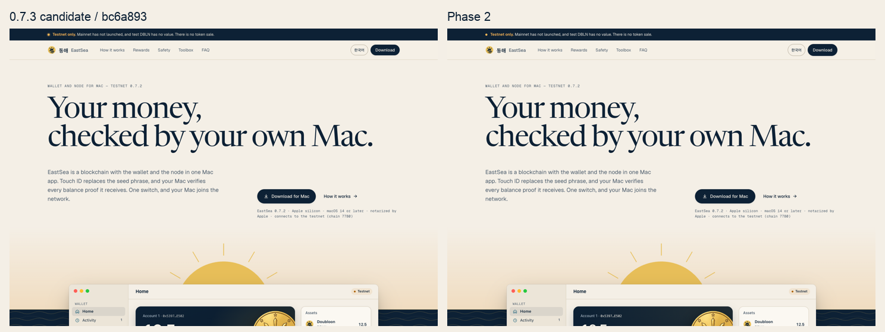
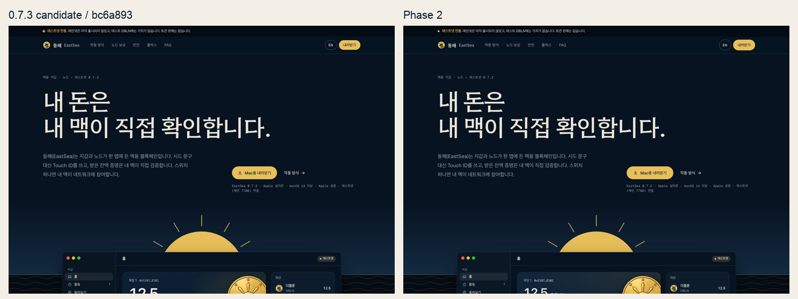
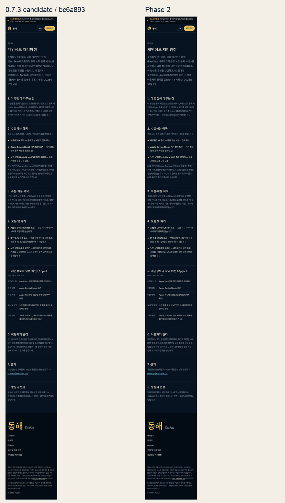
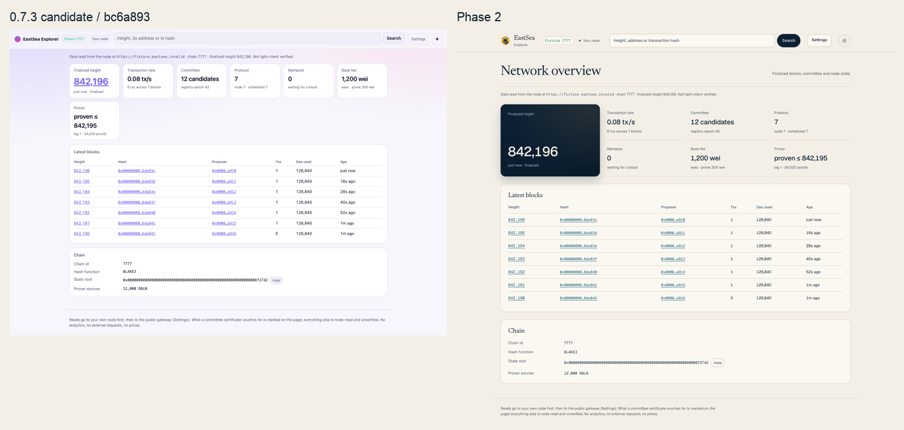
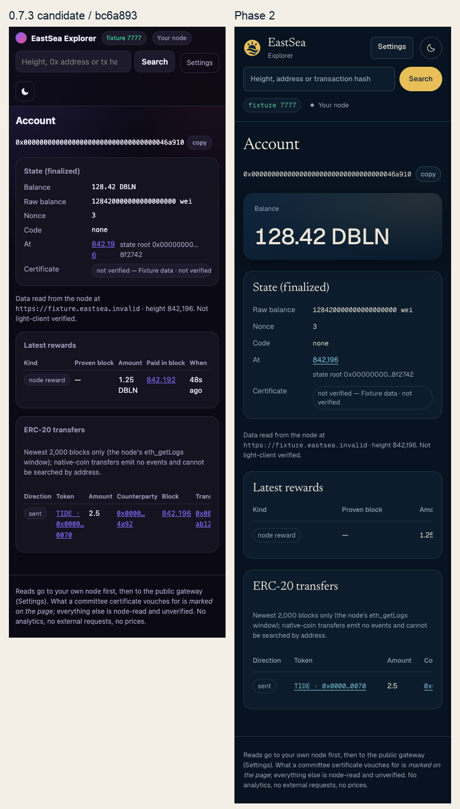

# Wallet redesign phase 2 — lead handoff

The approved EastSea system is applied in source across the Mac wallet, shared menu panel, settings, site and explorer. **Native verification is pending:** this lane reached its 20-minute compile-slot wait limit before `xcodebuild` started and stopped native work as instructed. New wallet screenshots and the full native old/new comparison are not available; do not treat this report as native launch approval.

Base: `bc6a893` (`codex/integrate-073`, 0.7.3 candidate). Phase 1: `b46d281`, merged as `81298dc`. Wallet source commit: `5503e4c`. Web commit: `194e210`. No push.

## What changed

- Global native color/font/spacing/radius aliases and primary, quiet and field styles read generated tokens.
- Home, activity, network/node/security, sidebar and all send/receive/assets/call/connect/recovery surfaces use paper/navy, the dawn mark and quiet rows. Exact Decimal count-up resets on account identity; exact wei-derived accessibility values remain authoritative.
- `EastSeaDesign.MenuBarPanel` is the actual menu content, with the existing account switcher, node binding, verification/health truth, prover/unattended diagnostics, receive/copy/share, reward export, open and quit actions. Typed content slots preserve these controls. Menu reward/status effect IDs remain nil because that adapter has no reliable confirmed event identity.
- Settings retain native controls and their bindings; native Grid label/control columns, short sections and **Learn more / 더 알아보기** disclosures retain the original detailed text. Safety, approval and rewards-off notices stay visible.
- Accounts/switcher/retirement, browser approvals, legal terms/voting invitation, health banners and migration overlays use shared surfaces without modifying their model or security logic. Native NSAlert chrome remains the operating system's own.
- Continuous earnings aurora, heartbeat, live ring, particles, confetti and bounce are removed. Navy depth, settled finite count-up and a 600 ms shine use the existing paid-reward celebration ID. Earnings model/value code is unchanged. Existing polling and relative-time updates remain.
- Both site pages load the shared components. Explorer balances use navy; metadata/controls and mobile settings alignment are corrected. Decorative and loading effects finish. Existing bilingual site content, links/actions and explorer RPC request sets are preserved.
- The existing validator-candidate EN/KO branch now uses the catalog in all five languages. New settings/menu copy has all five translations. There are **937 keys per language**.

## Verification

| Gate | Result |
|---|---|
| Shared token read-only drift check | PASS — 9 platform outputs match v1.1.0 |
| Token generator / palette / contrast regressions | PASS — 6 tests |
| Localization catalog and source lint | PASS — en/ko/ja/zh-Hans/zh-Hant, 937 keys each |
| Localization scanner self-test | PASS |
| Shell syntax and whitespace | PASS |
| Mechanical web design scan | Advisory findings only: approved Geist family and preserved privacy punctuation; [report](phase2/design-detector.json) |
| Explorer unit tests | PASS — 62/62 |
| Local web browser matrix | PASS — 49/49; no console/page errors, broken images, external requests or document overflow |
| Web preservation | PASS — same site catalogs, links/actions and exact explorer RPC request multisets |
| Independent native source review | No critical/high finding in inspected presentation diff; not compilation or render proof |
| Native WalletScreens build | NOT RUN — semaphore wait reached 20-minute lane cap; `xcodebuild` never started |
| Native app build / pure Swift / compiler-extracted localization | PENDING — lead must run |
| Redesigned native screenshots / QR decode / overflow / visual verdict | PENDING — lead must run all 336 fixture renders |

Web matrix: `index` and `privacy` × EN/KO × light/dark × desktop/mobile; explorer home/block/transaction/account/token × light/dark × desktop/mobile, plus 13 empty/pruned/unknown/pending/dropped/failed/contract/token/error/loading states on mobile. Web visual verdict: **95/100**. Normal-motion timing and Reduce Transparency were source-reviewed; browser captures exercise Reduce Motion. No deployed/live-RPC check was run.

## Side-by-side: old 0.7.3 and phase 2 web

These compare actual local captures from the exact old candidate checkout with the redesigned pages, at identical display scales.











Every web capture is retained as a lossless WebP in [old](phase2/web/old-073/report.json) and [new](phase2/web/new/report.json) reports; [dimensions and hashes](phase2/web-render-manifest.json). [Web QA handoff](phase2/web/handoff.json).

## Native comparison — pending build slot

Old 0.7.3 QA captures exist for all **48 fixtures × 7 language/appearance combinations = 336**. The release lane's Sources/Resources/Screens/Generated/Assets files match the detached `bc6a893` baseline byte for byte. Its prebuilt **WalletScreens** renderer was copied into this lane and used only with throwaway fixture homes; the real EastSea app was never launched. The native manifest records binary/source provenance, all existing old-candidate capture paths, image dimensions and SHA-256 hashes. A fresh old render pass was stopped at the lane cutoff; the complete existing old set remains the reference.

[Native baseline manifest and pending status](phase2/native-render-manifest.json).

| Screen | Old candidate | Phase 2 |
|---|---|---|
| Home EN light | [render](phase2/wallet-old-073/home-en-light.webp) | Pending native compile/render |
| Activity EN light | [render](phase2/wallet-old-073/activity-en-light.webp) | Pending native compile/render |
| Settings EN light | [render](phase2/wallet-old-073/settings-en-light.webp) | Pending native compile/render |
| Settings KO light | [render](phase2/wallet-old-073/settings-ko-light.webp) | Pending native compile/render |
| Settings KO dark | [render](phase2/wallet-old-073/settings-ko-dark.webp) | Pending native compile/render |
| Menu EN light | [render](phase2/wallet-old-073/menubar-en-light.webp) | Pending native compile/render |
| Menu KO dark | [render](phase2/wallet-old-073/menubar-ko-dark.webp) | Pending native compile/render |
| Send EN light | [render](phase2/wallet-old-073/sheet-send-en-light.webp) | Pending native compile/render |
| Explore window EN light | [render](phase2/wallet-old-073/window-explore-en-light.webp) | Pending native compile/render |
| Terms EN light | [render](phase2/wallet-old-073/sheet-terms-en-light.webp) | Pending native compile/render |

The script still covers every fixture in EN/KO light+dark and JA/zh-Hans/zh-Hant light. The menu fixture width is now 336 pt. `--no-build` repeats renders without reentering the compile semaphore. OCR, language checks and QR decoding still run for the captured matrix.

## Lead: remaining sequential gates

Run on this Mac in this worktree. Never launch EastSea.app or touch the real node folder. Existing `target/release/libaether_ffi.a` is a read-only symlink to the candidate lane's library, and the package cache is copied into this lane's own `tmp/`.

```bash
# Gates xcodebuild internally in the same shell, with a 20-minute slot-wait alarm.
scripts/wallet-screens.sh

# Re-render the whole language/theme matrix from the newly built fixture binary.
scripts/wallet-screens.sh --no-build

# Pure Swift tests keep the localization/account suites and design-effects target.
# Each compiler uses its own semaphore-owner shell to avoid retaining two slots.
scripts/test-swift-pure.sh

# Build the production target without launching it (no Rust/Jolt build needed).
export TMPDIR="$(git rev-parse --show-toplevel)/tmp"
perl -e 'alarm 1200; exec @ARGV' "$HOME/.claude/playbooks/aether-team/wait-compile.sh" && xcodebuild -project apps/wallet/AetherWallet.xcodeproj -scheme AetherWallet   -configuration Debug -derivedDataPath "$TMPDIR/wallet-phase2-app-build"   CODE_SIGNING_ALLOWED=NO build
```

After the first successful WalletScreens build, check compiler-extracted catalog keys with `scripts/check-wallet-l10n.sh --stringsdata tmp/wallet-screens-build/Build/Intermediates.noindex/AetherWallet.build/Debug/WalletScreens.build/Objects-normal/arm64`. Compare new `tmp/screens/` against the baseline manifest and phase-1 comps, particularly long settings picker values at 420 pt, menu health/receive content at 336 pt, full windows, QR payloads, all overlays and five-language layouts. Publish the complete old/new native matrix here and persist its Visual Verdict. Native type errors, layout overflow and hardware feedback remain unverified.

No Rust/Jolt guest was built, no SSH/rsync or real node access was used, and no built EastSea app was launched. Task-owned browser/server processes are closed; the isolated old renderer was stopped.

## Phase 2 changed files

- `apps/explorer/README.md`
- `apps/explorer/explorer.css`
- `apps/explorer/js/app.js`
- `apps/explorer/js/dom.js`
- `apps/explorer/js/pages.js`
- `apps/wallet/AetherWallet.xcodeproj/project.pbxproj`
- `apps/wallet/Resources/Localizable.xcstrings`
- `apps/wallet/Screens/WalletScreens.swift`
- `apps/wallet/Sources/AccountSwitcher.swift`
- `apps/wallet/Sources/AetherWalletApp.swift`
- `apps/wallet/Sources/AgentWalletPanel.swift`
- `apps/wallet/Sources/AssetsSheet.swift`
- `apps/wallet/Sources/CandidateEligibilityText.swift`
- `apps/wallet/Sources/ContentView.swift`
- `apps/wallet/Sources/Design/MenuBarPanel.swift`
- `apps/wallet/Sources/Earnings.swift`
- `apps/wallet/Sources/ExploreTab.swift`
- `apps/wallet/Sources/HealthMonitor.swift`
- `apps/wallet/Sources/MigrationStatus.swift`
- `apps/wallet/Sources/NetworkPaused.swift`
- `apps/wallet/Sources/NodeStatusViews.swift`
- `apps/wallet/Sources/Onboarding.swift`
- `apps/wallet/Sources/ProverMenu.swift`
- `apps/wallet/Sources/ReceiveAddressView.swift`
- `apps/wallet/Sources/ResourcesSettings.swift`
- `apps/wallet/Sources/SettingsView.swift`
- `apps/wallet/Sources/SimpleDashboard.swift`
- `apps/wallet/Sources/StorageSettings.swift`
- `apps/wallet/Sources/Theme.swift`
- `apps/wallet/Tests/candidate-eligibility/main.swift`
- `scripts/test-swift-pure.sh`
- `scripts/wallet-screens.sh`
- `site/README.md`
- `site/index.html`
- `site/privacy.html`
- `site/styles.css`
