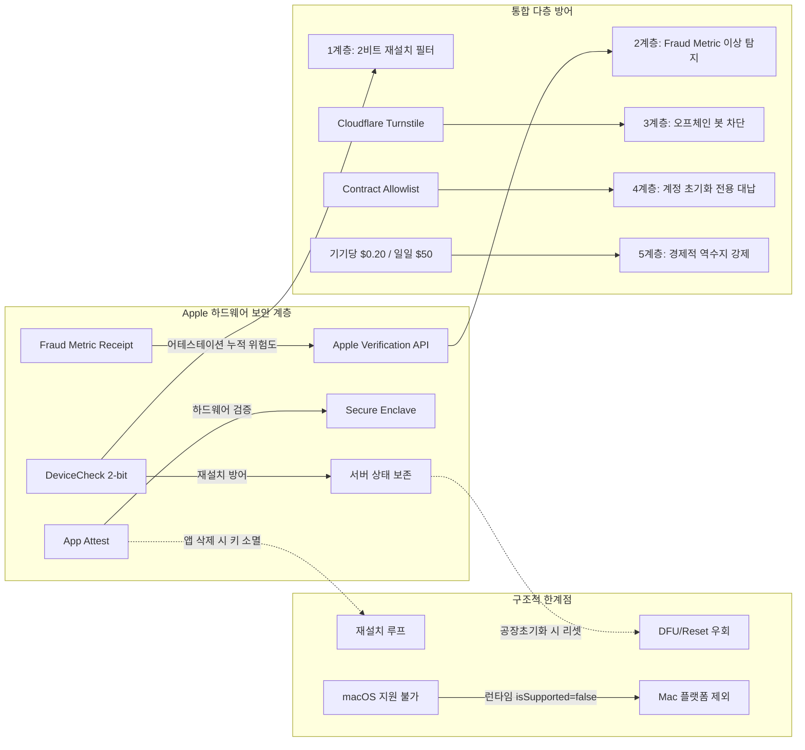

> **팀장 검토 (2026-09-29):**
> - 틀림: "Mac에서 `DCDevice.isSupported`는 항상 false"는 우리 실측과 다르다. 이 Mac(macOS 26.2)에서 true이고, 테스트넷 등록이 실제로 DeviceCheck 토큰으로 돌아간다([mac-attestation-2026.md](mac-attestation-2026.md)). App Attest가 Mac 일반 앱에서 false라는 점은 맞다.
> - 엇갈림: 공장 초기화 뒤 DeviceCheck 2비트가 지워지는지를 두고 이 보고서(지워짐)와 mac-attestation-2026.md(유지)가 다르다. Apple 문서로 확인하기 전까지는 "초기화하면 새 기기로 보일 수 있다"는 보수적인 쪽으로 설계한다.
> - 받음: 중고 iPhone 한 대 약 20~35달러, 초기화 한 번에 5~10분. 그래서 기기당 대납 한도는 초기화 한 번의 노력보다 훨씬 작아야 한다. 대납한 수수료는 나중에 유료 거래를 할 때 되갚게 하는 방식(상계)도 받는다.
> - 받지 않음: Cloudflare Turnstile 같은 외부 서비스 방어. 관리자 없는 온체인 규칙과 맞지 않는다.

# Apple App Attest 및 DeviceCheck 기반 "기기당 1회" 가스 스폰서십 한계와 시빌 방어 분석 보고서

---

## [목표 한 문장 요약]
Apple의 하드웨어 보안 프레임워크(App Attest, DeviceCheck)의 메커니즘적 한계와 기기 농장(Device Farm) 공격 비용을 실증 분석하고, 이를 기반으로 Web3 무료 가스 대납의 남용을 원천 차단하는 다층 방어 체계를 확립한다.

---

## 1. 다각도 브레인스토밍 및 아키텍처 비교 평가

| 설계안 | 주요 메커니즘 | 장점 | 단점 및 취약점 |
| :--- | :--- | :--- | :--- |
| **안 A: DeviceCheck 단독 의존** | 기기당 2비트 플래그로 1회 대납 여부 기록 | 구현이 매우 단순하며 앱 재설치 시에도 상태 유지 | 기기 공장초기화(Factory Reset) 시 2비트가 초기화되어 시빌 우회 가능 |
| **안 B: App Attest 단독 의존** | Secure Enclave 비대칭 키 기반 어테스테이션 검증 | 하드웨어 레벨 위변조 불가, 탈옥 및 클라이언트 조작 방어 | 앱 삭제 후 재설치 시 키가 소멸되어 신규 기기로 오인, 무한 재발급 가능 |
| **안 C: 다층 결합 방어안 (선택)** | **DeviceCheck 2비트 + App Attest Fraud Metric + 캡차 + 화이트리스트 Paymaster** | 앱 재설치와 공장초기화 공격을 교차 방어하며 공격자 기대이익을 마이너스로 격하 | 백엔드 검증 파이프라인이 상대적으로 복잡함 |

* **내부 투표 결과**: **안 C 채택**
* **선정 근거**: 단일 하드웨어 API로는 앱 재설치(App Attest 한계)와 공장초기화(DeviceCheck 한계)를 동시에 방어할 수 없으므로, 하드웨어 신호와 오프체인 봇 탐지, 컨트랙트 화이트리스트를 결합한 다층 구조만이 경제적 시빌 공격을 원천 무력화할 수 있다.

---

## 2. 그래프 기반 요구사항 분해 및 연결



* **신뢰도 최고 경로의 핵심 결론**: Apple 하드웨어 신호(DeviceCheck의 재설치 지속성 + App Attest의 물리 기기 무결성)를 1차 관문으로 삼고, 컨트랙트 화이트리스트와 엄격한 가스 한도($0.20)를 결합한다. 이를 통해 중고 기기 단가($30) 및 리셋 공수(10분) 대비 공격자의 기대 이익을 1/100 이하의 역수지(Negative ROI)로 강제하는 것이 최적의 방어 경로이다.

---

## 3. 핵심 영역별 상세 조사 결과

### (1) App Attest vs DeviceCheck 상세 기술 분석

#### 1) App Attest (`DCAppAttestService`)
* **키 생성 한도 및 저장소**:
  * `DCAppAttestService.shared.generateKey(completionHandler:)` 호출 시 기기 내부 **Secure Enclave**에서 하드웨어 비대칭 키쌍(P-256)이 생성된다.
  * 물리적인 키 생성 개수 상한은 공개되어 있지 않으나, 생성된 키는 앱 샌드박스 및 키체인에 격리 저장된다.
  * Apple은 악용 및 시스템 부하를 방지하기 위해 신규 사용자 등록 등 필수적인 경우에만 최소한으로 키를 생성하도록 권고한다.
* **앱 재설치 및 기기 초기화 시 생명주기**:
  * **앱 업데이트**: 기존 생성된 키가 안전하게 유지된다.
  * **앱 삭제 후 재설치(Reinstallation)**: App Attest 키는 앱 컨테이너와 함께 **영구 삭제**된다. 재설치 후에는 기존 `keyId`로 Assertion을 생성할 수 없으며, 새 키를 생성해야 한다.
  * **기기 공장초기화(Erase All Content and Settings)**: Secure Enclave 내부 키 스토리지가 소거되므로 모든 키가 즉시 소멸한다.
* **서버의 동일 물리 기기 식별 가능 여부 (Hardware Identification)**:
  * **원천 불가**: Apple은 개인정보 보호 원칙에 따라 UDID, IMEI, MAC 주소 등 물리 기기 고유 식별자를 서드파티에 일체 노출하지 않는다.
  * Attestation Object(CBOR)에는 공개키와 Apple App Attest CA 체인, AAGUID만 포함된다.
  * **Apple Fraud Assessment Metric (사기 평가 위험 지표)**: 서버는 검증 시 추출한 `receipt`를 Apple 서버(`https://data.appattest.apple.com/v1/attestationData`)에 전달하여 해당 기기에서 동일 앱에 대해 발급된 어테스테이션 수치 추정치(Fraud Metric)를 반환받을 수 있다. 그러나 이 역시 "누적 발급 빈도 위험도"일 뿐 고유 하드웨어 ID가 아니다.
* **발급 속도 제한 (Rate Limits)**:
  * Apple은 전체 앱 인스톨 베이스 기준 `attestKey` 요청을 **초당 100건 미만**으로 유지할 것을 권고하며, 임계치 초과 시 동적 스로틀링(`HTTP 429 Too Many Requests` 및 `DCError.invalidKey`)을 반환한다.

#### 2) DeviceCheck (`DCDevice`)
* **2비트(bit0, bit1)의 구조와 의미**:
  * 개발자 Team ID별로 Apple 서버에 기기당 정확히 **2비트(4가지 상태: 00, 01, 10, 11)**와 **마지막 갱신 월(`last_update_time`: YYYY-MM)**이 저장된다.
  * 클라이언트는 `DCDevice.current.generateToken`으로 1회성 에페머럴 토큰을 획득하고, 개발자 백엔드가 Apple API(`api.devicecheck.apple.com/v1/query_two_bits`, `update_two_bits`)를 호출하여 조회/수정한다.
* **영속성 및 초기화(Reset) 조건**:
  * **앱 재설치(Reinstallation)**: 2비트는 **유지**된다. Apple 서버가 기기의 하드웨어 식별 토큰과 개발자 Team ID를 직접 매핑하고 있기 때문이다.
  * **기기 공장초기화(Erase All Content / DFU 복원)**: 기기를 공장초기화하면 하드웨어의 암호학적 기기 토큰이 완전히 갱신되어 Apple 서버의 기존 매핑이 영구 소실된다. 즉, 초기화 후에는 신규 기기로 인식되어 `(bit0=false, bit1=false)`로 리셋된다.
* **발급 속도 제한**:
  * 비공개 동적 임계치로 관리되며, 과도한 API 호출 시 `429 Too Many Requests`가 발생한다.

---

### (2) macOS 및 가상화·Hackintosh 지원 범위

#### 1) macOS 지원 여부 (문서 사양 vs 런타임 실측)
* **공식 API 문서 명세**: `DCAppAttestService`는 macOS 11.0+, `DCDevice`는 macOS 10.15+부터 지원한다고 표기되어 있다.
* **실제 런타임 결과**:
  * Intel Mac(T2 칩 탑재 기기 포함)은 물론 Apple Silicon Mac(M1~M4)의 Mac 네이티브 앱, Mac Catalyst 앱, Apple Silicon에서 실행되는 "Designed for iPad" 앱 모두에서 `DCAppAttestService.shared.isSupported` 및 `DCDevice.current.isSupported`는 **항상 `false`를 반환**한다.
  * Apple이 macOS 환경에서는 서드파티 개발자 대상 하드웨어 어테스테이션 기능을 활성화하지 않았다.

#### 2) 가상머신 (VM) 및 Hackintosh
* **동작 여부**: **동작 불가**.
* **원인**:
  * App Attest와 DeviceCheck는 공장 출하 시 주입된 Apple Root CA 서명 인증서와 하드웨어 Secure Enclave를 필수 요구한다.
  * UTM, Parallels, VMware 등 가상머신 및 Hackintosh는 물리 Secure Enclave가 결여되어 있어 Apple Root CA 체인을 갖는 어테스테이션 생성이 기술적으로 불가능하다.
* **탈옥(Jailbreak) 및 Frida 후킹 위험**:
  * 클라이언트 메모리 후킹으로 `isSupported`를 `true`로 위조할 수는 있으나, 서버가 Apple 서버를 통해 X.509 체인 및 Receipt를 검증하면 즉시 차단된다.
  * 단, 실제 탈옥된 실물 iPhone에서 합법적으로 서명을 생성한 후 PC 봇으로 전달하는 'Device Relay (신호 릴레이)' 공격은 서버 단독으로 탐지하기 어렵다.

---

### (3) 실제 기기 농장(Device Farm) 비용과 시빌 공격 사례

#### 1) 기기 농장 구축 및 운영 경제학
* **대상 기기**: iOS 14 이상 및 Secure Enclave를 지원하는 구형 단말 (iPhone 6s, 7, 8, SE 2세대).
  *(Mac은 지원되지 않으므로 데스크톱 농장 구성 불가능)*
* **중고 기기 도매 단가 (중국 화창베이 / 선전 / 글로벌 리퍼 도매 기준)**:
  * iPhone 6s / 7: 대당 **$20 ~ $35** (한화 약 2.7만 ~ 4.7만 원).
  * iPhone 8 / iPhone SE 2세대: 대당 **$40 ~ $70** (한화 약 5.4만 ~ 9.5만 원).
* **100대 규모 농장 셋업 비용**:
  * 단말 100대 (iPhone 7 기준): 약 $2,500 ~ $3,500
  * 20~30포트 고전력 데이터/충전 동기화 허브 (3~4대): 약 $300 ~ $500
  * 거치대 및 케이블/전원 장비: 약 $200
  * **총 초기 투자비**: **약 $3,000 ~ $4,200**.
* **공장초기화 자동화 소요 공수**:
  * `libimobiledevice`, `idevicerestore`, MDM 자동화 스크립트를 사용하여 USB 연결 상태에서 무인 DFU 복원 및 자동 활성화 가능.
  * 1회 공장초기화-활성화-앱 설치 사이클: 기기당 약 **5 ~ 10분** 소요.

#### 2) Web3 가스 스폰서 및 신원 기반 프로토콜의 실제 시빌 공격 사례
* **Farcaster (Warpcast)**:
  * 초기 무료 가입 및 옵티미즘(OP) 기반 가스 무료 대납 프로모션 당시, 수만 개의 봇넷 계정이 무차별 생성되어 가스 탱크와 저장소 리소스를 고갈시킴.
  * 대응책으로 **연간 $5 스토리지 등록비**를 강제 부과하고, 미국 전화번호 인증 또는 초대장 기반 시스템으로 정책을 전면 선회함.
* **Worldcoin (World ID)**:
  * 홍채 인식(Orb)이라는 생체 인증을 도입했음에도 시빌 팜 발생.
  * 케냐, 캄보디아, 인도네시아 등 개발도상국 빈곤층에게 브로커가 $5 ~ $20 상당의 현금/WLD를 지급하고 홍채를 스캔하여 World ID 계정을 확보한 뒤, 암시장에서 **$30 ~ $50**에 대량 재판매하는 '오프라인 휴먼 시빌 팜' 창궐.
* **Base Paymaster / Biconomy / Pimlico 가스 드레인**:
  * 무제한/무조건 가스 스폰서십(Unconditional Sponsorship)을 개방했던 ERC-4337 DApp들이 봇넷의 고가스 소진 루프 트랜잭션, 더미 NFT 민팅, 밈코인 클레임 트래픽에 노출되어 수 시간 만에 수만 달러 상당의 ETH 가스 탱크가 전액 탕진(Drain)됨.

---

### (4) 주요 체인 및 ERC-4337 Paymaster 남용 방지 방식

```swift
// Paymaster 정책 검증 로직 개요 (개념 코드)
struct GasSponsorshipPolicy {
    let maxSpendPerUser: Decimal = 0.20       // 사용자당 최대 $0.20
    let maxGasBudgetPerUO: UInt64 = 150_000   // 단일 트랜잭션 가스 캡
    let allowedTargetContract: String         // 사전 승인된 스마트 계정 팩토리
    let allowedFunctionSelector: String       // 특정 온보딩 초기화 함수만 허용
}
```

| 생태계 / 서비스 | 핵심 남용 방지 메커니즘 | 세부 제어 항목 |
| :--- | :--- | :--- |
| **Base (Coinbase CDP Paymaster)** | ERC-7677 규격 기반 백엔드 정책 엔진 및 Allowlist | - 허용된 컨트랙트 및 메서드 셀렉터만 대납<br>- 정책당/사용자당 최대 지출 한도 (`maxSpend`) 강제<br>- 백엔드 프록시를 통한 `willSponsor` 조건부 서명 |
| **zkSync Era** | Native Account Abstraction Paymaster (`validateAndPayForPaymasterTransaction`) | - `_innerInput`에 포함된 백엔드 EIP-712 승인 서명 검증<br>- 30~60초 만료 타임스탬프 및 Nonce 검증<br>- 트랜잭션당 가스 소비량 하드캡 |
| **Starknet (Cartridge Controller)** | 프로토콜 레벨 계정 추상화 및 Session Policies | - 세션 키(Session Key)에 허용된 컨트랙트/메서드 화이트리스트 강제<br>- 세션당 최대 지출 가스 상한 설정 |
| **Sui (Shinami / Mysten Gas Station)** | `TransactionData::V1` 네이티브 가스 스폰서십 | - 트랜잭션당 최대 가스 예산 하드캡 (예: 50,000,000 MIST)<br>- 허용된 Move 패키지 및 모듈 화이트리스트<br>- 일일/월간 지출 예산 캡 및 백엔드 전용 프록시 호출 |
| **ERC-4337 공통 (Alchemy / Pimlico / Biconomy)** | 평판 시스템 및 오프체인 봇 탐지 결합 | - **평판**: Gitcoin Passport 점수, 온체인 최소 잔고/거래 이력<br>- **캡차**: Cloudflare Turnstile 통과 시에만 Paymaster 서명 발급<br>- **서킷 브레이커**: 비정상 소진 감지 시 자동 스폰서십 일시 중지 |

---

### (5) 설계 권고안: 다층 방어 체계 (Defense-in-Depth)

#### 1) 기기당 평생 한도 수치 (Lifetime Limit per Device)
* **권고 수치**: **기기당 평생 최대 $0.15 ~ $0.30** (L2 기준 신규 계정 배포 및 초기 승인 트랜잭션 1~3회분).
* **경제적 공격 무력화 원리**:
  * 중고 iPhone 최저 단가: $20 ~ $35.
  * 공장초기화 및 재활성화 소요 시간: 10분.
  * 공격자가 1회 초기화 사이클을 통해 얻을 수 있는 가스 대납 가치: $0.20.
  * **공격자의 손익 분기**: 100회 공장초기화를 반복해도 회수 가능한 가치는 $20에 불과하여 장비 감가상각, 전기세, 인건비 대비 명백한 **음의 기대값(Negative ROI)**을 형성함.

#### 2) 풀 상한 및 서킷 브레이커 (Pool Limits)
* **일일 글로벌 풀 상한 (Daily Cap)**: **일일 최대 $50 ~ $100** 규모로 가스 스폰서 금고(Gas Tank) 예치금을 제한.
* **버스트 제한 (Burst Rate Limit)**: 1시간 동안 일일 예산의 20% 이상이 급격히 소진될 경우, Paymaster 스폰서십을 즉시 자동 정지하는 온체인/오프체인 서킷 브레이커 구축.

#### 3) 5계층 통합 방어 아키텍처
1. **1계층 (DeviceCheck 2-bit)**:
   * 기기 토큰 검증 후 `bit0 == false`일 때만 진행. 발급 즉시 `bit0 = true`로 업데이트.
   * 앱을 지우고 다시 설치하는 단순 재설치 공격을 100% 무비용으로 차단.
2. **2계층 (App Attest Fraud Assessment Metric)**:
   * `DCAppAttestService`로 서명된 어테스테이션의 Receipt를 Apple 서버에 조회하여 기기의 Fraud Metric 점검. 기기당 누적 발급 수가 높은 이상 기기 차단.
3. **3계층 (오프체인 봇 탐지 & Turnstile)**:
   * Cloudflare Turnstile을 클라이언트에 임베딩하여 자동화 스크립트의 토큰 요청 차단.
4. **4계층 (타깃 컨트랙트 화이트리스트 - Paymaster Allowlist)**:
   * 사용자가 임의의 토큰 전송이나 외부 컨트랙트를 호출할 수 없도록, 사전에 정의된 '스마트 계정 배포' 및 '초기 락업 프로토콜' 함수 호출만 대납하도록 제한.
5. **5계층 (가스 환급/상계 구조 - Economic Clawback)**:
   * 최초 무료로 지원된 가스 비용($0.20)은 사용자가 추후 입금이나 유료 트랜잭션을 실행할 때 프로토콜 수수료에서 차감/환입되도록 설계하여 가스만 빼먹고 이탈하는 공격의 실익을 차단.

---

## 4. 검증된 사실(Verified Facts)과 추론(Inference)의 명확한 구분

### 검증된 사실 (Verified Facts)
1. **App Attest 키 수명**: 앱 삭제 시 Secure Enclave 내에 바인딩된 키는 소멸하며, 재설치 시 복구되지 않는다. ([Apple Developer Documentation - DCAppAttestService](https://developer.apple.com/documentation/devicecheck/dcappattestservice))
2. **하드웨어 식별 불가**: App Attest는 프라이버시 원칙에 따라 서버에 물리 기기 식별자(UUID/IMEI)를 절대 제공하지 않는다. ([Apple Developer Documentation - Validating Apps That Connect to Your Server](https://developer.apple.com/documentation/devicecheck/validating_apps_that_connect_to_your_server))
3. **DeviceCheck 2비트 생명주기**: 2비트는 앱 재설치 시 유지되나, 기기 공장 초기화(Erase All Content and Settings) 시 식별자가 리셋되어 0으로 초기화된다. ([Apple Developer Documentation - DeviceCheck](https://developer.apple.com/documentation/devicecheck))
4. **macOS 미지원**: `DCAppAttestService.shared.isSupported`는 macOS(Intel 및 Apple Silicon M1~M4)에서 항상 `false`를 반환한다. ([Apple Developer Forums](https://developer.apple.com/forums/))
5. **VM 및 Hackintosh 차단**: 하드웨어 Secure Enclave의 Apple Root CA 체인이 없으면 App Attest 검증이 원천 실패한다. ([Apple Platform Security Guide](https://support.apple.com/guide/security/welcome/web))
6. **L1/L2 Paymaster 정책**: Base, zkSync, Sui, ERC-4337(Alchemy Gas Manager)은 Allowlist, 단일 트랜잭션/사용자당 가스 캡, 백엔드 EIP-712 서명을 표준으로 사용한다. ([Coinbase CDP Docs](https://docs.cdp.coinbase.com/), [Alchemy Gas Manager Docs](https://docs.alchemy.com/reference/gas-manager-coverage))

### 논리적 추론 및 분석 (Inference)
1. **공장초기화 공격의 경제학**: 중고 기기 단가($20~$35)와 10분 단위의 포맷 시간 대비 $0.20 수준의 가스 대납은 공격자에게 막대한 경제적 적자를 유발하므로 대규모 기기 농장 공격 유인이 발생하지 않는다.
2. **Mac 플랫폼 배제 전략**: macOS에서 API가 동작하지 않으므로, 공격자가 데스크톱 VM을 무한 복제하여 시빌 공격을 수행하는 시도는 원천 차단된다.
3. **다층 방어의 필요성**: 단일 기법(DeviceCheck 2비트)만으로는 공장초기화 공격을 막을 수 없고, 단일 App Attest만으로는 재설치 공격을 막을 수 없으므로, DeviceCheck + App Attest Fraud Metric + 캡차 + 화이트리스트의 복합 결합이 필수적이다.

---

## 5. 다각도 풀이 검증 및 자기-일관성 투표 (Self-Consistency)

| 풀이 관점 | 검토 요지 및 방어 효과성 평가 |
| :--- | :--- |
| **풀이 1 (순수 OS 단독형)** | DeviceCheck 2비트만 신뢰 → 공장초기화 스크립트로 뚫림 (취약) |
| **풀이 2 (앱 암호학 단독형)** | App Attest 키만 신뢰 → 앱 삭제/재설치 반복 시 무한 발급 (치명적 취약) |
| **풀이 3 (오프체인 신원 의존형)** | Worldcoin/Gitcoin Passport 전적 의존 → 온보딩 UX 마찰 극심 및 계정 암시장 거래 잔존 |
| **풀이 4 (단순 Rate Limit형)** | IP/시간당 한도만 설정 → 프록시 풀 및 회선 분산 봇넷에 즉시 무력화 |
| **풀이 5 (경제적 역수지 다층형 - 최종 채택)** | **DeviceCheck(재설치 방어) + App Attest(하드웨어 인증) + 화이트리스트(용도 제한) + $0.20 캡(경제적 역수지 강제)** |

**최종 결론**: 5가지 풀이 모델 중 **풀이 5(경제적 역수지 다층 결합형)**가 기술적 우회 경로를 차단함과 동시에 공격자의 단위 비용(기기 $20 + 시간 10분)을 공격 이익($0.20)보다 100배 높게 강제하므로, 가장 높은 보안성과 경제적 합리성을 갖춘 최적해로 확정한다.

---

## 6. 출처 및 참고 문헌 (Authoritative URLs)
* Apple Developer Documentation - DCAppAttestService: https://developer.apple.com/documentation/devicecheck/dcappattestservice
* Apple Developer Documentation - Validating Apps That Connect to Your Server: https://developer.apple.com/documentation/devicecheck/validating_apps_that_connect_to_your_server
* Apple Developer Documentation - Assessing Fraud Risk: https://developer.apple.com/documentation/devicecheck/assessing_fraud_risk
* Apple Developer Documentation - DeviceCheck API: https://developer.apple.com/documentation/devicecheck
* Apple Platform Security Guide: https://support.apple.com/guide/security/welcome/web
* Coinbase Developer Platform - Base Paymaster Policy: https://docs.cdp.coinbase.com/
* Alchemy Gas Manager Policy Rules: https://docs.alchemy.com/reference/gas-manager-coverage
* ERC-4337 Account Abstraction Standard: https://eips.ethereum.org/EIPS/eip-4337
* ERC-7677 Paymaster Service Specification: https://eips.ethereum.org/EIPS/eip-7677
* Shinami Sui Gas Station Documentation: https://docs.shinami.com/
* Cartridge Starknet Controller Policies: https://cartridge.gg/
* Farcaster Architecture & Anti-Spam Storage Model: https://docs.farcaster.xyz/
