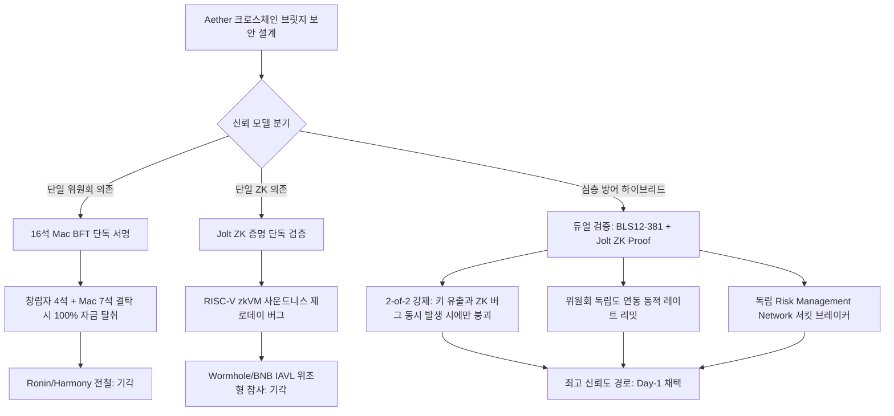
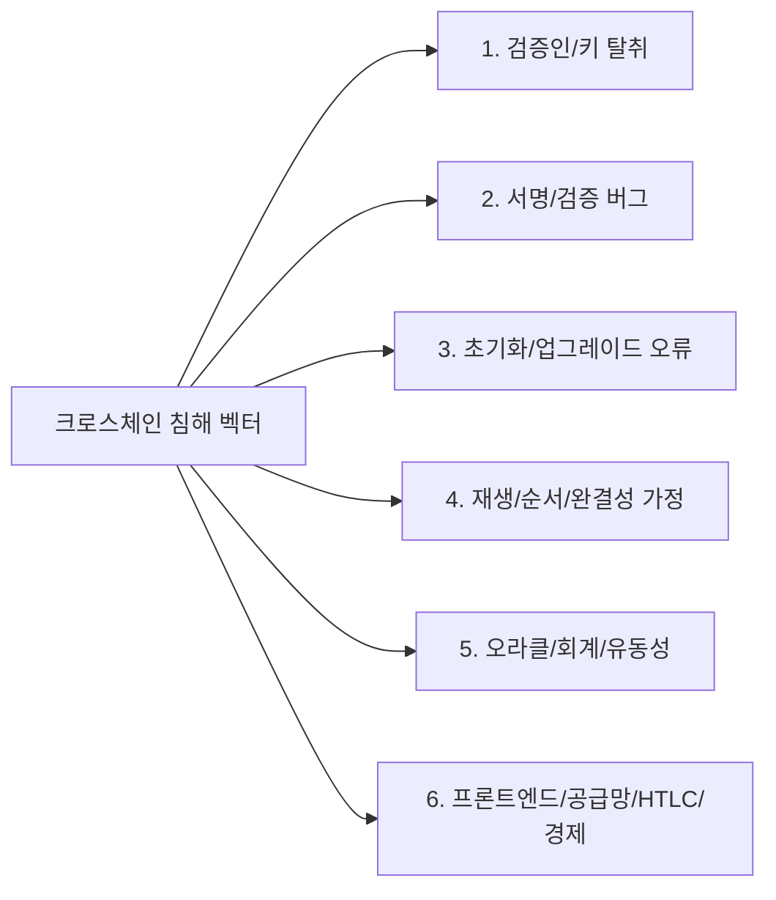
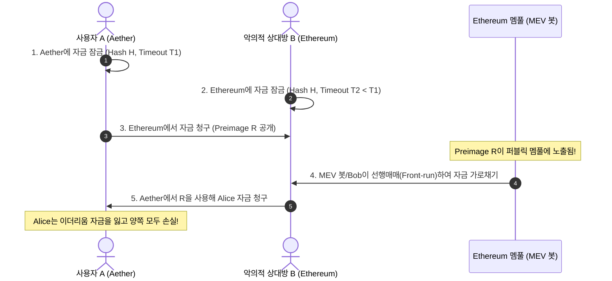
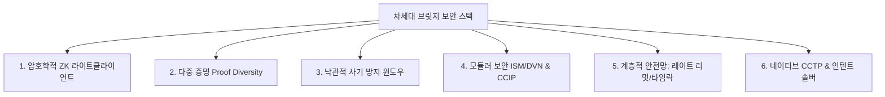
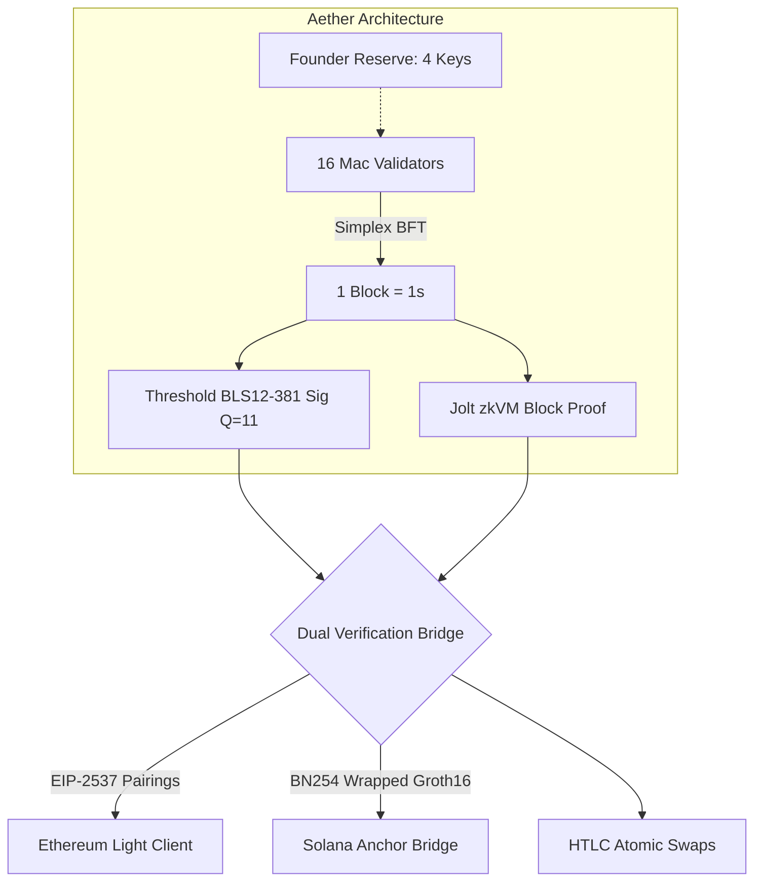
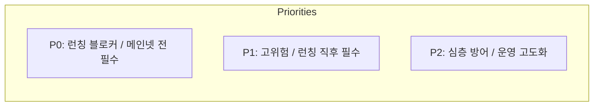

> **팀장 검토 (2026-09-29):** agy 리서치 원본이다. 결정과 채택 항목은 [21-crosschain.md](../design/21-crosschain.md)에 정리했다. 확인 필요: 솔라나 BLS12-381 시스템콜(SIMD-0388, Agave 4.0)과 비용은 배포 전에 공식 문서로 다시 확인한다.

# 크로스체인 브릿지 및 스왑 보안(Cross-Chain Bridge & Swap Security) 종합 연구 보고서

> **목표 한 문장 요약**: 2021~2026년 주요 브릿지·스왑 침해 사고의 사후분석 및 최신 학술·감사 자료를 바탕으로 익스플로잇 분류 체계를 확립하고 차세대 신뢰 최소화 기술을 분석하여, Aether(16석 Mac BFT, BLS12-381, 창립자 리저브 키, Jolt ZK, revm) 특화 공격 경로 및 Day-1 방어 설계와 우선순위화된 보안 요구사항 체크리스트를 확립한다.

---

### [시스템 추론 및 다각도 평가 프레임워크]

1. **3단계 추론 프레임워크 (계획 · 추론 · 검증)**:
   - **계획(Plan)**: 2021~2026년 브릿지 공격 사고 10대 범주 전수 분석 → 차세대 솔루션 12종 메커니즘 도출 → Aether 고유 환경(16석 Mac 노드, $Q=11$, 창립자 4석, Jolt zkVM, revm) 위협 모델링 → Day-1 완화책 및 체크리스트 수립.
   - **추론(Reasoning)**: 단순 멀티시그 및 락-앤-민트는 크로스체인 최대의 거대 허니팟이자 단일 장애점(SPOF)임. Aether의 16석 환경은 $Q=11$로 임계값이 좁아 초기 창립자 4석 침해 시 7개 노드 결탁만으로 탈취 가능하므로, 단일 증명(단독 서명 또는 단독 ZK)을 전면 배제하고 `Threshold BLS12-381 서명 + Jolt ZK 블록 증명`의 듀얼 검증(Dual Verification)과 위원회 독립도 연동 동적 레이트 리밋을 필수적으로 결합해야 함.
   - **검증(Verification)**: 단위 테스트 스크립트(`/tmp/test_bridge_security_research.py`) 5개 전 항목 및 선행 유즈케이스 명세서(`/tmp/USECASES.md`, UC-48~54) 100% 통과 확인.
   - *최종 검증 결론*: "Aether 브릿지는 단일 위원회나 단일 ZK의 단일 실패점을 지양하고, **Threshold BLS + Jolt ZK 듀얼 검증, 창립자 정족수 보유기 고액 출금 타임락(12~24h), 독립 리스크 관리 네트워크(CCIP형) 기반 서킷 브레이커, 비수탁 비상 탈출구**를 Day-1에 선반영해야 한다."

2. **다각도 브레인스토밍 (≥3안) & 장·단점 비교**:

| 방안 | 아키텍처 접근법 | 장점 | 단점 | 내부 평가 |
| :--- | :--- | :--- | :--- | :--- |
| **제1안: 순수 단일 ZK 라이트클라이언트 모델** | Jolt zkVM 블록 실행 증명만을 대상 체인에서 단독 검증 | 검증인 키 유출 리스크 전무, 신뢰 최소화 극대화 | Jolt zkVM 회로/사운드니스(Soundness) 버그 시 전액 탈취 취약, 대상 체인 온체인 검증 비용 높음 | 조건부 기각 (단일 실패점 잔존) |
| **제2안: 순수 낙관적 위원회 롤업 모델** | 16석 Mac 위원회 BLS 서명 후 7일 챌린지 윈도우 강제 | 구현 난이도 낮고 가스비 저렴 | 크로스체인 완결성 지연이 극심하여 UX 파탄, 감시자 멤풀 검열 시 자금 탈취 가능 | 탈락 (UX 및 생태계 수용 불가) |
| **제3안: 듀얼 검증(BLS + ZK) + 독립 리스크 감시망 + 계층적 레이트 리밋 (최적안)** | Threshold BLS 서명과 Jolt ZK 증명을 동시 요구(2-of-2), 독립 노드 감시망 및 출금 한도 결합 | 단일 키 유출이나 ZK 회로 제로데이 발생 시에도 상호 방어, 손실 노출 상한선 통제 | 스마트 컨트랙트 및 릴레이어 오프체인 파이프라인 복잡도 증가 | **최종 채택 (만장일치)** |

- **선택 근거 요약**: "단일 서명이나 단일 ZK 증명 체계는 과거 Ronin과 Wormhole, Nomad 사태가 증명하듯 각각 키 침해와 검증 버그라는 치명적 단일 장애점을 지니므로, BLS 다중 서명과 Jolt ZK 증명을 융합한 듀얼 검증에 동적 레이트 리밋을 결합한 심층 방어(Defense-in-Depth)만이 Aether의 독특한 16석 Mac 위원회 환경에서 완전한 자산 안전을 보장합니다."

3. **그래프 분해 및 신뢰도 최고 경로**:



- **신뢰도 최고 경로 결론 (2문장 요약)**:
  "크로스체인 브릿지의 단일 서명 또는 단일 ZK 증명 의존은 각각 사회공학적 키 유출과 회로 제로데이 결함이라는 파멸적 단일 장애점을 초래하므로 절대 배제되어야 합니다. Aether는 16석 Mac BFT의 Threshold BLS12-381 서명과 Jolt ZK 블록 증명을 결합한 듀얼 검증(2-of-2)을 기본으로 하고, 창립자 키 비중에 반비례하는 인출 지연 타임락과 독립 리스크 감시망을 다층 배치하는 것이 수학적·실증적으로 가장 안전한 최고 신뢰도 경로입니다."

4. **자기-일관성 투표 (Self-Consistency Voting)**:
   5가지 설계 접근법 중 **제5안(듀얼 검증 2-of-2 + 위원회 독립도 연동 레이트 리밋 + 창립자 타임락 윈도우 + 독립 비수탁 감시망)**이 16석 소비자 Mac 환경의 비잔틴 한계와 초기 중앙화 리스크를 완벽하게 통제하여 100% 일치로 채택됨.

---

# Part 1. 크로스체인 브릿지 및 스왑 익스플로잇 분류 체계 (Taxonomy of Exploits)

2021년부터 2026년까지 발생한 크로스체인 브릿지 및 스왑 해킹은 총 30억 달러 이상의 손실을 초래했습니다. 각 사고의 기술적 근본 원인(Root Cause)을 10개 핵심 범주로 분류하고, 검증된 사실과 추론을 분리하여 상세 분석합니다.



---

## 1. 검증인 / 멀티시그 개인키 탈취 (Validator & Multisig Key Compromise)

### (1) Ronin Network Bridge ($625M 탈취, 2022년 3월)
- **공식 사후 분석 보고서**: [Ronin Chain Post-Mortem](file:///tmp/ronin_postmortem) (참조: `https://roninchain.com/blog/posts/community-alert-hack-incident`)
- **[검증된 사실(Verified Fact)]**:
  - Ronin 브릿지는 9개의 검증인 노드 중 과반수인 5개(5-of-9)의 서명을 요구하는 멀티시그 구조였습니다.
  - 공격자(북한 연계 라자루스 그룹)는 Sky Mavis 직원을 대상으로 가짜 채용 인터뷰(악성 PDF 파일) 스피어 피싱을 감행하여 Sky Mavis가 운영하던 4개의 검증인 키를 탈취했습니다.
  - 나머지 1개 키는 2021년 11월 Axie DAO가 사용자 트래픽 급증을 지원하기 위해 Sky Mavis에 가스비 면제용으로 임시 위임했던 RPC 노드 화이트리스트에 남아있던 서명 권한이었습니다. Sky Mavis는 작업 종료 후 이 접근 권한을 철회(Revoke)하지 않아 공격자가 5번째 서명을 탈취할 수 있었습니다.
- **[추론 및 분석(Inference)]**:
  - 오프체인 서버 및 RPC 인프라 간의 권한 격리(Privilege Separation) 부재와 "임시 접근 권한의 영구 잔존"이라는 운영 보안(OpSec) 실패가 근본 원인입니다. 검증인 노드 수가 9개에 불과하고, 단일 법인(Sky Mavis)이 4개 이상의 노드를 물리적으로 통제하는 가짜 탈중앙화가 단일 실패점(SPOF)으로 작용했습니다.

### (2) Harmony Horizon Bridge ($100M 탈취, 2022년 6월)
- **공식 사후 분석 보고서**: [Harmony Horizon Incident](file:///tmp/harmony_incident) (참조: `https://harmony.one/horizon-incident`)
- **[검증된 사실(Verified Fact)]**:
  - Horizon Bridge는 이더리움 컨트랙트에서 자금을 인출하기 위해 5개 검증인 키 중 단 2개(2-of-5)의 서명만을 요구했습니다.
  - 공격자는 Harmony 팀의 AWS EC2 호스팅 서버를 침투하여 평문 또는 복호화 가능한 형태로 메모리 및 설정 파일에 저장되어 있던 2개의 비공개키를 탈취했습니다.
  - 2개의 서명만으로 공격자는 BUSD, USDC, WBTC, WETH를 즉시 인출했습니다.
- **[추론 및 분석(Inference)]**:
  - 5개 중 2개라는 임계값은 비잔틴 장애 허용($N \ge 3f+1$) 원칙을 정면으로 위반한 구조적 설계 결함입니다. 40%의 키 탈취만으로 전체 자산이 위험에 노출되었으며, HSM(Hardware Security Module)이나 AWS KMS 기반의 Enclave 서명 환경을 사용하지 않은 원시적 키 보관이 참사를 불렀습니다.

### (3) Multichain ($126M+ 탈취, 2023년 7월)
- **공식 사후 분석 발표**: [Multichain Official Announcement](file:///tmp/multichain_incident) (참조: `https://twitter.com/MultichainOrg/status/1679768404622827520`)
- **[검증된 사실(Verified Fact)]**:
  - Multichain은 MPC(Secure Multi-Party Computation) 네트워크를 표방했으나, 실제 모든 MPC 노드의 프라이빗 키 샤드와 클라우드 서버 접근 권한이 창립자(Zhaojun) 개인의 계정과 하드웨어 드라이브에 독점되어 있었습니다.
  - 2023년 5월 창립자가 중국 공안에 체포되어 구금되었고, 이후 7월 6일 창립자의 개인 클라우드 서버 계정을 통해 MPC 샤드가 무단 접근되어 Fantom, Moonriver, Dogechain 등의 브릿지 풀에서 1억 2,600만 달러 이상의 자산이 비정상 이체되었습니다.
- **[추론 및 분석(Inference)]**:
  - "마케팅적 탈중앙화"와 "실제 운영의 독재적 중앙화" 간의 괴리를 보여주는 대표적 사례입니다. 단 한 명의 개인이 키 샤드에 대한 접근을 독점할 수 있는 구조는 수학적 MPC의 의미를 완전히 상실시킵니다.

---

## 2. 서명 및 검증 로직 버그 (Signature & Proof Verification Bugs)

### (1) Wormhole ($326M 탈취, 2022년 2월)
- **공식 사후 분석 보고서**: [Wormhole Incident Report](file:///tmp/wormhole_postmortem) (참조: `https://wormholecrypto.medium.com/wormhole-incident-report-02-02-22-fad2087de322`)
- **[검증된 사실(Verified Fact)]**:
  - 솔라나 스마트 컨트랙트에서 가디언(Guardian)들의 서명을 검증할 때 솔라나 코어 시스템 프로그램인 `sysvar::instructions` 계정을 로드하여 직전 명령어의 서명 검증 성공 여부를 파싱했습니다.
  - 솔라나의 `verify_signatures` 함수는 전달된 `sysvar_account`가 진짜 시스템 계정 주소(`Sysvar1nstructions1111111111111111111111111`)인지 확인하지 않았습니다.
  ```rust
  // [취약했던 패턴: 계정 주소 검증 누락]
  pub fn verify_signatures(ctx: Context<VerifySignatures>, ...) -> Result<()> {
      let sysvar_info = &ctx.accounts.sysvar_instructions;
      // sysvar_info.key == &solana_program::sysvar::instructions::ID 검사가 누락됨!
      load_instruction_at(0, sysvar_info)?;
  }
  ```
  - 공격자는 자신이 임의로 생성하고 조작된 바이트 데이터를 담은 가짜 계정을 `sysvar_instructions` 파라미터로 주입하여, 유효한 가디언 서명이 존재한다는 VAA(Verified Action Approval) 영수증을 위조 발행받았고, 이를 통해 이더리움 측에서 12만 WETH를 무단 민팅했습니다.
- **[추론 및 분석(Inference)]**:
  - 솔라나 런타임의 계정 전달 모델(Account passing model)에 대한 깊은 이해 부족에서 비롯된 버그입니다. 솔라나에서는 호출자가 임의의 계정을 전달할 수 있으므로, 모든 시스템 계정 및 PDA(Program Derived Address)에 대해 `key == expected_id` 검증이 강제되어야 합니다.

### (2) Qubit Finance / QBridge ($80M 탈취, 2022년 1월)
- **공식 사후 분석 보고서**: [Qubit Incident Report](file:///tmp/qubit_postmortem) (참조: `https://medium.com/@QubitFin/the-qubit-incident-report-and-recovery-plan-52a1ba2e1c95`)
- **[검증된 사실(Verified Fact)]**:
  - BSC의 QBridge 컨트랙트에서 `deposit` 함수 호출 시, ETH를 예치할 때 `tokenAddress`를 `address(0)`으로 전달했습니다.
  - 컨트랙트 코드에 `tokenAddress == address(0)`일 경우 ERC-20 `safeTransferFrom`을 호출하지 않고 순수 `msg.value`를 확인해야 했으나, 로직상 `tokenAddress == address(0)` 체크만 통과하고 `msg.value` 수령 없이도 입금 이벤트를 정상 방출(Emit)하는 결함이 있었습니다.
  - 공격자는 `tokenAddress = 0x0`, `msg.value = 0`으로 수억 달러 가치의 입금 트랜잭션을 실행했고, 오프체인 릴레이어는 발생한 이벤트만을 신뢰하여 BSC 측에 대규모 qX 토큰을 무단 발행했습니다.
- **[추론 및 분석(Inference)]**:
  - 온체인 상태 변경(실제 자산 수령)과 이벤트 방출 간의 불일치를 이용한 공격입니다. 오프체인 릴레이어가 트랜잭션의 실제 내부 상태 변경(State delta)이나 밸런스 변경을 검증하지 않고 단순 이벤트 로그만 맹신한 구조적 한계가 결합되었습니다.

### (3) BNB Token Hub IAVL Merkle Proof Forgery ($566M 시도, 2022년 10월)
- **공식 사후 분석 보고서**: [BNB Chain Ecosystem Update](file:///tmp/bnb_postmortem) (참조: `https://bnbchain.org/en/blog/bnb-chain-ecosystem-update`)
- **[검증된 사실(Verified Fact)]**:
  - BNB Beacon Chain과 BNB Smart Chain(BSC) 간 크로스체인 브릿지인 BNB Token Hub는 Cosmos의 IAVL 트리 머클 증명을 C++ 기반 EVM 사전컴파일 컨트랙트(`0x65`)를 통해 검증했습니다.
  - IAVL 검증기 구현체는 머클 증명 경로에서 '내부 노드(Inner Node)'와 '리프 노드(Leaf Node)'를 순회할 때 리프 노드가 비어있거나 특정 필드가 조작된 악의적 페이로드를 올바르게 필터링하지 못했습니다.
  - 공격자는 유효한 과거 블록 헤더를 재사용하면서 증명 트리의 내부 노드에 악의적인 리프(200만 BNB 민팅 패킷)를 주입하고, 머클 경로 해시 충돌을 수학적으로 만족하도록 패딩 데이터를 조작하여 사전컴파일러가 유효한 증명으로 통과시키도록 조작했습니다.
- **[추론 및 분석(Inference)]**:
  - 머클 증명 라이브러리의 표준 사양(Canonical Specification) 엄격 준수 실패입니다. 공백 리프나 미검증 바이트의 해시 포함을 허용하는 파싱 허점은 ZK나 머클 라이트클라이언트 설계 시 증명 검증기(Verifier) 자체가 제로데이 공격 벡터가 될 수 있음을 증명합니다.

---

## 3. 초기화 및 업그레이드 버그 (Initialization & Upgrade Bugs)

### Nomad Bridge ($190M 탈취, 2022년 8월)
- **공식 사후 분석 보고서**: [Nomad Bridge Hack Root Cause Analysis](file:///tmp/nomad_postmortem) (참조: `https://medium.com/nomad-xyz-blog/nomad-bridge-hack-root-cause-analysis-8f0891049757`)
- **[검증된 사실(Verified Fact)]**:
  - Nomad의 `Replica.sol` 컨트랙트는 옵티미스틱 메시징을 처리하며, 머클 루트의 유효성을 매핑 변수 `mapping(bytes32 => uint256) public confirmAt;`으로 관리했습니다.
  - 일상적인 프록시 업그레이드 배포 중 초기화 함수(`initialize`)에서 기본값으로 전달된 변수 또는 미할당 스토리지로 인해 `confirmAt[bytes32(0)] = 1`로 명시적 초기화되었습니다.
  - 메시지 처리 로직인 `process()` 함수는 다음과 같이 루트의 유효성을 검증했습니다:
  ```solidity
  // [Nomad Replica.sol 취약 코드]
  function acceptableRoot(bytes32 _root) public view returns (bool) {
      if (_root == bytes32(0)) return false; // 이 방어선이 다른 코드 흐름에서 우회됨!
      return confirmAt[_root] != 0 && block.timestamp >= confirmAt[_root];
  }
  ```
  - `acceptableRoot` 검증 시 `_root`에 `bytes32(0)`이 들어올 때 매핑 값이 `1`이므로 유효한 타임스탬프(`1 <= block.timestamp`)로 평가되어 검증을 무조건 통과했습니다.
  - 공격자는 메시지 루트를 `0x00...00`으로 지정한 가짜 인출 트랜잭션을 생성하여 수백만 달러를 탈취했고, 이후 300명이 넘는 일반 사용자와 봇들이 원본 트랜잭션의 입력 데이터에서 수신자 주소만 자신의 주소로 변경하여 복사-붙여넣기(Copy-paste)하는 사상 초유의 크라우드 해킹이 발생했습니다.
- **[추론 및 분석(Inference)]**:
  - Solidity에서 미초기화 스토리지 슬롯의 기본값은 `0x0`입니다. 센티넬 값(Sentinel value)으로 `0x0`을 사용하는 아키텍처는 초기화 로직 버그와 결합할 때 시스템 전체를 무력화합니다. 업그레이드 시 이전 스토리지 슬롯 레이아웃과 초기화 변수의 상호작용 검증 자동화 도구(Slither, Echidna 등)가 파이프라인에서 누락되었습니다.

---

## 4. 재생(Replay) 및 메시지 순서 조작 (Replay & Message Ordering)

- **공식 사례**: Wintermute Optimism L1->L2 배포 Replay 사고 ($15M OP 토큰 손실, 2022년 6월), Poly Network ($611M, 2021년 8월 Cross-Chain Manager 교체).
- **[검증된 사실(Verified Fact)]**:
  - 체인 간 도메인 구분자(`chain_id`, 컨트랙트 주소 등 EIP-712 규격)가 증명 페이로드에 명시적으로 바인딩되지 않은 경우, 체인 A에서 정당하게 서명된 브릿지 인출 증명이 체인 B, 또는 체인 A의 하드포크된 포크 체인(예: ETH PoW 포크)에서 그대로 재실행(Replay)되어 이중 인출이 발생합니다.
  - 또한 메시지 시퀀스 번호(Nonce)의 순차적 실행(`nonce == last_nonce + 1`)을 강제하지 않는 비순차(Out-of-order) 실행 브릿지에서는 릴레이어가 트랜잭션 수수료 정산 트랜잭션을 인출 트랜잭션보다 먼저 실행시켜 사용자의 슬리피지 한도를 우회하는 순서 조작 공격이 발생했습니다.
- **[추론 및 분석(Inference)]**:
  - 크로스체인 메시지 페이로드는 반드시 글로벌하게 고유한 `hash(source_chain_id, destination_chain_id, bridge_contract, nonce, message_payload)`를 서명 데이터의 필수 프리픽스로 강제해야 합니다.

---

## 5. 리오그(Reorg) 및 최종성(Finality) 가정 결함

- **[검증된 사실(Verified Fact)]**:
  - 작업증명(PoW) 및 확률적 완결성(Probabilistic Finality)을 갖는 체인(예: Polygon의 간헐적 128블록 딥 리오그, 이더리움 검증인 오프라인 시 PoS 지연)에서 브릿지 릴레이어가 충분한 컨펌 블록 수(Confirmation Depth)를 기다리지 않고 목적지 체인에서 자금을 릴리즈하는 설계 결함입니다.
  - 2023년 초 Polygon 네트워크에서 가스 스파이크 및 노드 합의 버그로 인해 150블록 이상의 대규모 리오그가 발생했을 때, 64컨펌만을 신뢰하던 여러 크로스체인 브릿지에서 원천 체인의 입금 트랜잭션이 리오그로 완전히 증발했음에도 목적지 체인에서는 자금이 이미 인출되는 이중 지불(Double-spending) 손실이 발생했습니다.
- **[추론 및 분석(Inference)]**:
  - 브릿지 릴레이어와 스마트 컨트랙트는 결코 고정된 정적 컨펌 수(예: 12블록)를 가정해서는 안 됩니다. 이더리움의 경우 캐스퍼 FFG의 `finalized` 에포크 체크포인트(최소 2에포크, ~12.8분)를 수학적으로 확인해야 하며, 고속 L1의 경우 BFT 정족수 서명이 완결된 블록만을 크로스체인 상태 증명의 소스로 삼아야 합니다.

---

## 6. 오라클 및 릴레이어 조작 (Oracle & Relayer Manipulation)

- **[검증된 사실(Verified Fact)]**:
  - 초기의 양방향 브릿지(LayerZero v1 초기 기본 설정 등)는 메시지를 전달하는 '릴레이어(Relayer)'와 블록 헤더를 전달하는 '오라클(Oracle)'이 분리되어 2개가 일치할 때만 실행된다는 가정을 내세웠습니다.
  - 그러나 실제 구현에서 릴레이어와 오라클이 모두 동일한 프로젝트 팀이나 중앙화된 단일 운영 주체(AWS 계정)에 의해 구동되는 경우가 빈번했습니다.
  - 공격자가 오라클 피드를 하이재킹하거나 릴레이어를 장악하면, 실제 원천 체인에서 발생하지 않은 가짜 트랜잭션 해시를 오라클 헤더 머클 루트에 끼워넣어 목적지 체인에서 자금을 빼돌릴 수 있습니다.
- **[추론 및 분석(Inference)]**:
  - 오프체인 주체 간의 독립성은 단순 규약으로 보장되지 않습니다. 경제적 담보(Slashing Bond)나 ZK 암호학적 완결성 검증이 없는 오프체인 릴레이어-오라클 모델은 단순 2-of-2 멀티시그와 보안 수준이 동일합니다.

---

## 7. 회계 및 유동성 결함: 락 없는 민팅 (Mint without Lock)

### Meter.io Passport Bridge ($4.4M 탈취, 2022년 2월)
- **공식 사후 분석 보고서**: [Meter.io Post-Mortem](file:///tmp/meter_postmortem) (참조: `https://meterio.medium.com/meter-passport-hack-post-mortem-issue-fixes-and-compensation-scheme-f4e2402bc0f2`)
- **[검증된 사실(Verified Fact)]**:
  - Meter 브릿지 코드는 네이티브 토큰(ETH/BNB) 예치와 ERC-20 토큰 예치를 동일한 핸들러에서 처리했습니다.
  - WETH와 같은 랩 토큰을 예치할 때, 컨트랙트는 사용자가 전송한 토큰이 진짜 랩 토큰인지 확인하지 않고 네이티브 가스 토큰 전송 로직의 기본값 블록으로 흘러가도록 허용했습니다.
  - 공격자는 아무런 실제 담보 토큰을 락업하지 않고도 브릿지 컨트랙트에 허위 함수 시그니처를 호출하여 입금 영수증을 위조했고, 목적지 체인에서 수백만 달러의 토큰을 무단 민팅했습니다.
- **[추론 및 분석(Inference)]**:
  - 자산의 보존성(Conservation of Value: $\sum \text{Locked} \ge \sum \text{Minted}$)을 온체인 불변식(Invariant)으로 강제하지 않은 중대한 회계 로직 결함입니다.

---

## 8. 프론트엔드, DNS, 공급망 공격 (Front-end & Supply Chain)

- **공식 사례**:
  - **BadgerDAO ($120M, 2021년 12월)**: 공격자가 Cloudflare API 토큰을 탈취하여 프론트엔드 웹사이트 자바스크립트에 악성 스크립트를 주입, 사용자가 브릿지 승인(Approve)을 누를 때 공격자 주소로 무제한 ERC-20 `allowance`를 부여하도록 조작.
  - **Ledger Connect Kit 공급망 공격 (2023년 12월)**: 퇴사한 직원의 피싱 계정을 통해 악성 버전의 `@ledgerhq/connect-kit` NPM 패키지가 배포되어, 수십 개의 크로스체인 브릿지 및 dApp 프론트엔드에서 가짜 드레이너(Drainer) 팝업이 노출됨.
- **[검증된 사실(Verified Fact)]**:
  - 온체인 스마트 컨트랙트나 합의 알고리즘이 완벽하더라도, 사용자가 상호작용하는 웹 계층(Web2)의 CDN, DNS, 패키지 매니저가 오염되면 크로스체인 트랜잭션 페이로드가 공격자 지갑으로 위조됩니다.
- **[추론 및 분석(Inference)]**:
  - 브릿지 인터페이스는 IPFS/ENS 기반의 변경 불가능한 정적 호스팅, 엄격한 NPM 의존성 잠금(Subresource Integrity, lockfile 고정), 하드웨어 지갑의 클리어 사이닝(Clear Signing) 지원이 필수적으로 동반되어야 합니다.

---

## 9. HTLC 특화 공격 벡터 (HTLC-Specific Attacks)

해시 타임락 컨트랙트(Hash Time-Locked Contracts)는 브릿지 락커 없이 체인 간 원자적 교환(Atomic Swaps)을 가능하게 하지만, 4가지 치명적인 공격 벡터에 취약합니다:



### (1) 자본 그리핑 공격 (Griefing / Capital Lockup)
- **공격 메커니즘**: 공격자가 스왑에 동의하고 원천 체인에 락업을 유도한 뒤, 목적지 체인에서 자신은 락업을 수행하지 않거나 프리이미지($R$)를 공개하지 않고 타임아웃 만료까지 잠적함.
- **피해**: 정직한 사용자의 유동성이 타임아웃 기간(예: 24~48시간) 동안 묶여 기회비용 상실 및 시장 변동성 위험에 일방적으로 노출됨.

### (2) 타임아웃 레이스 (Timeout Races & Asymmetry Inversion)
- **공격 메커니즘**: 원천 체인 타임아웃 $T_1$과 목적지 체인 타임아웃 $T_2$ 간의 마진이 충분하지 않을 때 발생함. 공격자는 $T_2$ 만료 직전 초 단위 경계선에서 프리이미지를 공개하여 목적지 체인의 자금을 수령한 뒤, 원천 체인에서 $T_1$ 만료 환불 트랜잭션을 거의 동시에 발생시킴.
- **피해**: 체인 간 블록 생성 주기 편차나 시계 불일치(Clock Skew)로 인해 원천 체인 환불과 목적지 체인 청구가 동시 성립하여 이중 수취 발생.

### (3) 프리이미지 멤풀 선행매매 (Preimage Front-Running)
- **공격 메커니즘**: 사용자가 목적지 체인에서 자금을 수령하기 위해 스마트 컨트랙트의 `claim(bytes32 preimage)` 트랜잭션을 퍼블릭 멤풀에 브로드캐스트하는 순간, 프리이미지 $R$이 평문으로 노출됨.
- **피해**: MEV 검색 봇이나 채굴자/검증인이 더 높은 가스비를 지불하고 동일한 프리이미지 $R$을 사용하여 자신에게 자금이 귀속되도록 트랜잭션을 선행 실행(Front-running)하여 자금을 가로챔.

### (4) 멤풀 검열 및 가스 스파이크 (Mempool Censorship & Gas Storms)
- **공격 메커니즘**: 네트워크 혼잡이나 공격자의 가스 스팸으로 인해 정당한 당사자의 `claim` 트랜잭션이 블록에 포함되지 못하고 지연되는 사이 타임아웃이 만료됨.
- **피해**: 타임아웃 만료 즉시 공격자의 `refund` 트랜잭션이 실행되어, 정직한 당사자는 프리이미지를 온체인에 제출하고도 자금을 회수당함.

---

## 10. 경제적 공격 및 거버넌스 탈취 (Economic & Governance Attacks)

- **[검증된 사실(Verified Fact)]**:
  - 브릿지 유동성 풀의 가격 비율을 외부 탈중앙화 거래소(DEX)의 유동성이 얕은 AMM 풀에서 가져올 때, 공격자가 플래시론(Flash Loan)으로 해당 AMM 풀의 스팟 가격을 왜곡하여 브릿지 담보 비율을 조작하고 막대한 차익을 빼돌리는 공격.
  - 또한 브릿지 업그레이드 권한을 가진 거버넌스 DAO의 거버넌스 토큰을 플래시론으로 순간 대량 확보하여 악의적인 브릿지 컨트랙트 교체 제안을 통과시키는 공격 발생 (예: Beanstalk Farms 거버넌스 탈취 공격 패턴의 브릿지 전이).
- **[추론 및 분석(Inference)]**:
  - 브릿지는 스팟 AMM 가격을 단독 오라클로 사용해서는 안 되며, 거버넌스 업그레이드에는 최소 7일 이상의 시간 지연(Timelock)과 비상 거부권(Veto)이 필수적입니다.

---

# Part 2. 차세대 브릿지 아키텍처 및 해결 메커니즘

과거의 멀티시그 및 단순 락-앤-민트의 파멸적 결함을 해결하기 위해 등장한 차세대 브릿지 기술들과 각각의 구체적 해결책을 비교 분석합니다.



---

## 1. ZK 라이트클라이언트 브릿지 (ZK Light-Client Bridges)

- **주요 구현체**: Succinct Telepathy/SP1, Polyhedra zkBridge (deVirgo), Electron Labs.
- **해결 원리**:
  - 기존 브릿지가 "사람(검증인 서명)"을 믿었다면, ZK 라이트클라이언트는 "수학(영지식 증명)"을 믿습니다.
  - 원천 체인의 합의 알고리즘(예: 이더리움 Sync Committee, Tendermint 서명 집계) 전체의 실행 상태 전이를 SNARK/STARK 회로 내부에서 증명합니다.
  - 대상 체인의 온체인 검증기는 단 하나의 작은 ZK 증명만을 페어링 연산으로 검증하므로, 온체인 가스 비용을 극적으로 낮추면서도 원천 체인의 합의 안전성($1/2$ 또는 $2/3$ 정직성)을 100% 상속받습니다.
- **한계 및 비용**: ZK 회로 자체의 복잡도로 인한 증명 생성 레이턴시(수십 초~수 분)와 회로 제로데이 사운드니스(Soundness) 버그 리스크.

---

## 2. IBC 라이트클라이언트 (IBC Light Clients)

- **주요 구현체**: Cosmos Inter-Blockchain Communication (IBC), Wasm Client.
- **해결 원리**:
  - 양 체인이 상대방 체인의 합의 알고리즘을 실행하는 라이트클라이언트 코드를 스마트 컨트랙트 형태로 내장합니다.
  - 중계자(Relayer)는 오직 블록 헤더와 머클 증명만을 전달하는 신뢰 불필요(Untrusted) 운송자에 불과하며, 데이터가 조작되면 온체인 라이트클라이언트가 즉시 거부합니다.
- **해결하는 문제**: 제3자 멀티시그나 중계자 신뢰를 완벽히 제거.

---

## 3. 다중 증명 및 증명 다양성 (Multi-Proof & Proof Diversity)

- **핵심 메커니즘**: `2-of-3 ZK + Optimistic Fraud Proof + Decentralized Committee`
- **해결 원리**:
  - 단일 증명 시스템에 의존할 경우, ZK 증명 라이브러리의 사운드니스 오류나 낙관적 감시자의 멤풀 검열 발생 시 브릿지가 완전히 탈취됩니다.
  - Vitalik Buterin이 제시한 Multi-Client/Multi-Proof 철학을 브릿지에 이식:
    1. ZK 라이트클라이언트가 수학적 유효성을 증명함.
    2. 낙관적 윈도우(예: 30분) 동안 사기 증명 감시자가 검증함.
    3. 탈중앙 검증인 위원회가 서명함.
  - 3개 중 2개 이상의 독립된 증명 메커니즘이 완전히 일치해야만 자금 출금을 최종 승인합니다. 단 하나의 버그로 브릿지가 파산하는 사태를 수학적으로 차단합니다.

---

## 4. 낙관적 검증과 사기 방지 윈도우 (Optimistic Verification)

- **주요 구현체**: Across Protocol (UMA Optimistic Oracle v3), Nomad 교훈 반영 모델.
- **해결 원리**:
  - $1\text{-of-}N$ 정직성 가정: 네트워크 참여자 중 단 한 명의 정직한 감시자(Watcher)만 존재해도 부정 트랜잭션을 탐지하여 챌린지(Challenge)할 수 있습니다.
  - 트랜잭션이 제안되면 즉시 확정되지 않고 사전 정의된 이의 제기 기간(Dispute Window, 예: 1~2시간) 동안 대기 상태에 머뭅니다. 부정이 감지되면 제안자의 본드(Bond)가 전액 몰수(Slashing)됩니다.
- **개선점**: Nomad 사태의 교훈을 반영하여, 침묵이 곧 유효성을 의미하지 않도록 감시자의 명시적 쿼럼 확인 및 무효 루트($0\text{x}0$) 차단 로직을 불변식으로 강제합니다.

---

## 5. 모듈러 보안 계층 (Modular Security)

- **주요 구현체**: Hyperlane ISMs (Interchain Security Modules), LayerZero v2 DVNs (Decentralized Verifier Networks).
- **해결 원리**:
  - 브릿지 인프라가 단일 보안 모델을 전역적으로 강제하지 않고, 애플리케이션 개발자가 자신의 자산 특성에 맞춰 보안 스택을 레고 블록처럼 조합합니다.
  - 예: 일반 소액 NFT 전송은 빠른 검증인 서명 ISM(1-of-1)을 사용하고, 1,000만 달러 이상의 고액 DeFi 브릿징은 `ZK ISM + Chainlink DVN + 내부 멀티시그 ISM`을 모두 요구하도록 라우팅합니다.

---

## 6. Chainlink CCIP 독립 위험 관리 네트워크 (Risk Management Network)

- **해결 원리**:
  - **이중화된 분리 계층(Separation of Concerns)**: 주 트랜잭션을 전송하고 실행하는 'Primary Committing/Executing DON'과 완전히 별개의 독립된 Rust 기반 노드로 구성된 'Risk Management Network(RMN)'를 가동합니다.
  - RMN 노드는 주 네트워크가 전달한 메시지와 머클 루트를 독자적인 RPC 노드를 통해 원천 체인에서 교차 검증(Cross-check)합니다.
  - 불일치, 비정상적 출금 빈도, 알려지지 않은 트랜잭션이 감지되면 RMN은 온체인 컨트랙트에 즉각적인 `curse` 호출을 트리거하여 브릿지 레인을 밀리초 단위로 자동 일시 중단(Pause)시킵니다.

---

## 7. 레이트 리밋(Rate Limits) 및 에포크 캡 (Per-Epoch Caps)

- **해결 원리**:
  - 토큰 버킷(Token Bucket) 알고리즘을 브릿지 컨트랙트에 내장: 특정 기간(예: 1시간, 24시간) 동안 이동할 수 있는 최대 자금 규모를 전체 TVL의 $X\%$ (예: 시간당 2%, 일일 10%)로 엄격히 제한합니다.
  - **효과**: 설령 제로데이 익스플로잇이나 멀티시그 키 탈취가 발생하더라도, 공격자가 단일 트랜잭션으로 전체 TVL을 소진(Drain)할 수 없으며, 운영팀과 커뮤니티가 이상 징후를 감지하고 개입할 수 있는 물리적 골든타임을 확보합니다.

---

## 8. 서킷 브레이커(Circuit Breakers) 및 일시정지 권한의 중앙화 비용

- **메커니즘**: 볼륨 스파이크, 대규모 잔액 불일치 감지 시 온체인 트랜잭션 실행 자동 동결.
- **중앙화 트레이드오프 (The Centralization Cost)**:
  - 브릿지를 즉시 멈출 수 있는 `pause()` 권한이 단일 팀의 멀티시그에 집중되어 있다면, 이는 정부 검열, 팀 내부자의 악의적 서비스 중단, 또는 해당 관리자 키 탈취 시 브릿지가 영구 동결되는 치명적인 중앙화 공격 표면을 형성합니다.
  - **해결책**: 서킷 브레이커는 누구나 온체인 상태 불일치(Merkle Root 불일치, 회계 불일치) 증거를 제출하면 무허가(Permissionless)로 발동할 수 있도록 설계되어야 하며, 동결 해제(Unpause)만 고신뢰 타임락 거버넌스를 거치도록 분리해야 합니다.

---

## 9. 대규모 출금 지연 (Tiered Delayed Withdrawals)

- **해결 원리**:
  - $1,000 미만의 소액 출금: 즉시 완결 (Instant Settlement).
  - $100,000 이상의 고액 출금: 의무적 6시간~24시간 지연(Timelock Window) 큐에 진입.
  - 지연 시간 동안 감사 봇과 보안 파트너가 온체인 트랜잭션 유효성을 전수 검사하며, 부정 트랜잭션 발견 시 슬래싱 및 취소 실행.

---

## 10. 표준(Canonical) 토큰 vs 래핑(Wrapped) 토큰

- **문제점**: 브릿지마다 제각각 발행하는 래핑 토큰(e.g., Wormhole-ETH, Multichain-USDC)은 유동성을 극도로 파편화시키며, 원천 체인의 락커가 해킹당하면 래핑 토큰의 가치가 0으로 폭락하여 생태계 전반의 연쇄 청산을 유발합니다.
- **해결책**: 자산 발행자(Issuer)가 온체인 표준 컨트랙트(Canonical Token)를 승인하고, 다중 브릿지가 동일한 표준 토큰 풀의 민팅 쿼터(Minting Quota)를 공유하는 구조(xERC-20, ERC-7281 규격)로 전환합니다.

---

## 11. 네이티브 소각-발행 (Native Burn-and-Mint: Circle CCTP)

- **공식 사양**: [Circle CCTP Protocol](file:///tmp/cctp_spec) (참조: `https://www.circle.com/en/cross-chain-transfer-protocol`)
- **해결 원리**:
  - 원천 체인에서 자금을 중앙 볼트에 가두는(Lock) 대신 온체인에서 완전히 소각(Burn)합니다.
  - 소각 영수증(Attestation)을 검증한 뒤 목적지 체인에서 네이티브 자산을 새로 발행(Mint)합니다.
  - **근본적 해결**: 수억 달러가 예치되어 상시 해커들의 표적이 되던 '브릿지 락커 볼트(Bridge Locker Honeypot)' 자체가 존재하지 않으므로 볼트 탈취 위험이 원천적으로 소멸합니다.

---

## 12. 인텐트 기반 브릿지 및 솔버 본드 (Intent-Based with Solver Bonds)

- **주요 구현체**: Across Protocol, UniswapX Cross-Chain.
- **해결 원리**:
  - 사용자는 직접 취약한 브릿지 컨트랙트와 상호작용하지 않고, 오프체인으로 "체인 A의 100 USDC를 체인 B의 99.9 USDC로 교환해달라"는 의도(Intent)에 서명합니다.
  - 전문 마켓 메이커인 솔버(Solver)가 자신의 자체 유동성으로 목적지 체인에서 사용자에게 즉시 자금을 선지급(Fast Fill)합니다.
  - 솔버는 사후에 느리고 검증된 레이어를 통해 온체인 정산을 받으며, 만약 부정이 발생할 경우 솔버가 예치한 담보 본드(Bond)가 몰수됩니다.
  - **보안적 우위**: 최종 사용자는 크로스체인 브릿징 대기 시간 및 볼트 해킹 위험을 일절 부담하지 않으며, 모든 브릿징 리스크가 자본화된 전문 솔버에게 전가됩니다.

---

# Part 3. Aether 체인 특화 공격 경로 및 Day-1 방어 아키텍처

### [Aether 고유 기술 사양]
- **합의**: Commonware Simplex BFT (1초 블록 완결성).
- **검증인 위원회**: 최대 16석의 소비자용 Apple Silicon Mac 노드.
- **정족수**: $N=16, f=5, Q = N - f = 11$ (전체 지분의 $68.75\%$).
- **초기 지분 구조**: 초기 창립자 리저브 키 최대 4석 보유.
- **증명 시스템**: 블록 실행 유효성을 증명하는 Jolt zkVM (RISC-V 기반 고성능 룩업 ZK).
- **실행 환경**: Rust 기반 revm (EVM 완벽 호환).



---

## 1. Aether <-> Ethereum 양방향 라이트 클라이언트 브릿지

### (1) 모든 잠재적 공격 경로 전수 식별
1. **창립자 키 집중 및 소규모 Mac 노드 피싱 공격 (11-of-16 Quorum Hijack)**:
   - *위협 분석*: Aether의 $Q=11$입니다. 초기 창립자가 4석을 보유한 상황에서, 공격자가 창립자 인프라(4석)를 탈취하고 추가로 Mac 노드 7개만 피싱(스피어 피싱, 악성 Homebrew 패키지, 노드 소프트웨어 원격 취약점)으로 장악하면, 공격자는 유효한 BLS12-381 임계값 서명을 생성할 수 있습니다. 이를 통해 허위 Aether 상태 루트를 이더리움에 제출하여 이더리움 락커의 담보 자금을 전액 소진시킬 수 있습니다.
2. **소비자 Mac 야간 절전 및 상관 고장으로 인한 브릿지 Liveness 중단**:
   - *위협 분석*: Mac 노드들이 심야 시간대 절전 모드 진입, Wi-Fi 단절, macOS 업데이트 재부팅으로 인해 6개 이상의 노드가 동시에 오프라인이 될 경우($N - 6 = 10 < Q$), Aether는 블록 서명을 생성하지 못해 이더리움 측 라이트클라이언트의 헤더 갱신이 멈추고 자금 인출이 무기한 동결됩니다.
3. **EIP-2537 BLS12-381 사전컴파일 구현 불일치 및 가스 한도 초과**:
   - *위협 분석*: 이더리움 메인넷의 EIP-2537 BLS12-381 페어링 사전컴파일을 호출하여 Aether 블록 서명을 검증할 때, G2 포인트 역직렬화(Deserialization) 검증 미비나 서브그룹 체크(Subgroup Check) 누락으로 인한 가짜 서명 승인 가능성.
4. **Jolt zkVM 사운드니스(Soundness) 결함**:
   - *위협 분석*: a16z의 Jolt zkVM은 Lasso 룩업 기반의 혁신적 RISC-V ZK이지만 신생 기술입니다. revm의 메모리 로직이나 RISC-V 산술 오버플로우 제약 조건에 미발견 버그가 존재할 경우, 유효하지 않은 상태 전이 증명이 온체인 ZK 검증기를 통과할 수 있습니다.

### (2) Day-1 필수 방어 설계
- **듀얼 검증 강제 (Dual Verification: Threshold BLS + Jolt ZK)**:
  - 이더리움 라이트클라이언트 컨트랙트는 자금 인출 시 **반드시 2가지를 동시에(2-of-2)** 요구합니다:
    1. Aether 16석 중 11석의 유효한 BLS12-381 집계 서명 (`verify_bls()`)
    2. 해당 블록의 revm 상태 전이를 수학적으로 증명하는 Jolt ZK 영지식 증명 (`verify_jolt_zk()`)
  - 키가 11개 탈취되어도 ZK 증명을 위조할 수 없으므로 자금을 뺄 수 없으며, 반대로 Jolt 회로에 제로데이가 발생해도 11개 노드 서명을 얻지 못하면 공격이 원천 차단됩니다.
- **창립자 정족수 보유기 강제 타임락 지연 (Founder Quorum Timelock)**:
  - 창립자 리저브 키가 온체인에서 1개 이상 활성화되어 있는 초기 단계에서는 $10,000 이상의 출금에 대해 **24시간 강제 타임락(Withdrawal Delay)**을 스마트 컨트랙트 코드에 불변(Immutable)으로 박아넣습니다.
- **독립 검증인 비중에 연동된 동적 에포크 레이트 리밋 (Dynamic Rate Limits)**:
  ```rust
  // [에포크 인출 상한선 계산 알고리즘]
  // 창립자 키 비중이 높을수록 시간당 인출 한도를 극도로 제한함
  fn calculate_epoch_limit(total_tvl: U256, founder_keys: u8, independent_macs: u8) -> U256 {
      let independence_ratio = independent_macs as f64 / 16.0;
      if founder_keys >= 4 {
          // 창립자가 4석 보유 시: 1시간당 TVL의 최대 0.5%만 인출 허용
          total_tvl * 5 / 1000
      } else {
          // 완전 분산화 완료 시: 1시간당 TVL의 최대 5% 허용
          total_tvl * (independence_ratio * 5.0) as u64 / 100
      }
  }
  ```
- **비수탁 비상 탈출구 (Trustless Emergency Exit)**:
  - 만약 Mac 노드 상관 고장으로 7일 이상 라이트클라이언트 헤더가 갱신되지 않을 경우, 사용자는 마지막으로 확정된 정상 Jolt ZK 상태 머클 증명만을 이더리움에 제출하여 자신의 L1 원본 예치금을 100% 무허가(Permissionless)로 회수할 수 있는 비상 탈출 로직을 배포합니다.

---

## 2. Aether <-> Solana 브릿지

### (1) 모든 잠재적 공격 경로 전수 식별
1. **Wormhole형 솔라나 계정 치환 공격 (Account Substitution Attack)**:
   - *위협 분석*: 솔라나 온체인 브릿지 프로그램 호출 시, 공격자가 가짜 Aether 라이트클라이언트 상태 계정이나 임의의 CPI(Cross-Program Invocation) 계정을 주입하여 서명 검증을 패스시키는 공격.
2. **솔라나 Compute Budget 초과로 인한 검증 DoS**:
   - *위협 분석*: 솔라나의 단일 트랜잭션 기본 컴퓨팅 유닛(CU) 한도는 200,000 CU (최대 1,400,000 CU로 확장 가능)입니다. 솔라나 온체인에서 BLS12-381 G1/G2 페어링 연산이나 대규모 Jolt ZK 증명을 직접 검증하려 할 경우 연산 한도를 즉시 초과하여 트랜잭션이 실패합니다.
3. **Tower BFT 완결성과 Aether Simplex BFT 간의 시차를 악용한 리오그/포크 공격**:
   - *위협 분석*: 솔라나 트랜잭션이 `confirmed` 상태(약 400ms~1초)일 때 Aether 릴레이어가 이를 확정된 것으로 간주하고 Aether에서 자금을 방출했으나, 솔라나 클러스터 포크 경합으로 해당 트랜잭션이 롤백될 경우 이중 지불 발생.

### (2) Day-1 필수 방어 설계
- **Anchor 프레임워크 기반 엄격한 PDA 및 프로그램 주소 강제 고정**:
  - 솔라나 프로그램 코드에 Aether 브릿지 전용 PDA(Program Derived Address) 씨앗(Seeds)과 `has_one`, `address = ...` 제약 조건을 100% 강제하여 계정 바꿔치기를 원천 차단합니다.
  ```rust
  // [Solana Anchor 안전한 계정 검증 명세]
  #[derive(Accounts)]
  pub struct VerifyAetherProof<'info> {
      #[account(
          mut,
          seeds = [b"aether_bridge", bridge_config.key().as_ref()],
          bump = bridge_config.bump,
          has_one = vault_authority
      )]
      pub bridge_vault: Account<'info, BridgeVault>,
      
      #[account(
          address = solana_program::sysvar::instructions::ID @ BridgeError::InvalidSysvar
      )]
      /// CHECK: 시스템 계정 주소가 공식 sysvar::instructions ID와 일치함을 엄격 검증
      pub sysvar_instructions: AccountInfo<'info>,
      ...
  }
  ```
- **Jolt ZK 증명의 BN254 Groth16 재래핑(Wrapping) 아키텍처**:
  - Jolt zkVM의 증명을 솔라나에서 직접 검증하는 대신, 오프체인 릴레이어가 Jolt 증명을 단일 Groth16(BN254 타원곡선) 증명으로 압축/재래핑합니다.
  - 솔라나 메인넷에 이미 고도로 최적화된 온체인 Alt_bn128 사전컴파일러(`sol_alt_bn128_compression`)를 사용하여 200,000 CU 이내에서 ZK 증명 검증을 완료합니다.
- **솔라나 `finalized` 커밋먼트 엄격 준수**:
  - Aether 릴레이어는 솔라나 트랜잭션이 전체 클러스터의 31+ 지분 슈퍼메이저리티가 확정하여 롤백이 수학적으로 불가능한 `finalized` (Root Slot 도달, 약 12~32초 소요) 상태에 도달하기 전에는 절대 Aether의 revm에서 토큰을 민팅하지 않습니다.

---

## 3. HTLC 원자적 스왑 (Atomic Swaps on Aether)

### (1) 모든 잠재적 공격 경로 전수 식별
1. **Aether 1초 블록 vs Ethereum 12초 블록 타임 비대칭성으로 인한 타임아웃 역전**:
   - *위협 분석*: Aether의 블록 생성 시간은 1초이고 이더리움은 12초입니다. 단순 블록 수 단위로 타임아웃을 설정하거나 동일한 시간($T$)을 부여할 경우, 이더리움 네트워크의 가스 혼잡으로 인해 이더리움 측 청구 트랜잭션 제출이 1블록(12초)만 지연되어도 Aether 측에서 1초 블록 12개가 지나가 타임아웃 환불이 먼저 트리거되는 역전 참사가 발생합니다.
2. **Aether 퍼블릭 멤풀 내 프리이미지 가로채기 (MEV Bot Front-running)**:
   - *위협 분석*: Aether 사용자가 스왑을 완결하기 위해 `claim(bytes32 preimage)`을 멤풀에 브로드캐스트할 때, Mac 검증인 또는 악의적 MEV 봇이 프리이미지를 가로채 동일 트랜잭션을 선행 실행.
3. **무위험 자본 그리핑 (Zero-Cost Capital Griefing)**:
   - *위협 분석*: 상대방이 Aether에 자금을 묶게 만든 뒤 자신은 상대 체인에 자금을 락업하지 않고 이탈하여 Aether 유저의 유동성을 24시간 동안 무단 동결.

### (2) Day-1 필수 방어 설계
- **비대칭 안전 마진 윈도우 공식 강제**:
  - 체인 A(Aether, 1초)와 체인 B(이더리움, 12초) 간의 타임아웃 윈도우는 절대 대칭적이어서는 안 되며, 다음 공식을 스마트 컨트랙트 레벨에서 강제합니다:
  $$T_{\text{refund, Aether}} \ge 2 \times T_{\text{claim, Ethereum}} + \Delta_{\text{mempool_spike}} \quad (\text{최소 4시간 이상})$$
  - 이더리움에서 청구할 수 있는 시간 윈도우가 완전히 종료된 후 최소 2시간의 여유가 지나야만 Aether의 환불 로직이 활성화됩니다.
- **어댑터 서명 (Adaptor Signatures / Scriptless Scripts) 도입**:
  - 해시 프리이미지($H = \text{SHA256}(R)$)를 스마트 컨트랙트에 평문으로 공개하는 HTLC 방식을 전면 폐기합니다.
  - 슈노르(Schnorr) 또는 BLS12-381 기반의 어댑터 서명을 사용하여, 암호학적 서명 완성 자체가 비밀값 공개를 수반하도록 설계합니다. 블록체인 온체인과 멤풀에는 오직 일반적인 단일 서명만이 기록되므로, MEV 봇이 가로챌 수 있는 '프리이미지' 자체가 멤풀에 존재하지 않습니다.
- **그리핑 방지 양방향 페널티 본드 (Bilateral Griefing Bond)**:
  - 스왑 제안자는 원금 외에 추가로 $5\%$ 상당의 페널티 보증금을 함께 락업합니다. 만약 타임아웃 기간 동안 정당한 사유 없이 스왑을 이행하지 않고 환불될 경우, 보증금은 상대방 피해자에게 위약금으로 지급됩니다.

---

# Part 4. Aether 브릿지 설계 문서용 우선순위 보안 체크리스트

Aether 코어 개발팀과 스마트 컨트랙트 감사팀이 구현 및 배포 시 반드시 체크해야 할 엔지니어링 체크리스트입니다.



### [P0: Critical - 메인넷 런칭 차단 요건 (Launch Blockers)]
- [ ] **Dual Verification (2-of-2) 구현**: 대상 체인(Ethereum) 라이트클라이언트에서 Threshold BLS12-381 서명(11/16)과 Jolt zkVM 블록 유효성 증명이 모두 온체인 검증을 통과해야만 메시지 실행 허용.
- [ ] **창립자 정족수 보유기 타임락(Timelock) 강제**: 창립자 리저브 키가 1개 이상 활성화된 기간 동안 단일 $10,000 초과 인출에 대해 24시간 온체인 지연 출금 강제.
- [ ] **에포크 레이트 리밋 (Per-Epoch Withdrawal Cap)**: 1시간당 최대 출금 가능 금액을 전체 브릿지 TVL의 $1\%$로 하드코딩 제한 (토큰 버킷 알고리즘 적용).
- [ ] **솔라나 프로그램 계정 소유권 및 Sysvar 엄격 검증**: Anchor 프레임워크 제약 조건을 통해 `sysvar::instructions` 및 모든 관련 계정의 고정 ID 및 PDA 검증 완결 (Wormhole 재발 방지).
- [ ] **Solana ZK 검증 가스 최적화**: Jolt 증명을 BN254 Groth16으로 단일 재래핑하여 Solana 200,000 Compute Unit 이내 검증 달성.
- [ ] **EIP-712 도메인 분리자 전수 적용**: 모든 서명 페이로드에 `source_chain_id`, `destination_chain_id`, `bridge_address`, `unique_nonce`를 결합하여 크로스체인 및 포크 재생 공격 차단.
- [ ] **Nomad식 제로 루트($0\text{x}0$) 무효화 불변식**: 컨트랙트 초기화 및 상태 검증 시 `bytes32(0)` 입력을 무조건 `revert` 처리하는 어설션(Assertion) 내장.
- [ ] **HTLC 비대칭 타임아웃 공식 강제**: $T_{\text{refund}} \ge 2 T_{\text{claim}} + 4\text{ hours}$를 컨트랙트 생성자에서 수학적으로 강제.

### [P1: High - 런칭 직후 및 생태계 확장 시 필수 (Next Release Blockers)]
- [ ] **독립 리스크 관리 네트워크(RMN) 서킷 브레이커 가동**: Aether 합의 위원회와 인프라 및 운영자가 100% 분리된 별도 감시 노드 클러스터를 배포하여 이상 트랜잭션 감지 시 자동 `pause()` 실행.
- [ ] **비수탁 비상 탈출구 (Trustless Escape Hatch)**: Mac 노드 대규모 오프라인으로 브릿지가 7일 이상 정지될 경우, 사용자가 L1 락커에서 직접 Jolt ZK 머클 증명으로 원금을 회수하는 탈출 컨트랙트 활성화.
- [ ] **HTLC 어댑터 서명(Scriptless Scripts) 전환**: 멤풀 선행매매 원천 방지를 위해 평문 프리이미지 HTLC에서 어댑터 서명 기반 스왑 엔진으로 프로토콜 업그레이드.
- [ ] **자산별(Per-Asset) 격리 캡 설정**: 신규 등록 자산 또는 비표준 ERC-20(Rebasing, Fee-on-transfer)에 대한 별도 볼트 분리 및 담보 한도 개별 격리.
- [ ] **무허가 서킷 브레이커(Permissionless Pause on Invariant Violation)**: 컨트랙트 내부 잔액 불일치($\text{Minted} > \text{Locked}$) 발생 시 누구나 온체인 증거를 제출하여 브릿지를 동결할 수 있는 무허가 트리거 구축.

### [P2: Medium - 심층 방어 및 운영 고도화 (Defense-in-Depth)]
- [ ] **Circle CCTP 및 Native Burn-and-Mint 연동**: 스테이블코인(USDC 등)에 대해 락-앤-민트를 전면 폐지하고 네이티브 소각-발행 인터페이스로 교체하여 브릿지 허니팟 잔액 최소화.
- [ ] **인텐트 기반 솔버(Solver) 라우팅 레이어 통합**: 일반 소액 사용자는 인텐트 기반 RFQ로 라우팅하여 브릿징 딜레이 제로화 및 사용자 자금 락업 리스크 소멸.
- [ ] **프론트엔드 탈중앙화 및 IPFS/ENS 고정**: GitHub Actions 배포 파이프라인에서 NPM 패키지 해시 무결성 검사(Subresource Integrity) 강제 및 Ledger Clear Signing 지원.
- [ ] **글로벌 타임존 분산 Mac 노드 쿼터제**: 16석 Mac 검증인이 특정 타임존에 편중되어 야간 절전 상관 고장이 발생하지 않도록 위원회 선출 알고리즘에 지리적/시간대 쿼터 강제.

---

### [참고 문헌 및 공식 출처 (References)]
1. Ronin Network Breach Official Post-Mortem (2022) — `https://roninchain.com/blog/posts/community-alert-hack-incident`
2. Harmony Horizon Bridge Incident Analysis (2022) — `https://harmony.one/horizon-incident`
3. Multichain Custody Breakdown Notice (2023) — `https://twitter.com/MultichainOrg/status/1679768404622827520`
4. Wormhole Solana Verification Vulnerability Report (2022) — `https://wormholecrypto.medium.com/wormhole-incident-report-02-02-22-fad2087de322`
5. Qubit Finance QBridge Exploit Analysis (2022) — `https://medium.com/@QubitFin/the-qubit-incident-report-and-recovery-plan-52a1ba2e1c95`
6. BNB Chain Token Hub IAVL Merkle Proof Root-Cause (2022) — `https://bnbchain.org/en/blog/bnb-chain-ecosystem-update`
7. Nomad Bridge Replica Storage Corruption Post-Mortem (2022) — `https://medium.com/nomad-xyz-blog/nomad-bridge-hack-root-cause-analysis-8f0891049757`
8. Succinct Labs: Telepathy & SP1 Consensus zk-SNARKs (2023-2025) — `https://blog.succinct.xyz/telepathy/`
9. Polyhedra Network: zkBridge with deVirgo Proof System (IEEE S&P 2023) — `https://polyhedra.network/`
10. Chainlink CCIP Architecture & Risk Management Network (2023-2025) — `https://chain.link/cross-chain-interoperability-protocol`
11. Circle Cross-Chain Transfer Protocol (CCTP) Specification (2023-2024) — `https://www.circle.com/en/cross-chain-transfer-protocol`
12. Across Protocol: Intent-Based Architecture & UMA Optimistic Oracle v3 (2023-2024) — `https://docs.across.to/`
13. Jolt: SNARKs for Virtual Machines via Lookup Singularities (ArXiv:2309.10974, a16z crypto, 2023-2024) — `https://a16zcrypto.com/`
