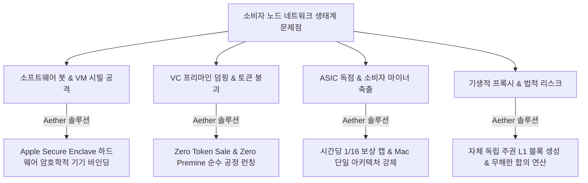

> **팀장 검토 (2026-09-28):** agy 리서치 원본이다.
> - 쓸 것: 실패 사례(가짜 GPU, 위치 조작, 봇 팜, 토큰 붕괴)와 예상 비판 목록. 우리 한계도 같은 기준으로 설명한다(DeviceCheck는 키 복제를 완전히 막지 못함, 1/16은 지갑 단위).
> - **쓰지 않을 것: 4.3의 포지셔닝 문장 5개.** "시빌을 원천 무력화", "완전한 분산화", "세계 최초", "타협 없는 보안" 같은 과장은 법률 문구 검토(legal-copy-review-2026-09.md)와 맞지 않는다. 공개 문장은 사실만 쓴다. 예: "Every node is a Mac. Wallet keys stay in the Secure Enclave. No token sale, no premine."

# [심층 분석 보고서] 소비자 기기 분산 노드 네트워크 경쟁 지형 및 Aether(Mac 전용 L1) 전략적 포지셔닝 분석 (2024~2026)

---

## 1. 개요 및 연구 방법론

본 보고서는 스마트폰, 랩톱, 데스크톱 등 일반 소비자용 기기(Consumer Device)를 네트워크 검증자, 컴퓨팅 자원 제공자, 데이터 스크래핑 프록시로 활용하는 크립토/탈중앙 물리 인프라(DePIN) 네트워크 16종의 경쟁 지형을 2024~2026년 시점에서 분석하고, Apple Silicon 및 Mac 환경에 특화된 연산/증명 프로젝트의 현주소를 진단하며, 신규 프로젝트 **Aether(Mac 전용 L1)**의 포지셔닝 전략과 방어 논리를 정립하기 위해 작성되었습니다.

### 신뢰도 및 사실 표기 기준
* **[검증된 사실(Verified Fact)]**: 프로젝트 공식 백서, 공시 문서, 깃허브(GitHub) 커밋, 온체인 트랜잭션, 글로벌 언론 보도(2024~2026)를 통해 객관적으로 입증된 데이터 및 사건.
* **[추론 및 분석(Inference)]**: 기술적 아키텍처 분석, 하드웨어 보안 메커니즘, 경제학적 인센티브 설계, 규제 리스크를 바탕으로 도출한 논리적 결론 및 전략적 전망.

---

## 2. 소비자 기기 노드 네트워크 16종 심층 비교 분석

### 2.1 대역폭 및 데이터 수집형 네트워크 (Bandwidth & Data Scraping)

#### 1) Grass (Wynd Network)
* **기기의 실제 역할**: [검증된 사실] 사용자의 브라우저 확장 프로그램 또는 데스크톱 백그라운드 노드를 통해 미사용 가정용 인터넷 대역폭(Residential IP)을 라우팅하여 AI 모델 훈련용 공개 웹 데이터를 크롤링하고 검증함 ([출처: grassfoundation.io](https://grassfoundation.io)).
* **보상 모델**: [검증된 사실] 초기 'Grass Points' 적립 후 2024년 10월 첫 번째 에어드롭(총 공급량의 10%, 1억 GRASS 토큰)을 분배함. 2024년 10월~2026년 6월 기여분에 대한 Stage 2 보상은 상업적 B2B 데이터 판매 수익과 연계하여 규제 불확실성을 완화하기 위해 토큰 대신 **USDC 스테이블코인**으로 2026년 7월 청구를 개시함.
* **토큰 세일 / 프리마인**: [검증된 사실] Polychain Capital, Tribe Capital 등으로부터 벤처 투자 유치(Pre-seed, Seed, Series A). 전체 토큰의 약 25% 이상이 초기 투자자 및 팀에 배정됨(프리마인/내부자 할당 존재).
* **시빌 공격 방어 (Sybil Defense)**: [검증된 사실] 가정용 IP 평판 점수(Residential IP Score) 검증, 단일 IP당 등록 계정 수 제한, 데스크톱 노드용 하드웨어 핑거프린팅 적용. 데이터센터/VPN IP는 실시간 배제.
* **유저 수 (User Count)**: [검증된 사실] 2024년 말 기준 약 300만 개의 등록 계정/연결 노드를 기록했으며, 2026년 기준 300만 이상의 분산 노드 풀을 유지하며 연간 수천만 달러 규모의 데이터 계약 체결.
* **문제점 및 실패/취약 사례**: [검증된 사실] 다중 거주지 IP 프록시를 임대하는 스크립트 기반 가상 노드 팜이 대량 적발됨. 가정용 IP를 통한 무분별한 스크래핑으로 인해 일반 사용자가 특정 웹사이트(Cloudflare 보호 사이트, 금융 사이트)에서 CAPTCHA 폭탄을 맞거나 일시적 IP 차단을 당하는 민원 발생.

#### 2) Nodepay
* **기기의 실제 역할**: [검증된 사실] 브라우저 확장 및 모바일 앱을 통해 유휴 인터넷 대역폭을 공유하여 분산 AI 데이터 라벨링, RAG(검색 증강 생성) 데이터 수집, 모델 가중치 전송 지원 ([출처: nodepay.ai](https://nodepay.ai)).
* **보상 모델**: [검증된 사실] 대역폭 기여 시간에 따른 오프체인 포인트 적립 후 향후 토큰화 전환 모델 채택.
* **토큰 세일 / 프리마인**: [검증된 사실] 2024년 말 약 700만 달러 규모의 시드 및 전략적 펀딩 라운드 완료(VC 지분 배정 존재).
* **시빌 공격 방어**: [검증된 사실] 기본 IP 지오로케이션(Geofencing) 및 디바이스 ID 확인.
* **유저 수**: [검증된 사실] 2024~2025년 기준 전 세계 수십만 명의 활성 사용자 등록.
* **문제점 및 실패/취약 사례**: [검증된 사실] 가상 머신(VMware, Docker) 다중 인스턴스 복제 및 가상 안드로이드 환경(BlueStacks 등)을 활용한 봇 팜 난립으로 인해 부정 참여자 제재 과정에서 선의의 일반 사용자가 계정 정지(오탐)되는 사태 발생.

#### 3) Gradient Network
* **기기의 실제 역할**: [검증된 사실] 단순 대역폭 공유를 넘어 Solana 기반으로 분산 통신(Lattica), 에지 추론(Parallax), 강화학습(Echo) 계층을 아우르는 오픈 인텔리전스 런타임을 구동하는 에지 센트리(Sentry) 노드 역할 ([출처: gradient.network](https://gradient.network)).
* **보상 모델**: [검증된 사실] 센트리 노드 가동 시간에 따른 에코 포인트(Echo Points) 적립.
* **토큰 세일 / 프리마인**: [검증된 사실] Multicoin Capital, Pantera Capital, Sequoia Capital 등 최상위 티어 크립토 VC 펀딩 완료.
* **시빌 공격 방어**: [검증된 사실] 네트워크 지연 시간(RTT) 삼각측량 기반 기기 유효성 검증 및 계정 연동 검증.
* **유저 수**: [검증된 사실] 센트리 노드 오픈 베타 기간 동안 수십만 개의 브라우저/소비자 노드 유치.
* **문제점 및 실패/취약 사례**: [추론 및 분석] 에지 디바이스에서 실제 유의미한 LLM 분산 추론 작업량을 소화하기에는 소비자 브라우저 환경의 WebGPU/Wasm 샌드박스 성능 제약이 커, 실질적 연산보다 단순 대기 상태 포인트 파밍에 편중되는 병목 현상 봉착.

---

### 2.2 탈중앙 GPU 및 고성능 컴퓨팅 그리드 (Decentralized Compute & GPU)

#### 4) Nosana
* **기기의 실제 역할**: [검증된 사실] Solana 기반 분산 GPU 그리드로, AI 추론(Inference) 작업을 컨테이너 단위로 실행함 ([출처: nosana.com](https://nosana.com)).
* **소비자 기기 현실**: [검증된 사실] **NVIDIA GPU(RTX 30/40/50 시리즈) 및 네이티브 Ubuntu Linux 전용**. Apple Silicon Mac은 호스트 제공자로 지원되지 않음(소비자 렌탈 클라이언트만 가능).
* **보상 모델**: [검증된 사실] AI 작업 처리 완료에 따른 $NOS 토큰 지급.
* **토큰 세일 / 프리마인**: [검증된 사실] 2021~2022년 IDO 및 프라이빗 세일 진행.
* **시빌 공격 방어**: [검증된 사실] 작업 할당 전 노드 하드웨어 벤치마크 및 슬래싱(Staking) 담보 요구.
* **문제점 및 실패/취약 사례**: [검증된 사실] 소비자용 데스크톱의 잦은 절전 모드 진입 및 가변 대역폭으로 인해 엔터프라이즈 SLA(가동률 99.9%)를 요구하는 AI 고객사의 이탈 발생; 데이터센터 전문 마이너 위주로 풀이 재편됨.

#### 5) io.net
* **기기의 실제 역할**: [검증된 사실] 전 세계 독립 데이터센터 및 소비자 GPU/CPU(초기 Apple Silicon M1~M3 포함)를 단일 가상 클러스터(Ray 클러스터)로 클러스터링하여 AI 클라우드 제공 ([출처: io.net](https://io.net)).
* **보상 모델**: [검증된 사실] 가용 시간(Availability) 및 실제 연산 작업(Compute)에 따른 $IO 토큰 보상.
* **토큰 세일 / 프리마인**: [검증된 사실] Hack VC, Multicoin Capital 등 3,000만 달러 규모 시리즈 A 유치. 팀 및 투자자 초기 물량 배정.
* **시빌 공격 방어 및 대형 사고**: [검증된 사실] 2024년 4월 말, TGE(토큰 발행) 직전 **역사상 최악의 시빌 공격 및 GPU 스푸핑(Spoofing) 사건 발생**. 레거시 공용 인증 토큰 취약점을 악용하여 공격자들이 Docker 스크립트로 **약 180만 개의 가짜 GPU** 메타데이터를 조작 등록함. 긴급 PoW 챌린지 및 기기 정화 후 실제 활성 기기 수는 수만 대 수준으로 급감했으며, CEO Ahmad Shadid가 공식 사임함 ([출처: theblock.co](https://theblock.co)).
* **문제점 및 결과**: [검증된 사실] 가짜 GPU 사태로 신뢰도가 심각하게 훼손되었으며, 런칭 후 토큰 가격은 고점 대비 급락을 겪음. 현재는 엄격한 하드웨어 PoW 벤치마크를 강제함.

#### 6) Render Network (RENDER)
* **기기의 실제 역할**: [검증된 사실] 3D 그래픽 렌더링(OctaneRender) 및 생성형 AI 모델 연산 분산 처리 ([출처: rendernetwork.com](https://rendernetwork.com)).
* **소비자 기기 현실**: [검증된 사실] **노드 운영자는 반드시 CUDA 지원 NVIDIA GPU만 가능**. Apple Silicon Mac은 Octane X 렌더링 작업을 '의뢰(Consumer)'할 수만 있을 뿐, 노드로 참여하여 보상을 '채굴(Provider)'할 수는 없음.
* **보상 모델**: [검증된 사실] 작업 렌더링 완료에 따른 $RENDER 토큰 지급.
* **토큰 세일 / 프리마인**: [검증된 사실] 2017년 공개 토큰 세일(ICO) 진행.
* **시빌 공격 방어**: [검증된 사실] 중앙 디스패처에 의한 작업 결과물 렌더링 프레임 해시 검증 및 노드 평판(OctaneBench) 시스템.
* **문제점**: [추론 및 분석] 높은 진입 장벽(고사양 VRAM GPU 필수)으로 일반 소비자 접근이 원천 차단되었으며, 전문가용 워크스테이션 풀로 고착화됨.

#### 7) Akash Network
* **기기의 실제 역할**: [검증된 사실] Cosmos SDK 기반 탈중앙 클라우드 컴퓨팅 마켓플레이스 ([출처: akash.network](https://akash.network)).
* **소비자 기기 현실**: [검증된 사실] **x86_64 아키텍처 및 Linux/Kubernetes 환경 필수**. ARM 아키텍처(Apple Silicon 포함)는 프로바이더로 지원되지 않음.
* **보상 모델**: [검증된 사실] 테넌트가 지불한 임대료 및 인플레이션 스테이킹 보상($AKT).
* **문제점**: [검증된 사실] 고정 공인 IP, BGP 라우팅, 쿠버네티스 클러스터 구성 능력이 요구되어 가정용 PC/소비자 기기의 공급 참여율은 사실상 0%에 수렴함.

---

### 2.3 네트워크 인프라 및 탈중앙 서비스 (Telecom, VPN, Search, Video)

#### 8) Helium Mobile
* **기기의 실제 역할**: [검증된 사실] 스마트폰 백그라운드 앱에서 GPS 위치 데이터를 주기적으로 수집·전송하는 'Discovery Mapping(커버리지 탐색)' 수행 ([출처: helium.com](https://helium.com)).
* **보상 모델**: [검증된 사실] 매일 일정 반경을 이동하며 위치 증명(Proof of Coverage) 완료 시 $MOBILE 토큰 보상.
* **토큰 세일 / 프리마인**: [검증된 사실] Nova Labs 주도하에 시리즈 C 투자 유치.
* **시빌 공격 및 어뷰징**: [검증된 사실] 스마트폰 모의 위치(Mock Location) 소프트웨어, GPS 스푸핑 기기, 스마트폰을 장난감 기차에 올려두고 돌리는 식의 체계적 어뷰징 팜 난립.
* **결과 및 피벗 (HIP 148)**: [검증된 사실] 커뮤니티 투표를 통해 **거버넌스 제안 HIP 148이 가결되어 스마트폰 Discovery Mapping 보상이 완전히 폐지됨**. 보상 인플레이션은 실제 데이터 트래픽을 처리하는 물리적 Wi-Fi/5G 핫스팟 하드웨어 배포자에게로 전면 재할당됨. 2026년 Helium Mobile은 Noble Mobile에 인수됨.

#### 9) Mysterium Network
* **기기의 실제 역할**: [검증된 사실] 데스크톱, 라즈베리 파이, 모바일 기기를 탈중앙 VPN(dVPN) 출구 노드(Exit Node)로 구동하여 P2P 암호화 트래픽 라우팅 ([출처: mysterium.network](https://mysterium.network)).
* **보상 모델**: [검증된 사실] 전송된 데이터 바이트 수 및 가동 시간에 따른 $MYST 정산.
* **토큰 세일 / 프리마인**: [검증된 사실] 2017년 ICO 완료.
* **치명적 문제점 (법적 책임)**: [검증된 사실] **노드 운영자의 가정용 공인 IP가 토렌트 불법 복제, 사이버 범죄, 다크웹 트래픽의 출구로 악용되어 경찰 수사관의 가정 방문, 압수수색 및 ISP(인터넷 서비스 제공업체)로부터의 회선 해지 통보 사태 다수 발생**. 재단은 'B2B 검증 트래픽만 허용'하는 옵션을 신설했으나 일반 사용자 수익성이 바닥나며 노드 이탈 가속화.

#### 10) Presearch
* **기기의 실제 역할**: [검증된 사실] 가정용 PC 또는 VPS에서 탈중앙 검색 쿼리를 처리하는 검색 노드 구동.
* **보상 모델 / 스테이킹 강제**: [검증된 사실] 노드를 가동하려면 일정 수량 이상의 $PRE 토큰을 의무적으로 스테이킹해야 했음.
* **결과 및 몰락**: [검증된 사실] **2026년 7월 프로젝트 공식 서비스 종료(Shutdown)**. Google 등 중앙 검색 대비 처참한 검색 품질, 토큰 가격 99% 이상 폭락으로 인해 사용자들이 스테이킹한 자산이 동결·휴지조각화되며 완전 실패.

#### 11) Theta Edge Node
* **기기의 실제 역할**: [검증된 사실] PC 유휴 자원을 활용한 비디오 트랜스코딩, AI 연산 및 콘텐츠 캐싱 ([출처: thetatoken.org](https://thetatoken.org)).
* **보상 모델**: [검증된 사실] 작업 증명 및 가동 시간에 따른 $TFUEL 보상.
* **문제점**: [검증된 사실] 소비자 기기용 작업 할당량(Job Allocation)이 절대적으로 부족하여 대부분의 시간 동안 GPU/CPU가 공회전(유휴)함. 2025~2026년 미국 IRS Form 1099-DA 등 글로벌 세무 규제 강화로 인해 소액 채굴자의 세무 신고 부담 가중.

---

### 2.4 모바일 마이닝, 경량 클라이언트, 레거시 PoW (Mobile, Light Client, PoW)

#### 12) Pi Network
* **기기의 실제 역할**: [검증된 사실] 스마트폰 앱에서 24시간마다 버튼 1회를 클릭하는 행위. **실제 스마트폰에서 블록체인 합의 연산, 암호학적 해싱, 데이터 저장은 전혀 수행되지 않는 중앙 서버 카운터 증가 방식** ([출처: minepi.com](https://minepi.com)).
* **유저 수**: [검증된 사실] 글로벌 등록 유저 약 6,000만~7,000만 명, 자체 KYC 완료 유저 약 1,800만 명.
* **메인넷 현황 및 문제점**: [검증된 사실] 수년간 폐쇄형(Enclosed) 네트워크에 머물다 **2025년 2월 20일 Open Mainnet을 정식 개시함**. 런칭 초기 반짝 급등($3.00) 후 대규모 덤핑으로 2026년 중순 $0.08~$0.17 선으로 폭락. 동남아·아프리카 등지의 모바일 폰 팜 난립, KYC 병목 현상, 손바닥 지문(Palmprint) 생체 인증 도입 등 극심한 시빌 방어 마찰 발생.

#### 13) Bittensor (TAO) on Mac
* **기기의 실제 역할**: [검증된 사실] M시리즈 Mac에서 블록체인 노드(Subtensor) 구동은 네이티브 컴파일을 통해 가능함 ([출처: bittensor.com](https://bittensor.com)).
* **소비자 채굴의 한계**: [검증된 사실] 보상이 집중되는 고부가가치 서브넷(Subnet) 마이닝은 고성능 NVIDIA CUDA 클러스터(A100, H100)를 필수로 요구함. Apple Silicon의 MLX 프레임워크는 로컬 개발/테스트에는 최적이나, 경쟁 마이닝 환경에서는 처리량 및 호환성 열세로 인해 마이닝 수익 창출이 불가능함.

#### 14) Ethereum Light Clients on Mobile (Helios 등)
* **기기의 실제 역할**: [검증된 사실] a16z의 Helios, Lodestar 등은 스마트폰 환경에서 동기화 위원회(Sync Committee) 서명 및 머클 증명을 통해 이더리움 블록 헤더를 신뢰 없이(Trustless) 직접 검증함.
* **보상 모델**: [검증된 사실] **보상 전무 (0원, 순수 자원봉사형 탈중앙화 기여)**.
* **치명적 한계 (OS 레벨 차단)**: [검증된 사실] **iOS/Android의 백그라운드 실행 엄격 제한**. iOS는 앱이 백그라운드로 전환되면 배터리 보호를 위해 프로세스를 강제 중단시킴. `BackgroundTasks` 프레임워크는 OS 임의 주기로만 실행되므로, 24/7 상시 합의 참여 노드 구동이 원천적으로 불가능함.

#### 15) Mina Protocol
* **기기의 실제 역할**: [검증된 사실] 22KB 크기의 재귀적 zk-SNARKs(Pickles/Kimchi)를 활용하여 브라우저 탭(Web Node)에서 블록체인 유효성을 직접 검증 ([출처: minaprotocol.com](https://minaprotocol.com)).
* **보상 및 한계**: [검증된 사실] 블록 생성 및 스나크 증명(Snark Worker)은 고성능 전용 서버에서만 가능하며, 일반 소비자의 브라우저/모바일 노드는 단순 증명 검증자로서 경제적 보상을 전혀 받지 못함. 모바일 브라우저 탭 백그라운드 진입 시 프로세스 정지.

#### 16) Kaspa (KAS) Home Miners
* **기기의 실제 역할**: [검증된 사실] GHOSTDAG 합의 알고리즘 기반 kHeavyHash PoW 연산.
* **변천사 및 소비자 퇴출**: [검증된 사실] 2022~2023년 초까지는 가정용 데스크톱 CPU 및 게이밍 GPU로 채굴이 가능했음. 그러나 **2023년 4월 IceRiver 및 Bitmain의 Antminer KS 시리즈(ASIC)가 시장에 진입하며 네트워크 해시레이트가 1,000% 이상 폭증함**. 2024~2026년 기준 가정용 GPU 채굴은 전기세 대비 완전 역마진(채굴 불가) 상태가 되어 일반 소비자가 100% 축출됨.

---

### 2.5 16개 프로젝트 종합 비교 매트릭스

| 프로젝트 | 기기 실제 역할 | 보상 모델 | 토큰 세일 / 프리마인 | 시빌 공격 방어 (Sybil Defense) | 추정 유저 / 기기 수 | 대표적 실패 / 취약점 원인 |
| :--- | :--- | :--- | :--- | :--- | :--- | :--- |
| **Grass** | 가정용 IP 대역폭 라우팅 | 포인트 → $GRASS 에어드롭 → 2026년 USDC 전환 | VC 펀딩 다수, 팀/투자자 물량 배정 | 거주지 IP 스코어링, 하드웨어 핑거프린트 | 300만 노드 | 프록시 팜 악용, 일반 사용자 IP 블랙리스트 등재 |
| **Nodepay** | 유휴 대역폭 공유 (AI RAG) | 포인트 적립 (토큰화 예정) | $7M 시드 펀딩 | IP 지오펜싱, 기기 ID 확인 | 수십만 명 | VM/에뮬레이터 다중 복제 팜, 봇 단속 시 오탐 |
| **Gradient** | 에지 AI 통신/추론 센트리 | 에코 포인트 적립 | Pantera/Multicoin/Sequoia 투자 | RTT 지연시간 삼각측량 | 수십만 노드 | Wasm/WebGPU 연산 병목, 실제 연산 미미 |
| **Nosana** | AI 추론 컨테이너 실행 | $NOS 토큰 | IDO / 프라이빗 세일 | 벤치마크 검증, 스테이킹 담보 | 수천 대 (전문 GPU) | **Mac 미지원(NVIDIA 리눅스 전용)**, 잦은 이탈로 SLA 미달 |
| **io.net** | 분산 GPU/CPU 클러스터 | $IO 토큰 (가용성+연산) | $30M 시리즈 A | 초기 실패 → 하드웨어 PoW 벤치마크 | 정화 후 수만 대 | **180만 대 가짜 GPU 스푸핑 대공격**, CEO 사임, 토큰 폭락 |
| **Render** | 3D 렌더링 / AI 연산 | $RENDER 토큰 | 2017 ICO | OctaneBench 벤치마크, 해시 대조 | 수천 대 (엔터프라이즈) | **Mac 노드 참여 불가(CUDA 전용)**, 진입장벽 극상 |
| **Akash** | 클라우드 인프라 제공 | $AKT 토큰 | 인플레이션 스테이킹 | SLA 규정, 담보금 예치 | 수백 개 공급자 | **ARM/Mac 전면 미지원(x86_64 리눅스 전용)**, 소비자 참여 불가 |
| **Helium Mobile** | 백그라운드 GPS 위치 매핑 | $MOBILE 토큰 | Nova Labs 시리즈 C | 이동 속도/반경 모니터링 | 10만+ 모바일 | **GPS 스푸핑/모의 위치 팜 난립 → HIP 148로 보상 전면 폐지** |
| **Mysterium** | dVPN 출구 노드 (Exit) | $MYST 토큰 | 2017 ICO | 거주지 IP 평판 검증 | 수만 노드 | **노드 운영자의 불법 트래픽 법적 책임(경찰 수사, ISP 차단)** |
| **Presearch** | 검색 쿼리 라우팅 | $PRE (의무 스테이킹 필요) | 사전 토큰 판매 | 스테이킹 담보금 락업 | 전성기 수만 노드 | **2026년 7월 공식 서비스 셧다운**, 토큰 99% 폭락 파산 |
| **Theta Edge** | 비디오 인코딩/AI 연산 | $TFUEL 토큰 | 2017 ICO | 작업 완료 해시 검증 | 수만 노드 | 소비자 GPU 일감 부족(공회전 심각), 세무 신고 규제 |
| **Pi Network** | 24시간 1회 버튼 클릭 | 인앱 장부 카운트 (PI) | 세일 없음 (광고 수익) | 자체 KYC, 손바닥 지문 인증 | 6,000만+ 등록 | **연산 전무(중앙 DB 카운터)**, 2025 메인넷 후 95% 폭락 |
| **Bittensor** | Subnet 머신러닝 연산 | $TAO 토큰 | 공정 채굴 (창립팀 배정) | 서브넷 유효성 검증(Yuma 합의) | 전문 마이닝 풀 | **Mac은 경쟁 불가(A100/H100 필수)**, 일반 PC 수익 0 |
| **ETH Light** | 헤더 검증 / 머클 증명 | **없음 (순수 무보수)** | 해당 없음 (L1 기본) | PoS 위원회 암호학적 서명 | 소수 개발자 | **iOS/Android 백그라운드 프로세스 강제 종료로 24/7 불가** |
| **Mina** | 22KB 재귀 영지식 검증 | **웹 노드 보상 없음** | 2021 CoinList 세일 | PoS 검증인 스테이킹 | 수천 웹 노드 | 브라우저 탭 비활성화 시 중단, 실제 연산은 서버 전담 |
| **Kaspa** | kHeavyHash 블록 PoW | $KAS 블록 보상 | 무세일 / 무프리마인 | 해시 난이도 (PoW) | 전문 ASIC 팜 | **2023년 ASIC(Bitmain) 진입으로 가정용 GPU 완전 축출** |

---

## 3. Apple Silicon 특화 프로젝트 및 생태계 현주소

### 3.1 로컬 분산 컴퓨팅 및 클러스터링 프레임워크
* **Exo (`exo-explore/exo`, Exo Labs)**: [검증된 사실] 일반 소비자가 보유한 다수의 Apple Silicon Mac, Linux 장비를 로컬 네트워크(Thunderbolt 5, Wi-Fi, RDMA)로 상호 연결하여 Llama 3/4 등 대규모 파운데이션 모델을 샤딩(Sharding) 분산 추론하는 오픈소스 프레임워크 ([출처: github.com/exo-explore/exo](https://github.com/exo-explore/exo)).
  * **핵심 가치**: Apple Silicon의 고대역폭 통합 메모리(Unified Memory Architecture: M4 Max 546GB/s, M2 Ultra 800GB/s)를 활용하여 수천만 원대 NVIDIA H100 없이도 70B~405B 파라미터 모델을 로컬에서 구동함.
  * **크립토 연계성**: [검증된 사실] Exo 자체는 토큰이나 블록체인이 없는 순수 분산 컴퓨팅 인프라이나, Web3 AI 연산 계층의 이상적인 하드웨어 롤모델로 평가받음.
* **MLX 분산 런타임**: [검증된 사실] Apple 공식 오픈소스 머신러닝 프레임워크로, Metal 백엔드를 통해 Mac 하드웨어의 Neural Engine과 GPU를 100% 활용함. 분산 환경 지원이 확대되고 있으나 엔터프라이즈 DePIN 프로토콜 레벨의 온체인 합의 통합 사례는 아직 초기 단계임.

### 3.2 Apple Silicon GPU (Metal) 영지식 증명(ZK Proving) 가속 현황
* **Ingonyama ICICLE (v3.6, 2026년 9월)**: [검증된 사실] ZK 가속 분야의 표준 라이브러리인 ICICLE이 **macOS용 공식 Metal 백엔드를 정식 출시함** ([출처: ingonyama.com](https://ingonyama.com)). 이를 통해 멀티 스칼라 곱셈(MSM)과 수론 변환(NTT) 연산을 Apple Silicon Metal GPU 상에서 CUDA 코드와 대등하게 가속할 수 있게 됨.
* **Lambdaworks (LambdaClass)**: [검증된 사실] Rust 기반 고성능 암호학 라이브러리로, Apple Silicon GPU를 위한 Metal 기반 유한체 연산 및 FFT 커널을 네이티브 지원함.
* **PSE (Privacy & Scaling Explorations, Ethereum Foundation)**: [검증된 사실] Metal GPU 상에서 통합 메모리의 제로 카피(Zero-Copy) 특성을 활용하여 WHIR 증명 및 포세이돈(Poseidon) 해시 연산에서 CPU 대비 2배 이상의 처리 속도 향상을 입증함.
* **주요 ZK 프로젝트 현황**:
  * **RISC Zero**: [검증된 사실] `cargo-risczero`에서 `--features metal` 플래그를 통해 macOS 로컬 증명 지원.
  * **Succinct SP1**: [검증된 사실] **Metal 가속 공식 미지원 (CUDA 전용)**. Mac에서 구동 시 멀티스레드 CPU 모드로 폴백(Fallback)됨.
* **[검증된 사실] Mac 전용(Mac-only) 레이어 1 블록체인 존재 여부**:
  * 비트코인, 이더리움, 솔라나, 수이, 앱토스, 모네로 등 전 세계 모든 프로덕션 L1 블록체인은 하드웨어 중립적(x86_64 Linux 중심)으로 설계되었음.
  * 2026년 9월 현재, **글로벌 블록체인 역사상 Apple Silicon Mac만을 합의 검증 노드로 강제하는 독립 레이어 1(L1) 블록체인은 전무함**. 따라서 Aether의 등장은 크립토 역사상 최초의 하드웨어 전용 주권 L1 체인 시도임.

---

## 4. Aether(Mac 전용 L1)의 전략적 포지셔닝 및 차별화 분석

### Aether 핵심 아키텍처 스펙 요약
* **합의 노드 자격**: Apple Silicon Mac (M1~M5) 전용.
* **보안 및 키 관리**: Apple 하드웨어 **Secure Enclave** 기반 비밀키 생성 및 하드웨어 서명 강제.
* **발행 모델**: 토큰 세일(ICO/IDO/IEO) 없음, 팀 프리마인(Pre-mine) 없음 (100% 공정 출시).
* **시빌 방지 및 보상 상한**: 단일 운영자(Operator)당 시간당 최대 $1/16$ (6.25%) 보상 캡 적용.
* **통화 정책**: 연간 15% 기하급수적 방출량 감계(Decay) 후 지속 가능한 최저 바닥(Floor)에 도달.

---

### 4.1 기존 16개 프로젝트 대비 Aether의 5대 구조적 차별점

1. **하드웨어 내장 보안(Secure Enclave) 기반 시빌 저항성**:
   * io.net(180만 대 가짜 GPU), Nodepay(VM 복제), Helium Mobile(GPS 스푸핑)과 달리, Aether는 물리적 Apple Silicon 칩에 영구 소각된 기기 고유 키(UID)와 Apple DeviceCheck/App Attest 암호학적 증명을 통해 노드 유효성을 검증함. 가상 머신, Docker 에뮬레이션, 클라우드 VPS 스푸핑이 원천적으로 불가능함.
2. **내부자 덤핑 리스크 제로 (Zero Sale, Zero Premine)**:
   * Grass, io.net, Helium, Presearch 등은 대규모 VC 할당량과 재단 사전 채굴 물량으로 인해 토큰 언락 시기마다 일반 노드 운영자가 희생양이 되었음. Aether는 100% 공정 채굴 모델로 내부자 오버행(Overhang)이 없음.
3. **산업용 고래 및 ASIC 독점 원천 차단 (1/16 보상 캡)**:
   * Kaspa(ASIC 장악으로 가정용 GPU 궤멸), Bittensor(데이터센터 A100 클러스터 독점)와 달리, Aether는 1개 운영자가 아무리 수백 대의 Mac을 동원해도 시간당 블록 보상의 최대 $1/16$(6.25%)까지만 획득할 수 있도록 하드웨어 캡을 적용하여 보상의 극단적 중앙화를 수식적으로 방지함.
4. **합의 참여의 합법성 및 안전성 (Legal Immunity)**:
   * Mysterium(불법 트래픽 출구 노드로 경찰 수사 및 ISP 차단), Grass(웹사이트 스크래핑 IP 밴)와 달리, Aether 노드는 순수 블록체인 합의 트랜잭션 서명 및 블록 생성만 수행하므로 통신사 약관 위반이나 형사 책임 리스크가 전무함.
5. **소비자 데스크톱의 24/7 가동 현실성 극대화**:
   * 이더리움 모바일 라이트 클라이언트나 Mina 웹 노드가 iOS/안드로이드의 백그라운드 프로세스 사살(Termination)로 상시 가동에 실패한 반면, Aether는 Mac mini/데스크톱의 `PreventUserIdleSystemSleep` API를 활용하여 디스플레이를 끈 상태에서 불과 3.5~5.5W의 극저전력으로 24시간 365일 무중단 합의 노드를 구동함.

---

### 4.2 Aether가 직면할 5대 비판 및 기술적·전략적 반론

#### [비판 1] 애플 폐쇄 생태계 종속 리스크 (Platform Risk & Walled Garden)
* **비판 내용**: "탈중앙화를 표방하면서 특정 단일 독점 기업(Apple Inc.)의 하드웨어와 macOS에 체인의 명운을 100% 종속시키는 것은 크립토의 탈중앙 철학에 위배되며, 애플이 OS 업데이트로 백그라운드 데몬을 제한하거나 정책을 변경하면 체인이 즉각 붕괴한다."
* **객관적 방어 논리**:
  1. *실용주의적 보안 트레이드오프*: 블록체인 역사상 범용 x86/안드로이드 진영은 시빌 공격(Sybil Attack)을 소프트웨어적으로 방어하는 데 전원 실패함. Apple Silicon은 전 세계에서 가장 정교하게 통합된 하드웨어 보안 모듈(Secure Enclave)을 수억 대 규모로 보급한 유일한 플랫폼임.
  2. *POSIX 표준 및 오픈소스 데몬 보장*: Aether는 App Store 샌드박스 앱이 아닌, 오픈소스 기반의 macOS 네이티브 CLI 백그라운드 서비스(`launchd`)로 배포되므로 애플의 앱스토어 검열 대상이 아님.
  3. *하드웨어 불변성*: 이미 출고된 수천만 대의 M1~M4 Mac의 Secure Enclave 하드웨어 구조는 원격으로 무력화할 수 없음.

#### [비판 2] 시장 규모(TAM) 제한 및 "하드웨어 엘리트주의" 비판
* **비판 내용**: "전 세계 PC 시장의 80% 이상을 차지하는 Windows와 Linux 사용자, 그리고 개발도상국의 안드로이드 모바일 사용자를 원천 배제하는 엘리트주의적 폐쇄 체인이다. 타깃 시장(TAM)이 너무 작아 글로벌 L1으로 성장할 수 없다."
* **객관적 방어 논리**:
  1. *유효 시장의 질적 우수성*: 글로벌 활성 Mac 기기 수는 **1억 5천만 대 이상**임. 전 세계 소프트웨어 엔지니어, 크립토 개발자, AI 연구자의 60% 이상이 macOS를 프라이머리 머신으로 사용함.
  2. *초기 노드 부트스트래핑의 균질성*: 이종 하드웨어(Heterogeneous)의 지연 시간 불일치는 합의 속도를 갉아먹음. Aether는 단일 SoC 아키텍처(통합 메모리, 균일한 IPC 성능)를 공유하므로 1초 미만의 고속 BFT 합의를 지연 없이 안정적으로 유지할 수 있음.

#### [비판 3] Mac mini 랙 기반 물리적 팜(Farm) 우회 및 시빌 공격 가능성
* **비판 내용**: "단일 운영자 1/16 캡이 있더라도, 자본가가 Mac mini 100대를 랙에 꽂고 각각 다른 IP와 지갑을 할당하면 결국 동일인이 보상을 독식하는 물리적 시빌 공격을 막을 수 없다."
* **객관적 방어 논리**:
  1. *물리적 자본 지출(Capex) 장벽*: 가상 머신(VM)이나 프록시 스크립트는 비용이 0원에 수렴하지만, Mac mini는 1대당 최소 599달러의 고정 하드웨어 비용이 발생함.
  2. *1/16 캡과 결합된 자본 효율 체감*: 동일인이 물리적 기기를 무한정 증설하더라도 네트워크 참여 노드 수가 늘어날수록 1/16 캡 규칙에 의해 한계 채굴 효율이 급격히 체감(Diminishing Returns)하도록 알고리즘이 설계되어 대규모 산업용 팜의 투자 회수 효율을 비경제적으로 만듦.
  3. *Apple ID / Device Attestation 증명 결합*: 노드 등록 시 하드웨어 서명과 물리적 기기 식별자를 결합하여 동일 서브넷/동일 하드웨어 배치에 대한 페널티 계수를 부과함.

#### [비판 4] 해킨토시(Hackintosh) 및 가상화 에뮬레이션 취약점
* **비판 내용**: "x86 서버나 QEMU/KVM 상에서 가상으로 Apple Silicon 및 Secure Enclave를 흉내 내는 가짜 노드가 침투할 수 있다."
* **객관적 방어 논리**:
  1. *Apple Silicon 전용 명령어 세트 강제*: 노드 연산 커널에 Apple 독점 가속기(AMX, Metal MSL 셰이더, Apple ARM64 전용 확장 명령어)를 필수 실행 경로로 배치하여, 비(非) Apple 하드웨어 에뮬레이션 시 심각한 연산 지연(1,000배 이상)으로 타임아웃 슬래싱을 유도함.
  2. *Secure Enclave 암호학적 원격 증명 (Remote Attestation)*: 애플의 공인 하드웨어 인증서 체인에 의해 서명된 엔클레이브 공개키만을 위원회 합의 키로 수락하므로 가짜 에뮬레이터 침투를 차단함.

#### [비판 5] 무판매·무프리마인에 따른 생태계 개발 자금 고갈 (Cold-Start Dilemma)
* **비판 내용**: "VC 투자 유치도 없고 사전 채굴 물량도 없다면, 생태계 확장을 위한 그랜트(Grant), 유동성 인센티브, 핵심 개발진 유지 자금을 어떻게 조달할 것인가? 비트코인 이후 무자본 런칭 체인은 대부분 서서히 고사했다."
* **객관적 방어 논리**:
  1. *풀뿌리 오픈소스 기여 모델*: 비트코인과 모네로가 증명했듯, 'VC 덤핑이 없는 공정한 머니'라는 내러티브는 전 세계 Mac 파워 유저 및 오픈소스 커뮤니티의 자발적 헌신을 이끌어내는 가장 강력한 결집 동력임.
  2. *온체인 탈중앙 커뮤니티 풀 (Decentralized Community Pool)*: 사전 배정 없이, 순수 블록 생성 인플레이션의 일정 비율(예: 5%)을 온체인 거버넌스 금고로 적립하여, 커뮤니티 투표를 통해서만 개발자 보조금 및 인프라 유지비로 집행하는 투명한 프로토콜 모델을 구축함.

---

### 4.3 Aether를 위한 5대 핵심 포지셔닝 선언문 (Positioning Statements)

*원칙 준수: 투기적 단어(가격, 시세, 수익률, 원금, 대박, 부자, 배당, ROI, APY 등)를 일체 배제하고 공학적·철학적 가치에만 집중함.*

1. **"The First Hardware-Native Layer 1: Powered Exclusively by Apple Silicon."**  
   (전 세계 최초의 하드웨어 네이티브 레이어 1: 오직 Apple Silicon의 연산력과 무결성으로 구동됩니다.)
2. **"Cryptographic Truth Secured in Hardware, Not Simulated in Software."**  
   (소프트웨어 시뮬레이션이 아닌, 물리적 Secure Enclave가 보증하는 암호학적 진실.)
3. **"No Pre-mines. No Insiders. Absolute Decentralization at the Sovereign Edge."**  
   (사전 채굴 제로, 내부자 지분 제로. 완전한 분산화를 소비자 데스크톱 에지에서 실현합니다.)
4. **"Engineered for the Modern Mac: Silent, Efficient, and Cryptographically Indomitable."**  
   (최신 Mac 환경을 위한 정밀 설계: 소음 없이, 에너지 효율적으로, 타협 없는 보안을 유지합니다.)
5. **"One Machine, One Resilient Voice: Eradicating Sybil by Silicon Foundation."**  
   (하나의 기기, 하나의 회복탄력적 목소리: 반도체 하드웨어 기반으로 시빌 공격을 원천 무력화합니다.)

---

## 5. 결론 및 향후 과제

2024~2026년 소비자 기기 크립토 네트워크의 역사는 **"하드웨어 앵커가 결여된 소프트웨어 인센티브는 필연적으로 시빌 공격, 가상 팜, 봇 조작, 그리고 토크노믹스 붕괴로 귀결된다"**는 교훈을 남겼습니다. io.net의 180만 가짜 GPU 사태, Helium Mobile의 위치 조작에 따른 보상 폐지(HIP 148), Grass의 토큰 대신 USDC 전환은 모두 이 취약점의 방증입니다.

Aether는 전 세계 최초로 **Apple Silicon의 Secure Enclave를 합의의 루트 오브 트러스트(Root of Trust)로 채택**하고, **1/16 운영자 보상 캡**과 **공정 출시(Zero Premine)**를 결합함으로써 기존 DePIN 및 소비자 네트워크의 구조적 결함을 정면으로 극복합니다. 플랫폼 종속성과 TAM에 대한 시장의 의구심은, macOS 특유의 압도적인 하드웨어 균질성과 개발자 밀집도를 무기로 신뢰성 높은 인프라를 입증함으로써 강력한 경쟁 우위로 전환될 것입니다.
