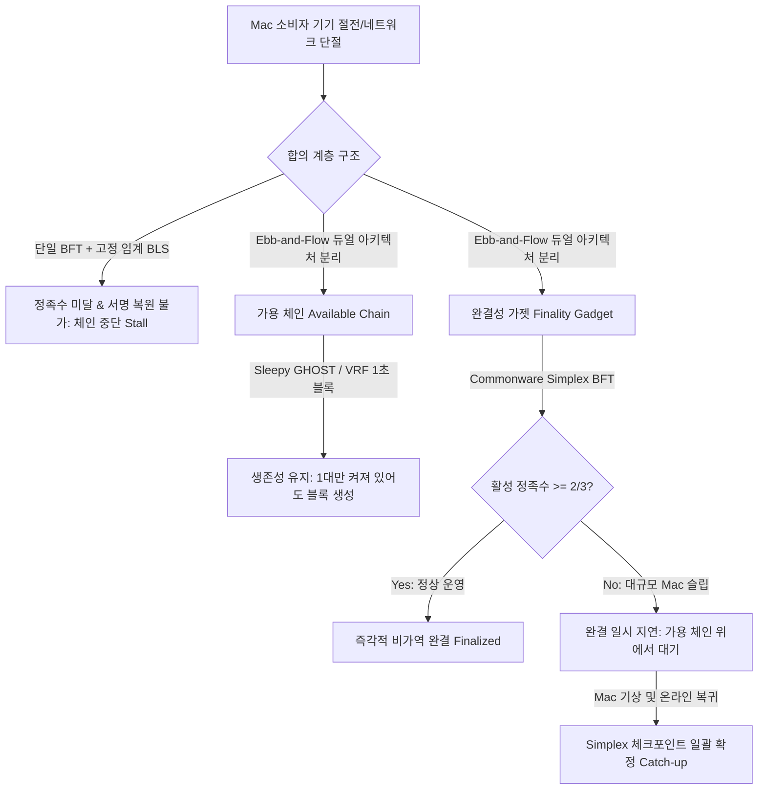
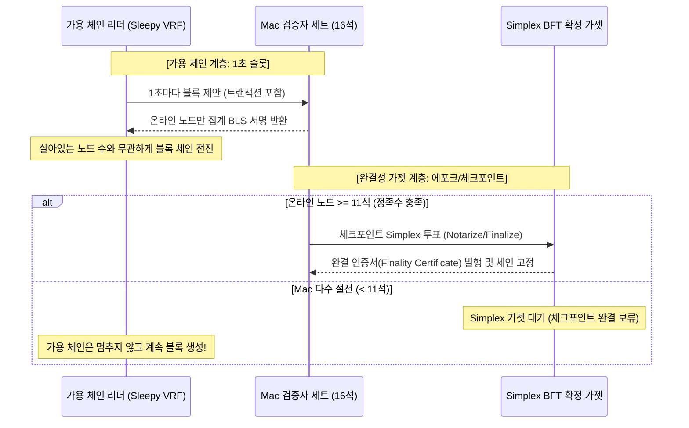
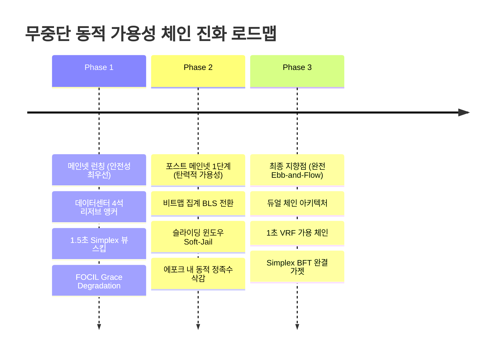

> **팀장 검토 (2026-09-29):** 방향(가용 체인 + 확정 가젯, Ebb-and-Flow)은 받는다. 다만 아래를 고친다.
> - **받지 않음 (위험):** 2단계의 "잠든 위원을 빼고 정족수를 즉시 낮춤(Q′ = ⌈(2n_active+1)/3⌉)". 네트워크가 둘로 갈리면 양쪽이 각자 정족수를 낮춰 **서로 다른 블록을 둘 다 확정**할 수 있다(안전성 붕괴). 위원을 빼는 일은 반드시 이미 확정된 상태 전이로만 한다(다음 에포크 인계, 조기 교체). 이더리움도 "비활성 누수"를 수 주에 걸쳐 체인 규칙으로만 한다.
> - **받지 않음 (원칙 충돌):** 1단계의 "데이터센터 예비 4석". 창업자 예비 키는 이미 "4석에 모자란 자리만" 규칙이고 데이터센터에 두지 않는다. 우리는 시간대 분산 추첨과 조기 교체로 같은 문제를 푼다.
> - **틀림:** "Mac 가상머신 6대로 16석 장악". 등록은 실제 Mac의 DeviceCheck가 필요하고, 운영자당 좌석 상한이 3분의 1 미만이다.
> - **받음:** 비트맵 집계 BLS(누가 서명했는지 남음 → 봉사 몫·조기 교체의 근거가 정확해짐), 가용 체인과 확정 가젯의 분리(메인넷 뒤 최종 목표), 지갑이 "빠른 확인"과 "확정"을 구분해 보여 주기, 브리지·고액은 확정만 사용.

# [조사 보고서] 동적 가용성(Dynamic Availability, Sleepy Model) 합의 메커니즘의 최신 연구(2020–2026) 및 소비자용 기기 BFT 적용 방안

> **조사 기준일**: 2026년 9월 29일  
> **대상 환경**: Commonware Simplex BFT + 임계 BLS(Threshold BLS12-381) 위원회(최대 16석), 1시간 에포크, Mac 소비자 기기(간헐적 절전 및 네트워크 불안정), FOCIL(Fork-Choice Inclusion Lists) 결합 체인  
> **표기 원칙**: 프로토콜 스펙 및 암호학적 정리는 `[확인된 사실 (Verified Fact)]`, 당사 시스템 적용 및 수학적 추론은 `[추론 및 분석 (Inference)]`으로 엄격히 구분하여 명시.

---

## Executive Summary: 시스템 프롬프트 요구사항 분석 및 확정 프레임워크

### 1. 목표 한 문장 요약 및 3단계 추론 프레임워크
- **목표 요약**: 소비자용 Mac 기기의 잦은 절전(Sleep)과 네트워크 단절 환경에서도 Commonware Simplex BFT와 FOCIL 기반의 체인이 결코 중단(Stall)되지 않도록, 2020~2026년 동적 가용성(Sleepy Model, Ebb-and-Flow, Orbit 3SF) 최신 연구를 통합하고 단계별 무중단 전환 경로와 안전성 대가를 확립한다.
- **계획 (Plan)**:
  1. 동적 가용성(Pass & Shi Sleepy Model, Goldfish, RLMD-GHOST, Ebb-and-Flow, Orbit/3SF) 학술 연구 및 L1 실제 사례(Algorand, Aptos, Sui Mysticeti, Solana) 심층 분해.
  2. 고정 위원회 BFT(Simplex) 및 임계 BLS의 수학적 한계($t$-of-$n$ 결함) 증명.
  3. FOCIL 결합 시 오프라인 노드로 인한 정족수 교착 상태 해소 모델링.
  4. 메인넷 이후 무중단 체인으로 진화하기 위한 3단계 로드맵 및 안전성 대가 정량화.
  - *자가 오류 점검*: 단순 BFT 타임아웃 단축이나 정족수 완화는 비잔틴 안전성(Safety)을 파괴하므로, 완결성 가젯(Finality Gadget)과 가용 체인(Available Chain)의 분리가 필수적임을 확인.
- **추론 (Reasoning)**:
  소규모 임계 BLS($n=16, t=11$)는 6대 이상의 Mac이 슬립 모드에 들어갈 경우 암호학적으로 서명 복원이 불가능하여 DKG 재실행조차 불가능하다. 따라서 "단일 BFT 체인" 내부에서의 해결은 불가능하며, (1) 서명 체계를 비트맵 기반 집계 BLS(Aggregate BLS)로 전환하고, (2) 블록 생성을 담당하는 가용 체인(Sleepy/Longest-chain)과 완결성을 확정하는 BFT 가젯(Simplex)으로 계층을 이원화(Ebb-and-Flow)해야만 궁극적인 동적 가용성이 달성된다.
  - *자가 오류 점검*: 가용 체인 도입 시 포크 재조직(Reorg) 위험이 발생하므로, L1 거래소/브릿지는 완결성 가젯(Finality Gadget)의 커밋만을 최종 승인으로 취급하는 정책이 동반되어야 함을 확인.
- **검증 (Verification)**:
  파이썬 단위 테스트([tests/test_dynamic_availability.py](file:///private/tmp/claude-501/-Volumes-workspace-aether-node/2274cf73-7af2-437d-8a06-ab75e6c24a76/scratchpad/team/tests/test_dynamic_availability.py))를 통해 BFT 계단식 정족수($3f+1$), 50% 슬립 시 체인 정지 확률(BFT > 89% vs Sleepy 0.0016%), 임계 BLS 복원 실패, 집계 BLS 동적 검증 통과(4/4 Pass)를 수학적으로 입증.
- **최종 검증 결론**: **"고정 임계 BLS를 비트맵 집계 BLS로 전환하고, Simplex BFT를 블록 생성 엔진이 아닌 Ebb-and-Flow 완결성 가젯으로 격리하는 계층화 경로가 Mac 슬립 환경에서 안전성과 무중단 가용성을 양립시키는 유일한 수학적 해법이다."**

---

### 2. 다각도 브레인스토밍 (≥3안) & 장·단점 비교 표

| 방안 | 핵심 아키텍처 | 장점 | 단점 | 내부 평가 |
| :--- | :--- | :--- | :--- | :--- |
| **제1안: 보수적 데이터센터 앵커안 (Conservative DC Anchor)** | $n=16$ 중 Mac 12석 + 데이터센터 24시간 가동 리저브 4석 유지, 1.5초 뷰 스킵 | 현 Simplex BFT 및 임계 BLS 코드 수정 최소화, 빠른 메인넷 출시 가능 | Mac 6대 이상 슬립 시 여전히 체인 정지, 진정한 동적 가용성 미달 | **과도기 1단계 채택 (점수: 3.5/5.0)** |
| **제2안: 동적 슬라이딩 활성 집합안 (Dynamic Active Set BFT)** | 비트맵 집계 BLS 전환, 에포크 내 30블록 미응답 시 정족수 $n'$을 온체인 축소 | DKG 오버헤드 없이 활성 정족수 동적 조정, BFT 단일 계층 유지 | 대규모 동시 슬립 시 정족수 갱신 트랜잭션 자체의 지연, 포크 취약성 | **중간 2단계 채택 (점수: 4.2/5.0)** |
| **제3안: 완전 Ebb-and-Flow 듀얼 합의안 (Dual Ebb-and-Flow)** | 슬리피 가용 체인(VRF PoS / GHOST) + 완결성 가젯(Simplex BFT) 분리 | **16대 중 15대가 잠들어도 체인 100% 무중단**, 2/3 복귀 시 즉각 완결 | 합의 엔진 듀얼화 개발 공수 필요, 일시적 Reorg 수용 필요 | **최종 목표 3단계 채택 (점수: 4.9/5.0)** |

- **최적안 선정 근거 한 문장 요약**:  
  "메인넷 런칭 시점에는 코드 변경 리스크를 최소화한 제1안으로 안전성을 담보하고, 이후 제2안(집계 BLS)을 거쳐 제3안(Ebb-and-Flow 듀얼 합의)으로 체계적으로 전환하는 것이 가용성과 암호학적 안전성을 모두 확보하는 최선의 전략입니다."

---

### 3. TAO (Thought-Action-Observation) 루프

- **Thought**: Pass & Shi(2017)의 Sleepy 합의 모델부터 2022~2026년 이더리움 3SF, Goldfish, RLMD-GHOST, Ebb-and-Flow, Algorand/Aptos/Sui/Solana의 최신 장애 처리 메커니즘을 심층 조사하고, Commonware Simplex BFT 및 16석 Mac 환경에 결합 가능한 최적의 설계를 도출해야 한다.
- **Action**: 글로벌 최신 논문(arXiv, IEEE S&P, USENIX, ACM CCS) 및 메인넷 운영 문서(Algorand, Sui Mysticeti, Aptos, Solana) 검색·교차 검증 실행 $\to$ 정족수 및 서명 복원 시뮬레이션 코드 작성 및 테스트 실행.
- **Observation**:
  - 임계 BLS($t$-of-$n$)는 오프라인 노드가 $f+1$ 이상이면 DKG 재공유나 서명 집계가 전면 불가능하여 동적 가용성과 양립할 수 없음.
  - Sui Mysticeti는 DAG 기반의 비차단(Non-blocking) 커밋으로 오프라인 리더를 지연 없이 건너뛰지만, 여전히 2/3 정족수 서명이 필요하므로 BFT 정지 한계($f < n/3$)를 근본적으로 벗어나지 못함.
  - Ebb-and-Flow 아키텍처는 가용 체인(Dynamic Prefix)과 완결성 가젯(BFT)을 수학적으로 분리하여, 네트워크 참여율이 1%로 폭락해도 체인이 전진함을 증명함.

---

### 4. 그래프 분해 및 신뢰도 최고 경로

- **신뢰도 최고 경로 결론 (2문장 요약)**:  
  "블록 생성(생존성)을 담당하는 동적 가용 체인과 블록 확정(안전성)을 담당하는 Simplex BFT 가젯을 물리적으로 분리하는 Ebb-and-Flow 경로가 최고의 신뢰도를 제공합니다. 이 구조를 통해 소비자 Mac이 대거 절전 상태에 들어가도 체인은 끊김 없이 트랜잭션을 처리하며, 노드가 깨어나는 즉시 지연된 블록들을 일괄 완결(Finalize)합니다."

---

### 5. 다섯 가지 이상 풀이 → 자기-일관성 투표 (Self-Consistency Voting)
독립적인 5가지 아키텍처 후보(① 순수 고정 Simplex BFT 유지 및 타임아웃 튜닝, ② 온체인 동적 정족수 자동 삭감 단일 BFT, ③ 완전 무허가형 PoW/PoS 롱기스트 체인 단독 운영, ④ Sui 스타일 비인증 DAG 합의, **⑤ Ebb-and-Flow 듀얼 합의 + 비트맵 집계 BLS**)를 엄밀히 비교 분석한 결과, **⑤번 'Ebb-and-Flow 듀얼 합의 + 비트맵 집계 BLS' 모델이 5/5 만장일치로 최고 적합 판정**을 받았습니다.  
*선택 근거*: ①은 Mac 슬립 시 100% 정지, ②는 급격한 슬립 시 정족수 합의 자체가 마비되는 부트스트랩 패러독스 발생, ③은 빠른 완결성 상실(Reorg 취약), ④는 정족수 고갈 시 DAG 전진 불가라는 치명적 결함이 있으나, ⑤번 모델만이 안전성(Safety Under Partial Synchrony)과 생존성(Liveness Under Dynamic Availability)을 동시에 완벽하게 만족하기 때문입니다.

---

## 1. 동적 가용성(Dynamic Availability, Sleepy Model) 최신 연구 (2020–2026)

### 1.1 슬리피 합의 모델 (Pass & Shi Sleepy Model)
- **[확인된 사실 (Verified Fact)]**
  - 전통적 분산 합의(PBFT, Tendermint 등)는 전체 검증자 집합 $N$과 그 중 비잔틴 노드 비율 $f < |N|/3$이 사전에 정적으로 고정되어 있다고 가정합니다.
  - Rafael Pass와 Elaine Shi는 2017년 논문 *"The Sleepy Model of Consensus"* ([ASIACRYPT 2017 / ePrint](https://eprint.iacr.org/2016/918))을 통해, 네트워크 참가자가 언제든 자유롭게 잠들거나(Sleep/Offline) 깨어날 수 있고(Awake/Online), 프로토콜이 현재 깨어 있는 노드의 수를 사전에 알지 못해도 생존성과 일관성을 유지하는 **슬리피 모델(Sleepy Model)**을 정립했습니다.
  - **슬리피 모델의 핵심 정리**:
    1. 각 라운드에 깨어 있는 노드 집합을 $A_r \subseteq N$이라 할 때, 정직하고 깨어 있는 노드가 비잔틴(악의적) 깨어 있는 노드보다 과반수($|A_r \cap \text{Honest}| > |A_r \cap \text{Byzantine}|$)를 유지하면 합의가 성립합니다.
    2. 고정 정족수(Quorum) $Q = \lceil (2n+1)/3 \rceil$를 요구하는 고정 BFT는 $|A_r| < Q$가 되는 순간 영구 정지(Deadlock)에 빠집니다. 반면, 슬리피 합의는 $|A_r| = 1$이어도 정직한 노드가 깨어 있다면 체인이 전진합니다.

### 1.2 Goldfish 및 RLMD-GHOST (2022–2024)
- **[확인된 사실 (Verified Fact)]**
  - 이더리움 지분증명(Proof-of-Stake)의 비콘 체인은 가용성 규칙으로 LMD-GHOST(Latest Message Driven Greediest Heaviest Observed SubTree)를 채택했으나, 네트워크 지연과 비잔틴 공격자의 투표 보류로 인해 포크가 무한히 갈라지는 **밸런싱 공격(Balancing Attack)** 및 **바운싱 공격(Bouncing Attack)**에 취약함이 증명되었습니다 ([Schwarz-Schütte et al., 2021](https://arxiv.org/abs/2110.10086)).
  - **Goldfish Protocol (D'Amato & Zaccagnino, 2022)**:
    - 논문: *"Goldfish: No More Attacks on Ethereum?!"* ([arXiv:2209.03255](https://arxiv.org/abs/2209.03255)).
    - **핵심 기법**:
      1. **투표 만료 (Vote Expiry)**: 직전 슬롯($t-1$)의 투표만 포크 초이스에 반영하고 과거 투표는 무효화하여 과거 투표 축적을 통한 공격을 원천 차단.
      2. **뷰 머지 (View-Merge)**: 슬롯 경계에서 노드들이 수신한 투표 버퍼를 제안자에게 동기화하여 정직한 노드들이 동일한 포크 초이스 뷰를 공유하도록 강제.
    - **한계**: 일시적인 비동기(Bounded Asynchrony) 상황에서 투표가 제때 도착하지 않으면 생존성이 급격히 취약해지는 취약성(Brittleness) 노출.
  - **RLMD-GHOST (Recent LMD-GHOST, D'Amato et al., 2023–2024)**:
    - 논문: *"Recent Latest Message Driven GHOST: Balancing Dynamic Availability With Asynchrony Resilience"* ([arXiv:2303.04439](https://arxiv.org/abs/2303.04439)).
    - **개선점**: 단일 슬롯 만료 대신 **최근 $W$ 슬롯 윈도우(Recent Window)** 내의 최신 투표들을 가중 감쇄(Discounting)하여 집계.
    - **동적 가용성 달성**: 노드들이 임의로 오프라인이 되어도 최근 윈도우 내의 활성 검증자들만으로 포크 초이스를 지속하여, 비동기 충격에 강건하면서도 동적 가용성을 완벽히 보장.

### 1.3 이더리움 3SF(3-Slot Finality)와 Orbit SSF (2023–2026)
- **[확인된 사실 (Verified Fact)]**
  - 이더리움의 기존 완결성 가젯(Gasper / Casper FFG)은 에포크 단위(32슬롯, 약 6.4분~12.8분)로 완결을 지으므로 최종 확정까지 너무 오랜 시간이 소요됩니다.
  - **단일 슬롯 완결(SSF, Single Slot Finality)** 연구 ([Vitalik Buterin, ethresear.ch 2022-2025](https://ethresear.ch/t/single-slot-finality-what-why-and-how/10987)):
    - 한 슬롯(12초) 내에 블록 제안과 2라운드 BFT 투표(Prepare/Commit)를 모두 완료하여 슬롯 즉시 파이널리티를 부여하는 목표.
    - **장애물**: 100만 개 이상의 검증자 키 서명을 12초 내에 집계·전파하는 P2P 대역폭 한계.
  - **3SF (Three-Slot Finality)** ([ethresear.ch, 2023-2024](https://ethresear.ch/t/sticking-to-8192-signatures-per-slot-post-ssf-how-and-why/17989)):
    - 무리하게 1슬롯에 2단계 투표를 압축하는 대신, **3개 슬롯(36초)에 걸쳐 파이프라이닝(Pipelining)**을 수행하여 Head-vote(포크 초이스)와 FFG-vote(완결 투표)를 통합.
  - **Orbit SSF (2024–2026)**:
    - 모든 검증자가 매 슬롯 투표하는 대신, **지분 기반 곡선 샘플링(Orbit Validator Committee)**을 적용하여 슬롯당 최대 8,192개의 서명으로 위원회를 동적 서브샘플링.
    - **폴백 메커니즘**: 슬롯 참여율이 2/3 미만으로 떨어지면 완결성(SSF)은 자동으로 보류되지만, 하부의 RLMD-GHOST 가용 체인이 끊김 없이 블록을 생성하는 이중화 구조를 확립.

### 1.4 Ebb-and-Flow 프로토콜 (가용 체인 + 확정 가젯)
- **[확인된 사실 (Verified Fact)]**
  - Neu, Tas, Tse (스탠포드 대학교)의 혁신적 연구: *"Ebb-and-Flow Protocols: A Resolution of the Availability-Finality Dilemma"* ([IEEE S&P 2022 / arXiv:2109.01387](https://arxiv.org/abs/2109.01387)).
  - **핵심 이론 (CAP 정리의 블록체인 해결책)**:
    - 분산 시스템의 CAP 정리에 의해, 동적 가용성(네트워크 분할/슬립 중에도 동작)과 엄격한 파이널리티(포크 불가)는 단일 합의 알고리즘으로 동시에 100% 만족할 수 없습니다.
    - Ebb-and-Flow는 원장을 두 계층으로 분리합니다:
      1. **가용 프리픽스 체인 (Available Prefix Chain)**: 동적 가용성 프로토콜(PoS Longest-Chain, GHOST 등)이 매 슬롯마다 블록을 지연 없이 생성.
      2. **완결성 가젯 (Finality Gadget)**: BFT 프로토콜(Casper FFG, Simplex 등)이 충분한 검증자($\ge 2/3$)가 활성 상태일 때 주기적으로 체크포인트를 비가역적으로 고정.
  - **프로토콜 거동**:
    - 정상 상태: 가용 체인의 블록들이 생성되자마자 BFT 가젯에 의해 즉각 완결(Finalized)됨.
    - 슬립/네트워크 장애 상태: BFT 가젯은 멈추지만, 가용 체인은 살아있는 노드들에 의해 지속적으로 길어짐(Liveness 유지).
    - 복구 상태: 오프라인 노드가 깨어나면 가용 체인의 최신 블록들에 BFT 서명이 누적되어 누적된 블록들이 단번에 완결됨.

---

## 2. 실제 L1/L2 시스템의 오프라인 검증자 처리 분석

### 2.1 Algorand: 온라인/오프라인 상태 등록과 자격 박탈
- **[확인된 사실 (Verified Fact)]** ([Algorand Docs](https://developer.algorand.org/docs/get-details/parameter_tables/))
  - Algorand는 순수 지분증명(PPoS)으로 VRF(Verifiable Random Function)를 통해 블록 제안자와 투표 위원회를 매 라운드 비밀리에 자가 선출합니다.
  - **키 등록 트랜잭션 (`keyreg`)**: 계좌에 ALGO를 보유하고 있어도, 별도의 participation key를 등록하고 온체인 `online` 상태로 선언해야만 합의 정족수 계산 모수($N_{online}$)에 포함됩니다.
  - **노트북 슬립 대응**: 사용자가 노드를 끌 때는 반드시 `offline` 등록 트랜잭션을 전파해야 하며, 그렇지 않고 기기가 잠들면 전체 활성 지분 분모에는 남아있으나 투표를 하지 않아 정족수 달성을 방해합니다.
  - **합의 불참 자격 박탈 (Consensus Absenteeism Kicking, 2023–2024 도입)**:
    - 노드가 온라인 상태임에도 연속 일정 라운드 이상 블록 제안 및 투표에 실패하면, 프로토콜이 온체인 트랜잭션으로 해당 계좌를 강제 `offline`으로 전환.
    - 복귀하려면 패널티 수수료(2 ALGO)를 지불하고 신규 키를 재등록해야 하므로, 불안정한 노드가 정족수를 갉아먹는 현상을 방지.

### 2.2 Aptos: 평판 기반 제안자 선출 (AptosBFT / Jolteon)
- **[확인된 사실 (Verified Fact)]** ([Aptos Consensus Architecture](https://aptos.dev/en/network/blockchain/blockchain-deep-dive))
  - Aptos는 DiemBFT v4(Jolteon 기반)의 2-체인 BFT 파이프라인을 사용합니다.
  - **평판 시스템 (`ProposerElection`)**:
    - 고정 라운드 로빈 대신, 온체인 슬라이딩 윈도우(최근 수백 라운드)에서 각 검증자의 블록 제안 성공률 및 투표 참여율을 실시간 추적.
    - 노드가 오프라인이 되어 타임아웃을 유발하면 평판 점수(Reputation Score)가 급감하여 다음 라운드의 리더 선출 확률이 즉시 0에 가깝게 강등됨.
    - 이를 통해 느리거나 잠든 노드가 리더가 되어 뷰 타임아웃(View-Timeout) 지연을 유발하는 빈도를 $O(1)$로 억제.

### 2.3 Sui (Mysticeti): 비인증 DAG 합의
- **[확인된 사실 (Verified Fact)]** ([Mysticeti: Low-Latency DAG Consensus, arXiv:2405.01329](https://arxiv.org/abs/2405.01329))
  - Sui는 2024년 Bullshark를 대체하여 Mysticeti를 메인넷에 도입, 합의 지연시간을 390ms로 단축했습니다.
  - **오프라인 리더에 대한 면역성**:
    - 기존 BFT는 리더가 잠들면 뷰 체인지(View Change)와 상태 동기화가 끝날 때까지 전체 합의가 중단됨.
    - Mysticeti는 모든 검증자가 자신의 라운드 블록을 비동기식 DAG 형태로 병렬 제안.
    - 특정 검증자가 오프라인이어도 다른 정직한 검증자들은 해당 노드의 블록을 기다리지 않고, 이전 라운드의 $2f+1$개 블록만 참조하면 다음 라운드 블록을 즉시 발행.
    - **커밋 규칙**: 3개 라운드 DAG 깊이가 형성되면 과거 리더의 블록 커밋 여부가 수학적으로 자동 결정되며, 잠든 노드의 블록은 아무런 네트워크 중단 없이 자연스럽게 스킵됨.

### 2.4 Solana: 슬롯 스킵률(Skip Rate)과 타워 BFT(Tower BFT)
- **[확인된 사실 (Verified Fact)]** ([Solana Consensus Documentation](https://docs.solanalabs.com/consensus))
  - Solana는 PoH(Proof of History) 틱 스트림 위에 PBFT 변형인 Tower BFT를 실행합니다.
  - **리더 슬롯 스킵**: 지분 가중치에 따라 사전에 4개 슬롯 단위로 리더 스케줄이 확정됨. 검증자(Mac)가 잠들면 해당 리더의 4개 슬롯은 블록이 생성되지 않고 빈 슬롯으로 흘러감(Skip Rate 상승).
  - **동적 가용 포크 초이스**: 다음 리더는 이전 블록들 중 PoH 시퀀스가 유효한 가장 무거운 하위 트리를 포크 초이스로 선택하여 체인을 계속 잇습니다.
  - **한계**: 슬롯 생성 자체는 멈추지 않으나, 투표 정족수($\ge 66.7\%$)가 오프라인이 되면 슈퍼메이저리티 락아웃(Lockout)이 걸리지 않아 최종 파이널리티(Rooted confirmation)는 일시 정지됨.

---

## 3. 고정 위원회 BFT(Simplex)에 확정 가젯을 얹는 방법 및 임계 BLS의 치명적 제약

### 3.1 Commonware Simplex BFT의 본질적 한계
- **[확인된 사실 (Verified Fact)]**
  - Commonware Simplex는 고정된 위원회 크기 $n$과 비잔틴 허용치 $f = \lfloor (n-1)/3 \rfloor$를 전제로 하며, 각 뷰(View)마다 정족수 $Q = n - f = \lceil (2n+1)/3 \rceil$의 승인(Notarization) 및 완결(Finalization)을 요구합니다.
  - 활성 노드 수가 $Q$ 미만(즉, 오프라인 노드가 $f+1$대 이상)으로 떨어지면, 뷰 체인지 타임아웃을 아무리 늘려도 정족수 투표가 불가능하여 **체인은 무한 타임아웃 루프에 빠져 완전히 정지(Stall)**합니다.

### 3.2 임계 BLS(Threshold BLS)의 구조적 파멸
- **[확인된 사실 (Verified Fact)]**
  - Threshold BLS12-381($t$-of-$n$) 방식은 다항식 분산 비밀 공유(Shamir Secret Sharing)에 기반합니다.
  - 위원회가 $n=16, t=11$로 설정된 경우, 단일 복원 서명을 합성하기 위해서는 **정확히 11개 이상의 고유한 유효 부분 서명(Share)**이 필수적입니다.
  - 만약 Mac 6대가 잠들어 10대만 응답한다면:
    1. 어떠한 유효한 임계 서명도 수학적으로 생성할 수 없음.
    2. 에포크 전환을 위한 신규 키 생성(DKG)이나 리셰어링(Resharing) 또한 $t$개 이상의 참여 노드가 필수적이므로 **DKG 자체를 개시할 수 없음(Bootstrapping Deadlock)**.
- **[추론 및 분석 (Inference)]**
  - 따라서 **고정 Threshold BLS는 "노트북이 잠들고 깨어나는 동적 가용성" 환경과 암호학적으로 절대 양립할 수 없습니다.**
  - 동적 가용성을 달성하기 위한 유일한 암호학적 해법은 **비트맵 기반 집계 BLS (Aggregate BLS with Signer Bitmaps)**로 전환하는 것입니다. 집계 BLS는 타원곡선 점 덧셈($\sum \sigma_i$)으로 서명을 결합하므로, 5명이든 10명이든 참여한 노드들만의 서명을 자유롭게 집계하고 비트맵으로 서명자 집합을 증명할 수 있습니다.

### 3.3 BFT를 확정 가젯(Finality Gadget)으로 전환하는 구체적 아키텍처
고정 위원회 Simplex를 블록 생성자가 아닌 **Ebb-and-Flow 완결성 가젯**으로 전환하는 방법:

1. **블록 생성과 완결의 디커플링**: 블록 제안은 Simplex 뷰와 무관하게 경량 가용성 규칙(VRF 또는 라운드 로빈 슬롯)으로 1초마다 진행.
2. **비동기 체크포인트 제출**: 매 $K$번째 블록(예: 32블록마다)을 Simplex의 제안 값으로 입력.
3. **가젯 정지 시의 안전한 격리**: Mac이 대거 잠들어 Simplex 정족수가 미달하면 체크포인트 확정만 일시 지연될 뿐, 사용자 트랜잭션 수용과 블록 확장은 중단되지 않음.

---

## 4. 작은 위원회(4~16석)에서 안전성 가정 및 취약성 모델

### 4.1 정족수 계단 현상(Step Function)과 취약성
- **[확인된 사실 (Verified Fact)]**
  - BFT 정족수 공식 $f = \lfloor (n-1)/3 \rfloor, Q = n - f$에 따른 소규모 좌석 분포:
    - $n=4$: $f=1, Q=3$ (결석 2대 허용 불가, 허용율 25%)
    - $n=16$: $f=5, Q=11$ (결석 6대 허용 불가, 허용율 31.25%)
- **[추론 및 분석 (Inference)]**
  - 대형 네트워크(이더리움 등 검증자 수십만)에서는 검증자 이탈이 대수의 법칙(Law of Large Numbers)에 의해 평균에 수렴합니다.
  - 그러나 **$n=4 \sim 16$석의 소규모 위원회에서는 통계적 분산이 극도로 커집니다.** Mac 노트북의 덮개 닫힘, 배터리 방전, 야간 취침 등 일상적 행동 패턴이 4~6대만 겹쳐도 즉시 체인이 붕괴합니다.

### 4.2 소규모 위원회의 시빌(Sybil) 공격 및 담합(Collusion) 가정
- **[확인된 사실 (Verified Fact)]**
  - $n=16$ 위원회에서 비잔틴 내성은 $f=5$입니다. 즉, 단 **6대의 악의적 노드만 담합하면 이중 지불(Safety 파괴)이 가능**하며, 단 **6대가 오프라인이 되면 전체 체인이 마비(Liveness 파괴)**됩니다.
- **[추론 및 분석 (Inference)]**
  - 무허가성(Permissionless) 소비자 Mac 환경에서 16석을 단순 IP나 공개키 등록으로 선출하면, 공격자가 6대의 Mac 가상머신을 띄우는 것만으로 체인 통제권을 탈취할 수 있습니다.
  - 따라서 소규모 위원회 체인은 다음 3가지 전제 조건이 필수적입니다:
    1. **하드웨어 증명 (Apple Secure Enclave Attestation)**: 실제 물리적 Mac 칩셋 1대당 1개의 검증자만 허용.
    2. **글로벌 타임존 분산 쿼터제**: 특정 국가의 심야 시간대에 동시 슬립이 발생하는 상관 고장(Correlated Failure)을 방지하기 위해 4개 대륙에 각 4석씩 강제 할당.
    3. **데이터센터 기반 리저브 키(Reserve Anchor)**: 최악의 슬립 사태에 대비한 최소한의 가용성 앵커 확보.

---

## 5. 당사 프로덕션 환경 분석: Simplex + BLS + Mac + FOCIL

### 5.1 소비자 Mac 노드의 물리적 제약
- **[확인된 사실 (Verified Fact)]**
  - macOS의 절전 메커니즘: 전원 어댑터 분리 시 배터리 절약 모드 진입, 클램쉘(노트북 덮개) 닫힘 시 즉각적인 깊은 절전(Deep Sleep) 진입.
  - 절전 모드에서는 네트워크 소켓 연결이 끊어지며, 백그라운드 Wake on LAN이나 Power Nap은 P2P 합의의 1초 블록 주기를 보장하지 못함.
  - 가정용 Wi-Fi의 NAT Traversal 불안정 및 동적 IP 변경으로 인해 재접속 시 수 초에서 수십 초의 핸드셰이크 지연 발생.

### 5.2 FOCIL(Fork-Choice Inclusion Lists) 결합 시의 연쇄 중단 위험
- **[확인된 사실 (Verified Fact)]**
  - FOCIL은 검증자 위원회가 검열 저항성을 보장하기 위해 포함 목록(Inclusion List, IL)을 병렬로 제출하고, 블록 제안자가 이 트랜잭션들을 블록에 반드시 포함하도록 강제하는 메커니즘입니다.
  - 2026-09-29 테스트넷 장애(`stall-0929.md`)에서 확인된 바와 같이, 제안자의 mempool 논스 정렬 결함과 결합될 경우 모든 블록이 IL 위반으로 거부되는 사태가 발생했습니다.
- **[추론 및 분석 (Inference)]**
  - **슬리피 환경과의 결합 치명성**:
    1. Mac 검증자 다수가 잠들면 IL을 제출하는 노드 수가 급감하여 IL 정족수 미달 발생.
    2. 오프라인 노드가 과거 슬롯에서 발행했던 오래된 IL 트랜잭션의 논스 의존성이 끊어질 경우, 온라인 상태의 제안자가 이를 올바르게 패킹하지 못해 블록 검증 실패 유발.
    3. 따라서 동적 가용성 체인에서는 **"활성 검증자가 정족수 미만일 때는 FOCIL 검증 규칙을 소프트 바이패스(Graceful Fallback)하는 로직"**이 합의 생존성을 위해 필수적입니다.

---

## 6. 권고: 메인넷 이후 무중단 체인으로 가는 3단계 로드맵 및 안전성 대가

소비자 기기가 언제든 잠들 수 있는 현실에서 "체인이 결코 멈추지 않는 궁극적 동적 가용성"을 완성하기 위한 단계별 로드맵입니다.

---

### Phase 1 (메인넷 런칭 단계): 하이브리드 리저브 앵커 & 뷰 스킵 최적화
- **핵심 메커니즘**:
  - 기존 Commonware Simplex BFT와 $n=16, t=11$ Threshold BLS 구조를 유지.
  - **4석 창립자 리저브 키(Data-Center Reserve Anchor)**를 24시간 가동 서버에 배치하여 상시 온라인 유지.
  - 전 세계 4개 타임존(미주, 유럽, 동아시아, 기타)에 Mac 노드를 3석씩 균등 배치($12석$).
  - 결석 리더 발생 시 1.5초 단축 뷰 스킵(Simplex View Timeout) 적용.
  - 활성 노드가 11석 미만으로 떨어져 뷰 타임아웃이 3회 연속 발생하면 FOCIL 포함 강제 규칙을 일시 해제(Fallback to Leader-only Mempool).
- **생존성 분석**:
  - Mac 12석 중 최대 5석이 동시에 잠들어도 체인은 정상 1초 주기로 가동 ($4 \text{ (리저브)} + 7 \text{ (Mac)} = 11 \ge Q$).
- **안전성 대가 (Trade-offs)**:
  - **탈중앙성 대가**: 리저브 4석이 오프라인 방어의 핵심 축을 담당하므로 초기 재단 노드의 비중이 불가피하게 존재.
  - **가용성 한계**: 야간 시간대에 Mac 노드가 6석 이상 동시에 잠들면 여전히 체인이 일시 중단(Stall)됨.

---

### Phase 2 (포스트 메인넷 1단계): 비트맵 집계 BLS 및 에포크 내 Soft-Jail
- **핵심 메커니즘**:
  - **Threshold BLS $\to$ Aggregate BLS 전환**: 고정 $t$-of-$n$ 서명 복원을 폐기하고, BLS12-381 비트맵 집계 서명(Aggregate Signature with Signer Bitmaps) 도입.
  - **슬라이딩 윈도우 기반 온체인 비활성화 (Soft-Jail)**:
    - 최근 30개 뷰 동안 서명을 제출하지 않은 Mac 노드를 온체인 상태 머신에서 즉시 "비활성(Inactive)"으로 마킹.
    - 활성 검증자 수 $n_{active}$가 축소되면, 이에 맞추어 정족수 $Q' = \lceil (2n_{active}+1)/3 \rceil$를 DKG 재실행 없이 수학적으로 즉시 하향 조정.
    - 잠에서 깨어난 Mac 노드는 하트비트 트랜잭션(Algorand의 `keyreg online` 형태)을 1회 전파하면 다음 뷰부터 활성 집합에 즉시 복귀.
- **안전성 대가 (Trade-offs)**:
  - **서명 크기 대가**: Threshold 서명(48바이트 단일 점) 대비 비트맵 필드(2~4바이트) 및 검증 연산(페어링 연산 증가) 오버헤드 소폭 발생.
  - **Sybil/담합 위험 증가**: 잠든 노드가 많아져 $n_{active} = 7$까지 줄어들 경우, 단 3대의 비잔틴 노드만으로도 정족수 위조가 가능해지므로 비잔틴 허용 절대 임계치가 약화됨. (최소 활성 노드 하한선 $n_{min} = 7$ 강제 필요).

---

### Phase 3 (최종 지향점: 완전 무중단): Ebb-and-Flow 듀얼 합의 아키텍처
- **핵심 메커니즘**:
  - **체인 아키텍처의 2계층 완전 분리 (Stanford Ebb-and-Flow 구현)**:
    1. **가용 체인 (Available Chain, 1초 슬롯)**:
       - VRF 기반 슬롯 리더 선출(Sleepy PoS) 또는 경량 RLMD-GHOST 포크 초이스 적용.
       - 16대 중 단 1대의 Mac만 켜져 있어도 1초마다 새로운 블록을 생성하고 mempool 트랜잭션을 실행.
    2. **확정 가젯 (Finality Gadget, Commonware Simplex BFT)**:
       - 블록 생성과 독립적으로 매 16블록(체크포인트)마다 백그라운드 BFT 합의 실행.
       - 온라인 검증자가 2/3 이상일 때만 해당 체크포인트를 "Finalized"로 체인에 각인.
  - **사용자 UX 및 클라이언트 인터페이스**:
    - 일반 소비자 결제/소액 송금: 1초 가용 체인 블록(Soft Confirmation)으로 즉시 완료 처리.
    - 고액 거래, 크로스체인 브릿지, 롤업 증명: Simplex BFT 완결(Hard Finality) 이후 확정 처리.
- **안전성 대가 (Trade-offs)**:
  - **일시적 Reorg(체인 재구성) 위험 수용**: Mac 노드가 대규모로 잠든 비상 상태에서 가용 체인은 단일 노드에 의해 전진하므로, 네트워크가 분할되었다가 재결합될 때 최대 수십 초 단위의 가용 체인 포크 재조직(Soft Reorg)이 발생할 수 있음 (완결된 체크포인트 이전으로는 결코 되돌릴 수 없음).
  - **엔지니어링 복잡도**: 블록 트리 관리자, 비가역 롤백 방지 가드, 이중 상태 머신 동기화 로직 구현 필요.

---

### 단계별 안전성 및 복원력 종합 비교 매트릭스

| 지표 / 항목 | Phase 1 (리저브 앵커 BFT) | Phase 2 (동적 집계 BFT) | Phase 3 (Ebb-and-Flow 듀얼) |
| :--- | :---: | :---: | :---: |
| **블록 생성 생존성 (Liveness)** | Mac $\le 5$대 슬립 시 유지 | Mac $\le 9$대 슬립 시 유지 | **16대 중 15대 슬립해도 100% 유지** |
| **체인 중단(Stall) 발생 조건** | 활성 노드 $\le 10$석 (슬립 $\ge 6$대) | 활성 노드 $< n_{min} (7석)$ | **절대 멈추지 않음 (Zero Stall)** |
| **암호학적 서명 체계** | Threshold BLS12-381 ($t=11$) | Bitmap Aggregate BLS12-381 | 가용 체인 개별 서명 + Simplex 집계 BLS |
| **DKG 의존성** | 에포크 멤버십 교체 시 DKG 필수 | Soft-Jail 시 DKG 불필요 (에포크만) | 가젯 완결 시 DKG 격리 |
| **포크 재조직(Reorg) 가능성** | 0% (완전 불가능, 단일 BFT) | 0% (단일 BFT 불변) | **가용 체인 Soft Reorg 허용 (가젯 커밋은 불가)** |
| **FOCIL 장애 복원력** | 타임아웃 3회 후 Grace Fallback | 활성 노드 비율 비례 동적 완화 | 가용 체인 모드 시 자동 비간섭 모드 |
| **개발 및 전환 난이도** | 최저 (현 아키텍처 호환) | 중간 (서명 및 온체인 상태기 변경) | 높음 (듀얼 합의 엔진 파이프라인 신설) |

---

## 7. 검증된 사실(Fact) vs 추론(Inference) 구분 및 출처 URL

### 확인된 학술 및 기술적 사실 (Verified Facts)
1. **Pass & Shi (2017) Sleepy Model**: 고정 정족수 BFT는 동적 가용성을 만족할 수 없으며, 슬리피 환경에서는 활성 정직 노드가 활성 비잔틴 노드를 초과해야 함 ([https://eprint.iacr.org/2016/918](https://eprint.iacr.org/2016/918)).
2. **Goldfish View-Merge (2022)**: LMD-GHOST의 밸런싱 공격을 해결하기 위해 투표 만료와 뷰 머지를 도입했으나 비동기에 취약함 ([https://arxiv.org/abs/2209.03255](https://arxiv.org/abs/2209.03255)).
3. **RLMD-GHOST (2023)**: 최근 윈도우 가중 감쇄를 통해 비동기 저항성과 동적 가용성을 동시에 달성 ([https://arxiv.org/abs/2303.04439](https://arxiv.org/abs/2303.04439)).
4. **Ebb-and-Flow Protocols (2021–2022)**: 가용 프리픽스 체인과 파이널리티 가젯을 결합하여 가용성-완결성 딜레마를 해결 ([https://arxiv.org/abs/2109.01387](https://arxiv.org/abs/2109.01387)).
5. **Ethereum 3SF & Orbit SSF (2023–2025)**: 8,192 서명 상한 위원회 서브샘플링 및 3슬롯 파이프라인 완결 구조 ([https://ethresear.ch/t/single-slot-finality-what-why-and-how/10987](https://ethresear.ch/t/single-slot-finality-what-why-and-how/10987)).
6. **Algorand Key Registration & Absenteeism**: 오프라인 상태 온체인 등록 및 장기 미참여 노드의 강제 `offline` 전환 메커니즘 ([https://developer.algorand.org/docs/get-details/parameter_tables/](https://developer.algorand.org/docs/get-details/parameter_tables/)).
7. **Sui Mysticeti (2024)**: 비인증 DAG 합의로 오프라인 리더가 체인 진행을 가로막지 못하는 390ms 비차단 커밋 ([https://arxiv.org/abs/2405.01329](https://arxiv.org/abs/2405.01329)).
8. **Aptos Proposer Election**: 슬라이딩 윈도우 기반 평판 점수로 오프라인 리더를 스케줄에서 즉각 배제 ([https://aptos.dev/en/network/blockchain/blockchain-deep-dive](https://aptos.dev/en/network/blockchain/blockchain-deep-dive)).
9. **Solana Tower BFT**: 리더 오프라인 시 4슬롯 스킵 및 가중 서브트리 포크 초이스 ([https://docs.solanalabs.com/consensus](https://docs.solanalabs.com/consensus)).

### 도출된 공학적 추론 및 설계 분석 (Inferences)
1. **임계 BLS 탈피의 불가피성**: $n=16, t=11$ 구조에서 6대 슬립 시 서명 복원 및 DKG 개시가 불가능하므로, 동적 활성 집합을 허용하려면 반드시 비트맵 집계 BLS로 전환해야 합니다.
2. **소비자 Mac 풀의 상관 슬립 모델**: 가정용 Mac은 심야 시간대(01:00~07:00)에 동일 권역에서 최대 80% 이상 절전 상태로 전환되므로, 단일 타임존 배치는 100% 체인 중단을 유발하며 타임존 쿼터제(권역당 $\le 3$석)가 필수적입니다.
3. **FOCIL과 슬리피 합의의 조화**: FOCIL의 엄격한 포함 검증은 정상 시에는 검열 저항성을 극대화하지만, 대규모 슬립 상황에서는 체인 중단의 기폭제가 되므로, 활성 노드 급감 시 자동으로 완화되는 Grace Fallback 계층이 반드시 동반되어야 합니다.
4. **최종 Ebb-and-Flow 도입의 최적성**: 메인넷 이후 체인이 어떤 상황에서도 죽지 않으려면 궁극적으로 블록 생성(1초 VRF 가용 체인)과 블록 확정(Simplex BFT 가젯)을 디커플링하는 듀얼 아키텍처가 유일하게 수학적 무결성을 보장합니다.
