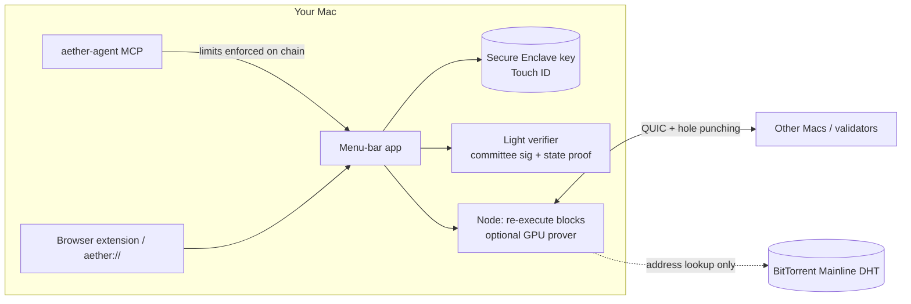

# 2025-2026 GitHub 급성장 저장소 분석과 Aether 적용안

작성: 2026-09-28. 스타 수는 같은 날 `gh api repos/<repo>`로 조회한 값이다.

주의 1: GitHub는 2026-06-30부터 stargazer API를 저장소 관리자·협업자에게만 연다. 그래서 남의 저장소의 일별 곡선은 star-history 블로그, 기사, OSS Insight 글에 나온 수치로만 재구성했다. ([star-history: GitHub Has Restricted Access to Star Data](https://www.star-history.com/blog/github-stargazer-api-restriction))

주의 2: 스타는 "관심"을 재는 지표이지 "사용"을 재는 지표가 아니다. 가짜 스타 캠페인도 흔하다(CMU 연구, 약 600만 개 추정). 암호화폐 저장소는 보상 캠페인 탓에 스타가 부풀려진 경우가 많으니 수치를 그대로 믿지 않는다. ([CMU](https://www.cs.cmu.edu/news/2025/fake-github-stars), [star-history: markdown editors](https://www.star-history.com/blog/standalone-markdown-editor))

---

## 1. 대상 저장소 19개 — 궤적과 급등 계기

| # | 저장소 | 분야 | 생성일 | 현재 ★ | 궤적 | 급등 계기 |
|---|---|---|---|---|---|---|
| 1 | [openclaw/openclaw](https://github.com/openclaw/openclaw) | AI 에이전트 | 2025-11-24 | 390.7K | 첫날 19개, 첫 주 232개로 조용히 출발. 2026년 1월 말에 24일 동안 약 15만 개. 88일 만에 20만 개 | 개명 소동(Clawdbot → Moltbot → OpenClaw, Anthropic 상표 요청), 에이전트 SNS Moltbook 동시 흥행, CNBC·Wired 등 주류 언론 보도 |
| 2 | [deepseek-ai/deepseek-harness](https://github.com/deepseek-ai/deepseek-harness) | 에이전트 하네스 | 2026-08-13 | 237.8K | 첫날 74,578개(역대 최대 하루 증가), 15일 만에 20만 개 | 프런티어 연구소의 이름값. README는 77줄뿐 |
| 3 | [obra/superpowers](https://github.com/obra/superpowers) | Claude Code 스킬 | 2025-10-09 | 292.2K | 블로그 글과 함께 공개된 뒤 계속 쌓였다. 2026-04-11 하루 1,589개로 Trending 2위 | 저자 블로그 글 "Skills are what give your agents Superpowers", Simon Willison의 언급 |
| 4 | [anthropics/skills](https://github.com/anthropics/skills) | 에이전트 스킬 | 2025-09-22 | 178.7K | 공개 직후 급등(추정) | 1st-party 기능 발표와 함께 공개됨(추정) |
| 5 | [garrytan/gstack](https://github.com/garrytan/gstack) | Claude Code 스킬 | 2026-03-11 | 134.3K | 48시간에 1만, 1주일 안에 2만, 11일에 3.9만, 16일에 5만+ (하루 평균 3,148개) | YC CEO의 X 스레드, Alfred Lin 등 유명 계정의 재공유, "하루 1~2만 줄" 같은 논쟁적 주장 |
| 6 | [github/spec-kit](https://github.com/github/spec-kit) | 개발 도구 | 2025-08-21 | 139.1K | 2025-09-02 공식 블로그 글 이후 매달 증가 | GitHub 블로그, Microsoft Dev 블로그, "vibe coding 대 SDD"라는 논쟁 프레임 |
| 7 | [anomalyco/opencode](https://github.com/anomalyco/opencode) | 코딩 에이전트 | 2025-04-30 | 210.4K | 꾸준히 급증 | (계기는 확인하지 못함) README가 20여 개 언어로 번역돼 있다 |
| 8 | [earendil-works/pi](https://github.com/earendil-works/pi) | 에이전트 툴킷 | 2025-08-09 | 109.8K | 2026년 5~8월에 58K → 98K, 하루 약 600개 | 2025-11-30 저자 블로그 글, Armin Ronacher의 "Pi: OpenClaw 안의 최소 에이전트"(2026-01-31), OpenClaw에 내장된 것 |
| 9 | [upstash/context7](https://github.com/upstash/context7) | MCP | 2025-03-26 | 62.5K | 2025년 MCP 붐을 탐 | star-history가 2025년 3월 주제로 MCP를 꼽음. README 첫 줄에 Cursor 원클릭 설치 버튼 |
| 10 | [browser-use/browser-use](https://github.com/browser-use/browser-use) | 에이전트 브라우저 | 2024-10-31 | 116.5K | 2025년에 급증 | 2025년 3월 Manus 열풍 때 "브라우저 에이전트"가 주목받음(추정), star-history 2025년 6월 주제 |
| 11 | [punkpeye/awesome-mcp-servers](https://github.com/punkpeye/awesome-mcp-servers) | awesome 리스트 | 2024-11-30 | 95.6K | MCP 붐과 함께 증가 | 새 생태계의 "목록" 자리를 선점. 다른 프로젝트들이 PR을 보내며 링크를 공유함 |
| 12 | [manaflow-ai/cmux](https://github.com/manaflow-ai/cmux) | macOS 앱 | 2026-01-28 | 27.4K | Show HN 직후 0 → 900개, 6개월 뒤 26K | 2026-02-19 Show HN(최고 2위), Mitchell Hashimoto 공유, 일본(catnose)·중국 X 계정 확산 |
| 13 | [cjpais/Handy](https://github.com/cjpais/Handy) | macOS/로컬 우선 | 2025-02-13 | 32.3K | 첫 Show HN은 3점으로 실패. 나중에 다른 사람이 올린 글이 247점·댓글 110개 | 개인 사연(손가락 골절), "무료·오프라인·가장 포크하기 쉬움", 유료 앱(Wispr Flow)의 대안이라는 프레임 |
| 14 | [steipete/CodexBar](https://github.com/steipete/CodexBar) | macOS 메뉴바 | 2025-11-16 | 22.0K | 작성자(OpenClaw 저자)의 팔로워가 초기 동력 | 작성자의 X 영향력, brew cask 한 줄 설치 |
| 15 | [jordanbaird/Ice](https://github.com/jordanbaird/Ice) | macOS 메뉴바 | 2023-08-04 | 29.7K | 계단형으로 꾸준히 증가 | 유료 앱(Bartender)을 대체하는 무료 오픈소스라는 위치 |
| 16 | [permissionlesstech/bitchat](https://github.com/permissionlesstech/bitchat) | 암호·P2P | 2025-07-04 | 36.3K | 2025-07 말에 29K(7/27 하루 1,720개). 2026-07 인도 차단 요구로 다시 급등 | Jack Dorsey X 발표(7/6), 백서 공개, TestFlight 1만 명 즉시 마감, 시위·인터넷 차단 뉴스 |
| 17 | [x402-foundation/x402](https://github.com/x402-foundation/x402) | 암호 결제 | 2025-02-21 | 6.7K | 2025-09에 1.5K → 2026년 중반 6K | 2025-09-23 Cloudflare+Coinbase 재단 발표, 2025년 10월 거래량 10,000% 급증, a16z 보고서 언급 |
| 18 | [zama-ai/fhevm](https://github.com/zama-ai/fhevm) | 암호 인프라 | 2025-05-02 | 24.8K | 짧은 기간에 큰 폭으로 증가 | 바운티 프로그램 배지와 명시적인 스타 요청. 암호화폐 커뮤니티 캠페인의 영향이 의심되므로 참고용으로만 본다 |
| 19 | [BlockRunAI/ClawRouter](https://github.com/BlockRunAI/ClawRouter) | 에이전트+지갑(x402) | 2026-02-03 | 6.6K | OpenClaw 붐 직후 급등 | "OpenClaw용"이라는 생태계 편승 + x402 USDC 지갑 결제 |

출처: [DeepSeek Harness vs OpenClaw 200K](https://www.star-history.com/blog/deepseek-harness-beats-openclaw-fastest-200k-stars), [OpenClaw가 React를 추월](https://www.star-history.com/blog/openclaw-surpasses-react-most-starred-software), [CNBC OpenClaw](https://www.cnbc.com/2026/02/02/openclaw-open-source-ai-agent-rise-controversy-clawdbot-moltbot-moltbook.html), [Taskade OpenClaw history](https://www.taskade.com/blog/moltbook-clawdbot-openclaw-history), [star-history Harness 월간](https://www.star-history.com/blog/harness), [star-history Skills 월간](https://www.star-history.com/blog/skills), [OSS Insight: personal AI stacks](https://ossinsight.io/blog/personal-ai-stacks-2026), [Alfred Lin X](https://x.com/Alfred_Lin/status/2036943401288163605), [superpowers 분석](https://self.md/people/jesse-vincent-superpowers/), [GitHub Blog spec-kit](https://github.blog/ai-and-ml/generative-ai/spec-driven-development-with-ai-get-started-with-a-new-open-source-toolkit/), [Armin Ronacher on Pi](https://lucumr.pocoo.org/2026/1/31/pi/), [star-history MCP 월간](https://www.star-history.com/blog/mcp-server), [cmux Show HN 회고](https://cmux.com/blog/show-hn-launch), [star-history Building Blocks](https://www.star-history.com/blog/building-blocks), [Handy 1차 HN](https://news.ycombinator.com/item?id=44302416), [Handy 2차 HN](https://news.ycombinator.com/item?id=46628397), [BitChat Wikipedia](https://en.wikipedia.org/wiki/BitChat), [KuCoin GitHub trending](https://www.kucoin.com/news/flash/jack-dorsey-s-github-trending-buzz-bitchat-ego-lite-top-three), [Cloudflare x402 Foundation](https://blog.cloudflare.com/x402/), [Cointribune x402](https://www.cointribune.com/en/the-crazy-numbers-of-coinbases-x402-10000-and-500000-transactions-in-7-days/)

### 타이밍 패턴 4가지

1. **권위자 X 게시 → 48시간 폭발 → Trending이 굳힘** (gstack, bitchat, DeepSeek). 누가 올리느냐가 전부다. OSS Insight의 결론은 "스타는 신뢰와 호기심에 대한 지지"라는 것이다.
2. **조용한 출발 → 서사 사건 → 폭발** (OpenClaw: 두 달 동안 조용하다가 개명 소동과 Moltbook이 겹치며 폭발, bitchat 2차: 정부의 차단 요구). 논란도 뉴스가 된다.
3. **Show HN 상위권 → 영향력 있는 개인의 재공유 → 해외 X로 확산 → 장기 복리** (cmux, Handy). 첫 HN이 실패해도 다시 올라올 수 있다(Handy: 3점 → 247점).
4. **생태계 편승** (Pi는 OpenClaw 안에 들어감, ClawRouter는 "for OpenClaw", cmux는 libghostty 기반, awesome-mcp-servers는 MCP 붐). 큰 흐름의 주변 제품이 함께 오른다.

---

## 2. README 구조 분석 (18개 저장소 원문 기준)

측정 방법: `gh api repos/X/readme`로 원문을 받아 줄 수, 배지, 이미지, 영상, 표, 설치 명령, Discord, 번역본을 셌다.

| 저장소 | 줄 수 | 첫 화면 | 히어로 시각물 | Why/비교 | 첫 화면 설치 | 기타 |
|---|---|---|---|---|---|---|
| openclaw | 331 | 다크/라이트 배너, 배지 5개(CI·npm·node·license·Discord) | 배너 | "How it fits together" | Install 섹션이 첫 번째 | Security·Governance·후원자 |
| deepseek-harness | 77 | 제목, 영/중 전환, 한 문단 | 없음 | 없음 | `npx @deepseek-ai/dsh web` | Developer preview 경고를 크게 |
| pi | 116 | 로고 128px, Discord·npm 배지 | 없음(사이트로 연결) | 없음 | 패키지 표 | "새 기여자 PR 자동 종료" 공지 |
| gstack | 629 | Karpathy 인용 → 1인칭 서사 → 실적 수치 | 없음 | 이야기 형식의 Why | "Install — 30 seconds" | 사회적 증거(인용·수치) |
| superpowers | 399 | 한 문장 정의 + 목차 | 없음 | Philosophy | 에이전트 16종별 설치법 | 배지 0개 |
| opencode | 129 | 다크/라이트 로고, 한 줄, 배지 3개, **번역 20여 개** | 스크린샷 | 없음 | curl/brew/npm | Discord |
| spec-kit | 212 | 로고, h3 태그라인, stars 배지, 번역 | webp | "Choose your process" 표 | 바로 아래 | Star history |
| context7 | 159 | 커버 이미지 → **Cursor 원클릭 설치 버튼** | 커버 + 영상 | **"❌ Without / ✅ With"** | 클라이언트별 설정 | 언론 보도("In Media"), 번역 |
| browser-use | 327 | 다크/라이트 로고, 다운로드 통계 배지 | 데모 영상 8개 | Path 1/2/3 | 3가지 경로 | Discord |
| cmux | 498 | h1 + 한 줄 + **DMG 다운로드 버튼 이미지** + 번역 12개 + X·Discord 배지 | 영상/스크린샷 | "Why cmux?", "Zen of cmux" | DMG 또는 brew | Star history, FAQ, Founder's Edition |
| Handy | 471 | Discord 배지, 굵은 한 줄 | 스크린샷 | "Why Handy?" 네 단어(Free/Open/Private/Simple) | Quick Start | **Verify Release Signatures** |
| CodexBar | 302 | 이모지 제목 + 재치 있는 부제 + 배지 7개 + 가로 전체 소셜 이미지 | 소셜 카드 | Why | brew cask | Privacy note, 권한 설명 |
| Ice | 112 | 앱 아이콘 200px + 배너 + 다운로드 배지 | 배너 + 갤러리 영상 | 없음 | 다운로드 배지 | Features/Roadmap 체크리스트 |
| bitchat | 168 | 아이콘 + 한 문단 + App Store/Play 링크 | 없음 | 없음 | 스토어 | **"신뢰할 수 있는 사본 얻기"(빌드 검증)** |
| x402 | 170 | Slack 배지 + **코드 10줄이 곧 히어로** | 코드 | Principles | npm/pip | Ecosystem |
| fhevm | 180 | 다크/라이트 헤더, 백서·문서 링크, SLSA 배지 | 헤더 | 없음 | 문서 링크 | 백서 |
| ClawRouter | 985 | 배너 + "Agents can't … can only sign transactions" 3행 카피 + 큰 배지 6개 | 배너 + 스크린샷 | **"How it compares" 표** | Quick Start | 표 18개 |
| (참고) aether-node | 54 | 제목, 한 줄, Disclaimer 배지 | 없음 | 없음 | Releases 링크 | 설명·토픽·홈페이지 비어 있음, ★1 |

### 2-1. README 패턴과 사용 빈도 (18개 중)

| 패턴 | 사용 수 | 예 |
|---|---|---|
| 첫 5줄 안의 한 줄 가치 제안 | 17 | cmux "A Ghostty-based macOS terminal with vertical tabs and notifications for AI coding agents" |
| 가운데 정렬 로고·배너(다크/라이트 `<picture>` 포함) | 12 (다크/라이트 6) | openclaw, opencode, browser-use, fhevm |
| 첫 화면의 설치·다운로드 행동 유도(DMG 버튼, brew, npx, 스토어) | 13 | cmux DMG 버튼, CodexBar `brew install --cask`, DeepSeek `npx` |
| 배지 2개 이상 | 13 | CodexBar 7개(릴리스·macOS 14+·brew·license·site) |
| Discord/Slack 커뮤니티 링크 | 12 | openclaw, pi, cmux, Handy, x402(Slack) |
| "Why X?" 또는 철학 섹션 | 9 | Handy "Free/Open Source/Private/Simple", cmux "Zen" |
| 여러 클라이언트용 설치 섹션(Claude Code/Codex/Cursor…) | 6 | superpowers 16종, context7, gstack |
| 번역 README | 7 | opencode 20여 개, cmux 12개, spec-kit 3개 |
| 영상 데모(user-attachments mp4/YouTube) | 6 | browser-use, cmux, Ice, context7 |
| 보안·신뢰 섹션(서명 검증, 빌드 검증, 공급망) | 5 | bitchat, Handy, openclaw, pi, fhevm(SLSA) |
| 비교 표 또는 Before/After | 4 | ClawRouter "How it compares", context7 "Without/With", spec-kit |
| 사회적 증거(유명인 인용, 언론, 후원자) | 4 | gstack(Karpathy 인용), context7 "In Media", openclaw 후원자 |
| Star history 차트 삽입 | 3 | cmux, spec-kit (2026-06 API 제한 뒤로 남의 저장소 차트는 깨짐) |
| 움직이는 GIF | 1 | spec-kit webp. **2026년에는 GIF 대신 mp4를 첨부하는 쪽이 주류** |
| 로드맵 체크리스트 | 2 | Ice, x402 ROADMAP.md |
| 아키텍처 다이어그램 | 3 | openclaw "How it fits together", bitchat(DeepWiki 링크), x402 |

**길이와 어조**: 줄 수 중앙값은 약 300줄(77~985). 가장 빨리 성장한 두 저장소(DeepSeek 77줄, pi 116줄)는 오히려 짧다. README 분량이 아니라 **출처의 신뢰도와 첫 화면의 설치 한 줄**이 핵심이다. 어조는 1인칭 개발자 목소리(gstack, Handy)와 건조하고 기술적인 서술(x402, pi) 두 부류다. 마케팅 문구는 드물다.

### 2-2. 홍보 채널과 전술

| 채널/전술 | 효과를 본 사례 | 실행 방법 |
|---|---|---|
| 본인 또는 권위자의 X 스레드 | gstack(48시간에 1만), bitchat(Dorsey), CodexBar | 첫 트윗에 결과물 영상과 저장소 링크. 이어서 기술 디테일 3~5개. 인플루언서에게는 미리 비공개 빌드를 준다(cmux는 Hashimoto가 공유) |
| Show HN | cmux(2위), Handy(2차 시도에 247점) | 제목은 `Show HN: 이름 – 기술적 한 문장`, 8~12단어, 80자 이하, 최상급 표현 금지. 화~목 오전 9시~정오(미 동부). 가입 벽 없이 바로 써 볼 수 있어야 한다. 첫 댓글에 자기소개, 문제, 배경, 기술, 차별점, 피드백 요청. 2~4시간 동안 댓글에 답한다 ([HN Show 규칙](https://news.ycombinator.com/showhn.html), [markepear](https://www.markepear.dev/blog/dev-tool-hacker-news-launch), [syften](https://syften.com/blog/hacker-news-marketing/)) |
| 재도전 | Handy | 첫 게시가 묻혀도 몇 달 뒤 큰 업데이트와 함께 다시 올린다. 모더레이터의 second-chance pool도 있다 |
| 긴 블로그 글 | superpowers, pi, spec-kit | "내가 X를 만들며 배운 것" 형식. HN과 Lobsters에 글 자체로 올린다 |
| 생태계 편승 | Pi, ClawRouter, cmux | 이미 뜬 도구(Claude Code, Codex, OpenClaw, MCP)용 플러그인이라고 소개한다. awesome 리스트에 PR을 보낸다 |
| 해외 언어권 | cmux(일본·중국 X), opencode | 번역 README와 해당 언어권 인플루언서 |
| 서사·논란 | OpenClaw 개명, bitchat 차단 | 억지로 만들 수는 없다. 대신 이야기(왜, 누가, 무엇을 막았나)를 준비해 둔다 |
| 1st-party·기관 발표 | spec-kit, x402(Cloudflare) | 파트너 블로그와 재단 발표 |
| 원클릭 설치 경험 | context7(Cursor 딥링크), CodexBar(brew) | 설치 마찰이 스타 전환율을 좌우한다 |

---

## 3. Aether 적용안

### 제약 (모든 문구에 적용)
- 가격·수익·APY·"돈 벌기"·"패시브 인컴"·"early" 같은 투자 어휘는 쓰지 않는다. 테스트넷 AETH는 가치가 0이라고 명시한다.
- 보상은 "earn"보다 "share block rewards"(프로토콜 규칙을 기술하는 표현)로 쓴다. 테스트넷 화면에는 항상 "testnet, no value"를 붙인다.
- 소스는 아직 비공개다. HN과 r/programming 계열에서는 "closed-source crypto"라는 공격이 가장 먼저 나올 것이다. 그래서 **대규모 런치(Show HN, Product Hunt)는 소스 공개 조건(테스트넷 30일 무리셋, 시크릿 스캔)이 충족된 뒤로 미룬다.**
- 저장소 메타데이터가 비어 있다(설명, 토픽, 홈페이지, 소셜 프리뷰, ★1). 런치 전에 반드시 채운다.

### 3-(a) README 개편안

**태그라인 후보** (첫 줄, 한 문장)
1. `A wallet and a blockchain node that live in your Mac's menu bar.` (가장 설명적. 추천)
2. `Any Mac can be a validator, and your Mac verifies your wallet itself.` (현행. 두 번째 줄로 내린다)
3. `Touch ID wallet, on-device verification, no seed phrase, no ports.` (기능 나열형)
4. `Give your AI agent a wallet with spending limits it can't change.` (에이전트 채널 전용 README 섹션이나 플러그인 저장소용)

**첫 화면(정확한 마크업 설계)**
```
<p align="center">
  <picture> (다크/라이트) 앱 아이콘 128px </picture>
  <h1>Aether</h1>
  <p>A wallet and a blockchain node that live in your Mac's menu bar.</p>
  <p><sub>Any Mac can be a validator, and your Mac verifies your wallet itself.</sub></p>
  [Download for macOS 버튼 이미지 → releases/latest/download/Aether.dmg]
  [Chrome extension] · [Docs] · [Discord 또는 GitHub Discussions]
  배지: Release vX · macOS 14+ Apple silicon · Notarized by Apple ·
        Testnet — tokens have no value (주황) · Legal disclaimer (빨강) ·
        Source: publishing at mainnet (회색)
</p>
<히어로: 메뉴바 드롭다운 스크린샷(다크/라이트 picture) 또는 20초 mp4>
> [!IMPORTANT] 테스트넷 전용, 감사를 받지 않음, 토큰 가치 0 (한 줄로 줄이고 DISCLAIMER 링크)
```
- `brew install --cask`를 제공할 수 있으면 DMG 버튼 옆에 둔다(CodexBar, cmux 패턴).
- Star history 차트는 넣지 않는다. 스타가 1개인 지금은 역효과이고, 2026년 이후에는 토큰이 필요하다.

**섹션 순서**
1. 첫 화면(위 구성)
2. **What you can do in 60 seconds**: 설치 → 메뉴바 → Touch ID로 지갑 생성 → 노드 스위치 켜기. 번호 매긴 4단계(Handy의 "How it works" 형식)
3. **Why Aether?**: 네 단어 원칙(Handy 형식)
   - *No seed phrase*: 키는 Secure Enclave 안에 있고 내보낼 수 없다.
   - *Verify, don't trust*: 잔액은 위원회 서명과 상태 증명으로 Mac에서 직접 검증한다.
   - *No ports*: BitTorrent DHT로 주소를 찾고 QUIC 홀펀칭으로 연결한다.
   - *One Mac, one seat*: DeviceCheck로 등록하고, 운영자 한 명은 최대 1/16.
4. **How it compares** 표(ClawRouter/context7 형식). 사실만 적고 가격이나 성과 비교는 하지 않는다.
   | | Aether | 일반 브라우저 지갑 | 일반 풀노드 |
   |---|---|---|---|
   | 키 보관 | Secure Enclave, Touch ID | 시드 문구 | 해당 없음 |
   | 잔액 검증 | Mac에서 서명과 증명을 검증 | RPC 서버를 신뢰 | 직접 검증 |
   | 네트워크 설정 | 포트·VPN 불필요 | 해당 없음 | 포트 개방이 흔함 |
   | 설치 | DMG 하나 | 확장 | CLI와 서버 |
5. **For AI agents**: 30초 설치 코드 블록(`aether-agent init`, `setup all --apply`)과 Claude Code, Codex, Cursor, Hermes, OpenClaw별 접이식 설치법(superpowers 형식). 플러그인 저장소로 연결.
6. **For web pages**: 확장과 `aether://` 흐름, 코드 5줄(x402처럼 코드를 히어로로)
7. **How it works**: 아키텍처 다이어그램(아래 3-(b)) 한 장과 문단 3개
8. **How mainnet will launch**: 현행 문구를 그대로 둔다. 이미 법적 톤으로 잘 쓰였다. "Nothing here promises a price or a return."는 섹션 첫 줄로 올린다.
9. **Trust & verification**: 공증 확인 명령(`spctl -a -vv`), 릴리스 해시와 서명, 권한 설명(bitchat, Handy 형식). 지갑 제품에서 가장 중요한 섹션이다.
10. **Source code**: 공개 조건과 진행 상황 체크박스(테스트넷 N/30일, 시크릿 스캔)
11. **Roadmap** 체크리스트(Ice 형식)
12. **Community**: Discussions와 Discord, 보안 제보 이메일
13. Disclaimer와 라이선스

길이는 200~300줄이 목표다. 한국어·일본어 README는 소스 공개 뒤에 만든다(cmux, opencode 패턴).

**GitHub 설정**
- description: `macOS menu-bar wallet and node: Secure Enclave keys, on-device verification, no ports (testnet)`
- topics: `macos`, `menu-bar-app`, `secure-enclave`, `wallet`, `blockchain`, `light-client`, `quic`, `dht`, `mcp`, `ai-agents`, `claude-code`
- 소셜 프리뷰(1280×640): 메뉴바 스크린샷과 태그라인. X와 HN 링크 미리보기가 이 이미지다.

### 3-(b) 만들 시각 자료

**1) 메뉴바 GIF → 실제로는 mp4, 12~20초, 무음, 반복 재생**
- 0-3초: 메뉴바의 Aether 아이콘을 클릭하면 드롭다운이 열린다(잔액, "Verified ✓ by committee sig + state proof").
- 3-8초: "Run a node" 스위치를 켠다 → 블록 높이가 올라가고 "re-executed on this Mac" 카운터가 움직인다.
- 8-14초: 한 시간 주기 표시 "This hour: online ✓ · reward share: testnet, no value"(가치 0 문구가 화면에 늘 보여야 한다).
- 14-18초: 결제 요청 → Touch ID 시트 → 완료.
- 규격: 1600×1000 레티나 캡처, 다크 모드, 커서 강조, 파일 5MB 이하. GitHub `user-attachments` mp4로 올리고, 폴백으로 첫 프레임 PNG를 둔다.
- 금지: 잔액이 늘어나는 것을 "수익"처럼 보이게 하는 확대 연출, 달러 표기, 차트.

**2) 60초 데모 영상 스크립트** (X, HN, PH 공용, 자막 필수)
| 시간 | 화면 | 내레이션/자막 |
|---|---|---|
| 0-5 | 빈 메뉴바 → DMG를 끌어 넣음 | "This is Aether. One app, notarized by Apple." |
| 5-15 | 첫 실행 → Touch ID → 지갑 생성 | "Your key is created inside the Secure Enclave. No seed phrase to write down." |
| 15-25 | 잔액 옆 Verified 배지, 상세 패널에 서명과 증명 | "Your Mac checks every balance itself, against the validators' signatures and a state proof." |
| 25-35 | 노드 스위치 켜기, 피어 연결, 포트 설정 없음 | "Flip one switch and your Mac follows the chain and re-executes every block. No ports, no VPN." |
| 35-45 | 터미널에서 Claude Code에 "send 1 test AETH" → 한도 초과 요청이 거절됨 | "AI agents get a wallet with on-chain limits. Only you can change them, with Touch ID." |
| 45-55 | 확장에서 웹페이지 결제 승인 | "Web pages ask; you approve in the extension or the Mac app." |
| 55-60 | 태그라인, 저장소 URL, "Testnet. Tokens have no value." | 끝 |

**3) 아키텍처 다이어그램** (README용 SVG, 다크/라이트 두 벌)


### 3-(c) 채널별 런치 계획 (순서)

**Phase 0: 준비 (지금부터 2주)**
- README 개편, 저장소 메타데이터, 소셜 프리뷰, mp4, 60초 영상, 다이어그램
- 랜딩 페이지 한 장(가입 벽 없이 DMG를 바로 받을 수 있게)
- 법무 문구 점검표: 가격, 수익, 투자, 에어드롭, "early" 금지. 모든 게시물에 "testnet tokens have no value"
- GitHub Discussions 열기(Discord보다 운영 부담이 적다)

**Phase 1: 소스 비공개 기간, "에이전트 지갑" 틈새 공략**
- 저장소 이름 자체가 에이전트를 향하는 `aether-plugin`을 앞세운다. 생태계 편승 패턴이다.
- awesome 리스트에 PR: awesome-mcp-servers(95K★), awesome-claude-code 계열, awesome-x402 계열(해당하면). 설명은 사실만 적는다.
- X 스레드 ①: "I gave Claude Code a wallet it can't drain", 영상 20초. 한도를 넘는 요청이 거절되는 장면이 핵심이다.
- r/ClaudeAI 또는 r/ClaudeCode: 기술 쇼케이스로 올린다(게시 전에 해당 서브레딧의 셀프 프로모션 규칙을 확인한다).
- 목표: 초기 스타 100~300개와 피드백. 이 단계에서는 HN에 올리지 않는다.

**Phase 2: 소스 공개일 (조건 충족 직후 화~목, 미 동부 9-11시)**
- Show HN 제목 후보(80자 이하, 최상급 표현 없음):
  1. `Show HN: Aether – A wallet and blockchain node in the macOS menu bar`
  2. `Show HN: A Mac wallet that verifies its own balance (Secure Enclave, no seed)`
  3. `Show HN: Aether – P2P validator on macOS with no port forwarding (DHT + QUIC)`
  4. `Show HN: Giving AI agents a wallet with on-chain spending limits`
  → 1번을 추천한다. 3번은 기술 블로그 글로 따로 올리기 좋다.
- 첫 댓글 뼈대: 자기소개 1줄 → 문제(시드 문구, RPC 신뢰, 노드 운영 난이도) → 만든 것 → 기술 선택(Secure Enclave, DHT를 주소 조회에만 쓰는 이유, QUIC 홀펀칭, 위원회 서명+상태 증명) → **토큰 정책(판매 없음, 프리마인 없음, 운영자당 최대 1/16, 테스트넷 가치 0)을 먼저 밝힘** → DeviceCheck의 한계와 Apple 의존성을 스스로 인정 → 피드백 요청
- 예상 반론과 답변 준비: "왜 블록체인인가", "Apple 종속", "DeviceCheck는 시빌 방어가 약하다", "1/16 상한은 우회 가능하다", "감사를 받지 않았다"
- 같은 날 X 스레드 ② (7~9개 트윗):
  1. 60초 영상 + 한 줄 + 저장소 링크
  2. 시드 문구가 없는 이유(Secure Enclave)
  3. "Verify, don't trust" 스크린샷
  4. 포트가 필요 없는 이유(DHT + QUIC 다이어그램)
  5. 에이전트 지갑 한도 데모
  6. 출시 규칙(판매·프리마인·창업자 몫 없음, 1/16 상한), "no price or return promised"
  7. 소스, 라이선스, 기여 링크
- Lobsters(초대가 필요함)와 기술 블로그 글("DHT를 주소 조회에만 쓰는 P2P 노드 만들기")을 하루 이틀 간격으로 올린다.

**Phase 3: 1~2주 뒤**
- Reddit: r/macapps(무료 오픈소스 Mac 앱이라는 각도, 셀프 프로모션 비율 규칙 확인), r/CryptoTechnology(기술 토론만, 가격 얘기 금지 규칙과 잘 맞음), r/selfhosted(포트 없는 노드라는 각도, 적합한지 사전 확인). r/CryptoCurrency와 r/programming은 반감이 크거나 규칙이 엄격하니 뒤로 미루거나 제외한다.
- Product Hunt: 화~수요일 0시(태평양 시간)에 올린다. 카테고리는 Mac/Developer Tools로 한다. 헌터보다 제작자 본인의 첫 댓글이 중요하다. 이미지 5장과 60초 영상. 암호화폐 제품에 대한 PH 정책은 조사에서 확인하지 못했으니 게시 전에 가이드라인을 확인한다.
- 뉴스레터 제보: Console.dev, TLDR, Changelog Nightly 같은 개발자 뉴스레터와 Mac 앱 큐레이션 사이트.

**Phase 4: 메인넷 공지**
- 별도 Show HN이 아니라 블로그 글("How Aether's mainnet launches without a sale")로 올린다. 이때도 가격이나 수익에 대한 언급은 없다.
- 일본어·한국어 README와 해당 언어권 X 계정에 사전 공유한다(cmux 패턴).

**하지 말 것**: 스타를 달라는 캠페인, 에어드롭을 암시하는 것, "early adopters"류 문구, 지인을 동원한 추천 댓글(HN이 제재한다), 스타 수 배지.

---

## 요약 (6줄)
1. 2025-26년 가장 빠른 성장은 AI 에이전트 계열에서 나왔다(OpenClaw 88일 만에 20만, DeepSeek Harness 첫날 7.5만, gstack 48시간에 1만). 계기는 권위자의 X 게시, 서사·논란, 생태계 편승이다.
2. 암호화폐 쪽 급성장 사례는 bitchat(Dorsey 발표, 29K→36K), x402(Cloudflare 재단, 6.7K), ClawRouter(OpenClaw+x402 편승) 정도다. 이 분야 스타는 캠페인으로 부풀려진 경우가 많다.
3. README의 공통 패턴은 한 줄 가치 제안, 첫 화면의 설치 버튼, 배지, Discord, Why 섹션이다. 길이(77~985줄)나 GIF는 성장과 거의 관련이 없다.
4. Aether는 메타데이터부터 채우고, 메뉴바 태그라인, DMG 버튼, "Testnet: no value" 배지, Why 4원칙, 비교 표, 신뢰·검증 섹션 순으로 개편한다.
5. 소스 공개 전에는 에이전트 지갑이라는 틈새(awesome 리스트, X, r/ClaudeAI)로 초기 반응을 모은다. Show HN과 Product Hunt는 소스 공개일에 맞춘다.
6. 모든 채널에서 가격·수익·에어드롭 어휘를 금지하고, 토큰 정책(판매·프리마인 없음, 1/16 상한)을 먼저 밝혀 신뢰를 얻는다.
