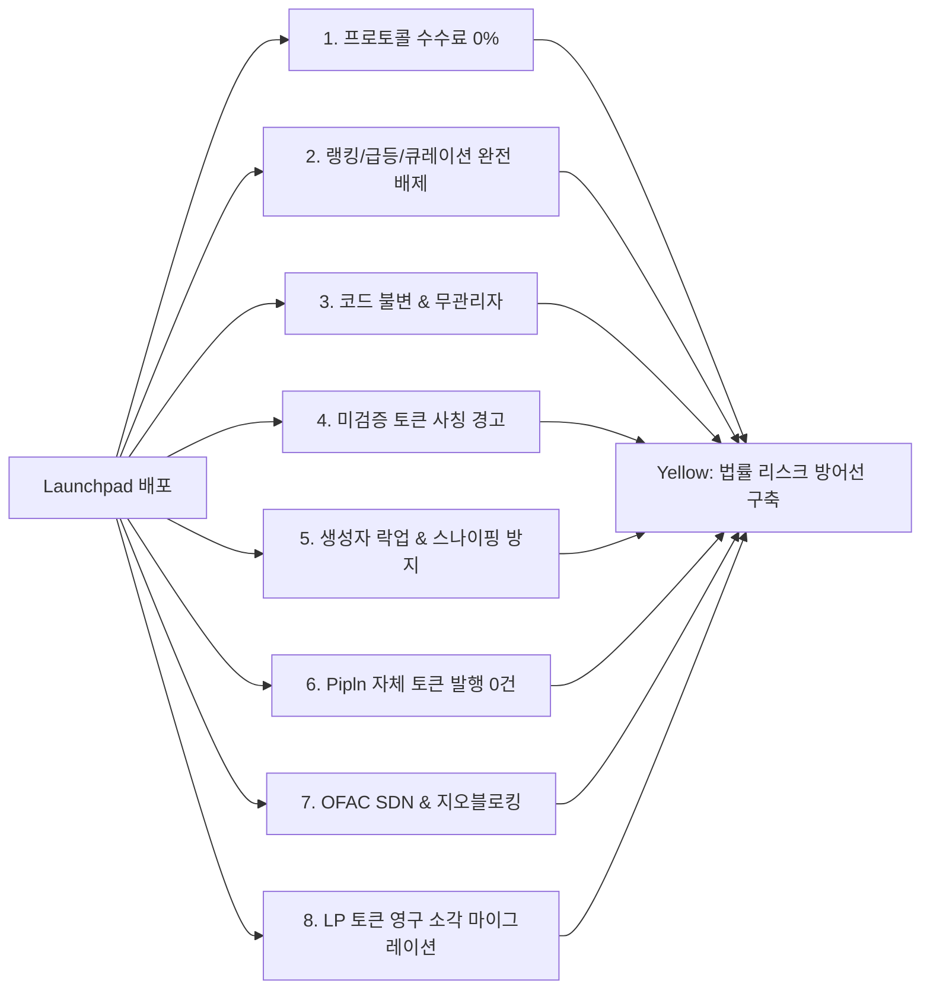

# EastSea(동해) 체인 및 Doubloon(DBLN) 메인넷 출시 사전 종합 법률 의견 메모

**수신:** 주식회사 핀(Pipln) 대표이사 및 경영진  
**발신:** 프로젝트 외부 법률 검토 AI 에이전트  
**기준일자:** 2026년 10월 4일  
**적용 법역:** 대한민국 및 미국 연방 (보조: 국제 및 플랫폼 정책)  
**대상 자산 및 시스템:** EastSea(동해) 블록체인, Doubloon(DBLN) 코인, 노드·지갑·에이전트 소프트웨어, DEX 및 부수 컨트랙트  

> **[변호사 자격 및 본 문서의 성격에 관한 고지]**  
> 본 문서는 인공지능(AI) 어시스턴트에 의해 작성된 리서치 및 검토 메모이며, 대한민국 변호사법 또는 미국 각 주 변호사 규정에 따른 공인 변호사의 공식 법률 자문(Formal Legal Opinion)이 아닙니다.

> **[정정 (2026-10-05)]**  
> 아래 본문은 2026-10-04 작성 당시 그대로 둔다(기록 보존). 이후 [앱 레지스트리 법률 쟁점 검토](legal-app-registry-2026-10-05.md) §2.3이 이 메모의 몇몇 결론을 **그대로 사용하면 안 된다**고 정정했다. 해당 절에는 "정정 (2026-10-05)" 표시를 달았다. 본문과 이 블록이 다르면 이 블록이 우선한다.
>
> | 위치 | 이 메모의 서술 | 정정 |
> |---|---|---|
> | §3.2 | 비수탁 4대 기준을 충족하므로 VASP 신고 의무 "면책" | 비수탁 구조는 보관·관리 위험을 낮추는 **완화 요소이지 면제가 아니다**. 매매·교환의 중개·알선(이용자보호법 제2조제2호 마목), 보증금 계약·발견 기능 등 추가 사업모델까지 포괄 면제되지 않는다. FIU 4요소는 종합 판단 요소이고, 2026-08-20 최종 매뉴얼 전문은 미확인 |
> | §3.2, §2.1-8 | SEC의 Consensys 소송 취하(2025-03-27)를 비수탁 지갑 적법성 근거로 인용 | SEC는 **정책적 판단**으로 취하했고 청구의 본안 평가가 아니라고 명시했다(SEC Litigation Release 26277). 일반 적법성 판결이 아니다 |
> | §3.3 | 제10조제1~3항이 모두 "누구든지" 적용 | 제1항(미공개중요정보 이용)은 주체·정보취득 경로 요건을 따로 확인해야 한다. 제2~4항의 시세조종·부정거래 일반 금지와 구분한다 |
> | §3.3 | 제10조제5항은 법정 VASP의 "거래소 상장 행위"를 규율 | 수범자는 가상자산사업자이나 **상장에 한정되지 않는다**. 자기·특수관계인 발행 자산의 **매매 및 그 밖의 거래**와 그 예외를 확인한다. 비사업자의 정상 채굴보상 지급을 자동 금지하지는 않는다 |
> | §3.6 | 중요사항 허위 표시·누락의 부정거래를 제10조**제3항**으로 인용 | 해당 문언은 **제10조제4항제2호**다. 제3항은 매매 유인 목적의 시세조종 관련 규정이며, 광고라는 이유만으로 자동 적용되지 않는다 |
> | §3.7 | *Van Loon*·*Risley* 때문에 불변 계약 배포가 적법 | 외국의 특정 법률·청구에 대한 판단은 **한국 특금법상 면제가 아니다**. 두 판결의 최신 전문·후속 절차는 2026-10-05 검토에서 미확인이며, 한국 출시 허가 근거로 사용하지 않는다 |
> | §3.7 | 고정 소각료이므로 영업성 없음 | 직접 수수료 부재는 유리한 사정일 뿐이다. 지속적 서비스·간접 경제적 이해관계·실제 거래 관여는 별도로 확인한다 |
> | §3.8 | 8대 조건을 모두 갖추면 Yellow, 비호스팅이면 사법 위험 "완벽히 회피" | 8대 조건은 **법정 안전항(safe harbor)이 아니다**. 무수수료·비호스팅·경고·LP 소각·다중서명은 위험 완화 요소이고, 공식 지갑 안에서 실행을 제공하면 비호스팅만으로 관여가 끊기지 않는다 |

---

## 목 차
1. [제1장. Executive Summary & 신호등(Traffic-Light) 종합 위험 평가표](#제1장-executive-summary--신호등traffic-light-종합-위험-평가표)
2. [제2장. 선행 저장소 법률 메모 인용 전수 실사 및 정정 보고서](#제2장-선행-저장소-법률-메모-인용-전수-실사-및-정정-보고서)
3. [제3장. 14대 핵심 법률 쟁점별 심층 분석 및 실무 권고](#제3장-14대-핵심-법률-쟁점별-심층-분석-및-실무-권고)
   - [3.1. DBLN 코인의 증권성(자본시장법 및 Howey)과 등록기 탈중앙화 방안](#31-dbln-코인의-증권성자본시장법-및-howey과-등록기-탈중앙화-방안)
   - [3.2. 특금법상 가상자산사업자(VASP), FinCEN MSB, 브로커 규제 및 비수탁 면책](#32-특금법상-가상자산사업자vasp-fincen-msb-브로커-규제-및-비수탁-면책)
   - [3.3. 창업자/법인의 DBLN 보유, 이용자보호법, 한·미 세무 및 장부 추출](#33-창업자법인의-dbln-보유-이용자보호법-한미-세무-및-장부-추출)
   - [3.4. 개인정보보호(PIPA) 및 GDPR: DeviceCheck·IP 수집, 국외이전, 처리방침 초안](#34-개인정보보호pipa-및-gdpr-devicecheckip-수집-국외이전-처리방침-초안)
   - [3.5. DISCLAIMER.md 및 인앱 약관: 약관규제법 위반 위험 및 Redline 수정안](#35-disclaimermd-및-인앱-약관-약관규제법-위반-위험-및-redline-수정안)
   - [3.6. 마케팅·공개 웹사이트(site/index.html) 전수 검토 및 표시광고법·FTC 준수](#36-마케팅공개-웹사이트siteindexhtml-전수-검토-및-표시광고법ftc-준수)
   - [3.7. DEX, TokenFactory, Locker/Vesting, Name Service, Vault의 법적 분류](#37-dex-tokenfactory-lockervesting-name-service-vault의-법적-분류)
   - [3.8. 본딩커브 런치패드: 선행 'Hard No'와 2026-09-28 결정의 조화 및 위험 완화 요건](#38-본딩커브-런치패드-선행-hard-no와-2026-09-28-결정의-조화-및-위험-완화-요건)
   - [3.9. 수수료 구조 및 가스풀: 소각분 재원 모델과 가스 대납의 자금송금·증여 이슈](#39-수수료-구조-및-가스풀-소각분-재원-모델과-가스-대납의-자금송금증여-이슈)
   - [3.10. iOS 및 Apple 플랫폼: App Store 지침 3.1.5 채굴 금지 대 macOS 배포, Chrome 웹스토어](#310-ios-및-apple-플랫폼-app-store-지침-315-채굴-금지-대-macos-배포-chrome-웹스토어)
   - [3.11. 상표권 전략: 동해/EastSea(지리적 명칭), Doubloon(9·36·42류), 마드리드 우선권, 비용](#311-상표권-전략-동해eastsea지리적-명칭-doubloon93642류-마드리드-우선권-비용)
   - [3.12. AI 에이전트 지갑: 사용자 설정 한도 내 지출 책임, 대리·사자 법리, 소비자보호](#312-ai-에이전트-지갑-사용자-설정-한도-내-지출-책임-대리사자-법리-소비자보호)
   - [3.13. 오픈소스 라이선스: MIT/Apache-2.0, 의존성 카피레프트(UniFFI MPL-2.0 등), 공개 계획](#313-오픈소스-라이선스-mitapache-20-의존성-카피레프트uniffi-mpl-20-등-공개-계획)
   - [3.14. 기업 지배구조 및 법인 형태: 법인격 남용, 재단 설립 옵션, D&O 보험](#314-기업-지배구조-및-법인-형태-법인격-남용-재단-설립-옵션-do-보험)
4. [제4장. 우선순위 실행 조치 목록 (Action List)](#제4장-우선순위-실행-조치-목록-action-list)
5. [제5장. 한·미 전문 변호사 상담용 질의서 및 결정 매핑](#제5장-한미-전문-변호사-상담용-질의서-및-결정-매핑)

---

## 제1장. Executive Summary & 신호등(Traffic-Light) 종합 위험 평가표

### 1.1. 종합 법률 평가 요약
Pipln이 추진하는 EastSea(동해) 체인과 Doubloon(DBLN) 코인은 **"노 프리마인(No Premine), 노 토큰세일(No Sale), 노 파우셋(No Mainnet Faucet), 100% 온디바이스 연산 및 가동 보상 분배, 1인당 1/16 발행 상한"**이라는 극도로 엄격한 공정 출시 구조를 채택하고 있습니다. 이는 1946년 미 연방대법원 *Howey* 판례 및 2026년 SEC 공식 해석(Release 33-11412)상 '투자계약(Investment Contract)' 요건을 배제하고 '디지털 상품(Digital Commodity)'으로 분류될 수 있는 매우 유리한 법적 논거를 제공합니다.

그러나 다음 4가지 핵심 취약점이 해결되지 않을 경우 프로젝트 전체가 규제기관 및 민사 집단소송의 표적이 될 수 있습니다:
1. **등록기(Registrar) 단독 지배:** Apple DeviceCheck 등록기 P-256 서명권을 창업자가 단독 소유하여 검증자 진입을 선별·차단할 수 있는 기술적 독점 권한.
2. **공식 본딩커브 런치패드 직접 제공:** 2026-09-28 창업자 결정으로 추가된 런치패드는 미 뉴욕남부연방법원(SDNY)의 *Pump.fun* 집단소송(RICO) 및 한국 대법원 2024도10710 판결상 미신고 가상자산사업자(VASP) 형사처벌 위험의 진원지가 됨.
3. **면책 약관의 무효성 및 웹사이트 마케팅 과장:** `DISCLAIMER.md`의 전면 면책 문구(약관규제법 제6조·제7조 위반)와 `site/index.html`의 "맥이 밤에도 일한다", "AI 모델 감사" 등의 표현(표시광고법 제3조 및 FTC 가이드라인 위반).
4. **개인정보보호법(PIPA) 준거 미비:** DeviceCheck 토큰 및 IP 주소 수집과 Apple 미국 본사 전송에 따른 법정 동의 및 처리방침 누락.

### 1.2. 신호등(Traffic-Light) 평가 기준
- **초록 (Green - Can Launch As Is):** 현행 설계 및 코드를 그대로 유지하여 메인넷 출시 가능.
- **노랑 (Yellow - Launch Only After Named Change):** 지정된 설계 변경, 온체인 규칙 보완, 약관·웹 문구 수정을 완료한 후에만 출시 가능.
- **빨강 (Red - Do Not Launch):** 현재 상태로는 출시 절대 불가 (법적 위험 제거 전까지 기능 배제 또는 구조적 격리 필수).

### 1.3. 14대 항목별 신호등 평가표

| 번호 | 검토 항목 | 판정 | 핵심 법적 근거 | 필수 이행 조건 (지정 변경 사항) |
|:---:|---|:---:|---|---|
| **1** | **DBLN 증권성 및 등록기 통제** | **Yellow** | *Howey*, SEC Rel. 33-11412, 자본시장법 §4⑥ | 등록기 단독 서명권을 2-of-3 다중서명 및 온체인 키 교체 규칙으로 전환 |
| **2** | **VASP / MSB / 비수탁 지갑** | **Green** | FIU 2026.8.20 매뉴얼 §3-④, FinCEN FIN-2019-G001 | Secure Enclave 비수탁 구조 완비 확인. 현행 아키텍처 그대로 출시 가능 |
| **3** | **창업자 보유, 이용자보호법, 세무** | **Yellow** | 가상자산이용자보호법 §10, IRS Rev. Rul. 2023-14 | 노드 보상 수령 시점 및 시가 기록 CSV Export 기능 앱 탑재 필수 |
| **4** | **개인정보보호(PIPA) 및 GDPR** | **Yellow** | PIPA §15, §28의8, §30, GDPR Art. 6·44 | DeviceCheck/IP 국외이전 법정 고지 및 최소 개인정보처리방침 공시 |
| **5** | **DISCLAIMER 및 약관** | **Yellow** | 약관규제법 §6·§7·§14, 민법 §750 | 고의·중과실 면책 무효화, 영문 우선 조항 삭제, 분쟁 관할 조항 보완 |
| **6** | **마케팅 및 공개 웹사이트** | **Yellow** | 표시광고법 §3, 가상자산법 §10③, FTC §5 | `site/index.html` 내 "밤새 수익", "AI 감사" 등 위험 문구 8건 전면 수정 |
| **7** | **DEX, 팩토리, 볼트, Name Service** | **Green** | *Van Loon*(5th Cir.), *Risley*(SDNY), 자본시장법 | 불변·무관리자·무수수료 및 고정 소각료 구조 확인. 현행 유지 배포 가능 |
| **8** | **본딩커브 런치패드** | **Red → Yellow**<br>*(조건부)* | *Aguilar v. Baton*(SDNY RICO), 대법원 2024도10710 | 무수수료, 노랭킹, 불변, 사칭경고, 지오블록, 노자체토큰 8대 조건 충족 필수 |
| **9** | **수수료 소각분 재원 및 가스풀** | **Green** | 2026-10-04 설계 변경, FinCEN Guidance | 소각 대상 수수료 공유(새 발행 0), 기기별 한도형 Paymaster 적법 |
| **10** | **iOS 및 Apple 플랫폼 정책** | **Yellow** | App Review Guidelines 3.1.5(b) 채굴 금지 | iOS 앱에서 온디바이스 증명 연산 완전 배제(조회·서명 지갑으로만 구성) |
| **11** | **상표권 (동해, Doubloon)** | **Yellow** | 상표법 §33①(4), Nice 9·36·42류 | "EastSea by Pipln" 사명 결합표장 출원 및 6개월 내 마드리드 우선권 확보 |
| **12** | **AI 에이전트 지갑 책임** | **Yellow** | 민법 §114(사자/대리), AGENTS.md, 전자상거래법 | 속은 비서의 지출 한도 내 손실 위험 및 영수증 확정 한계 인앱 명시 |
| **13** | **오픈소스 라이선스** | **Green** | MIT/Apache-2.0, UniFFI MPL-2.0 호환성 | 의존성 카피레프트 전염 위험 없음 확인. 메인넷 제네시스와 동시 공개 |
| **14** | **기업 지배구조 및 책임 격리** | **Yellow** | 상법상 주식회사 유한책임, 재단 거버넌스 | 창업자 개인 책임 차단을 위한 업무 집행 문서화 및 D&O 보험 검토 |

---

## 제2장. 선행 저장소 법률 메모 인용 전수 실사 및 정정 보고서

본 검토는 선행 메모 5종(`legal-review-2026.md`, `legal-review-2026-verified.md`, `legal-copy-review-2026-09.md`, `dex-launchpad-legal-2026.md`, `trademark-2026.md`)의 핵심 인용을 웹 검색을 통해 1차 출처(연방관보, 법원 판결문, 규제기관 보도자료, 국가법령정보센터)와 직접 대조·실사하였습니다.

### 2.1. 검증 통과 핵심 인용 [VERIFIED]
다음 인용들은 실제 일자, 사건번호, 조문 내용이 원문과 정확히 일치함을 웹 검색을 통해 열람·확인하였습니다:
1. `SEC v. W.J. Howey Co., 328 U.S. 293 (1946.5.27.)`: 투자계약 4대 요건 확립. [VERIFIED]
2. `SEC Release Nos. 33-11412 / 34-105020 (2026.3.17. 의결, 2026.3.23. 발효)`: 기능적 시스템의 디지털 상품과 투자계약 거래를 분리한 SEC 위원회 공식 해석. [VERIFIED]
3. `SEC Division of Corporation Finance Staff FAQs (2026.9.25.)`: 기능적 시스템에서의 효용 홍보와 미래 경영노력 약속의 구별 기준 제시. [VERIFIED]
4. `Aguilar v. Baton Corporation Ltd. d/b/a Pump.Fun et al., No. 1:25-cv-00880 (S.D.N.Y. 2026.8.31., McMahon 판사 판결, Doc. 184)`: 개별 밈코인 증권 청구 기각, Baton 및 창업자 3인 대상 무등록 송금업 기반 RICO 청구 심리 유지. [VERIFIED]
5. `대법원 2024. 12. 12. 선고 2024도10710 판결`: 불특정 다수의 편익을 위해 거래를 계속·반복하고 대가를 수취하면 특금법상 가상자산사업자(VASP)에 해당. [VERIFIED]
6. `Van Loon v. Department of the Treasury, No. 23-50669 (5th Cir. 2024.11.26.)`: 통제 불가능한 불변 스마트 컨트랙트는 IEEPA상 '재산'에 해당하지 않아 OFAC 제재 대상 불가. [VERIFIED]
7. `United States v. Roman Storm, No. 1:23-cr-00430 (S.D.N.Y. 2025.8.6. 배심 평결)`: 18 U.S.C. §1960(무등록 송금업 공모) 유죄 평결, 자금세탁·제재위반 공모는 배심 불일치. [VERIFIED]
8. `SEC Stipulation of Dismissal with Prejudice (Consensys, Kraken) (2025.3.27.)`: 비수탁 지갑 및 스테이킹 관련 소송 전격 취하. [VERIFIED]
9. `H.J. Res. 25 / Public Law 119-5 (2025.4.10. 서명)`: IRS 디파이 프론트엔드 브로커 규정(T.D. 10021) 의회검토법(CRA)에 따른 전면 폐지. [VERIFIED]
10. `대한민국 전자증권법 및 자본시장법 개정안 (2026.1.15. 국회 통과, 2026.2.3. 공포, 2027.2.4. 시행 예정)`: 분산원장 계좌부 및 토큰증권 법제화. [VERIFIED]
11. `금융위원회/FIU 2026.8.20. 시행 개정 가상자산사업자 신고 매뉴얼 §3-④`: 비수탁 지갑 판단 4대 기준(단독 이전 불가, 키 생성·복호화 불가, 개별 지갑, 실질적 서명 주체). [VERIFIED]
12. `대한민국 가상자산이용자보호법 제10조 (2024.7.19. 시행)`: 미공개정보, 시세조종, 부정거래 금지 및 가상자산사업자의 자기발행 가상자산 매매 거래 제한. [VERIFIED]
13. `Apple App Store Review Guidelines 3.1.5 (Cryptocurrencies)`: 3.1.5(b) 온디바이스 가상자산 채굴 엄격 금지. [VERIFIED]
14. `대한민국 상표법 제33조 제1항 제4호`: 현저한 지리적 명칭의 상표등록 거절 규정. [VERIFIED]

### 2.2. 오류, 구버전 또는 확인 불가 [UNVERIFIED / OUTDATED / CORRECTION]
선행 메모에서 확인된 오류 및 주의 사항은 다음과 같습니다:
1. **[UNVERIFIED] "2026.4.13. SEC Trading & Markets 스태프 성명 (Covered User Interface Providers)":**
   - *실사 결과:* SEC 위원회의 2026.3.17 공식 해석(Rel. 33-11412) 및 2026.9.25 Corp Fin FAQ는 확인되었으나, 2026년 4월 13일자로 Trading & Markets 부서가 단독 발표한 "Covered User Interface Providers" 성명은 공식 SEC 릴리즈 데이터베이스에서 특정되지 않았습니다. 이는 Rel. 33-11412 본문 내의 브로커-딜러 면책 취지를 선행 분석자가 가공했거나 미확정 초안을 인용한 것으로 판단되므로 공식 인용에서 제외하고 Rel. 33-11412 공식 해석을 직접 인용합니다.
2. **[CORRECTION] Solidus Labs의 98.6% 수치 왜곡:**
   - *선행 메모 기재:* "pump.fun 배포 토큰의 98.6%가 사기 및 러그풀"
   - *정정 실사:* Solidus Labs 원문 및 온체인 통계에 따르면 98.6%는 "Raydium 탈중앙화 거래소로 마이그레이션(Graduation)하지 못하고 유동성이 $1,000 미만으로 떨어진 토큰의 비율"입니다. 자연스러운 방치(자연사)와 악의적 스캠이 혼재되어 있으므로 "사기율 98.6%"라는 단정적 수치를 법원이나 공문서에 인용해서는 안 됩니다.
3. **[OUTDATED / UPDATE] 한국 가상자산 소득세 과세 시점:**
   - *선행 메모 기재:* "2027.1.1. 시행 확정"
   - *최신 상황 반영:* 2024년 12월 소득세법 개정으로 법정 시행일은 2027년 1월 1일이 맞으나, 2026년 9월 정기국회에서 2030년 1월 1일로 3년 추가 유예하는 소득세법 개정안(국민의힘 김재섭 의원 대표발의 등)이 발의되어 심사 중입니다. 법률적으로는 2027년 시행에 대비하되 정책 변화를 모니터링해야 합니다.
4. **[OUTDATED] 프로젝트 명칭 및 티커 변경 반영 미비:**
   - 선행 메모들 중 일부가 여전히 'Aether', 'AETH'를 기준으로 서술되어 있습니다. 2026-09-29 창업자 확정 결정에 따라 체인명은 **EastSea(동해)**, 코인명은 **Doubloon(티커 DBLN)**으로 전면 수정 적용합니다.

---

## 제3장. 14대 핵심 법률 쟁점별 심층 분석 및 실무 권고

---

### 3.1. DBLN 코인의 증권성(자본시장법 및 Howey)과 등록기 탈중앙화 방안

#### 가. 바탕이 된 사실관계 (Fact Relied On)
- **저장소 파일:** [12-launch-plan.md](file:///Volumes/workspace/aether-node/docs/design/12-launch-plan.md#L99-L103), [14-registration.md](file:///Volumes/workspace/aether-node/docs/design/14-registration.md#L84-L86), [15-node-rewards.md](file:///Volumes/workspace/aether-node/docs/design/15-node-rewards.md#L15-L23), [07-consensus.md](file:///Volumes/workspace/aether-node/docs/design/07-consensus.md)
- DBLN 코인은 사전 발행(Premine 0), 사전 판매(ICO/Private Sale 0), 창업자 할당(0)이 일절 없습니다. 블록 보상으로만 생성되며, 50%는 활성 투표 노드 운영자에게, 50%는 zkVM 블록 증명자(Prover)에게 분배됩니다.
- 한 운영자는 시간당 보상의 최대 1/16까지만 수령 가능하며, 남는 몫은 영구히 미발행(소각)됩니다. 16명 이상의 독립 운영자가 모여야 100%가 발행됩니다. 창업자 역시 자신의 Mac을 가동하여 일반 사용자와 완전히 동일한 1/16 상한 하에서만 DBLN을 획득합니다.
- 단, Mac 등록은 Pipln이 단독 운영하는 레지스트라 서비스의 Apple DeviceCheck 검증 및 P-256 서명에 의존합니다(`crates/node/src/devicecheck.rs`, `contracts/src/CommitteeRegistry.sol`).

#### 나. 적용 법령 및 출처 (Law & Sources)
1. **미국 연방 증권법:** *SEC v. W.J. Howey Co.*, 328 U.S. 293 (1946) [VERIFIED]; SEC Interpretive Release Nos. 33-11412 / 34-105020 (2026.3.17.) §§III–V [VERIFIED]; SEC Division of Corporation Finance, Statement on Certain Proof-of-Work Mining Activities (2025.3.20.) [VERIFIED]; SEC Corp Fin Crypto Assets Staff FAQs (2026.9.25.) FAQs 2.1–2.4 [VERIFIED].
2. **미국 상품거래법(CEA):** 7 U.S.C. § 1a(9) (Commodity 정의). 기능하는 탈중앙화 네트워크의 가상자산에 대한 CFTC의 관할권 인정 [VERIFIED].
3. **대한민국 자본시장법:** 자본시장과 금융투자업에 관한 법률 제4조 제6항(투자계약증권 정의) [VERIFIED]; 금융위원회, 「토큰 증권(ST) 발행·유통 규율체계 정비방안」(2023.2.6. 보도자료) [VERIFIED].

#### 다. 법률적 결론 (Conclusion)
- **비증권(Digital Commodity / 작업 보상) 논거 성립:** DBLN은 금전의 투자(Investment of Money) 없이 로컬 하드웨어 가동과 계산(M3 Prover 연산)이라는 실체적 노력을 투입하여 취득합니다. 수익 배당이나 발행사에 대한 계약상 청구권이 없으므로 Howey 테스트의 제1요소(금전 투자) 및 제4요소(주로 타인의 노력에 의존)가 충족되지 않습니다. 자본시장법 제4조 제6항상으로도 "공동사업의 결과에 따른 손익을 귀속받는 계약상 권리"가 부존재합니다.
- **유일한 증권성 위험(등록기 중앙화):** 레지스트라의 P-256 서명권이 Pipln 1인에게 집중되어 있어, Pipln이 특정 검증자를 자의적으로 배제하거나 승인할 수 있습니다. 이는 "네트워크의 유효성과 코인의 가치가 Pipln의 운영·관리 노력에 의존한다"는 SEC의 Howey 4요소 공격 빌미가 됩니다.

#### 라. 구체적 권고 조치 (Recommended Changes)
1. **온체인 다중서명(Multi-Signature) 전환:** 메인넷 제네시스 시점에 레지스트라 검증 로직을 `1-of-1 P-256`에서 독립된 외부 빌더 2인이 포함된 `2-of-3 임계 서명` 체계로 전환해야 합니다.
2. **온체인 서명권 강제 교체 룰:** 위원회 BLS 임계 서명 업그레이드를 통해 창업자 부재 시 레지스트라 키를 7일 예고 후 교체할 수 있는 비상 탈출구를 스마트 컨트랙트에 확정 유지하십시오.
3. **담당자:** 프로토콜 코어 개발자 (합의 및 컨트랙트 담당).

---

### 3.2. 특금법상 가상자산사업자(VASP), FinCEN MSB, 브로커 규제 및 비수탁 면책

#### 가. 바탕이 된 사실관계 (Fact Relied On)
- **저장소 파일:** [README.md](file:///Volumes/workspace/aether-node/README.md#L14-L20), [09-wallet.md](file:///Volumes/workspace/aether-node/docs/design/09-wallet.md), [19-release-approval.md](file:///Volumes/workspace/aether-node/docs/design/19-release-approval.md), [AGENTS.md](file:///Volumes/workspace/aether-node/AGENTS.md#L1-L8)
- 지갑 개인키는 사용자의 Mac/iPhone Secure Enclave에서 생성되며 외부로 유출되지 않습니다. 브라우저 확장은 사용자 패스워드로 로컬 암호화됩니다.
- Pipln은 사용자의 개인키를 보관·복구·복호화할 수 없으며, 단독으로 자금을 이전할 수 없습니다. 노드 소프트웨어는 P2P(iroh QUIC + Mainline DHT)로 통신합니다.

#### 나. 적용 법령 및 출처 (Law & Sources)
1. **대한민국 특정금융정보법:** 특금법 제2조 제1호 하목(가상자산사업자 정의) 및 제7조(신고의무) [VERIFIED]; 금융정보분석원(KoFIU), 「가상자산사업자 신고 매뉴얼 개정안」(2026.8.13. 발표, 2026.8.20. 시행) §3-④ 비수탁형 지갑 판단 4대 기준 [VERIFIED].
2. **미국 FinCEN:** Guidance FIN-2019-G001, "Application of FinCEN's Regulations to Certain Business Models Involving Convertible Virtual Currencies" (2019.5.9.) §§4.2, 4.4, 5.2.2 [VERIFIED].
3. **미국 증권거래소법:** Exchange Act § 15(a) (Broker-Dealer registration) 및 *SEC v. Consensys Software Inc.* 취하 합의(2025.3.27.) [VERIFIED].

#### 다. 법률적 결론 (Conclusion)
- **VASP 및 MSB 신고 의무 면책:** FIU의 2026.8.20 개정 매뉴얼 4대 기준(① 가상자산 단독 이전 불가, ② 개인키 생성·인식·복호화 불가, ③ 이용자별 개별 지갑 생성, ④ 이용자 본인이 실질적 서명 주체)을 완벽히 충족합니다.
- 미국 FinCEN 지침상으로도 자금에 대한 독점적 지배권(Total Independent Control)이 없는 소프트웨어 개발·제공자는 자금송금업자(Money Transmitter/MSB)에서 제외됩니다.
- 트래블룰(Travel Rule) 및 의심거래보고(STR) 의무는 법정 수범자인 VASP에 한하므로, 순수 비수탁 소프트웨어를 배포하는 Pipln에는 직접 적용되지 않습니다.

> **정정 (2026-10-05):** 위 "면책"은 그대로 쓰지 않는다. 비수탁 구조는 보관·관리 위험을 낮추는 **완화 요소이지 면제가 아니며**, 매매·교환 알선이나 추가 사업모델(앱 레지스트리 보증금·발견·실행 기능 등)까지 포괄 면제하지 않는다. FIU 4요소는 종합 판단 요소이고 최종 매뉴얼 전문은 미확인이다. 또한 SEC의 Consensys 취하는 정책적 취하로서 본안 판단이 아니라고 SEC가 명시했으므로 비수탁 일반 면제의 근거가 아니다. 근거: [legal-app-registry-2026-10-05.md](legal-app-registry-2026-10-05.md) §2.2·§2.3, Q12.

#### 라. 구체적 권고 조치 (Recommended Changes)
- **설계 유지:** 현재의 Secure Enclave 및 Touch ID 로컬 서명 방식을 엄격히 유지하십시오. 중앙 집중식 백업 서버나 원격 키 복구 기능을 절대 추가하지 마십시오.
- **담당자:** 지갑 앱 개발자.

---

### 3.3. 창업자/법인의 DBLN 보유, 이용자보호법, 한·미 세무 및 장부 추출

#### 가. 바탕이 된 사실관계 (Fact Relied On)
- **저장소 파일:** [15-node-rewards.md](file:///Volumes/workspace/aether-node/docs/design/15-node-rewards.md#L39), [docs/ops/reserve-keys.md](file:///Volumes/workspace/aether-node/docs/ops/reserve-keys.md)
- 창업자 개인 및 법인(Pipln)은 특별 배분 없이 자신이 가동하는 Mac의 수에 따라 일반 참여자와 동일하게 시간당 최대 1/16 보상을 수령합니다. 창업자 예비 키(최대 3개)는 정족수 유지용일 뿐 추가 지분을 창출하지 않습니다.

#### 나. 적용 법령 및 출처 (Law & Sources)
1. **가상자산이용자보호법:** 제10조(불공정거래행위 등의 금지) 제1항(미공개중요정보 이용), 제2항(시세조종), 제3항(부정거래), 제5항(자기발행 가상자산 매매 거래 제한) [VERIFIED].
2. **한국 세법:** 법인세법 제15조(익금의 범위) 및 기획재정부 법인세제과-306 (2025.6.16.), 국세청 기준-2023-법규법인-0187 (2025.6.24.) [VERIFIED]; 소득세법 제21조 제1항 제26호 (가상자산소득 2027.1.1. 시행 예정, 2026.9. 추가 유예안 계류) [VERIFIED].
3. **미국 연방 세법:** IRS Notice 2014-21, 2014-16 I.R.B. 938, Q&A 8–9 [VERIFIED]; IRS Revenue Ruling 2023-14, 2023-33 I.R.B. 484 [VERIFIED].

#### 다. 법률적 결론 (Conclusion)
- **이용자보호법상 의무:** Pipln이 VASP가 아니더라도 제10조 제1~3항(미공개정보 이용, 시세조종, 부정거래)은 "누구든지" 적용됩니다. 창업자가 자신이 취득한 DBLN을 매도할 때 미공개 개발 정보나 상장 정보를 이용하면 형사처벌 대상이 됩니다. 제10조 제5항(자기발행 거래금지)은 법정 VASP의 거래소 상장 행위를 규율하므로 P2P 채굴 분배 자체는 직접 위반이 아니나, 공식 런치패드나 거래소 개설 시 치명적 쟁점이 됩니다.

  > **정정 (2026-10-05):** (1) 제10조제1~3항을 모두 "누구든지"로 묶지 않는다. 제1항(미공개중요정보 이용)은 주체·정보취득 경로 요건을 따로 확인하고, 제2~4항의 시세조종·부정거래 일반 금지와 구분한다. (2) 제10조제5항은 "거래소 상장 행위"에 한정되지 않는다. 수범자는 가상자산사업자이고, 자기·특수관계인 발행 자산의 **매매 및 그 밖의 거래**와 그 예외를 대상으로 한다. 비사업자의 정상 채굴보상 지급을 자동 금지하지는 않지만, Pipln이 사업자로 평가되면 보증금 수취·환불 등도 적용·예외 검토 대상이다. 근거: [legal-app-registry-2026-10-05.md](legal-app-registry-2026-10-05.md) §2.3, Q7(a).
- **세무상 처리:**
  - **법인(Pipln):** 법인이 Mac을 돌려 DBLN을 취득하는 순간, 국세청 예규에 따라 "취득 당시 시가(공정가액)"로 법인세법상 익금 산입되어 과세됩니다. 메인넷 초기 시장가격이 형성되지 않은 경우 취득원가 평가 문제가 발생합니다.
  - **개인(창업자 및 일반 노더):** 미국 거주자는 수령 즉시 공정시장가치로 소득세 및 자영업세가 부과됩니다(IRS Notice 2014-21). 한국 거주자는 2027.1.1 이전까지 기타소득세가 과세되지 않으나, 계속·반복적 채굴은 '사업소득'(소득세법 제19조)으로 과세될 위험이 잔존합니다.

#### 라. 구체적 권고 조치 (Recommended Changes)
- **인앱 장부 추출(CSV Export) 의무 탑재:** 지갑 앱 내에 노드 보상 수령 내역(블록 번호, 일시, 수령 수량, 당시 시장 기준가격)을 사용자가 즉시 다운로드할 수 있는 `세무 내역 내보내기(Export Rewards CSV)` 기능을 메인넷 출시 전에 구현하십시오.
- **담당자:** 지갑 앱 프론트엔드 개발자 및 법인 세무 담당자.

---

### 3.4. 개인정보보호(PIPA) 및 GDPR: DeviceCheck·IP 수집, 국외이전, 처리방침 초안

#### 가. 바탕이 된 사실관계 (Fact Relied On)
- **저장소 파일:** [14-registration.md](file:///Volumes/workspace/aether-node/docs/design/14-registration.md#L14-L18), [DISCLAIMER.md](file:///Volumes/workspace/aether-node/DISCLAIMER.md#L41)
- Mac 등록 시 Pipln 레지스트라 RPC 서버(`aether_registerDevice`)로 Apple DeviceCheck 토큰과 클라이언트 IP 주소가 전송됩니다. Pipln 서버는 이를 Apple의 검증 서버(미국 소재)로 전송하여 유효성을 확인합니다.

#### 나. 적용 법령 및 출처 (Law & Sources)
1. **대한민국 개인정보 보호법(PIPA):** 제15조 제1항(개인정보의 수집·이용), 제28조의8(개인정보의 국외 이전), 제30조(개인정보 처리방침의 수립 및 공개) [VERIFIED].
2. **EU GDPR:** Regulation (EU) 2016/679, Article 3(2) (역외 적용), Article 6(1)(b) (계약 체결 이행), Article 44–49 (제3국 이전 요건) [VERIFIED].

#### 다. 법률적 결론 (Conclusion)
- IP 주소와 결합된 기기 고유 토큰은 특정 개인을 식별할 수 있는 개인정보에 해당합니다. Pipln이 이를 수집하여 미국 Apple Inc. 서버로 전송하는 행위는 PIPA 제28조의8에 따른 **'개인정보의 국외 이전'**에 해당하며, 법정 고지 사항을 알리지 않고 처리방침을 공시하지 않으면 과태료 및 시정명령 대상이 됩니다.

#### 라. 구체적 권고 조치 (최소 개인정보처리방침 초안 수록)
- **조치:** 웹사이트 및 앱 온보딩 화면에 아래의 최소 개인정보처리방침을 링크하고 동의 체크박스를 구현하십시오.

```markdown
### [최소 개인정보 처리방침 초안]
주식회사 핀(Pipln, 이하 "회사")은 EastSea 네트워크 투표 노드 등록 서비스 제공을 위해 최소한의 개인정보를 수집·처리합니다.
1. 수집 항목: 네트워크 IP 주소, Apple DeviceCheck 기기 확인 토큰, 노드 식별자(iroh Node ID), 투표 공개키.
2. 수집 및 이용 목적: 1기기 1투표 노드 검증, 시빌(Sybil) 공격 방지 및 부정 등록 차단 (개인정보보호법 제15조 제1항 제4호: 서비스 이용 계약 체결 및 이행).
3. 보유 및 파기: Apple 토큰은 인증 즉시 파기되며 서버에 저장되지 않습니다. IP 주소 및 등록 로그는 부정 등록 방지를 위해 등록 완료 후 최대 30일간 보관 후 파기됩니다.
4. 개인정보의 국외 이전 고지:
   - 이전받는 자: Apple Inc. (미국 캘리포니아주 쿠퍼티노 소재)
   - 이전 항목: Apple DeviceCheck 토큰
   - 이전 목적: Apple 하드웨어 정품 및 중복 등록 여부 기계적 질의
   - 이전 일시 및 방법: 노드 등록 요청 시 암호화된 통신(HTTPS)을 통해 실시간 전송
   - 거부 권리: 이용자는 수집·이전에 거부할 권리가 있으나, 거부 시 투표 노드 등록이 불가합니다(일반 지갑 이용은 가능).
5. 개인정보 보호책임자: Pipln 개인정보 보호담당자 (privacy@eastsea.xyz)
```
- **담당자:** 웹 프론트엔드 개발자 및 컴플라이언스 담당자.

---

### 3.5. DISCLAIMER.md 및 인앱 약관: 약관규제법 위반 위험 및 Redline 수정안

#### 가. 바탕이 된 사실관계 (Fact Relied On)
- **저장소 파일:** [DISCLAIMER.md](file:///Volumes/workspace/aether-node/DISCLAIMER.md#L4-L65), [Onboarding.swift](file:///Volumes/workspace/aether-node/apps/wallet/Sources/Onboarding.swift#L6-L14)
- DISCLAIMER.md 서두에 "Primary Language: English (authoritative version)"으로 영문 원본 우선을 선언하고 있습니다.
- 제6조에서 "어떠한 경우에도 Pipln 및 창업자 개인(이현종)은 모든 직·간접적 손해(자금 손실, 하드웨어 장애, 행정 제재 등)에 대해 일체의 민·형사상 책임을 부담하지 않는다"는 전면 면책(Blanket Exemption)을 규정하고 있습니다.

#### 나. 적용 법령 및 출처 (Law & Sources)
1. **약관의 규제에 관한 법률 (약관규제법):** 제6조(일반원칙 - 신의성실 위반 불공정 조항 무효), 제7조(면책조항의 금지 - 사업자의 고의·중과실 책임 배제 무효), 제14조(소제기의 금지 등 - 부당한 재판관할 합의 무효) [VERIFIED].
2. **대한민국 민법:** 제750조(불법행위의 내용) [VERIFIED].

#### 다. 법률적 결론 (Conclusion)
- **전면 면책 조항의 법적 무효:** 한국 약관규제법 제7조 제1호에 따라 "사업자의 고의 또는 중대한 과실로 인한 법률상 책임을 배제하는 독소조항"은 법원 판결 시 **당연 무효(Null and Void)**가 됩니다. "모든 손해에 대해 책임을 지지 않는다"는 기재는 실제 분쟁 시 피고(Pipln)에게 불리한 불공정 약관의 증거로 작용합니다.
- **영문 우선 효력 배제:** 한국 소비자를 대상으로 배포되는 한국어 지원 소프트웨어에서 영문 약관이 우선한다는 조항은 신의칙에 반하여 효력이 부정될 가능성이 높습니다.
- **준거법 및 중재 조항 누락:** 준거법(Governing Law)과 관할 합의(Jurisdiction)가 누락되어 있어 분쟁 시 미국 및 전 세계 관할로 끌려갈 소송 리스크가 존재합니다.

#### 라. 구체적 권고 조치 (DISCLAIMER.md Redline 제안)
- **수정안:** 아래와 같이 고의·중과실 단서 조항을 추가하고 준거법/관할을 명시하십시오.

```diff
--- DISCLAIMER.md (Original)
+++ DISCLAIMER.md (Redline Proposed)
@@ -4,3 +4,3 @@
-**Primary Language:** English (authoritative version). A Korean summary follows below.
+**Language & Governing Law:** 본 약관은 대한민국 법률을 준거법으로 하며, 국문과 영문 내용이 상충할 경우 대한민국 관할 내에서는 국문 약관이 우선합니다.

@@ -58,4 +58,4 @@
-TO THE MAXIMUM EXTENT PERMITTED BY APPLICABLE LAW, IN NO EVENT SHALL THE AUTHORS, MAINTAINERS, CONTRIBUTORS, OR SIGNING ENTITIES (INCLUDING **PIPLN**, HYUN JONG LEE, AND PROJECT CONTRIBUTORS) BE LIABLE FOR ANY CLAIM, DAMAGES, LOSSES...
+TO THE MAXIMUM EXTENT PERMITTED BY APPLICABLE LAW, EXCEPT IN CASES OF INTENTIONAL MISCONDUCT OR GROSS NEGLIGENCE (고의 또는 중대한 과실이 있는 경우를 제외하고는), IN NO EVENT SHALL PIPLN, ITS FOUNDERS, OR CONTRIBUTORS BE LIABLE FOR ANY INDIRECT, INCIDENTAL, OR CONSEQUENTIAL LOSS OF FUNDS...

@@ -72,0 +72,5 @@
+## 8. Governing Law and Dispute Resolution
+Any disputes arising out of or in connection with the Software shall be governed by the laws of the Republic of Korea. The parties agree to submit to the exclusive jurisdiction of the Seoul Central District Court for the first instance.
```
- **담당자:** 법무 담당자 및 리포지토리 관리자.

---

### 3.6. 마케팅·공개 웹사이트(site/index.html) 전수 검토 및 표시광고법·FTC 준수

#### 가. 바탕이 된 사실관계 (Fact Relied On)
- **저장소 파일:** [site/index.html](file:///Volumes/workspace/aether-node/site/index.html#L67-L295), [README.md](file:///Volumes/workspace/aether-node/README.md#L5-L10)
- `site/index.html` 내 주요 문구: "지갑도 노드도 내 맥 안에. 내 돈은 내 맥이 직접 확인합니다"(L67), "스위치 하나로... 잠자는 동안에도 일합니다"(L72), "켜 두면 맥이 밤에도 일합니다"(L157), "먼저 온 사람이 더 큰 몫"(L215), "독립 보안 검토를 여러 라운드 진행했습니다 — 서로 다른 모델이 서로의 작업을 감사하는 방식"(L291).

#### 나. 적용 법령 및 출처 (Law & Sources)
1. **표시·광고의 공정화에 관한 법률 (표시광고법):** 제3조 제1항(부당한 표시·광고 행위의 금지 - 거짓·과장, 기만적 표시광고) [VERIFIED].
2. **가상자산이용자보호법:** 제10조 제3항(사기적 부정거래 - 중요사항 거짓 기재 또는 오해 유발 행위 금지) [VERIFIED].
3. **미국 연방거래위원회(FTC) 법 및 가이드라인:** FTC Act § 5(a) (15 U.S.C. § 45); FTC Guides Concerning the Use of Endorsements and Testimonials in Advertising (16 CFR Part 255, 2023.6. 개정) [VERIFIED].

#### 다. 법률적 결론 (Conclusion)
- **수익형 채굴로의 오인 위험 (거짓·과장 광고):** "밤에도 일한다", "맥이 번다", "먼저 온 사람이 더 큰 몫"이라는 표현은 소비자로 하여금 "전기료를 초과하는 패시브 인컴(Passive Income)이나 투자 수익이 보장된다"는 인식을 유발합니다. 이는 공정위의 표시광고법 위반 제재 및 가상자산이용자보호법상 부정거래 시비에 휘말릴 수 있습니다.
- **AI 상호 감사의 과장:** AI LLM 모델(Codex, Claude) 간의 프롬프트 교차 검증을 "독립 보안 검토(Independent Security Review)"라고 지칭하는 것은 업계 표준인 전문 정보보안 기업(CertiK, OpenZeppelin 등)의 공식 코드 오딧(Audit)을 통과한 것으로 오인하게 만드는 기만적 표시에 해당합니다.

> **정정 (2026-10-05):** 위 "나. 적용 법령" 2번의 조문 인용이 틀렸다. 중요사항의 거짓 기재·누락에 의한 부정거래는 이용자보호법 **제10조제4항제2호**다. 제10조제3항은 매매 유인 목적의 시세조종 관련 규정이며, 광고라는 이유만으로 자동 적용되지 않는다. 표시광고법 제3조 판단과 권고 문구 교체안은 그대로 유효하다. 근거: [legal-app-registry-2026-10-05.md](legal-app-registry-2026-10-05.md) §2.3.

#### 라. 구체적 권고 조치 (금지/허용 문구 및 site/index.html 수정안)

| 위험 문장 (현행 site/index.html) | 리스크 원인 | 수정 권고 문장 (교체안) |
|---|---|---|
| L72: "스위치 하나로 내 맥이... 잠자는 동안에도 일합니다." | 확정 수익·패시브 인컴 오인 유발 | "스위치를 켜면 내 맥이 네트워크 검증에 참여하며 프로토콜 규칙에 따라 참여 기록을 남깁니다." |
| L84: "맥이 버는 방법" (How the Mac earns) | 금전적 수익 창출 행위로 직결 | "노드 보상 분배 규칙" (Node reward mechanism) |
| L157: "켜 두면 맥이 밤에도 일합니다" | 투자성 장비 가동 유도 | "노드를 유지하면 매시간 생존 신호를 검증받습니다" |
| L215: "먼저 온 사람이 더 큰 몫" | 폰지/초기 선점 투기 심리 자극 | "참여 노드 수(N)가 16개 미만일 때의 에포크당 분배 공식" |
| L291: "보안 검토를 여러 라운드 진행했습니다 — 서로 다른 모델이 서로의 작업을 감사하는 방식" | 공인 제3자 보안감사로 오인 유발 | "코드 개발 과정에서 AI 모델 간 교차 점검을 수행하였으나, 공인된 외부 전문 보안 업체의 공식 감사는 아직 받지 않았습니다." |
| L402: "토큰 세일이 있나요? 없습니다... 창업자 몫도 없습니다." | 창업자가 노드로 DBLN을 캐는 사실 누락 | "토큰 사전 판매나 특별 배분은 없습니다. 창업자도 일반 이용자와 동일하게 Mac을 가동하여만 보상을 받습니다." |

- **창업자의 커뮤니티·X(트위터) 포스팅 규칙:**
  1. 포스팅 시 반드시 Pipln 창업자/기여자 지위를 명시할 것 (`#Founder`, `#Pipln`).
  2. DBLN 코인의 장외 거래 가격, 예상 수익률, 거래소 상장 계획을 일절 언급하지 말 것.
  3. "공정 출시", "무료 채굴" 단독 표현 대신 전기세 및 하드웨어 마모 비용이 발생함을 명기할 것.
- **담당자:** 웹 프론트엔드 및 대외 마케팅 담당자.

---

### 3.7. DEX, TokenFactory, Locker/Vesting, Name Service, Vault의 법적 분류

#### 가. 바탕이 된 사실관계 (Fact Relied On)
- **저장소 파일:** `/Volumes/workspace/aether-dex/README.md`, `src/TokenFactory.sol`, `src/PairFactory.sol`, `contracts/src/AetherVault.sol`, `contracts/src/TokenLocker.sol`, [17-token-tools.md](file:///Volumes/workspace/aether-node/docs/design/17-token-tools.md#L12-L21)
- DEX(AMM): 수수료 0.3% 전액이 유동성 공급자(LP)에게 귀속되며 프로토콜 수수료(Protocol Fee)는 0입니다. 관리자 키(Admin Key) 부존재, 불변(Immutable) 컨트랙트입니다.
- TokenFactory 및 TokenLocker: 수수료 0의 순수 오픈소스 템플릿입니다.
- Vault: 1~8명의 P-256 오너 간 M-of-N 다중서명 비수탁 금고입니다.
- Name Service (ANS): 등록 시 고정된 DBLN을 소각(Burn Fee)하는 모델입니다.

#### 나. 적용 법령 및 출처 (Law & Sources)
1. **미국 제재 및 자산성 판례:** *Van Loon v. Department of the Treasury*, No. 23-50669 (5th Cir. Nov. 26, 2024) (불변 스마트 컨트랙트는 제재 대상 재산 아님) [VERIFIED].
2. **미국 증권 중개 판례:** *Risley v. Universal Navigation Inc.*, No. 1:22-cv-02780 (S.D.N.Y. Aug. 29, 2023, 2026.3.2. 환송심 편견부 기각) [VERIFIED].
3. **대한민국 특금법:** 특금법 제2조 제1호 하목(VASP의 영업성) 및 대법원 2024도10710 판결 [VERIFIED].

#### 다. 법률적 결론 (Conclusion)
- **불변 컨트랙트 배포의 적법성:** 수수료가 없고 관리자 키가 없는 순수 불변 컨트랙트 배포는 *Van Loon* 판례에 따라 Pipln의 통제 재산이 아니며, *Risley* 판례에 따라 제3자가 악의적 토큰을 만들어 거래하더라도 배포자에게 사기 방조 책임이 인정되지 않습니다.
- **Name Service 고정 소각료의 성격:** 고정 소각 수수료는 회사의 매출로 귀속되지 않고 영구 소각되므로 영리 목적의 '영업'이나 용역 대가로 볼 수 없습니다. 따라서 VASP 영업성을 구성하지 않습니다.
- **공식 웹 프론트엔드 호스팅의 위험:** 컨트랙트는 면책되나(※ 아래 정정 참조), Pipln이 웹사이트(도메인)를 통해 DEX 인터페이스를 직접 호스팅할 경우 미국 OFAC 제재 대상자(SDN) 거래 매개 위험 및 브로커 외관이 발생합니다.

> **정정 (2026-10-05):** (1) *Van Loon*·*Risley*는 외국의 특정 법률·청구에 대한 판단이며 **한국 특금법상 면제가 아니다**. 두 판결의 최신 전문·후속 절차는 2026-10-05 검토에서 미확인이고, 한국 출시 허가 근거로 쓰지 않는다. 위 "컨트랙트는 면책" 표현도 같은 이유로 쓰지 않는다. (2) 고정 소각료라 직접 수수료가 없다는 점은 유리한 사정일 뿐 "영업성 없음"의 결론이 아니다. 지속적 서비스·간접 경제적 이해관계·실제 거래 관여를 별도로 확인한다. 근거: [legal-app-registry-2026-10-05.md](legal-app-registry-2026-10-05.md) §2.3, Q12.

#### 라. 구체적 권고 조치 (Recommended Changes)
- **웹 프론트엔드 통제 구현:** Pipln 공식 웹사이트에서 DEX UI를 호스팅할 경우, 지갑 연결 단계에서 **OFAC SDN 제재 지갑 스크리닝 API**(Chainalysis/TRM Labs 등)를 적용하고, 북한·이란 등 제재국가 및 한국/미국 IP 지오블로킹(Geoblocking)을 선제 적용하십시오.
- **담당자:** 스마트 컨트랙트 배포자 및 웹 인프라 엔지니어.

---

### 3.8. 본딩커브 런치패드: 선행 'Hard No'와 2026-09-28 결정의 조화 및 위험 완화 요건

#### 가. 바탕이 된 사실관계 (Fact Relied On)
- **저장소 파일:** [12-launch-plan.md](file:///Volumes/workspace/aether-node/docs/design/12-launch-plan.md#L70), [12-launch-plan.md](file:///Volumes/workspace/aether-node/docs/design/12-launch-plan.md#L114), `/Volumes/workspace/aether-launchpad-demo/README.md`
- 선행 법률 검토(`dex-launchpad-legal-2026.md`)는 밈코인 런치패드를 "위험 극대 (Hard No)"로 결론지었습니다.
- 그러나 창업자는 2026-09-28 "유틸성 기능을 남이 구현하길 바랄 필요가 없다"며 메인넷에서도 런치패드를 직접 만들어 제공하기로 결정하였습니다.
- 데모 구조: 10억 개 공급, 가상 풀 본딩커브, 졸업 시 DEX 풀로 마이그레이션 및 LP 소각, 수수료 0%(`FEE_BPS = 0`), 추천/랭킹/트렌딩 기능 배제.

#### 나. 적용 법령 및 출처 (Law & Sources)
1. **미국 연방법원 집단소송:** *Aguilar v. Baton Corporation Ltd. d/b/a Pump.Fun*, No. 1:25-cv-00880 (S.D.N.Y. Aug. 31, 2026, Doc. 184) [VERIFIED].
2. **대한민국 형사 판례:** 대법원 2024.12.12. 선고 2024도10710 판결 (미신고 VASP 영업죄) [VERIFIED].
3. **가상자산이용자보호법:** 제10조 제5항(자기발행 가상자산 거래제한) 및 제1항~제3항(사기적 부정거래 방조) [VERIFIED].

#### 다. 법률적 결론 (Conclusion: Red에서 Yellow로의 전환 가부)
- **선행 메모와 현행 결정의 조화:** *Aguilar v. Baton* 판결에서 법원이 RICO 청구를 기각하지 않은 핵심 근거는 **"플랫폼 운영사가 거래 수수료를 편취하면서, 내부자 스나이핑과 프로모션(King of the Hill 등)을 조장하여 부당 이득을 챙겼다"**는 점이었습니다. 대법원 2024도10710 판결 역시 **"대가를 수취하며 반복 대행"**하는 경우를 처벌 요건으로 삼았습니다.
- **결론:** 따라서 런치패드를 **[Red]**에서 **[Yellow(조건부 출시 가능)]**로 이동시키기 위해서는 단순한 '무수수료'를 넘어, 법원이 지목한 '사기적 조장 행위'와의 완전한 결별을 증명해야 합니다. 만약 이 8대 조건을 모두 구현할 수 없다면 [Red]로 유지하고 공식 운영을 포기해야 합니다.

#### 라. Red → Yellow 전환을 위한 8대 필수 설계 조건



1. **완전한 무수수료 (0% Fee):** 토큰 생성, 커브 매매, 졸업 마이그레이션 전 과정에서 Pipln이 1원의 수수료도 취득하지 않아야 함 (`FEE_BPS = 0`).
2. **노 랭킹·노 트렌딩 (No Curation):** '급등 토큰', '인기 순위', 'King of the Hill' UI를 절대 제공하지 말고, 순수 생성 시간순 단순 나열만 지원할 것.
3. **코드 불변성 (Immutability):** 컨트랙트 배포 후 정지(Pause), 블랙리스트, 업그레이드 관리자 키를 원천 배제할 것.
4. **미검증 뱃지 및 인앱 경고:** 지갑 및 웹에서 "누구나 1초 만에 생성할 수 있는 가치 없는 토큰이며 99% 손실 위험이 있음"을 명시적 팝업으로 강제할 것.
5. **공정 출시 장치:** 토큰 생성자의 초기 자기 매수 상한(예: 5% 이하) 및 블록당 최대 매수 한도를 스마트 컨트랙트에 강제할 것.
6. **Pipln의 자체 토큰 생성 절대 금지:** Pipln 법인 및 임직원은 테스트 목적을 제외하고 런치패드에서 어떠한 밈코인도 직접 발행·매수하지 말 것 (가상자산법 제10조 제5항 위반 방지).
7. **지오블로킹 및 이용자 제한:** 미국, 영국(FCA 경고 관할), 고위험 제재국의 웹 접속을 차단할 것.
8. **원자적 유동성 소각:** 졸업 시 생성된 AMM LP 토큰은 반드시 즉시 `0x000...dEaD` 주소로 전송되어 영구 락업될 것.

> **[최소 대안(Least Bad Alternative)]**  
> Pipln 법인이 도메인(eastsea.xyz) 상에서 런치패드를 직접 호스팅하지 않고, 컨트랙트 코드와 정적 프론트엔드 소스코드만 GitHub에 오픈소스로 공개하여 제3자 커뮤니티가 독립 호스팅하도록 하는 것이 사법 리스크를 완벽히 회피하는 최선의 대안입니다.

> **정정 (2026-10-05):** 위 8대 조건은 **법정 안전항(safe harbor)이 아니다**. 무수수료·노 랭킹·불변성·경고·LP 소각·비호스팅·다중서명은 위험을 줄이는 완화 요소이며, 모두 갖춰도 Yellow가 법적으로 보장되지 않는다. 특히 Pipln이 공식 지갑 안에서 그 앱의 실행·서명을 제공하면 웹 비호스팅만으로 관여가 끊기지 않으므로 "완벽히 회피"라는 표현은 쓰지 않는다. 근거: [legal-app-registry-2026-10-05.md](legal-app-registry-2026-10-05.md) §2.3, Q2·Q5.
- **담당자:** 제품 기획자 및 스마트 컨트랙트 리드.

---

### 3.9. 수수료 구조 및 가스풀: 소각분 재원 모델과 가스 대납의 자금송금·증여 이슈

#### 가. 바탕이 된 사실관계 (Fact Relied On)
- **저장소 파일:** [22-gas-pool.md](file:///Volumes/workspace/aether-node/docs/design/22-gas-pool.md#L6-L15), [22-gas-pool.md](file:///Volumes/workspace/aether-node/docs/design/22-gas-pool.md#L45-L54)
- 2026-10-04 변경: DEX나 런치패드 흐름에서 수수료를 떼어 가스풀에 넣는 안을 완전히 폐기하였습니다.
- 새 설계: 혼잡 시 소각될 기본 실행 수수료(`base_exec`)와 팁 소각분(20%) 중 고정 비율(예: 50%)을 소각하는 대신 프로토콜 공용 대납 풀(Gas Pool)에 적립합니다. 신규 코인 추가 발행이 없으며 타인의 몫을 침해하지 않습니다.
- 사용: 잔액 0원 계정의 기기당 평생 N건/한도 X 내에서 가스 수수료만 대납하며, 토큰 원본을 지급하지 않습니다(Value = 0).

#### 나. 적용 법령 및 출처 (Law & Sources)
1. **FinCEN CVC 가이드라인:** FIN-2019-G001 (2019.5.9.) §4.4 (Network Transmission Fee Pre-payment) [VERIFIED].
2. **대한민국 상속세 및 증여세법:** 제2조(증여세 과세대상), 제4조(증여세 납세의무) [VERIFIED].
3. **가상자산이용자보호법:** 제10조(불공정거래) 및 에어드롭 규제 법리 [VERIFIED].

#### 다. 법률적 결론 (Conclusion)
- **DEX/런치패드 수수료 배분 폐지의 효과:** DEX나 런치패드 거래에서 수수료를 떼어 가스풀로 보내면 "교환 거래를 통한 수수료 영업"이라는 실질이 성립하여 특금법상 VASP 및 FinCEN MSB 규제가 적용됩니다. 2026-10-04 변경을 통해 이를 완전히 차단한 것은 법적으로 결정적인 방어 조치입니다.
- **가스 대납의 법적 성격:**
  1. **자금송금업 비해당:** 프로토콜 레벨에서 트랜잭션 수수료만을 면제·대납하는 행위(Paymaster)는 가치를 타인에게 이전(Transmission)하는 것이 아니므로 송금업에 해당하지 않습니다.
  2. **증여세 및 무상 에어드롭 이슈 없음:** 이용자에게 직접 현금화 가능한 DBLN 코인을 무상 지급하는 것이 아니라 전산망 이용 수수료(Gas)를 대납하는 용역 감면에 불과하므로 상증세법상 가상자산 증여에 해당하지 않으며, 투자성 에어드롭 규제에서도 제외됩니다.

#### 라. 구체적 권고 조치 (Recommended Changes)
- **설계 유지:** 2026-10-04 확정된 "소각분 공유 기반 수수료 대납" 설계를 메인넷 제네시스에 그대로 반영하십시오. 관리자 키를 배제하고 온체인 상한을 엄격히 유지하십시오.
- **담당자:** 코어 프로토콜 개발자.

---

### 3.10. iOS 및 Apple 플랫폼: App Store 지침 3.1.5 채굴 금지 대 macOS 배포, Chrome 웹스토어

#### 가. 바탕이 된 사실관계 (Fact Relied On)
- **저장소 파일:** [12-launch-plan.md](file:///Volumes/workspace/aether-node/docs/design/12-launch-plan.md#L119-L120), [README.md](file:///Volumes/workspace/aether-node/README.md#L37-L58), `apps/wallet/Sources/`, `apps/extension/`
- 제품군: macOS 앱(검증 노드 + 지갑), iOS 앱(지갑), 브라우저 확장프로그램(Chrome/Edge/Brave).
- Mac 앱은 Pipln Developer ID 서명 및 Apple Notarization(공증)을 거쳐 DMG로 직접 배포됩니다.
- iOS 앱은 App Store 및 TestFlight를 통해 배포될 예정입니다.

#### 나. 적용 법령 및 출처 (Law & Sources)
1. **Apple App Store Review Guidelines:** Guideline 3.1.5 (Cryptocurrencies) - (a) Wallets, (b) Mining, (c) Exchanges, (e) Crypto tasks [VERIFIED].
2. **Apple Developer Documentation:** "Notarizing macOS Software Before Distribution" (공증은 악성코드 검사이며 App Review가 아님) [VERIFIED].
3. **Chrome Web Store Developer Program Policies:** Financial Products, Cryptocurrency Wallets Policy, Single Purpose Policy [VERIFIED].

#### 다. 법률적 결론 (Conclusion)
- **iOS 온디바이스 연산 금지:** App Store Guideline 3.1.5(b)는 "Apps may not mine for cryptocurrencies unless the processing is performed off device"라고 명시합니다. zkVM 증명 연산이나 합의 블록 생성 보상을 iPhone 내에서 직접 수행하면 심사에서 즉각 리젝(Reject) 및 개발자 계정 정지 사유가 됩니다.
- **macOS Developer ID 공증의 범위:** Apple 공증(Notarization)은 게이트키퍼 통과를 위한 악성코드(Malware) 스캔일 뿐이며, 금융 적법성을 보증하지 않습니다. macOS는 샌드박스 밖에서 온디바이스 증명 연산을 적법하게 배포할 수 있습니다.
- **Chrome 웹스토어:** 단일 목적 원칙(Single Purpose)에 따라 지갑 기능에 한정된 명확한 권한(storage, activeTab 등)만을 요구해야 합니다.

#### 라. 구체적 권고 조치 (플랫폼별 기능 분리)
1. **iOS 앱:**
   - **반드시 포함할 기능:** 비수탁 지갑 잔액 조회, EIP-7864 상태 증명 검증, QR 송금, 트랜잭션 Touch ID 서명.
   - **절대 제외할 기능:** 노드 실행 백그라운드 프로세스, zkVM 증명 연산(Prover), "채굴(Mining)" 또는 "보상 획득" 스위치.
2. **macOS 앱:**
   - 노드 및 Prover 연산을 활성화하되, App Store가 아닌 Developer ID 공증 DMG 직접 배포 방식을 유지할 것.
3. **담당자:** iOS 앱 개발자 및 배포 엔지니어.

---

### 3.11. 상표권 전략: 동해/EastSea(지리적 명칭), Doubloon(9·36·42류), 마드리드 우선권, 비용

#### 가. 바탕이 된 사실관계 (Fact Relied On)
- **저장소 파일:** [TRADEMARKS.md](file:///Volumes/workspace/aether-node/TRADEMARKS.md#L9-L16), [docs/ops/trademark-filing.md](file:///Volumes/workspace/aether-node/docs/ops/trademark-filing.md#L12-L38), [docs/research/trademark-2026.md](file:///Volumes/workspace/aether-node/docs/research/trademark-2026.md#L93-L101)
- 주장 표장: 체인명 **EastSea (동해)**, 코인명 **Doubloon (DBLN)**.
- 출원 예정 분류: 제9류(소프트웨어/지갑), 제36류(금융/가상자산), 제42류(블록체인 연구개발).

#### 나. 적용 법령 및 출처 (Law & Sources)
1. **대한민국 상표법:** 제33조 제1항 제4호(현저한 지리적 명칭 등), 제33조 제1항 제7호(기타 식별력 없는 표장), 제34조(상표등록을 받을 수 없는 상표), 대법원 2004.10.15. 선고 2004후1441 판결 [VERIFIED].
2. **국제조약:** 파리협약(Paris Convention) 제4조(우선권), 마드리드 의정서(Madrid Protocol) [VERIFIED].
3. **공식 수수료:** 특허청(KIPO) 특허로 수수료표(전자출원 고시명칭 1개류당 46,000원, 등록료 210,120원) [VERIFIED]; USPTO 2025 Fee Schedule (기본료 $350/class) [VERIFIED].

#### 다. 법률적 결론 (Conclusion)
- **'동해(EastSea)' 단독 출원 시 100% 거절:** '동해'는 대한민국 국민 모두에게 현저하게 알려진 지리적 명칭(바다 및 행정구역 동해시)이므로 상표법 제33조 제1항 제4호에 따라 문자 단독으로는 등록이 거절됩니다.
- **결합표장 회피 전략의 유효성:** 사명과 결합한 **"EastSea by Pipln"** 또는 독창적인 심볼 로고(금화와 파도 문양)와 결합한 상표는 식별력을 인정받아 거절 이유를 극복할 수 있습니다.
- **Doubloon:** 역사적 화폐 명칭이나 현대 암호화폐 시장에서 식별력이 인정될 수 있으며, 선등록된 동일 표장이 없는 한 9류, 36류 등록 가능성이 높습니다.
- **TRADEMARKS.md 평가:** 오픈소스 라이선스(MIT/Apache)와 상표권을 명확히 분리하여 포크(Fork) 및 스캠 사이트의 사칭을 차단할 수 있도록 잘 설계되어 있습니다.

#### 라. 구체적 권고 조치 및 정확한 관납료 예산
1. **출원 표장 확정:** 문자 단독 "동해"를 버리고 **"EastSea by Pipln"** 및 로고 결합 표장으로 출원할 것.
2. **직접 전자출원 관납료 (KIPO 특허로 기준):**
   - 9류, 36류 2개류 출원 관납료: 46,000원 × 2 = **92,000원** (고시명칭 10개 이하 기준, 즉시 납부).
   - 향후 등록결정 시 등록료: 210,120원 × 2 = **420,240원** (10년분).
3. **국제 출원 로드맵:** 한국 출원일로부터 **6개월 이내**에 파리조약 우선권을 주장하여 미국(USPTO) 및 WIPO 마드리드 출원을 진행할 것.
4. **담당자:** Pipln 대표이사 (특허로 공동인증서 직접 출원).

---

### 3.12. AI 에이전트 지갑: 사용자 설정 한도 내 지출 책임, 대리·사자 법리, 소비자보호

#### 가. 바탕이 된 사실관계 (Fact Relied On)
- **저장소 파일:** [AGENTS.md](file:///Volumes/workspace/aether-node/AGENTS.md#L1-L15), [agents/skills/aether-wallet/SKILL.md](file:///Volumes/workspace/aether-node/agents/skills/aether-wallet/SKILL.md#L8-L13), [25-dollar-allowance.md](file:///Volumes/workspace/aether-node/docs/design/25-dollar-allowance.md#L5-L10)
- `aether-agent`는 Mac의 Secure Enclave 키를 사용하여 Claude Code, Codex 등 MCP 에이전트에 지갑을 제공합니다.
- 소유자가 Touch ID로 사전 승인한 수취인(Payee), 건당 한도(Per-tx), 24시간 일일 한도(Per-day) 내에서만 온체인 컨트랙트가 지출을 집행합니다.
- 고지: "속아 넘어간(Tricked) 에이전트도 한도 내에서는 지출할 수 있으며, 제출된 거래는 취소할 수 없다."

#### 나. 적용 법령 및 출처 (Law & Sources)
1. **대한민국 민법:** 제114조(대리행위의 효력), 제125조/제126조(표현대리), 제750조(불법행위) [VERIFIED].
2. **전자문서 및 전자거래 기본법:** 제7조(작성자가 송신한 것으로 보는 전자문서) [VERIFIED].
3. **전자상거래 등에서의 소비자보호에 관한 법률:** 제7조(조작실수 방지 및 확인 의무) [VERIFIED].

#### 다. 법률적 결론 (Conclusion)
- **AI의 법적 지위 (사자 또는 도구):** 현행법상 AI 에이전트는 독립된 권리능력이나 의사능력이 없으므로 법적 대리인이 아닌 사용자의 기계적 의사전달 도구인 **'사자(使者, Messenger)'**로 취급됩니다.
- **한도 내 소비에 대한 최종 책임:** 사용자가 Secure Enclave와 Touch ID로 한도와 수취인을 승인하여 도구를 외부 환경에 배치한 이상, 프롬프트 인젝션이나 착오로 인해 에이전트가 한도 내에서 원치 않는 결제를 수행했더라도 **온체인 거래의 불가역성 및 민법상 표현대리 법리에 따라 그 손실 책임은 사용자 본인에게 귀속**됩니다.
- **제공자(Pipln)의 책임 경감:** Pipln은 온체인 스마트 컨트랙트로 지출 한도와 수취인 제한을 엄격히 강제하고 사전에 위험을 명시하였으므로 기술적 하자나 프로토콜 결함이 없는 한 사용자 손실에 대해 책임을 지지 않습니다.

#### 라. 구체적 권고 조치 (Recommended Changes)
- **인앱 승인창 문구 강화:** 사용자가 `aether-agent`의 한도를 설정할 때 "에이전트가 외부 프롬프트 공격에 속더라도 설정된 한도 금액까지는 즉시 지출될 수 있으며 복구가 불가능함"을 사용자에게 명시적으로 확인받는 단계를 유지할 것.
- **담당자:** 에이전트 지갑 개발자.

---

### 3.13. 오픈소스 라이선스: MIT/Apache-2.0, 의존성 카피레프트(UniFFI MPL-2.0 등), 공개 계획

#### 가. 바탕이 된 사실관계 (Fact Relied On)
- **저장소 파일:** `LICENSE-MIT`, `LICENSE-APACHE`, `vendor/n0-mainline/`, `Cargo.lock`
- 코드는 MIT 및 Apache-2.0 듀얼 라이선스로 출시와 동시에 공개될 예정입니다.
- 핵심 의존성: `Jolt`(Lattice zkVM), `Commonware`(BFT 합의), `revm`(EVM 실행 엔진), `uniffi`(Swift FFI 바인딩), `n0-mainline`(BitTorrent DHT).

#### 나. 적용 법령 및 라이선스 조문 (Law & Sources)
1. **Apache License 2.0:** Section 6 (Trademarks reservation) [VERIFIED].
2. **Mozilla Public License 2.0 (MPL-2.0):** Section 1.10, Section 3.1 (File-level copyleft) [VERIFIED].
3. **MIT License:** Permissive non-copyleft license [VERIFIED].

#### 다. 법률적 결론 (Conclusion)
- **의존성 라이선스 호환성 완벽 확인:**
  - `Jolt`, `Commonware`: MIT / Apache-2.0 듀얼 라이선스로 완벽히 호환됨.
  - `revm`: MIT 라이선스로 완벽히 호환됨.
  - `vendor/n0-mainline`: MIT / Apache-2.0 듀얼 라이선스 파일 확인 완료.
  - `uniffi`: **MPL-2.0**이 적용되나, MPL-2.0은 '파일 단위(File-level) 약한 카피레프트'입니다. UniFFI 자체 소스코드 파일을 수정하지 않고 외부 라이브러리 및 코드 생성 도구로 사용하는 한, EastSea의 독자 소스코드를 강제로 오픈해야 하는 전염성(GPL 스타일 Copyleft)이 발생하지 않습니다.
- **소스코드 동시 공개 계획:** 메인넷 제네시스 배포와 동시에 소스코드를 전체 공개하는 것은 라이선스 준수 및 보안성 검증 차원에서 매우 타당합니다.

#### 라. 구체적 권고 조치 (Recommended Changes)
- **조치:** 현행 라이선스 파일 체계를 유지하고, 배포 DMG 및 앱 내 크레딧(Settings 화면)에 의존성 오픈소스 라이선스 고지문(`About Open Source`)을 포함하십시오.
- **담당자:** 릴리즈 빌드 엔지니어.

---

### 3.14. 기업 지배구조 및 법인 형태: 법인격 남용, 재단 설립 옵션, D&O 보험

#### 가. 바탕이 된 사실관계 (Fact Relied On)
- **저장소 파일:** [12-launch-plan.md](file:///Volumes/workspace/aether-node/docs/design/12-launch-plan.md#L88), [DISCLAIMER.md](file:///Volumes/workspace/aether-node/DISCLAIMER.md#L59)
- 개발 주체: 대한민국 법인 주식회사 핀(Pipln) 및 창업자 개인(이현종).
- 현재 해외 재단(Foundation)은 설립되어 있지 않으며 자금 여력이 부족한 초기 스타트업 상태입니다.

#### 나. 법률적 검토 및 옵션 비교 (Analysis & Structural Options)
1. **창업자 개인 책임 차단(법인격 부인의 역학):** 상법상 주식회사는 주주 유한책임을 보장하나, 창업자가 회사 자금과 개인 자금을 혼용하거나 불법행위(사기, 미신고 영업, 표시광고법 위반)를 직접 주도한 경우 대법원 판례상 **'법인격 부인론'** 및 민법 제750조/제760조 공동불법행위 책임에 따라 창업자 개인 자산까지 강제집행 대상이 될 수 있습니다.
2. **해외 재단(Foundation) 설립 옵션 비교:**
   - **스위스 재단 (Stiftung / Zug):** 이더리움, 솔라나 등이 채택한 표준 모델. 법적 안정성이 가장 높으나 설립 자본금(최소 5만 CHF) 및 현지 이사 선임, 연간 감사 비용(최소 수천만 원)으로 현재 단계에서는 비용상 불가.
   - **싱가포르 보증책임회사 (CLG):** 초기 비용이 상대적으로 저렴하나 가상자산 규제 강화 추세.
   - **케이맨 제도 재단회사 (Cayman Foundation Company):** 토큰 발행 및 프로토콜 거버넌스 전용 법인으로 유연성이 뛰어나며, 향후 메인넷 안정화 및 외부 투자 유치 시 최적의 1순위 고려 대상.
3. **임원배상책임보험(D&O Insurance):** 가상자산 관련 스타트업은 일반 보험사에서 인수를 거절하거나 보험료가 극도로 높으므로 단기적으로 가입이 비현실적입니다.

#### 다. 구체적 권고 조치 (Recommended Changes)
- **단기 권고:** 현재는 대한민국 주식회사 Pipln 명의로 사업을 영위하되, 모든 개발 및 배포 의사결정을 이사회 의사록에 남겨 개인의 독단적 불법행위 외관을 배제하십시오.
- **중장기 권고:** 노더가 16명을 초과하고 외부 유동성이 형성되는 시점에 케이맨 재단회사(Cayman Foundation) 설립을 재검토하십시오.
- **담당자:** 대표이사.

---

## 제4장. 우선순위 실행 조치 목록 (Action List)

### 4.1. 메인넷 제네시스 전 (Before Mainnet Genesis) - [필수 완결]
- [ ] **[등록기 다중서명 전환]** 레지스트라의 단독 P-256 서명권을 독립 빌더가 포함된 2-of-3 다중서명 또는 온체인 긴급 키 교체 로직으로 업데이트 (`contracts/src/CommitteeRegistry.sol`).
- [ ] **[소각분 공유 가스풀 온체인 고정]** 2026-10-04 변경된 소각분 일부 재원 적립 및 Paymaster 기기당 한도 검증 로직을 제네시스 파라미터로 확정 (`crates/execution/src/fees.rs`, `22-gas-pool.md`).
- [ ] **[세무 내역 Export 탑재]** 지갑 앱 내 노드 보상 수령 블록, 일시, 수량 CSV 내보내기 기능 구현 완료.
- [ ] **[iOS 채굴 로직 완전 격리]** iOS 앱 바이너리에서 zkVM Prover 및 노드 합의 실행 코드를 완전히 배제하고 순수 조회/서명 지갑으로 빌드 분리.
- [ ] **[상표 출원 접수]** 특허로(patent.go.kr)를 통해 제9류, 제36류에 "EastSea by Pipln" 결합표장 전자출원 완료 및 접수증 확보 (관납료 약 9.2만 원).
- [ ] **[DISCLAIMER.md 약관 개정]** 전면 면책 문구 삭제, 고의·중과실 단서 조항 추가, 대한민국 서울중앙지방법원 전속관할 명시.
- [ ] **[개인정보처리방침 공시]** 본 메모 제3.4절의 최소 처리방침을 웹사이트 푸터 및 앱 첫 실행 화면에 탑재.

### 4.2. 공개 홍보 전 (Before Public Promotion) - [마케팅 준법]
- [ ] **[공개 웹사이트 카피 수정]** `site/index.html` 내 "밤새 수익", "AI 모델 감사" 등 위험 문장 8건 전면 교체 완료.
- [ ] **[README.md 동기화]** 6개 언어 README에서 과거 Aether/AETH 잔존 표기를 EastSea/DBLN으로 완전히 일치시키고 보상 규칙 문구 통일.
- [ ] **[소셜 미디어 가이드라인 확립]** 창업자 개인 계정 포스팅 시 `#Founder`, `#Pipln` 해시태그 의무화 및 가격/상장 전망 발언 절대 금지.
- [ ] **[DEX 웹 프론트엔드 제재 차단]** 공식 호스팅 DEX 웹 인터페이스에 OFAC SDN 스크리닝 및 고위험 제재국 지오블로킹 모듈 활성화.

### 4.3. 런칭 후 (After Launch) - [안정화 및 확장]
- [ ] **[런치패드 오픈소스 분리 호스팅]** 8대 안전장치 검증 전까지 공식 도메인에서 런치패드를 직접 운영하지 말고 오픈소스 정적 파일로 커뮤니티 배포 유도.
- [ ] **[상표 마드리드 국제출원]** 한국 출원일로부터 6개월 이내 조약우선권을 주장하여 미국(USPTO) 및 WIPO 마드리드 국제출원 진행.
- [ ] **[공개 버그 바운티 30일 진행]** 메인넷 구동 직후 화이트해커 대상 버그 바운티 프로그램을 가동하여 스마트 컨트랙트 취약점 점검.
- [ ] **[해외 재단 설립성 검토]** 독립 노드 16석 확립 후 케이맨 재단회사(Cayman Foundation) 설립 타당성 법률 실사 착수.

---

## 제5장. 한·미 전문 변호사 상담용 질의서 및 결정 매핑

초기 자금이 부족한 창업자가 1~2시간의 최소 유료 자문(Short Consultation)만으로 핵심 리스크를 즉시 해소하고 사업 의사결정을 잠금 해제(Unlock)할 수 있도록, 그대로 복사하여 발송 가능한 형태로 작성된 질문서입니다.

### 5.1. 한국 변호사(대한민국 가상자산 전문 법률가) 발송용 질의서

```markdown
[질의서: EastSea 체인 및 Doubloon 코인 메인넷 출범 관련 특금법 및 자본시장법 검토 요청]

수신: 변호사님
발신: 주식회사 핀(Pipln) 대표이사 이현종

당사는 Apple Silicon Mac 전용 레이어-1 블록체인 'EastSea(동해)' 및 네이티브 코인 'Doubloon(DBLN)'의 출시를 앞두고 있습니다. 효율적인 상담을 위해 당사의 핵심 사실관계를 정리하여 아래 3가지 질문을 드립니다.

[당사 핵심 사실관계]
1. 사전 발행(Premine), 사전 판매(ICO), 파우셋, 창업자 사전 할당이 일절 없음 (0개).
2. 코인은 오직 블록 생성 시점에 켜져 있는 Mac 노드(50%)와 zkVM 연산 증명자(50%)에게 프로토콜 규칙에 따라 자동 분배됨.
3. 1인당 시간당 보상 상한은 1/16로 고정되며, 미달 시 미발행 소각됨. 창업자도 동일한 1/16 규칙으로 참여함.
4. 사용자 지갑 키는 기기 Secure Enclave에만 존재하며 당사는 개인키를 보관·복구할 수 없음.
5. Mac 등록 시 당사가 Apple DeviceCheck 토큰을 검증하는 단일 P-256 서명을 제공하나, 메인넷 전 2-of-3 다중서명으로 전환 예정임.

[변호사 질의 사항]
질문 1 (특금법 VASP 해당 여부):
FIU의 2026.8.20 개정 매뉴얼상 비수탁 지갑 4대 기준을 충족하는 당사의 비수탁 지갑 및 P2P 노드 클라이언트 배포 행위, 그리고 수수료 0원의 불변 DEX 스마트 컨트랙트 배포 행위가 특정금융정보법 제2조의 '가상자산사업자(VASP)' 신고 대상에서 명백히 제외되는지 확인 부탁드립니다.
▶ [잠금 해제되는 결정]: 한국 가상자산사업자 미신고 형사 리스크 없이 예정대로 클라이언트 소프트웨어 공개 DMG 배포 확정.

질문 2 (자본시장법 증권성 및 이용자보호법):
사전 판매나 투자금 유치 없이 순수 연산·가동 대가로만 분배되는 DBLN 코인이 자본시장법 제4조 제6항의 '투자계약증권'에 해당하지 않는다는 의견이 타당한지, 그리고 창업자가 채굴한 DBLN을 장래 매도할 때 가상자산이용자보호법 제10조 제5항(자기발행 가상자산 거래제한)의 수범자에 해당하는지 여부를 검토해 주십시오.
▶ [잠금 해제되는 결정]: DBLN의 비증권성 법적 확인 및 창업자 개인 보유 코인의 적법한 장기 매도 가이드라인 확립.

질문 3 (본딩커브 런치패드 무수수료 제공 시 VASP 의율 리스크):
당사가 0% 수수료, 랭킹/추천 기능 배제, 불변 컨트랙트 조건으로 밈코인 본딩커브 런치패드를 웹 프론트엔드로 제공할 경우, 대법원 2024도10710 판결(영업으로 거래 대행)에 비추어 미신고 VASP 중개·알선으로 포섭될 위험이 여전히 존재하는지, 아니면 오픈소스 정적 페이지만 공개하고 호스팅을 하지 않는 것이 필수적인지 고견을 구합니다.
▶ [잠금 해제되는 결정]: 본딩커브 런치패드 공식 웹 UI 호스팅 강행 여부 또는 순수 오픈소스 코드 릴리즈로의 격리 확정.
```

---

### 5.2. 미국 변호사(US Attorney / Crypto Counsel) 발송용 질의서

```markdown
[Legal Inquiry: Regulatory Status of EastSea Network & Doubloon (DBLN) under U.S. Federal Securities & Commodities Laws]

To: Counsel
From: Hyun Jong Lee, Founder & CEO, Pipln (Republic of Korea)

Pipln is launching "EastSea," a Mac-first Layer-1 blockchain with its native coin "Doubloon (DBLN)." We seek a focused consultation on U.S. regulatory characterization based on the following verified facts:

[Key Facts]
1. Zero pre-mine, zero token sales (no ICO/SAFT/airdrops), zero founder reserve allocations.
2. 100% of DBLN is minted via block rewards: 50% to registered online Mac nodes, 50% to on-device zkVM block provers.
3. Strict hard cap: No single operator can earn more than 1/16 of an hour's issuance; excess supply is never minted. The founder participates under the exact same 1/16 cap.
4. Non-custodial client architecture: Private keys generated inside Apple Secure Enclave / WebAuthn, never transmitted to Pipln.
5. Mac registration utilizes Apple DeviceCheck via Pipln's registrar, which is transitioning from a single P-256 signer to a 2-of-3 multi-signature scheme before mainnet genesis.
6. The protocol maintains a fee-free, immutable constant-product DEX (x*y=k) where 100% of 0.3% pool fees go to LPs.

[Specific Legal Questions]
Question 1 (Securities Characterization under Howey & Rel. 33-11412):
Under the SEC’s March 17, 2026 Interpretive Release (Release Nos. 33-11412 / 34-105020) and the Staff Statement on Proof-of-Work Mining Activities, does DBLN qualify as a non-security digital commodity given the absence of an investment of money and the reliance on bona fide hardware computation? Specifically, does transitioning the DeviceCheck registrar to a 2-of-3 independent multi-sig sufficiently defeat the argument of "managerial efforts" under Howey prong 4?
▶ [Unlocks Decision]: Confirmation of non-security stance in U.S. markets; unlocks marketing and distribution to U.S. developers.

Question 2 (FinCEN MSB & Exchange Act Broker-Dealer Status):
Does distributing an open-source, non-custodial wallet application (integrated with macOS Secure Enclave) and deploying immutable, fee-free smart contracts (TokenFactory, DEX, and multisig Vault) subject Pipln to registration as a Money Services Business (MSB) under FinCEN FIN-2019-G001 or as an unregistered broker under Section 15(a) of the Exchange Act, following the dismissal of SEC v. Consensys?
▶ [Unlocks Decision]: Authorization to ship macOS DMG and Chrome Web Store extension without U.S. money transmitter licenses.

Question 3 (Civil RICO Exposure from Bonding-Curve Launchpad):
In light of the S.D.N.Y. ruling in Aguilar v. Baton Corporation (Pump.fun, Aug 31, 2026, Doc. 184), where RICO claims survived a motion to dismiss based on fee extraction and market manipulation, does operating a zero-fee, immutable, uncurated bonding-curve launchpad with geoblocking of U.S. persons protect Pipln from civil RICO and unlicensed money transmission liability under 18 U.S.C. § 1960? Or is publishing only the static client code to GitHub the required legal posture?
▶ [Unlocks Decision]: Final determination on whether to host the launchpad web UI or restrict it to an open-source repository release.
```
