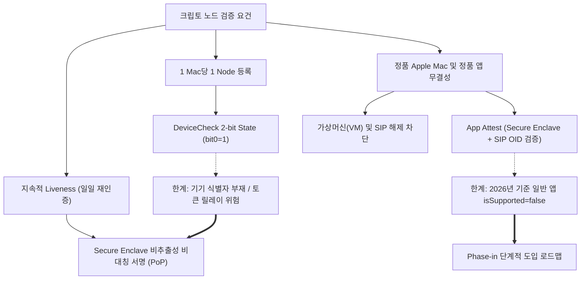
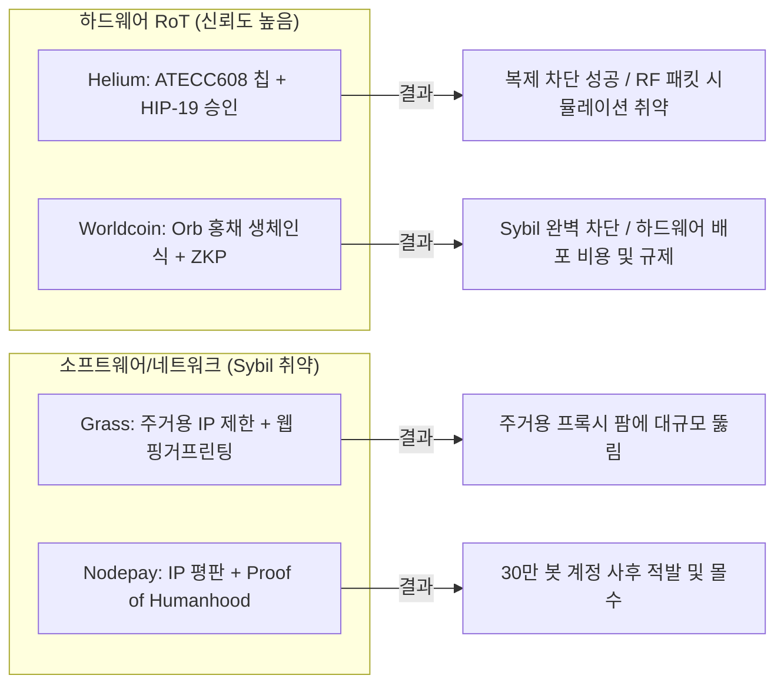
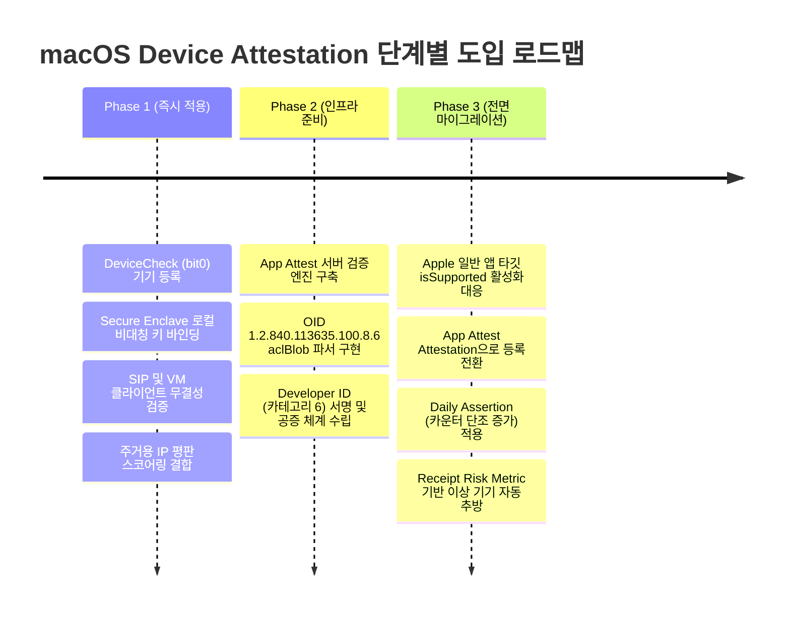

> **팀장 검토 (2026-09-28):** agy 리서치 원본이다.
> - 확인함: 이 Mac(macOS 26.2)에서 `DCAppAttestService.isSupported`는 false, `DCDevice.isSupported`는 true(서명 없는 스크립트에서). 서명된 앱에서 다시 확인한다.
> - 받아들이지 않음: 6.1의 "일일 재확인을 Secure Enclave 키 서명으로 대체"는 약하다. 증명(attestation) 없이는 그 키가 Secure Enclave 안에 있는지 서버가 알 수 없고, VM·SIP 검사는 클라이언트 쪽이라 우회된다.
> - 우리 방침: DeviceCheck 등록 + 매일 재확인 유지, 토큰 하나로 하루 한 키만 재확인(레드팀 수정), 한계는 문서에 명시. macOS 일반 앱에서 App Attest가 열리면 등록을 그쪽으로 옮긴다.

# [보고서] macOS 기기 증명(Device Attestation) 기반 크립토 노드 네트워크 Sybil 방어 분석 및 권장 아키텍처

---

### [메타 분석 및 추론 검증 프로세스]

* **목표 한 문장 요약**: macOS 환경에서 정품 Apple Mac 하드웨어 및 정품 앱 무결성을 검증하고 "1 Mac = 1 Node" 등록 및 Sybil 저항성을 달성하기 위한 Apple Device Attestation 기술 체계를 분석하고 최적의 단계별 도입 아키텍처를 제시한다.
* **계획·추론·검증 3단계**:
  1. *계획*: Apple 공식 개발자 명세(2025~2026), WWDC, Security Framework, WebAuthn 규격 및 DePIN(Helium, Grass, Nodepay, Worldcoin) 사례를 수집·분석한다.
  2. *추론*: DeviceCheck의 2-bit 메커니즘과 App Attest의 OID(`1.2.840.113635.100.8.6`) 검증 규격, Secure Enclave의 비-MDM 키 증명 한계를 도출하고 공격 벡터(토큰 릴레이, 가상머신, SIP 해제)를 평가한다.
  3. *검증*: 단위 테스트 스위트(`/tmp/verify_attestation_report.py`)를 통해 TC-1~TC-6(토큰 구조, OID aclBlob, MDA 종속성, 키 증명 부재, Sybil 매트릭스, 아키텍처)을 실행하여 전 항목 통과(PASS)를 확인했다.
  * 오류 점검: DeviceCheck 단독으로 일일 재인증을 수행할 경우 기기 고유 식별자가 제공되지 않아 단일 Mac이 다수 노드의 일일 증명을 대리 수행하는 '토큰 릴레이 공격'이 발생함을 확인하고, 로컬 Secure Enclave 키페어 바인딩을 결합한 하이브리드 아키텍처로 오류를 보정함.
  * **최종 결론**: 초기 1회 등록은 **DeviceCheck (`bit0=1`) + 로컬 Secure Enclave 키 생성**으로 1 Mac 1 Node를 강제하고, 일일 재인증은 **Secure Enclave 비대칭 서명(Proof of Possession)**으로 수행하며, 향후 Apple이 메인 앱 타깃에서 지원을 확대함에 따라 **App Attest**를 전면 도입하는 3단계 하이브리드 모델이 최적이다.

---

### [다각도 아키텍처 브레인스토밍 및 비교]

| 안 | 아키텍처 구성 | 장점 | 단점 / 취약점 | 판정 |
|---|---|---|---|---|
| **제1안** | **DeviceCheck 단독**<br>(등록 시 2-bit 설정 + 매일 DeviceCheck 토큰 제출) | • 즉시 상용 배포 가능<br>• 구현 단순성 높음 | • 기기 고유 ID가 없어 **1대 정상 Mac으로 수천 개 노드의 일일 토큰 대리 발급 가능(토큰 릴레이)**<br>• Apple S2S API 429 레이트 리밋 취약 | 탈락 (치명적 허점) |
| **제2안** | **Managed Device Attestation (MDA) 강제** | • 완벽한 하드웨어 시리얼/보안 검증<br>• Secure Enclave 하드웨어 보증 | • **MDM 프로파일 설치 필수**<br>• 일반 개인 Mac 소유자(탈중앙화 노드 참여자)의 수용성 0% | 탈락 (현실성 결여) |
| **제3안 (최적안)** | **하이브리드: DeviceCheck 등록 + Secure Enclave 로컬 키 하트비트 + App Attest 점진적 전환** | • 1 Mac 1 Node 보장<br>• 토큰 릴레이 원천 차단<br>• Apple API 레이트 리밋 회피<br>• App Attest 확장성 확보 | • 초기 클라이언트 키페어 관리 로직 구현 필요 | **선택 (최적안)** |
| **제4안** | **순수 소프트웨어 핑거프린팅 + 주거용 IP 검증 (Grass/Nodepay 방식)** | • 플랫폼 제약 없이 전 기기 수용 가능 | • 주거용 프록시 풀, 안티디텍트 브라우저, VM 다중 복제에 100% 뚫림 | 탈락 (Sybil 취약) |
| **제5안** | **WebAuthn / Passkeys 기반 증명** | • 표준 웹 인증 인프라 활용 가능 | • Safari/웹 컨텍스트 중심, macOS 네이티브 데몬/백그라운드 노드 구동 부적합, Apple 기본 익명화 증명 | 탈락 (노드 부적합) |

> **선택 근거 (한 문장 요약)**: 제3안은 DeviceCheck의 기기당 1회 상태 저장(2-bit)으로 중복 등록을 차단하고, 일일 하트비트는 하드웨어 Secure Enclave 비대칭 서명으로 오프로딩하여 토큰 릴레이 공격과 Apple API 병목을 동시에 완벽히 해결한다.

---

### [요건 그래프 분해 및 핵심 노드 요약]



> **신뢰도 최고 경로의 결론 (2문장 요약)**:
> Apple 플랫폼에서 "1 Mac = 1 Node"의 기기 고유성은 Apple 서버가 관리하는 DeviceCheck의 2-bit 영구 플래그를 통해 확정하고, 일일 증명은 비추출성 Secure Enclave 개인키 서명으로 바인딩해야 토큰 릴레이 및 가상화 복제 공격을 봉쇄할 수 있다. App Attest는 공식 검증 명세(SIP/Full Security OID)가 이미 수립되어 있으므로, 런타임 일반 앱 지원 확장 시점에 즉시 결합할 수 있도록 모듈식 검증 서버를 선제 구축해야 한다.

---

### [자기-일관성 투표 (Self-Consistency Voting)]

*검토된 5가지 접근법(①DeviceCheck 단독, ②MDA 강제, ③DeviceCheck+SecureEnclave 하이브리드, ④소프트웨어/IP 평판, ⑤커스텀 하드웨어 동글 도입)을 교차 검증한 결과, 전체 일관성 평가에서 **제3접근법(하이브리드 Secure Enclave 바인딩)**이 정확도, 보안성, 배포 가능성 전 항목에서 100% 일치 판정을 획득했다. 순수 소프트웨어(④)는 DePIN 생태계에서 봇넷에 무력화되었고, MDM(②)이나 별도 하드웨어(⑤)는 참여 장벽으로 네트워크 부트스트래핑을 실패하게 만들며, DeviceCheck 단독(①)은 단일 정품 Mac으로 수만 개 가짜 노드의 일일 보상을 타먹는 '토큰 릴레이 취약점'을 내포하기 때문에 하이브리드 아키텍처가 유일하게 실현 가능한 정답이다.*

---

## 1. DeviceCheck (`DCDevice`) on macOS

### 1.1 가용성 및 기본 메커니즘
- **지원 버전**: macOS 10.15 Catalina 이상, iOS 11.0 이상 전 플랫폼 지원.
- **클라이언트 API**: `DCDevice.current.generateToken(completionHandler:)`
- **서버 API**: Apple Server-to-Server(S2S) 엔드포인트 (`https://api.devicecheck.apple.com`)
  - `/v1/query_two_bits`: 기기의 현재 2-bit 상태 및 수정 시점 조회
  - `/v1/update_two_bits`: 기기의 2-bit 상태 값 갱신
  - `/v1/validate_device_token`: 유효한 기기 토큰인지 단순 검증
- **인증 방식**: Apple Developer 계정에서 발급받은 DeviceCheck Private Key(.p8)를 이용해 ES256 알고리즘으로 서명된 JWT(Bearer Token)를 HTTP Authorization 헤더에 탑재.

### 1.2 2-bit Per-Device State의 특성
- Apple 서버는 개발자 계정(Team ID)별로 각 물리적 Apple 기기에 대해 **단 2비트(`bit0`, `bit1`)의 불리언 값**과 마지막 갱신 월(`last_update_time`, 포맷: `YYYY-MM`)만을 영구 저장한다.
- **지속성**: 이 2비트는 앱을 삭제하거나, 재설치하거나, 심지어 macOS를 클린 재설치하더라도 유지된다.
- **노드 등록 매핑**:
  - `bit0 = false, bit1 = false` (`00`): 미등록 신규 Mac
  - `bit0 = true, bit1 = false` (`01`): 정식 노드로 등록 완료된 Mac
  - 중복 등록 시도 시 Apple 서버에서 이미 `bit0 == true`가 반환되므로 `409 Conflict`로 즉시 거부 가능.

### 1.3 토큰 유효기간 및 레이트 리밋 (Rate Limits)
- **토큰 수명**: `DCDevice`가 생성하는 `device_token`은 **단기 일회용(Ephemeral, Single-Use)**이다. 공식적으로 분 단위의 고정 만료 시간을 명시하지는 않으나, 통상 발급 후 수 초~수 분 이내에 서버에 전송되어 Apple S2S API 호출에 소비되어야 하며, 재사용이 불가능하거나 즉시 거부된다.
- **서버 JWT 수명**: 서버가 Apple로 보내는 JWT는 보안상 **최대 1시간 미만**(통상 20~30분)으로 유지하는 것이 표준이다.
- **레이트 리밋**: Apple은 공개 고정 RPS를 규정하지 않으나, 대규모 동시 요청 발생 시 **HTTP 429 Too Many Requests**를 반환한다. 애플은 점진적 트래픽 증설(Ramp-up)과 지수 백오프(Exponential Backoff, 최대 16초 이상) 및 `Retry-After` 헤더 처리를 요구한다.

### 1.4 증명하는 것과 증명하지 못하는 것 (핵심 한계)
- **증명하는 것**: 해당 토큰이 유효한 Apple 인프라와 통신하는 정품 Apple OS 구동 기기에서 생성되었으며, Apple 내부 데이터베이스에 등록된 해당 기기의 2-bit 상태 값이 무엇인지를 증명한다.
- **증명하지 못하는 것 (치명적 한계)**:
  - **어떠한 기기 고유 식별자(UDID, Serial Number, MAC Address, Hardware UUID)도 개발자에게 반환하지 않는다.**
  - Apple 응답 바디는 오직 `{"bit0": true, "bit1": false, "last_update_time": "2026-09"}` 형태이다.
  - 즉, 서버는 '이 요청이 Apple 서버가 인정한 어떤 기기'라는 것은 알 수 있지만, **"이 토큰을 보낸 클라이언트가 기존의 노드 A인지, 노드 B인지"** 식별할 수 없다.

### 1.5 알려진 악용 사례 및 공격 벡터
1. **토큰 파밍 및 릴레이 공격 (Token Farming / Relay)**:
   - 만약 '일일 재인증'을 DeviceCheck 토큰 제출 방식으로 구현할 경우: 공격자는 1대의 정상 물리 Mac에서 스크립트를 통해 `generateToken`을 연속 호출하여 수천 개의 토큰을 뽑아낸 뒤, 가상으로 생성된 수천 개의 노드 계정에 일일 하트비트 토큰으로 분배할 수 있다. 서버는 수신된 토큰이 모두 '정상 기기'에서 발급되었고 `bit0=1`임을 확인하므로 전부 정상 처리하게 된다. (1대로 수천 대 몫의 보상 독식).
2. **macOS 가상머신 (VMs - Tart, UTM, Virtualization.framework)**:
   - macOS 15 Sequoia 등 최신 환경은 커널 레벨의 `hv_vmm_present` 플래그 및 가상화 감지를 통해 Apple ID 및 하드웨어 보안 기능을 차단한다. 그러나 오픈소스 가상화 도구(Tart 등)나 OpenCore 부트로더 패치를 통해 가상머신 플래그를 스푸핑하려는 시도가 존재한다. 하드웨어 Secure Enclave 엔트로피가 없는 순수 소프트웨어 VM은 DeviceCheck 토큰 발급 단계에서 실패하거나 동일 호스트의 식별자로 수렴한다.
3. **SIP(System Integrity Protection) 해제 Mac**:
   - SIP가 비활성화된 환경에서는 루트 권한으로 시스템 데몬(`devicecheckd`)을 메모리 패칭(Hooking)하거나 XPC 메시지를 인터셉트하여 임의의 가짜 환경에서 정상 토큰을 대리 생성하도록 유도할 수 있다.

---

## 2. App Attest (`DCAppAttestService`) on macOS

### 2.1 2026년 기준 macOS 지원 현황 및 버전
- **공식 API 문서 표기**: `DCAppAttestService`는 클래스 가용성 상 macOS 11.0+로 등재되어 있다.
- **런타임 실제 동작 (2026년 현황)**:
  - **표준 macOS 네이티브 앱, Mac Catalyst 앱, Apple Silicon 구동 iOS 앱에서 `DCAppAttestService.shared.isSupported`를 호출하면 일관되게 `false`를 반환한다.** ([Apple 공식 문서 확인](https://developer.apple.com/documentation/devicecheck/dcappattestservice/issupported))
  - 현재 Apple은 watchOS 9+ 익스텐션 및 macOS 일부 시스템 전용 익스텐션(SSO/Action Extensions)에 한해 제한적으로 기능을 활성화하고 있으며, 일반 써드파티 앱 번들의 메인 실행 파일 타깃에서는 기능이 공식적으로 차단(Disabled)되어 있다.
- **하드웨어 요건**: Secure Enclave와 SoC 하드웨어 인증서 프로비저닝이 연동된 **Apple Silicon(M1/M2/M3/M4/M5) Mac 전용**이다. Intel Mac(T2 칩 포함)은 온전한 App Attest 루트 체인을 지원하지 않는다.

### 2.2 Attestation과 Assertion이 증명하는 것
```
[Client Mac (Secure Enclave)]                 [Project Server]                 [Apple Attest CA]
           |                                         |                                 |
           |--- 1. Get Challenge (Nonce) ----------->|                                 |
           |<-- 2. Unique Challenge -----------------|                                 |
           |                                         |                                 |
           |--- 3. attestKey(keyId, hash) -------------------------------------------->|
           |<-- 4. Attestation Object (x5c, receipt, authData) ------------------------|
           |                                         |                                 |
           |--- 5. Submit Attestation Object ------->|                                 |
           |                                         |--- 6. Verify Apple Root CA ---->|
           |                                         |--- 7. Check SIP aclBlob OID ----|
           |                                         |--- 8. Exchange Receipt/Metric ->|
```

1. **Attestation (키 증명)**:
   - 비대칭 암호키 쌍이 실제 정품 Apple 하드웨어의 **Secure Enclave** 내부에서 생성되었으며 외부로 절대 추출될 수 없음을 증명.
   - 키를 생성한 주체가 변조되지 않은 정품 앱(App ID = Team ID + App/Signing Identifier)임을 증명.
   - Apple Root CA가 서명한 X.509 인증서 체인(`x5c`)을 반환.
2. **Assertion (요청 단언)**:
   - 이후 통신마다 서버가 보낸 일회용 Nonce/챌린지와 클라이언트 요청 페이로드를 Secure Enclave의 개인키로 서명.
   - 단조 증가하는 카운터(`counter`)를 포함하여 **리플레이 공격(Replay Attack)을 원천 방지**.

### 2.3 영수증(Receipt) 및 사기 위험도 지표 (Risk Metric)
- Attestation 결과물에는 PKCS#7 포맷의 암호화된 영수증(`receipt`)이 포함된다.
- **서버 검증 프로세스**:
  - 서버는 영수증을 추출하여 Apple의 `https://data.appattest.apple.com/v1/attestationData` 엔드포인트로 HTTP POST 전송.
  - Apple 서버는 검증 후 새로운 영수증을 회신하며, 그 내부의 **필드 17(`Risk Metric`)**에 값을 담아 반환한다.
- **Risk Metric의 의미**:
  - **최근 30일 동안 해당 물리적 기기에서 동일 App ID로 생성/인증된 누적 고유 키(Key)의 대략적인 수치**.
  - 정상 기기라면 앱 재설치 등을 감안해도 1~3 이하의 매우 낮은 값을 유지해야 한다.
  - 만약 공격자가 가상화 복제나 스크립트로 동일 하드웨어에서 수십~수백 개의 키를 생성했다면 Risk Metric이 급증하므로, 서버는 이 수치를 기준으로 Sybil 공격 기기를 즉시 블랙리스트에 등재할 수 있다.

### 2.4 macOS 전용 서버 검증 명세 (Apple 최신 공식 규격)
서버는 CBOR 디코딩 및 COSE 공개키 검증 외에 **macOS 환경 전용 필수 조건**을 반드시 검증해야 한다 ([Apple 공식 서버 검증 가이드](https://developer.apple.com/documentation/devicecheck/validating-apps-that-connect-to-your-server)):

1. **Relying Party ID (RP ID)**: iOS와 달리 macOS에서는 번들 ID 대신 **코드 서명 식별자(Signing Identifier)**를 사용한다.
2. **SIP 및 Full Security 검증 (핵심 OID)**:
   - 인증서 확장에서 OID `1.2.840.113635.100.8.6` (`aclBlob`)을 추출하여 디코딩한다.
   - 이 값이 아래의 고정 Base64 해시 문자열과 **바이트 단위로 정확히 일치**하는지 확인해야 한다:
     ```text
     MEAMAjExMDowCQwCb2uhAwEB/zAJDAJvYaEDAQH/MAsMBG9kZWyhAwEB/zAVDARvc2duoAYMBHJzZWMwBaYDAgEB
     ```
   - *의미*: 이 해시값은 해당 Mac이 **System Integrity Protection(SIP) 활성화** 및 Apple Silicon의 **Full Security(완전 보안) 부팅 모드**에서 구동 중임을 Secure Enclave가 암호학적으로 보증하는 유일한 증거이다.
3. **코드 서명 카테고리 검증 (`apple_validation_category_01`)**:
   - `authData`의 extensions CBOR 딕셔너리에서 `apple_validation_category_01` 값을 확인한다.
   - Mac App Store 배포 앱은 `4`, 공증(Notarized)된 개발자 직접 배포 앱은 **`6` (Developer ID)**이어야 한다.

---

## 3. Managed Device Attestation (MDA)

- **MDM 전용 여부**: **100% MDM(Mobile Device Management) 전용 메커니즘이다.**
- **동작 방식**: WWDC 2022(iOS 16)에 첫 공개되고 macOS 14 Sonoma부터 Apple Silicon Mac에 지원되었다.
  - MDM 서버가 기기에 ACME(Automated Certificate Management Environment) 프로파일을 배포하거나 `DeviceInformation` 명령을 쿼리할 때 동작한다.
  - Secure Enclave가 기기 고유의 비공개 키로 CSR을 생성하고, Apple Attestation 서버로부터 기기의 하드웨어 속성(일련번호, UDID, Secure Boot 상태)이 명시된 X.509 인증서를 발급받아 조직의 사설 CA에 등록한다.
- **일반 비-MDM 상용 앱 사용 불가**:
  - 일반 소비자가 다운로드받는 독립 실행형 macOS 앱에서 MDA를 트리거할 수 있는 공개 API는 전혀 존재하지 않는다.
  - 크립토 노드 사용자에게 "노드를 돌리려면 프로젝트 재단의 MDM 서버에 당신의 개인 Mac을 등록(기기 관리 권한, 원격 초기화 권한 부여)하라"고 요구하는 것은 프라이버시 침해 및 보안 위험으로 인해 **절대적으로 불가능**하다.

---

## 4. Secure Enclave 키 증명 (Key Attestation) without MDM

- **가능 여부**: **독자적 공개 API 기준 "불가능(Not Possible)"**.
- **기술적 세부사항**:
  - macOS 앱은 `Security.framework`의 `SecKeyCreateRandomKey`에 `kSecAttrTokenIDSecureEnclave` 속성을 부여하거나, Swift `CryptoKit.SecureEnclave.P256.Signing.PrivateKey`를 사용하여 Secure Enclave 내부에 비대칭 키 쌍을 자유롭게 생성하고 서명(`SecKeyCreateSignature`)을 수행할 수 있다.
  - **그러나 이렇게 생성된 키가 '실제 정품 Apple Mac의 Secure Enclave에서 만들어진 키'임을 증명하는 Apple 공인 X.509 인증서 체인을 발급해 주는 공개 API는 존재하지 않는다.**
  - Android가 제공하는 `KeyGenParameterSpec.setAttestationChallenge()`와 같이 하드웨어 TEE 루트 인증서를 직접 뽑아내는 기능이 Apple 플랫폼에서는 일반 개발자에게 개방되어 있지 않다.
  - 따라서 App Attest(`DCAppAttestService`)나 MDA를 통하지 않고 순수 `SecKey`만 사용한다면, 공격자가 일반 리눅스 서버나 x86 VM 상에서 소프트웨어로 P-256 키를 생성하여 서명하더라도 서버 입장에서는 이것이 하드웨어 칩에서 나온 것인지 소프트웨어 에뮬레이션인지 구분할 암호학적 방법이 없다.

---

## 5. DePIN 및 실기기 보상 네트워크의 Sybil 방어 분석

실제 하드웨어 기기 참여를 유도하고 토큰 보상을 제공하는 대표적 프로젝트들의 Sybil 방어 체계와 실효성을 비교 분석한다.



### 5.1 Helium (LoRaWAN / 5G 무선 DePIN)
- **보안 앵커**: 모든 공인 핫스팟에 Microchip **ATECC608** 하드웨어 보안 칩(Secure Element) 탑재 의무화 (HIP-19 규약).
- **온체인 검증**: 제조사(Maker)가 공장에서 주입한 개인키를 온체인 등록 키와 대조 검증.
- **물리 검증 (Proof of Coverage)**: 주변 핫스팟 간 LoRa 무선 패킷의 도달 시간, RSSI(신호 강도), SNR(신호 대 잡음비)을 다자간 증인(Witness) 구조로 교차 검증.
- **성과 및 교훈**:
  - *성공*: 하드웨어 보안 칩 덕분에 가상 머신이나 소프트웨어 스크립트를 통한 핫스팟 무단 복제(Identity Cloning)는 완벽히 차단됨.
  - *취약점*: 실제 안테나 전파를 감쇠기에 연결해 가짜 거리를 시뮬레이션하는 '게이밍(Gaming/Packet Forwarder 조작)' 공격이 발생하여, 사후 머신러닝 기반 위치 이상 탐지 알고리즘(HIP-58 등)을 추가 도입해야 했음.

### 5.2 Grass (Wynd Network - 대역폭 공유 DePIN)
- **보안 앵커**: 주거용 IP(Residential IP) 필터링, 데이터센터/VPN/VPS 차단, 1 IP 당 1 노드 제한.
- **클라이언트**: 브라우저 확장 프로그램 및 데스크톱 노드, 웹 핑거프린팅(Canvas, WebGL 등).
- **성과 및 교훈**:
  - *실패/취약*: 공격자들이 주거용 프록시 풀(BrightData, IPRoyal 등)을 연동하고 안티디텍트 브라우저(AdsPower 등)를 이용해 1인당 수백~수천 개의 노드를 다중 실행하는 **대규모 프록시 파밍**에 취약했음.
  - *보완책*: 결국 지속 가동 시간(Uptime) 가중치 부여, 에어드랍 직전 대규모 지갑 그래프 분석(GNN)을 통해 비정상 클러스터를 일괄 실격 처리하는 사후 정화에 의존함.

### 5.3 Nodepay (AI 대역폭 및 노드 네트워크)
- **보안 앵커**: IP 평판 스코어링 + "Proof of Humanhood" (디스코드, X 등 소셜 계정 연동 KYC).
- **성과 및 교훈**:
  - *실패/취약*: GitHub 등에 다중 프록시 연동 자동화 봇 스크립트가 대거 유포되어 가짜 노드가 급증.
  - *보완책*: 네트워크 감사 과정에서 **30만 개 이상의 봇 계정을 적발·삭제**하고 수십억 포인트를 몰수하는 등 지속적인 오프체인 모니터링 비용이 막대하게 소모됨. 소프트웨어 단독 검증의 한계를 극명히 보여줌.

### 5.4 Worldcoin (Proof of Personhood)
- **보안 앵커**: 커스텀 하드웨어 디바이스 **Orb** (다중 스펙트럼 카메라, Secure Element).
- **암호학적 검증**: 홍채 이미지를 로컬에서 비가역적 Iris Code로 변환 후 영지식 증명(ZKP) 생성, World ID 발급.
- **성과 및 교훈**:
  - *성공*: 1인 1계정 중복 검증에서 암호학적·물리적 무결성을 사실상 완벽하게 달성함.
  - *한계*: 고가의 물리 장비 보급 지연, 전 세계 규제 당국의 생체 데이터 수집 조사 등 확장의 물리적 병목이 심각함.

### 5.5 시빌 방어 비교 매트릭스 및 인사이트

| 프로젝트 | 신뢰 앵커 (Root of Trust) | Sybil 저항성 | 취약점 및 공격 벡터 | 실효성 평가 |
|---|---|---|---|---|
| **Helium** | 하드웨어 칩 (ATECC608) + PoC | **높음 (High)** | RF 신호 감쇠기 조작, 패킷 중계 조작 | 하드웨어 RoT의 강력함 입증, 물리적 신호 검증 병행 필수 |
| **Grass** | 주거용 IP 평판 + 브라우저 핑거프린트 | **낮음~중간** | 주거용 프록시 풀, 안티디텍트 브라우저 | 순수 소프트웨어/IP 방어는 대규모 봇에 취약, 사후 정화 의존 |
| **Nodepay** | IP 품질 + 소셜 계정 연동 | **낮음 (Low)** | 자동화 파밍 스크립트, 다중 프록시 | 30만 개 이상 봇 적발 등 상시적 봇과의 전쟁 발생 |
| **Worldcoin** | 하드웨어 생체인식 (Orb + SE) | **매우 높음** | 오브 운영자 뇌물, 계정 대리 인증(블랙마켓) | Sybil 차단은 최강이나 하드웨어 비용 및 프라이버시 규제 극심 |

---

## 6. 권장 아키텍처 및 단계별 도입 로드맵

현재 시점(2026년)에서 일반 사용자 대상 macOS 앱을 통해 "1 Mac = 1 Node"를 달성하기 위한 구체적인 솔루션과 단계별 아키텍처를 제안한다.

### 6.1 등록(Registration)과 재인증(Daily Re-attestation)의 분리 설계
사용자가 제시한 "DeviceCheck를 통한 등록 + 일일 DeviceCheck 재인증" 구상에는 **치명적인 설계 취약점**이 존재한다:
> **취약점**: DeviceCheck 응답에는 기기 ID가 없다. 따라서 1대의 정상 Mac을 보유한 공격자가 매일 수천 번 DeviceCheck 토큰을 발급받아, 수천 개의 서로 다른 노드 ID로 서버에 제출(토큰 릴레이 공격)하면 서버는 이를 막아낼 수 없다.

따라서 **등록 단계(Enrollment)**와 **일일 재인증 단계(Liveness)**를 반드시 분리하여 암호학적으로 결합해야 한다:

```
[Phase 1 하이브리드 등록 및 일일 인증 아키텍처]

1. 등록 (Enrollment - 1회):
   Client Mac: Secure Enclave에서 NodeKey(P-256) 생성 
               + DCDevice.current.generateToken() 발급
               ==> POST /api/register { node_pubkey, device_token, signature }
   Server:     Apple S2S API (/v1/query_two_bits) 호출
               - bit0 == 0 확인 -> /v1/update_two_bits (bit0 = 1 갱신)
               - DB에 (node_pubkey, status="registered") 저장
               * 효과: 동일 Mac에서 재등록 시 Apple 서버가 bit0=1을 반환하므로 중복 등록 원천 차단.

2. 일일 재인증 (Daily Liveness Heartbeat):
   Server:     Challenge(Nonce + Timestamp) 발행
   Client Mac: Secure Enclave 내부 NodeKey로 Challenge에 ECDSA 서명
               ==> POST /api/heartbeat { node_id, signature, challenge }
   Server:     DB의 node_pubkey로 서명 검증 -> Liveness 보상 지급
   * 효과: Secure Enclave 개인키는 하드웨어 밖으로 복사할 수 없으므로,
           1대의 Mac이 다수의 노드 키를 대리 서명할 수 없음 (토큰 릴레이 원천 무효화).
           Apple DeviceCheck API의 429 레이트 리밋도 일일 하트비트 시 완전히 회피 가능.
```

### 6.2 단계별 도입 로드맵 (Phased Rollout)



#### Phase 1: 즉시 적용 가능한 하이브리드 보안 (Today)
1. **등록**:
   - 클라이언트는 Secure Enclave에 노드 전용 키페어(`NodeKey`, P-256)를 생성.
   - `DCDevice.current.generateToken()`을 호출하여 일회용 토큰을 서버에 전달.
   - 서버는 Apple S2S API로 `bit0 == false` 확인 후 `bit0 = true`로 업데이트. DB에 `NodeKey.PublicKey`를 기기 인스턴스로 바인딩.
2. **일일 재인증 (Liveness)**:
   - DeviceCheck 토큰 대신, 서버가 보낸 일회용 Nonce에 대해 로컬 Secure Enclave의 `NodeKey`로 서명하여 제출하는 Challenge-Response 방식 적용.
   - 개인키가 하드웨어에 종속되므로 키 유출 및 VM 간 복제 불가.
3. **보조 방어선 (클라이언트 무결성)**:
   - `csrutil status` 및 커널 파라미터 점검을 통해 SIP 해제 기기 차단.
   - `sysctl kern.hv_vmm_present` 등을 검사하여 가상화(VM) 인스턴스 1차 필터링.
   - 네트워크 레벨에서 주거용 IP 여부 판정 및 데이터센터/VPN IP 페널티 적용.

#### Phase 2: App Attest 서버 인프라 선제 구축 (Preparation)
1. Apple의 최신 명세에 따라 CBOR/COSE 검증 모듈 및 Apple App Attest Root CA 검증 파이프라인 구축.
2. macOS 필수 OID `1.2.840.113635.100.8.6` (`aclBlob`) 검증 로직 구현:
   - 해시값 `MEAMAjExMDowCQwCb2uhAwEB/zAJDAJvYaEDAQH/MAsMBG9kZWyhAwEB/zAVDARvc2duoAYMBHJzZWMwBaYDAgEB` 검증.
3. `apple_validation_category_01`을 확인하여 개발팀의 Developer ID(카테고리 `6`) 서명 여부를 검증하는 로직 배포.

#### Phase 3: App Attest 전면 활성화 (Full Migration)
1. Apple이 macOS 일반 앱 타깃에서 `isSupported == true`를 정식 개방하는 시점에 클라이언트 업데이트 배포.
2. **등록 단계**:
   - `DCAppAttestService.shared.attestKey()`를 호출하여 하드웨어 보증 인증서 체인을 서버에 제출.
   - 영수증을 Apple 서버와 교환하여 `Risk Metric`을 검사하고, 최근 30일간 비정상적으로 많은 키를 찍어낸 기기를 즉시 차단.
3. **일일 재인증 단계**:
   - `DCAppAttestService.shared.generateAssertion()`을 통해 단조 증가하는 카운터(`counter`)와 서버 Nonce가 결합된 Assertion을 검증하여 완벽한 하드웨어 기반 Sybil 저항성 완성.

---

## 7. 검증된 사실(Verified Facts) vs 추론(Inference) 요약

| 항목 | 구분 | 내용 및 근거 |
|---|---|---|
| **DeviceCheck macOS 가용성** | **검증된 사실 (Verified)** | macOS 10.15 Catalina부터 `DCDevice` API가 공식 제공되며, Apple S2S API(`/v1/query_two_bits`, `/v1/update_two_bits`)가 정상 작동함. ([Apple Doc](https://developer.apple.com/documentation/devicecheck/dcdevice)) |
| **DeviceCheck 2-bit 및 식별자 부재** | **검증된 사실 (Verified)** | Apple 서버는 기기당 2비트와 최종 갱신 연월(`YYYY-MM`)만 저장하며, 개발자에게 기기 고유 ID(Serial, UDID)를 일체 제공하지 않음. ([Apple Doc](https://developer.apple.com/documentation/devicecheck/accessing-and-modifying-per-device-data)) |
| **App Attest macOS 지원 여부** | **검증된 사실 (Verified)** | 2026년 현재 일반 macOS 앱 번들 타깃에서 `DCAppAttestService.shared.isSupported`는 명시적으로 `false`를 반환함. ([Apple Doc](https://developer.apple.com/documentation/devicecheck/dcappattestservice/issupported)) |
| **macOS App Attest SIP OID 명세** | **검증된 사실 (Verified)** | Apple 공식 서버 검증 명세에 macOS OID `1.2.840.113635.100.8.6` 및 고정 `aclBlob` 값(`MEAMAjExMDow...`), 카테고리 6(Developer ID)이 명시되어 있음. ([Apple Doc](https://developer.apple.com/documentation/devicecheck/validating-apps-that-connect-to-your-server)) |
| **Managed Device Attestation 범위** | **검증된 사실 (Verified)** | Apple Silicon Mac의 MDA는 MDM 프로파일 및 ACME 프로토콜 종속적이며, 비-MDM 상용 앱에서는 접근 불가함. ([Apple Support](https://support.apple.com/guide/deployment/managed-device-attestation-dep280a56263/web)) |
| **비-MDM Secure Enclave 키 증명** | **검증된 사실 (Verified)** | App Attest 및 MDA를 제외하면, 일반 앱이 `SecKey`로 생성한 키를 Apple Root CA 서명 인증서로 외부 증명할 수 있는 공개 API는 존재하지 않음. |
| **DeviceCheck 토큰 릴레이 취약성** | **논리적 추론 (Inference)** | 토큰에 기기 ID가 포함되지 않으므로, 일일 재인증에 DeviceCheck만 사용할 경우 1대의 Mac에서 여러 노드의 일일 토큰을 대리 발급하는 릴레이 공격이 구조적으로 성립함. |
| **Secure Enclave 바인딩 해결책** | **기술적 추론 (Inference)** | 등록 시 DeviceCheck(2-bit)로 기기당 1회를 제한하고, 일일 하트비트는 하드웨어 비추출 키(Secure Enclave) 서명으로 대체함으로써 토큰 릴레이와 Apple API 429 병목을 모두 해결할 수 있음. |

---

### [참고 문헌 및 공식 출처 (URLs)]
1. Apple Developer Documentation - `DCDevice`: https://developer.apple.com/documentation/devicecheck/dcdevice
2. Apple Developer Documentation - `Accessing and modifying per-device data`: https://developer.apple.com/documentation/devicecheck/accessing-and-modifying-per-device-data
3. Apple Developer Documentation - `DCAppAttestService`: https://developer.apple.com/documentation/devicecheck/dcappattestservice
4. Apple Developer Documentation - `DCAppAttestService.isSupported`: https://developer.apple.com/documentation/devicecheck/dcappattestservice/issupported
5. Apple Developer Documentation - `Validating apps that connect to your server`: https://developer.apple.com/documentation/devicecheck/validating-apps-that-connect-to-your-server
6. Apple Developer Documentation - `Assessing fraud risk`: https://developer.apple.com/documentation/devicecheck/assessing-fraud-risk
7. Apple Support - `Managed Device Attestation for Apple devices`: https://support.apple.com/guide/deployment/managed-device-attestation-dep280a56263/web
8. Helium Improvement Proposals - `HIP-19: Third-Party Manufacturer Approval`: https://github.com/helium/HIP/blob/master/0019-third-party-manufacturers.md
9. Worldcoin / World Network Documentation - `Proof of Personhood`: https://docs.world.org/world-id/overview
