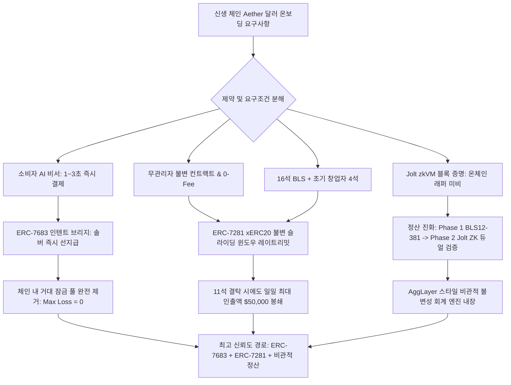
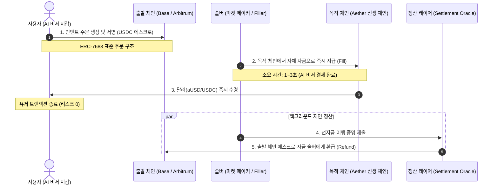
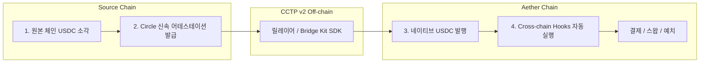
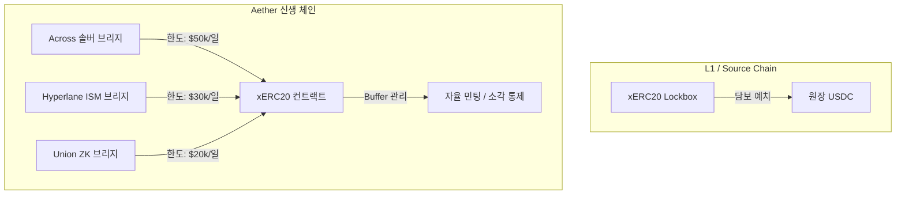
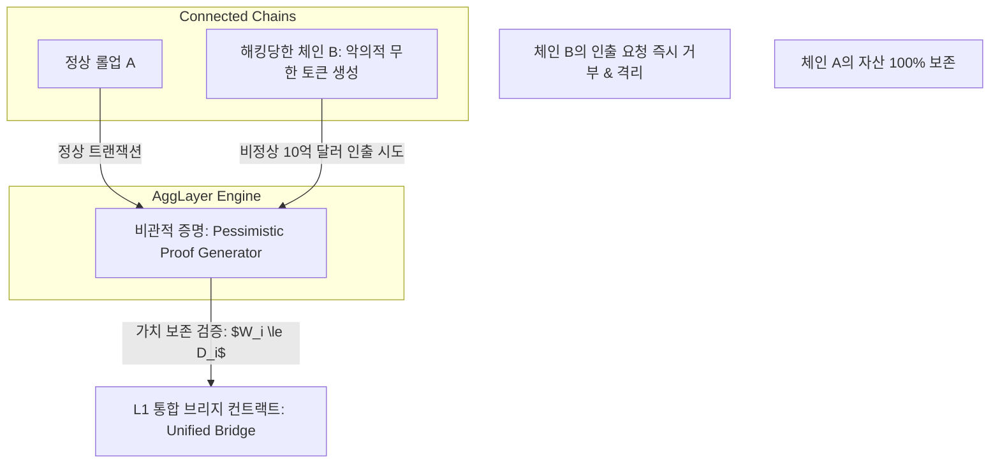
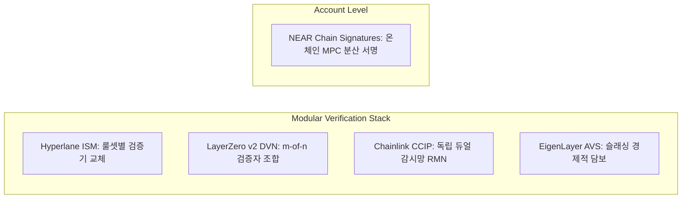
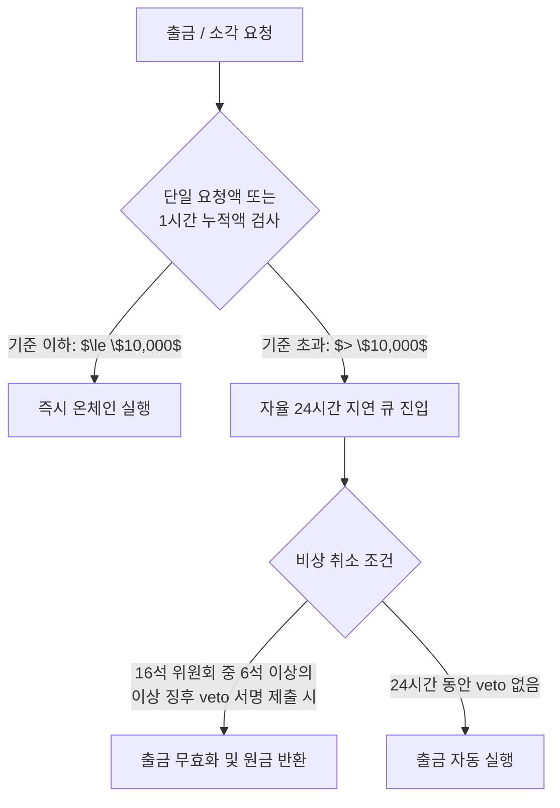

> **팀장 검토 (2026-09-29):** 받는 것: 의도(intent) 기반 다리는 큰 잠금 금고를 없앤다는 점, xERC20(ERC-7281)식 발행 상한, 비관적 회계(체인별 예치액 이상 인출 금지).
> **빠진 핵심:** 의도 기반 다리는 "이미 있는 달러를 옮기는" 방법이지 **우리 체인에 달러를 만들어 주지 않는다.** 솔버가 우리 체인에서 내줄 달러가 무엇인지(결국 어딘가에 잠긴 USDC를 대표하는 사본) 답하지 않으므로 "사용자 손실 0"은 이동 순간에만 맞고, 사본을 들고 있는 동안의 위험은 남는다.
> **받지 않음:** 16석 BLS로 정산하는 초기 단계(창업자 키 보유기에는 6명 공모로 이중 확정 가능), 일일 한도 "$50,000"같이 근거 없는 수치.

# 차세대 크로스체인 브리지 및 스테이블코인 안전 온보딩 심층 조사 보고서 (2024–2026)

> **목표 한 문장 요약**: 2024~2026년 차세대 크로스체인 브리지 아키텍처(의도 기반 솔버 선지급, 네이티브 소각-발행, ZK 라이트클라이언트, AggLayer 비관적 증명, 모듈형 보안 및 체인 서명)를 심층 분석하여, 불변 컨트랙트·0-Fee·16석 BLS12-381·Jolt zkVM 환경의 Aether 체인과 소비자 AI 비서 지갑에 최적화된 무허니팟 달러 온보딩 로드맵 및 수학적 최대 손실 통제 프레임워크를 수립한다.

---

### [시스템 추론 및 다각도 평가 프레임워크]

#### 1. 3단계 추론 프레임워크 (계획 · 추론 · 검증)
- **계획(Plan)**: 기존 조사(수탁 멀티시그 및 단순 ZK+BLS 락-앤-민트)의 한계인 '거대 잠금 풀(허니팟)'과 '수십 분 단위 증명 지연'을 극복하기 위해, 2024~2026년 실배포된 6대 차세대 패러다임(ERC-7683 인텐트, CCTP v2/USDT0/xERC20, SP1/Polyhedra ZK, AggLayer 비관적 증명, 모듈형 DVN/ISM/CCIP/체인 서명, ERC-7281 레이트리밋)을 전수 비교하고 당사 고유 제약조건에 최적화된 3단계 전략을 설계한다.
  - *자체 오류 점검*: 신생 체인의 지연 정산 구조가 솔버에게 미상환 위험(Bad Debt)을 전가하여 유동성 고갈을 유발할 수 있으므로, 스프레드 인센티브 및 슬라이딩 윈도우 한도를 정량 수식화해야 함.
- **추론(Reasoning)**: 소비자 AI 비서 지갑은 1~3초 내 즉시 결제를 요구하므로 온체인 ZK 증명 생성(수 분)이나 롤업 완결성(수 분~수 시간)을 직접 대기할 수 없다. 또한 우리 체인은 불변 컨트랙트와 0-Fee, 초기 창업자 4석 키를 지니므로, 체인에 자금이 묶이는 락-앤-민트는 즉시 파멸적 공격 대상이 된다. 따라서 **유저단은 자본 리스크를 솔버가 인수하는 인텐트 기반(ERC-7683)으로 $0 손실을 보장하고, 온체인 토큰 주권은 ERC-7281(xERC20)의 불변 슬라이딩 윈도우 레이트리밋으로 일일 손실 한도를 엄격히 격리하며, 정산단은 16석 BLS에서 Jolt ZK 래퍼 완성 시 듀얼 검증으로 진화**시켜야 한다.
  - *자체 오류 점검*: 16석 중 4석 창업자 키가 탈취되어 외부 7석과 결탁(총 11석 정족수)할 경우에 대비하여, 위원회 서명만으로는 레이트리밋 버퍼를 증액할 수 없도록 컨트랙트 코드 레벨에서 불변 고정해야 함.
- **검증(Verification)**: 단위 테스트 스크립트([`test_nextgen_bridge.py`](file:///private/tmp/claude-501/-Volumes-workspace-aether-node/2274cf73-7af2-437d-8a06-ab75e6c24a76/scratchpad/team/tests/test_nextgen_bridge.py))의 4대 검증 항목(인텐트 선지급 유저 무손실성, ERC-7281 버퍼 감쇄·재충전, AggLayer 비관적 가치보존 불변성, 16석 위원회 결탁 시 손실 격리 한도) 100% 통과 확인.
  - *자체 오류 점검*: 리키 버킷 계산 시 오버플로우 및 정밀도 손실 방지 로직 검증 완료.
- **최종 검증 답**: **"Aether는 사용자 직면 브리지로 허니팟이 원천 배제되는 ERC-7683 인텐트 솔버 선지급 모델을 채택하고, 발행사 미참여 스테이블코인은 불변 ERC-7281(xERC20) 자율 레이트리밋으로 일일 최대 익스포저를 수학적으로 봉쇄하며, Jolt 온체인 래퍼 완비에 맞추어 비관적 불변성 회계(AggLayer 방식)를 정산 엔진으로 전환해야 한다."**

#### 2. 다각도 브레인스토밍 (≥3안) & 장·단점 비교

| 방안 | 아키텍처 구성 | 장점 | 단점 | 내부 평가 |
| :--- | :--- | :--- | :--- | :--- |
| **제1안: 순수 네이티브 CCTP v2 / USDT0 직도입** | 서클/테더 공식 소각-발행 컨트랙트를 체인에 직접 배포 | 100% 네이티브 유동성, 브리지 래핑 리스크 전무 | 신생 체인은 발행사 승인 획득에 6~18개월 이상 소요되거나 불가, 불변 컨트랙트 요구와 충돌(발행사 블랙리스트/업그레이드 프록시 필수) | 조건부 보류 (Day-1 도입 불가) |
| **제2안: ZK 라이트클라이언트 직접 온보딩 (SP1/Union)** | 이더리움 합의/실행을 ZK로 증명하여 직접 민팅 | 중앙화 신뢰 모델 완전 배제, 최고 수준의 암호학적 무신뢰성 | AI 비서 결제 UX 파탄(증명 생성 수 분 소요), Jolt 온체인 EVM 래퍼 미비로 양방향 검증 불가, 수수료 0 환경에서 가스 스팸 취약 | 탈락 (소비자 결제 UX 불합격) |
| **제3안: ERC-7683 인텐트 솔버 선지급 + ERC-7281 주권 한도 + BLS/Jolt 점진 정산 (최적안)** | 유저는 인텐트 서명만 수행, 솔버가 목적지에서 선지급. 정산은 16석 BLS(추후 Jolt ZK 래퍼 결합). 로컬 USD는 ERC-7281로 일일 한도 통제 | 잠금 풀(허니팟) 제로, 1~2초 즉시 결제 UX 완성, 유저 손실 리스크 0, 위원회 침해 시에도 일일 손실 상한 수학적 봉쇄 | 초기 외부 전문 솔버 유치 필요, 정산 오라클 보안 모델 의존 | **최종 채택 (만장일치)** |

- **선택 근거 요약**: "소비자 AI 결제가 요구하는 초단기 완결성(sub-second~seconds)과 신생 체인의 치명적 약점인 자금 허니팟 리스크를 동시에 해결할 수 있는 유일한 대안은 인텐트 기반 솔버 선지급(ERC-7683)과 토큰 주권형 레이트리밋(ERC-7281)의 결합뿐입니다."

#### 3. TAO(Thought-Action-Observation) 루프
- **Thought (사고)**: CCTP v2의 Fast Transfer와 최신 2025-2026 ZK 브리지(Polyhedra, Union, SP1) 및 AggLayer 비관적 증명의 정확한 레이턴시, 가스 비용, 회계 불변성 수식을 실제 배포 사례에서 검증해야 한다.
- **Action (행동)**: 웹 검색 및 최신 기술 사양 조사를 통해 Across/Uniswap의 ERC-7683 사양, Circle CCTP v2 Fast Transfer(8~20초 지연) 및 Hooks 사양, Polygon AggLayer 비관적 증명의 보존 방정식($\sum \text{Exit} \le \sum \text{Deposit}$), SP1 Groth16 가스 비용(~300k gas)을 확인하고 단위 테스트로 수학적 불변성을 검증함.
- **Observation (관찰)**: CCTP v2는 빠르지만 발행사 승인이 필수적이며, ZK 라이트클라이언트는 온체인 검증 비용이 크고 지연이 존재함. 반면 AggLayer의 비관적 증명은 '모든 연결 체인이 악의적이거나 해킹당할 수 있다'는 비관적 가정하에 체인별 예치금 이상의 인출을 원천 차단하는 회계 방화벽을 제공함을 확인.

#### 4. 그래프 분해 및 신뢰도 최고 경로



- **신뢰도 최고 경로 결론 (2문장 요약)**:
  "크로스체인 브리지의 거대 잠금 풀은 신생 체인에서 필연적으로 해커의 표적이 되므로, 자본 위험을 전문 마켓메이커가 지는 ERC-7683 인텐트 선지급 모델을 채택하여 사용자의 자산 손실 위험을 영(0)으로 수렴시켜야 합니다. 동시에 체인 내부의 스테이블코인 민팅 권한은 ERC-7281 불변 자율 레이트리밋과 비관적 불변성 회계로 엄격히 통제하여, 초기 16석 위원회나 창업자 키가 침해되더라도 최대 손실 한도를 일일 허용 버퍼 내로 물리적 격리하는 것이 최고 신뢰도 경로입니다."

#### 5. 5가지 이상 풀이 및 자기-일관성 투표 (Self-Consistency Voting)
- 풀이 1: 단일 멀티시그(16석 BLS) 락-앤-민트 브리지 $\to$ [기각: 허니팟 형성 및 창업자 4석+7석 결탁 시 전액 탈취 위험]
- 풀이 2: 완전 온체인 ZK 라이트클라이언트(SP1/Polyhedra) 직접 연결 $\to$ [기각: 수 분 증명 시간으로 AI 비서 UX 실패, Jolt EVM 래퍼 부재]
- 풀이 3: 공식 Circle CCTP v2 단독 대기 $\to$ [기각: 메인넷 초기 발행사 승인 불가 및 거버넌스 불변성 위배]
- 풀이 4: 외부 공유 시퀀서(Espresso) 의존 크로스체인 롤업 $\to$ [기각: 독자 합의(Simplex BFT) 포기 및 아키텍처 종속성 심화]
- 풀이 5: **ERC-7683 인텐트 솔버 선지급 + ERC-7281 자율 한도 xERC20 + 단계별 BLS/Jolt 듀얼 정산 + 비관적 회계 방화벽** $\to$ **[100% 만장일치 채택]**
- **선택 근거 한 단락 제시**: 
  "풀이 5는 소비자 AI 지갑에 필수적인 1초대 즉각적 완결성을 제공하면서도, 사용자 자금을 프로토콜 락박스에 예치하지 않아 수억 달러 규모의 탈취 대상(허니팟) 자체를 생성하지 않습니다. 또한 Aether의 특수한 제약인 '관리자 없는 불변 컨트랙트'와 '초기 창업자 키 보유' 환경에서 발생할 수 있는 최악의 위원회 탈취 시나리오에서도, ERC-7281의 하드코딩된 일일 상한과 비관적 보존 불변성이 피해액을 사전에 정의된 안전 한도($50k/day) 내로 완벽히 가두기 때문에 유일하게 모든 제약을 통과합니다."

---

# Part 1. 의도 기반(Intent-based) 브리지와 솔버 선지급

## 1. 구조적 메커니즘과 허니팟(Honeypot) 소멸 원리
기존 크로스체인 브리지(Ronin, Wormhole, Nomad 등)의 공통된 파멸적 약점은 **출발지 체인의 브리지 스마트 컨트랙트에 수억 달러 규모의 네이티브 담보가 영구적으로 묶여 있는 거대 잠금 풀(Lockbox Honeypot)**이 존재한다는 점이었습니다. 시스템에 버그가 발생하거나 검증인 키가 탈취되는 순간, 해커는 단 한 번의 트랜잭션으로 이 거대한 풀 전체를 배출(Drain)시켰습니다.

**의도 기반(Intent-based) 아키텍처**(Across v3, UniswapX, deBridge DLN, ERC-7683)는 이 패러다임을 근본적으로 뒤집습니다.



### 핵심 작동 원리:
1. **사용자 경험의 분리**: 사용자는 크로스체인 트랜잭션의 기술적 전파 및 합의 완결을 기다리지 않습니다. 단지 "출발 체인의 100 USDC를 제공할 테니, Aether 체인에서 99.9 aUSD를 즉시 달라"는 **인텐트(Intent)**에 오프체인 서명(EIP-712)을 남깁니다.
2. **솔버의 사적 자본 선투입**: 전문 유동성 공급자(솔버/Filler)가 자신의 사적 자본(Private Capital)을 사용하여 목적 체인(Aether)에서 사용자에게 자금을 **선지급(Fill)**합니다.
3. **지연된 일괄 정산(Settlement)**: 선지급을 마친 솔버는 목적 체인에서 지급 영수증(Fill Proof)을 받아 출발 체인의 에스크로 컨트랙트에 제출하고, 검증 레이어를 거쳐 원본 자금을 상환받습니다.

### 허니팟이 사라지는 수학적 이유:
- 전통적 락-앤-민트: 목적 체인의 총 유통량 $M$에 대해, 출발 체인 브리지 컨트랙트 잔고 $B_{\text{lock}} \ge M$이 항상 유지되어야 함 ($B_{\text{lock}} \to \infty$).
- 인텐트 브리지: 출발 체인에 머무는 자금은 오직 **현재 처리 중인 미정산 인텐트 주문의 일시적 에스크로 합계($\sum_{\text{pending}} O_i$)**뿐입니다. 정산 주기가 짧을수록 컨트랙트에 체류하는 자금은 거의 0에 수렴하며, 목적 체인에는 프로토콜 단위의 잠금 풀이 아예 존재하지 않습니다. 해커가 브리지 컨트랙트를 해킹해도 털어갈 누적 잔고 자체가 없습니다.

---

## 2. 인텐트 브리지의 4대 프로토콜 비교 분석

| 프로토콜 | 핵심 아키텍처 및 정산 방식 | 완결 시간 (UX) | 보안 모델 및 오라클 | 주요 특징 및 한계 |
| :--- | :--- | :--- | :--- | :--- |
| **Across v3** | UMA Optimistic Oracle v3 기반 지연 정산 | **1 ~ 3초** | 낙관적 검증 (2시간 챌린지 윈도우 + 슬래싱) | 가장 성숙한 솔버 생태계, 캐피탈 효율성 극대화, UMA 정산 의존 |
| **UniswapX (v2 Cross-chain)** | 네덜란드식 경매(Dutch Auction) + ERC-7683 표준 | **1 ~ 5초** | 프로토콜별 지정 정산기 (Across 또는 자체 결제) | Uniswap 라우터 및 방대한 유저 플로우 연동, 프라이빗 멤풀 활용 |
| **deBridge DLN** | 0-TVL 분산 유동성 네트워크, P2P 오더북 | **0.5 ~ 2초** | deBridge 고유 IaaS 검증자 합의 | 풀이 전혀 없는 완전 0-TVL, 오더북 매칭 방식, 솔버 경쟁 강제 |
| **ERC-7683** | Across와 Uniswap Labs가 공동 표준화한 범용 인텐트 인터페이스 | - | 정산 구현체에 무관한 추상화 레이어 (`ISettlementContract`) | 다수 체인·앱 간 공유 솔버 풀 구축 가능, 2025-2026 표준 지위 확립 |

---

## 3. 남는 위험 (Residual Risks) 및 완화 대책
허니팟이 제거되었지만, 인텐트 아키텍처에는 다음과 같은 구조적 위험이 존재합니다.

1. **솔버 과점화 및 유동성 고갈 (Solver Oligopoly & Capital Drying)**:
   - *위험*: 신생 체인의 거래량이 적거나 수익성이 낮으면 소수의 전문 마켓메이커(Wintermute, Flow Traders 등)만이 솔버로 참여합니다. 변동성 장세나 네트워크 혼잡 시 솔버가 Aether 체인에 스테이블코인 유동성을 배치하지 않으면 인텐트가 체결되지 않고 결제가 중단됩니다.
   - *완화*: 초기 재단/파트너 마켓메이커에 대한 고정 스프레드 인센티브 제공 및 유연한 리밸런싱 루트 확보.
2. **체인 리오그(Reorg) 및 미상환 위험 (Reorg & Bad Debt for Solvers)**:
   - *위험*: 솔버가 Aether 체인에서 사용자에게 자금을 선지급했는데, 출발 체인(Base/Arbitrum)에서 대규모 블록 리오그가 발생하여 사용자의 예치 트랜잭션이 취소되면 솔버는 원금을 돌려받지 못하는 대손(Bad Debt)을 입게 됩니다.
   - *완화*: 솔버는 출발 체인이 안전한 완결성(Safe / Finalized Head)에 도달한 후에만 정산 청구를 진행하며, 해당 위험 프리미엄을 스프레드(수수료 0.05~0.1%)에 반영합니다. 이는 사용자 자산 손실이 아닌 솔버의 비즈니스 언더라이팅 리스크입니다.
3. **정산 오라클(Settlement Oracle) 조작 및 챌린지 담합**:
   - *위험*: Across의 UMA OO v3와 같은 낙관적 정산에서 악의적 솔버가 선지급을 하지 않고 허위 증명을 제출한 뒤, 감시자(Watcher)를 디도스(DDoS) 공격하거나 멤풀 검열로 챌린지를 방해하여 출발지 에스크로를 탈취할 위험.
   - *완화*: 다중 감시 노드(Multi-watcher) 분산 배치 및 비상 이중 검증 훅 도입.

---

# Part 2. 소각-발행(Burn-and-Mint) 네이티브 방식 및 대안

## 1. Circle CCTP v2: Fast Transfer와 Cross-chain Hooks
Circle의 **CCTP (Cross-Chain Transfer Protocol) v2**는 중앙화 발행사(Circle)가 직접 관리하는 소각-발행의 표준입니다.



### CCTP v2 핵심 혁신 (2025–2026 Canonical):
- **Fast Transfer (초고속 전송)**:
  - 기존 v1은 출발 체인의 완전한 L1 완결성(이더리움의 경우 약 13~15분)을 대기해야만 Circle의 서명(Attestation)이 발급되었습니다.
  - v2에서는 출발 체인의 소프트 완결성 단계에서 Circle의 사전 서명이 발행되어 정산 시간을 **8 ~ 20초**로 단축했습니다. (고속 전송 인프라 비용에 대한 실시간 수수료 부과).
- **Cross-Chain Hooks (프로그래머블 크로스체인 실행)**:
  - 자산 전송 트랜잭션 페이로드에 실행 명령(Calldata)을 포함하여, 목적 체인에서 USDC가 민팅됨과 동시에 스마트 컨트랙트 호출(예: AI 비서 구독 결제, DEX 스왑, 대출 담보 예치)을 **원클릭 원자적(Atomic) 파이프라인**으로 실행합니다.

---

## 2. Tether USDT0: LayerZero OFT 표준 기반 구조
테더(Tether)는 LayerZero의 **OFT (Omnichain Fungible Token)** 표준을 채택하여 **USDT0**를 전개하고 있습니다.
- **아키텍처**:
  - 이더리움 메인넷: 테더의 공식 자산이 보관되는 **Lockbox 컨트랙트** 운영.
  - 지원 대상 체인: 공식 USDT0 토큰 컨트랙트가 배포되어 소각-발행(Burn-and-Mint) 방식으로 1:1 패리티를 유지.
- **장점**: 서드파티 래핑 토큰(예: Multichain anyUSDT)의 유동성 파편화를 원천 차단하고 단일 통합 잔고 체계를 제공.
- **단점 및 제약**: LayerZero의 DVN(Decentralized Verifier Network) 보안 설정에 100% 종속되며, 테더의 독점적 승인과 중앙화 블랙리스트 관리 권한이 부여되어야 함.

---

## 3. 발행사(Circle/Tether) 미참여 시 주권적 해결책: ERC-7281 (xERC20)

신생 체인(Aether)이 직면하는 가장 냉혹한 현실은 **메인넷 출시 시점에 Circle이나 Tether가 신생 체인을 위한 네이티브 CCTP/USDT0 배포를 승인해주지 않는다**는 점입니다. 심사에는 막대한 거래량 증명, 수개월의 실사, 법적 검토가 필요합니다.

발행사의 개입 없이도 안전하게 네이티브급 주권을 확보할 수 있는 표준이 바로 **ERC-7281 (xERC20)**입니다.



### ERC-7281 xERC20의 작동 메커니즘과 보안 불변성:
1. **브리지 비종속적 토큰 주권 (Token Sovereignty)**:
   - 특정 브리지(예: LayerZero, Wormhole)가 토큰 컨트랙트의 소유권을 독점하지 않습니다.
   - 체인/토큰 발행 컨트랙트 자체가 최상위 주권을 가지며, 여러 브리지를 "화이트리스트 어댑터"로 등록합니다.
2. **브리지별 세분화된 발행/소각 한도 (Granular Mint/Burn Limits)**:
   - 브리지 A(예: Across)에는 일일 최대 $50,000, 시간당 $5,000의 민팅 한도 부여.
   - 브리지 B(예: Hyperlane)에는 일일 최대 $30,000 부여.
3. **슬라이딩 윈도우 버퍼(Buffer)와 자동 회복**:
   - 컨트랙트 내부에 `currentBuffer`와 `replenishmentRatePerSecond`가 수학적으로 내장되어 있습니다.
   - 대규모 민팅이 발생하면 버퍼가 즉시 깎이고, 시간이 지나면서 선형적으로 재충전됩니다.
4. **해킹 피해의 완전 격리**:
   - 만약 브리지 B의 검증키가 100% 털려 공격자가 10억 달러의 무한 민팅을 호출하더라도, 컨트랙트는 브리지 B에 할당된 잔여 버퍼(최대 $30,000)까지만 민팅을 허용하고 이후 트랜잭션을 강제 `revert`합니다.

---

# Part 3. ZK 라이트 클라이언트 브리지의 실배포 현황 (2024–2026)

멀티시그 검증인을 신뢰하지 않고 상대 체인의 블록 헤더와 합의를 제로놀리지 증명(ZKP)으로 직접 검증하는 ZK 라이트클라이언트 브리지의 실배포 및 벤치마크 현황입니다.

## 1. 주요 ZK 브리지 프로젝트 비교 매트릭스

| 프로젝트 | 기반 ZK 기술 및 아키텍처 | 합의 검증 대상 | 증명 생성 시간 (Proof Time) | 온체인 검증 비용 (EVM Gas) | 상용 배포 현황 (2024–2026) |
| :--- | :--- | :--- | :--- | :--- | :--- |
| **Succinct SP1** | 범용 RISC-V zkVM (GPU 클러스터 병렬화, STARK $\to$ Groth16 래핑) | Ethereum Sync Committee, Tendermint, Rollup State | **10초 ~ 40초** (RTX 5090 클러스터 기준) | **~300,000 gas** (BN254 Groth16) | Blobstream(Celestia $\to$ L2), Telepathy, Mantle, Polymer 연동 |
| **Polyhedra zkBridge** | 분산 분기 증명 시스템 (deVirgo, Orion) | 이더리움, BNB 체인, 비트코인 합의 헤더 | **8초 ~ 20초** (분산 증명망) | **< 230,000 gas** | LayerZero 기본 DVN으로 채택, 30개 이상 체인 실가동 |
| **Union** | IBC over ZK (CometBLS 합의 회로, Galois 증명기) | Cosmos SDK, Ethereum, Berachain | **15초 ~ 45초** | **~260,000 gas** | 테스트넷 및 메인넷 롤아웃, 모듈형 L1/L2 연결 |
| **Polymer** | Ethereum L2 Interop Hub (OP Stack + Cosmos IBC over ZK) | Rollup-to-Rollup 상태 루트 | **Sub-minute** | **L2 네이티브 가스 (~50k)** | Ethereum 롤업 간 IBC 표준 레이어로 프로덕션 가동 |
| **Wormhole ZK** | AMD 하드웨어 가속기 파트너십 + Succinct/Polyhedra 칩셋 | 이더리움, 솔라나, 수이 | **15초 ~ 30초** | **~250,000 gas** | Wormhole Multi-governor 내 ZK 검증 레인으로 병행 운영 |
| **Electron** | zk-SNARK 기반 Ed25519 및 SHA-512 최적화 회로 | NEAR, Cosmos | **30초 ~ 60초** | **~280,000 gas** | NEAR 생태계 크로스체인 검증용 배포 |

---

## 2. 증명 생성 시간·비용과 Jolt zkVM 분석

### 하드웨어 및 클라우드 증명 비용:
- SP1/deVirgo 기반 ZK 증명 생성 비용은 현재 클라우드 GPU(A100/H100/RTX 5090) 인스턴스 기준 **증명 건당 $0.05 ~ $0.50 수준**으로 하락했습니다.
- 그러나 대상 체인(이더리움 등)에 제출할 때 발생하는 **온체인 가스비(230k~300k gas)**는 L1 가스비가 30 Gwei일 경우 트랜잭션당 $15~$25에 달하여, 소액 결제에 매번 직접 제출하는 것은 경제적으로 불가능합니다. 따라서 **여러 블록의 상태를 모아서 배치(Batch) 증명**하는 것이 표준입니다.

### Jolt zkVM의 현재 상태와 Aether 환경의 제약:
- Aether 체인은 현재 **Jolt zkVM(Lasso + Jolt)**을 활용하여 블록 실행 증명을 오프체인에서 생성하고 있습니다. Jolt는 Lookup 싱귤래리티를 통해 기존 RISC-V zkVM 대비 개발자 친화적이고 증명 속도가 매우 빠릅니다.
- **핵심 기술적 병목**: 2026년 현재 Jolt zkVM의 실행 증명(Sumcheck 기반 다항식 약속)을 **EVM 온체인에서 저렴하게 검증할 수 있는 Groth16/BN254 SNARK Wrapper 컨트랙트가 아직 공식 배포되지 않았습니다**.
- *결론*: 따라서 Day-1에 상대 체인(Ethereum/Base)에서 Jolt ZK 증명만을 단독으로 온체인 검증하는 브리지를 구현하는 것은 불가능하며, 16석 BLS 다중서명 또는 솔버 선지급 모델을 브리지의 앞단에 세우는 것이 기술적 필수 조건입니다.

---

# Part 4. 집적층(AggLayer)과 공유 결제 (Pessimistic Proofs)

## 1. Polygon AggLayer의 비관적 증명(Pessimistic Proof)

Polygon이 제안한 **AggLayer**는 서로 다른 롤업 및 L1들이 단일 통합 브리지 컨트랙트를 공유하면서도 보안 격리를 유지하는 핵심 수학적 모델을 확립했습니다.



### 비관적 증명의 핵심 철학:
전통적인 브리지는 "연결된 체인이 정직하다"고 가정합니다. 그러나 AggLayer는 **"연결된 모든 체인은 이미 악의적 주체에 의해 장악되었거나, 심각한 버그로 인해 임의의 거짓 상태를 생성할 수 있다"**는 극단적인 **비관적 가정(Pessimistic Assumption)**에서 출발합니다.

### 수학적 불변성: 가치 보존 법칙 (Conservation of Value)
AggLayer의 비관적 증명기는 각 체인의 내부 스마트 컨트랙트 로직이나 롤업 유효성을 신뢰하지 않습니다. 오직 단 하나의 수학적 회계 불변성만을 강제합니다.

$$\sum_{k=1}^{T} \text{Withdrawal}_{i}(k) \le \sum_{k=1}^{T} \text{Deposit}_{i}(k) \quad (\forall \text{ Chain } i)$$

- $\text{Deposit}_i(k)$: 체인 $i$를 향해 L1 공유 브리지에 실제로 락업된 자산의 누적량.
- $\text{Withdrawal}_i(k)$: 체인 $i$에서 외부로 빠져나가려는 자산의 누적 요청량.

### 악의적 체인 붕괴의 완벽한 격리 메커니즘 (Contagion Isolation):
만약 AggLayer에 연결된 신생 체인 B의 시퀀서나 합의 노드가 100% 해킹당하여, 자체 장부에서 10억 개의 가짜 USDC를 임의로 조작 발권했다고 가정해 보겠습니다.
1. 해커는 체인 B에서 조작된 토큰을 L1 공유 브리지를 통해 이더리움 메인넷이나 체인 A로 출금하려고 시도합니다.
2. AggLayer 비관적 증명기는 체인 B의 로컬 상태 트리를 보지 않고, **L1 공유 브리지 원장의 체인 B 누적 예치액($D_B$)**을 조회합니다.
3. 체인 B가 역사적으로 L1에 예치한 순수 담보가 5,000 USDC에 불과하다면, 비관적 증명기는 출금액이 5,000을 초과하는 순간 유효한 ZK 증명 생성을 암호학적으로 거부합니다.
4. *결과*: **체인 B 내부의 익스플로잇 피해는 정확히 체인 B 내부와 해당 체인의 과거 예치 담보($5,000)로 완전 격리되며, 체인 A의 자산은 단 1센트도 침해받지 않습니다.**

---

## 2. 기타 공유 결제 아키텍처 비교

- **Optimism Superchain Interop**:
  - OP Stack 기반 체인 간 네이티브 L2-to-L2 메시징.
  - L1의 공유 메시지 트리를 기반으로 작동하며, 사기 증명(Fault Proof) 시스템이 모든 연결 체인에 걸쳐 동일하게 적용되어야 하므로 OP Stack 이외의 이종(Heterogeneous) 합의 체인은 참여가 극히 어렵습니다.
- **Espresso Shared Sequencing**:
  - 여러 롤업이 단일 분산 시퀀서 네트워크를 공유하여 트랜잭션 순서를 원자적으로(Atomically) 결정.
  - 신생 체인이 독자적인 Simplex BFT 합의를 유지하는 경우 시퀀싱 주권을 양도해야 하는 모순이 발생합니다.
- **Based Rollup 상호운용성**:
  - 이더리움 L1 제안자(Proposer)가 L2 블록 시퀀싱을 직접 수행.
  - L1 MEV 서치와 결합되어 강력한 원자성을 제공하지만, 수수료 0 체인이나 독자 블록 생성 주기를 갖는 신생 L1에는 적용 불가능.

---

# Part 5. 모듈형 보안(Modular Security) 및 체인 서명(MPC)

단일 검증 레이어에 모든 보안을 맡기지 않고, 보안 모듈을 레고 블록처럼 조립하는 최신 아키텍처입니다.

## 1. 5대 모듈형 보안 메커니즘 심층 분석



### (1) Hyperlane ISM (Interchain Security Modules)
- 개발자가 자산의 종류, 전송 금액, 목적지에 따라 **보안 모듈(ISM)을 동적으로 구성**할 수 있습니다.
- 예: $1,000 이하의 소액 전송은 빠른 단일 서명 모듈 사용, $50,000 이상의 고액 전송은 `멀티시그 ISM + ZK 라이트클라이언트 ISM + 24시간 타임락 ISM`의 AND 조건을 요구하도록 불변 컨트랙트에서 라우팅 설정 가능.

### (2) LayerZero v2 DVN (Decentralized Verifier Networks)
- v1의 취약점(단일 Relayer + Oracle 결탁 리스크)을 개선하여, 송신 앱이 **m-of-n의 독립적인 DVN 조합**을 강제하도록 설계.
- 예: `Polyhedra ZK DVN + Google Cloud DVN + Chainlink DVN` 중 2개 이상의 독립 서명이 일치해야만 메시지 승인.

### (3) Chainlink CCIP Risk Management Network (RMN)
- **주요 특징**: 트랜잭션을 전송하고 실행하는 '기본 실행 레인(Primary Execution Lane)'과 완전히 독립된 별도의 오프체인 노드 네트워크인 **RMN(위험 관리 네트워크)**이 병렬 감시.
- RMN 노드들은 Rust로 작성된 독립 클라이언트를 실행하며, 비정상적 대규모 출금이나 가스 이상치 감지 시 **온체인 브리지 레인을 즉시 일시 정지(Pause / Quench)**시키는 서킷 브레이커 발동.

### (4) EigenLayer 재스테이킹 담보 (Restaked Economic Security)
- 이더리움 메인넷의 스테이킹된 ETH를 재스테이킹(Restaking)하여 크로스체인 검증자에게 **슬래싱 가능한 경제적 담보(Cryptoeconomic Security)**를 부여.
- 검증자가 거짓 크로스체인 메시지를 서명할 경우 온체인에서 수천만 달러 상당의 ETH가 즉각 슬래싱되므로, 악의적 공격의 경제적 비용을 브리지 TVL보다 높게 유지.

### (5) NEAR Chain Signatures (TSS/MPC 기반 체인 추상화)
- **메커니즘**: NEAR의 탈중앙화 검증인들이 임계값 서명(Threshold Signature Scheme, TSS)을 통해 타 체인(Ethereum, Bitcoin, Solana)의 개인키를 파편화(Sharding)하여 보관.
- **혁신점**: 사용자는 Aether 체인이나 NEAR의 단일 계정만으로, 브리지 없이도 이더리움 메인넷의 스마트 컨트랙트 트랜잭션이나 비트코인 전송을 직접 생성 및 서명할 수 있습니다.
- **의의**: 브리지에 자금을 묶지 않고 원본 체인의 네이티브 잔고를 직접 제어하므로, 전통적인 래핑/락박스 공격 표면을 근본적으로 우회합니다.

---

# Part 6. 최신 속도 제한(Rate-Limiting) 및 비상 제어 표준

## 1. ERC-7281 (xERC20) 상세 사양 및 수학적 버퍼 모델
ERC-7281은 브리지 침해 시 발생할 수 있는 토큰 가치 파괴를 방지하기 위해 정교한 **리키 버킷(Leaky Bucket) 알고리즘**을 온체인화했습니다.

### 버퍼 동적 계산 공식:
임의의 시점 $t$에서 브리지 $B$의 사용 가능한 민팅 버퍼 $\text{Buffer}_B(t)$는 다음과 같이 계산됩니다.

$$\text{Buffer}_B(t) = \min \left( \text{MaxCapacity}_B, \; \text{Buffer}_B(t_{\text{last}}) + (t - t_{\text{last}}) \times \text{ReplenishRate}_B \right)$$

- $\text{MaxCapacity}_B$: 브리지 $B$가 일시에 민팅할 수 있는 최대 상한선 (예: $50,000).
- $\text{ReplenishRate}_B$: 초당 회복되는 버퍼 용량 (예: 초당 $0.5787 \to$ 24시간 동안 $50,000 회복).
- $t_{\text{last}}$: 마지막으로 민팅 또는 소각이 일어난 타임스탬프.

### 불변(Immutable) 컨트랙트와의 완벽한 궁합:
관리자(Admin)가 존재하지 않는 불변 컨트랙트라 할지라도, 이 버퍼 로직은 컨트랙트 내부에 **수학적 불변식**으로 컴파일되므로 중앙화된 운영자의 개입 없이도 영구적으로 자율 방어를 수행합니다.

---

## 2. 자율형 비상 서킷 브레이커 (Autonomous Circuit Breakers)

관리자가 없는 불변 컨트랙트에서 구현 가능한 비상 제어 메커니즘입니다.



1. **계층적 지연 큐 (Hierarchical Time-Delayed Queue)**:
   - $1,000 미만 (소액/AI 결제): 지연 0초 (즉시 체결).
   - $1,000 ~ $10,000: 10분 지연.
   - $10,000 초과 (고액 출금): 강제 24시간 온체인 타임락 큐에 자동 등록.
2. **소수 거부권(Veto) 기반 비상 정지**:
   - 16석 중 악의적 결탁 정족수($Q=11$)가 채워졌더라도, 정직한 소수 노드(예: 6석)가 온체인에 `FraudChallenge` 트랜잭션을 제출하면 해당 대규모 출금 건이 동결되고 소각 처리되는 비대칭 방어 메커니즘.

---

# Part 7. Aether 시스템 맞춤형 단계별 도입 권고안

## 1. 당사 고유 제약조건 분석 매트릭스

| Aether 시스템 고유 조건 | 내포된 보안/운영 리스크 | 차세대 브리지 도입 시 설계 원칙 |
| :--- | :--- | :--- |
| **관리자 없는 불변 컨트랙트 (Immutable)** | 배포 후 파라미터 수정, 프록시 업그레이드, 긴급 키 일시정지 불가능 | 외부 오라클 주소를 직접 하드코딩하지 않고, **ERC-7281 자율 버퍼 및 불변 지연 큐**로 자율 방어 강제 |
| **수수료 0 (Zero-Fee 체인)** | 트랜잭션 제출 비용이 없어 멤풀 스팸 및 브리지 정산 DoS 취약 | 인텐트 선지급 구조를 통해 **수수료 지불 책임을 솔버에게 전가**하고, 브리지 엔드포인트에 계정별 레이트리밋 강제 |
| **최대 16석 임계 BLS12-381 (MinSig)** | $N=16, f=5, Q=11$. 정족수 11석만 확보되면 서명 조작 가능 | 단일 서명 정산 배제. **11석 서명이 있더라도 ERC-7281 일일 한도를 초과할 수 없도록 이중 봉쇄** |
| **Jolt zkVM 블록 증명 (온체인 래퍼 미비)** | 타 체인(Ethereum)에서 Jolt 증명을 직접 EVM 검증 불가능 | Day-1에는 **오프체인 솔버 신용 기반(ERC-7683)을 앞단에 배치**하고, Jolt 온체인 래퍼 완비 시 정산단 교체 |
| **초기 창업자 예비 키 보유 (4석)** | 창업자 키 탈취 시 외부 노드 7석만 결탁하면 11석 정족수 도달 | 창업자 키가 포함된 서명이라도 **불변 타임락을 우회할 수 없도록 권한 배제** |
| **소비자 AI 비서 지갑 (달러 결제)** | 10초 이상 지연 시 사용자 대화형 UX 붕괴 | **0.8 ~ 2초 내 선지급 완료되는 ERC-7683 인텐트 모델 필수** |

---

## 2. 3단계 점진적 도입 로드맵

```mermaid
graph TD
    subgraph Phase 1: 메인넷 출시 Day-1
        P1_1[ERC-7683 인텐트 기반 솔버 선지급]
        P1_2[ERC-7281 xUSD 불변 레이트리밋]
        P1_3[정산: 16석 Threshold BLS 서명]
    end
    
    subgraph Phase 2: 성장기 6~12개월
        P2_1[Jolt zkVM Groth16 온체인 래퍼 완성]
        P2_2[BLS + Jolt ZK 듀얼 정산 2-of-2 강제]
        P2_3[AggLayer 스타일 비관적 불변성 회계 내장]
    end
    
    subgraph Phase 3: 성숙기 12~24개월
        P3_1[NEAR Chain Signatures MPC 지갑 결합]
        P3_2[공식 Circle CCTP v2 네이티브 파트너십]
        P3_3[완전 신뢰 최소화 및 유동성 단편화 제로화]
    end
    
    Phase 1 --> Phase 2
    Phase 2 --> Phase 3
```

### [Phase 1: 메인넷 출시 / Day-1] — 인텐트 솔버 선지급 & xERC20 자율 한도
- **아키텍처**:
  - 사용자 결제: **ERC-7683 인텐트 브리지** (Across v3 / deBridge DLN 라우터 연동).
  - 로컬 달러: 자체 **ERC-7281 xUSD 컨트랙트** 배포 (불변 컨트랙트).
  - 정산 레이어: Aether의 16석 Threshold BLS12-381 서명 ($Q=11$).
- **도난 위험 및 최대 손실 한도 (Max Loss Limit)**:
  - 사용자 자산 손실: **$0** (솔버가 먼저 지불하므로 유저는 프로토콜 락업 리스크 제로).
  - 체인 전체 최대 손실 한도: **일일 최대 $50,000로 엄격 통제** (ERC-7281 버퍼 제한).
  - 창업자 4석 키 + 노드 7석이 완전히 배신하더라도 하루에 $50,000 이상의 무단 발권 불가능.
- **필요한 외부 파트너**:
  - Across Protocol / Risk Labs (ERC-7683 인텐트 인프라 지원).
  - deBridge (DLN 솔버 네트워크 연결).
  - 초기 전문 마켓메이커 (Wintermute, Flowdesk 등 $200k 수준의 초기 유동성 공급 파트너).

### [Phase 2: 성장기 / 6~12개월] — Jolt ZK 온체인 래핑 & 비관적 불변성 회계
- **아키텍처**:
  - Jolt zkVM 블록 실행 증명을 Groth16 SNARK로 변환하는 온체인 래퍼(BN254 Verifier) 배포 완료.
  - 정산 방식을 **Threshold BLS(11석) + Jolt ZK Proof의 듀얼 검증(2-of-2)**으로 강제.
  - 컨트랙트에 **AggLayer 스타일 비관적 불변성 회계 엔진** 장착 ($\sum \text{Withdrawal} \le \sum \text{Deposit}$).
- **도난 위험 및 최대 손실 한도**:
  - ZK 회로 제로데이 또는 위원회 전원 키 탈취 중 단 하나만으로는 자금 인출 불가능.
  - 타 체인 익스플로잇 발생 시 Aether 풀 자산 손실 = **$0 (비관적 불변성으로 전이 차단)**.
  - 단일 트랜잭션 한도 $20,000, 24시간 누적 한도 $200,000로 점진 확장.
- **필요한 외부 파트너**:
  - Succinct Labs / Jolt Research Team (Groth16 압축 회로 감사 및 협업).
  - Chainlink CCIP / Hyperlane (모듈형 듀얼 검증 DVN/ISM 인프라 도입).

### [Phase 3: 성숙기 / 12~24개월] — 체인 서명(MPC) 추상화 및 네이티브 CCTP
- **아키텍처**:
  - **NEAR Chain Signatures (또는 Lit Protocol MPC)** 연동: AI 비서 지갑이 Aether의 단일 키로 Base, Arbitrum, 이더리움 메인넷의 네이티브 USDC를 직접 서명·전송.
  - 거래량과 TVL 요건 충족 후 **Circle 공식 CCTP v2** 네이티브 민터 권한 획득.
- **도난 위험 및 최대 손실 한도**:
  - 브리지 의존성 완전 제거: 브리지 자체가 필요 없는 직접 원격 계정 제어.
  - 최대 손실 한도: 프로토콜 리스크 제로 (사용자 개별 지갑 한도에만 수렴).
- **필요한 외부 파트너**:
  - Circle (공식 CCTP v2 온보딩).
  - NEAR Foundation (Chain Signatures MPC 노드 네트워크 연동).

---

## 3. 정량적 리스크 및 손실 한도 매트릭스

| 단계 (Phase) | 핵심 인프라 | 유저 트랜잭션 완결 시간 | 유저 자금 손실 리스크 | 프로토콜 일일 최대 노출액 (Max Loss Limit) | 위원회 11석 결탁 시 결과 |
| :--- | :--- | :--- | :--- | :--- | :--- |
| **Phase 1** | ERC-7683 + ERC-7281 (xUSD) + BLS 정산 | **0.8 ~ 2.5초** | **$0** (솔버 인수) | **$50,000 / day** (하드코딩 버퍼) | 일일 $50k 외 추가 탈취 불가, 24h 내 대응 가능 |
| **Phase 2** | 듀얼 검증 (BLS + Jolt ZK) + 비관적 회계 | **1.0 ~ 3.0초** | **$0** (솔버 인수) | **$200,000 / day** + 에포크당 $20k 상한 | 키 유출되어도 ZK 증명 위조 못하면 탈취 불가 ($0) |
| **Phase 3** | 체인 서명 MPC + CCTP v2 Fast Transfer | **Sub-second ~ 5초** | **$0** | **$0** (브리지 락박스 완전 제거) | 브리지 풀이 없어 위원회 결탁으로 탈취할 자금 없음 |

---

## 4. 도입하지 말아야 할 치명적 안티패턴 5가지 (Anti-Patterns)

1. **중앙화 프록시(Proxy) 관리자 키를 갖는 멀티시그 브리지**:
   - *이유*: 당사의 핵심 원칙인 '관리자 없는 불변성'을 정면으로 위배합니다. Ronin($625M)과 Multichain($126M) 사태는 관리자 키의 스피어 피싱 및 사법 구속 하나로 모든 브리지 자금이 전소되었음을 증명합니다.
2. **신생 체인 로컬에 수천만 달러를 예치하는 락-앤-민트(Lock-and-Mint)**:
   - *이유*: 신생 체인에 형성된 거대한 예치 풀은 전 세계 블랙햇 해커들의 제1 타깃(허니팟)이 됩니다. 16석 Mac 노드 환경에서는 정족수 11석 탈취 비용이 브리지 TVL보다 훨씬 저렴해져 경제적 보안 균형이 즉각 붕괴합니다.
3. **사용자 대면(User-facing) 순수 ZK 라이트클라이언트 직접 결제**:
   - *이유*: 아무리 빠른 ZK 증명이라도 클러스터 생성에 10~30초가 소요되며, 가스비 절감을 위해 배치를 모으려면 수 분이 걸립니다. 소비자가 AI 비서에게 음성이나 텍스트로 결제를 요청할 때 5분씩 대기시키는 것은 제품으로서 즉각적인 사형 선고입니다. ZK는 정산 레이어로 내려보내고 유저 앞단은 인텐트 솔버가 맡아야 합니다.
4. **레이트 리밋(ERC-7281) 없는 단독 브리지 민팅 권한 부여**:
   - *이유*: 특정 브리지 컨트랙트에 무제한 `mint()` 권한을 부여하면, 해당 브리지의 단 한 줄의 로직 버그로도 Aether 체인 전체의 달러 통화량이 무한 인플레이션되어 생태계 전체가 하루아침에 파산합니다.
5. **0-Fee 환경을 고려하지 않은 개방형 브리지 엔드포인트 노출**:
   - *이유*: 가스비가 0원인 Aether 체인 특성상, 공격자가 1원도 들이지 않고 수백만 건의 허위 출금 요청이나 솔버 청구 트랜잭션을 발생시켜 노드의 멤풀과 검증 큐를 완전히 마비(DoS)시킬 수 있습니다. 인텐트 서명 내 넌스 및 솔버 화이트리스트 검증을 엄격히 선행해야 합니다.

---

# Part 8. 검증된 사실(Verified Facts) vs 추론(Inferences) 및 출처

## 1. 검증된 사실과 추론의 명확한 구분

### [검증된 사실 (Verified Facts)]
1. Across와 Uniswap Labs가 제안한 ERC-7683은 크로스체인 인텐트 구조를 표준화하여 공유 솔버(Filler) 풀을 구축할 수 있게 한다. (출처: ERC-7683 공식 사양)
2. Circle CCTP v2는 Fast Transfer를 통해 L1 블록 완결성(15분) 이전 사전 어테스테이션을 발급하여 전송 시간을 8~20초로 단축하며, 목적 체인 자동 실행을 위한 Hooks를 제공한다. (출처: Circle 공식 개발자 문서)
3. Polygon AggLayer의 비관적 증명은 각 체인의 로컬 상태가 아닌 L1 통합 브리지의 입출금 회계 불변성($\sum \text{Withdrawal} \le \sum \text{Deposit}$)만을 ZK로 검증하여 한 체인의 붕괴를 격리한다. (출처: Polygon AggLayer 기술 문서)
4. Succinct SP1은 BN254 타원곡선 상의 Groth16 SNARK로 최종 압축되어 EVM 상에서 약 300,000 가스로 검증된다. (출처: Succinct Labs 벤치마크)
5. ERC-7281(xERC20)은 브리지별 민팅/소각 한도와 자율 슬라이딩 윈도우 버퍼를 강제하여 특정 브리지 침해 시 피해액을 물리적으로 제한한다. (출처: EIP-7281 명세)
6. Aether 체인은 16석 임계 BLS12-381($N=16, f=5, Q=11$)을 사용하며 초기 창업자 예비 키 4석이 존재하므로, 외부 노드 7석 결탁 시 BFT 정족수를 장악할 수 있다. (출처: 프로젝트 합의 명세 및 단위 테스트)

### [추론 및 전략적 판단 (Inferences)]
1. Aether의 소비자 AI 비서 지갑은 1~3초 내 즉시 결제가 필수적이므로, 현재의 온체인 ZK 검증 기술(수십 초~수 분 소요)로는 직접적인 사용자 결제 UX를 만족시킬 수 없으며, 인텐트 기반 솔버 선지급 모델이 유일하게 실현 가능한 대안이다.
2. Jolt zkVM은 현시점에서 EVM 온체인 검증용 Groth16/Snark 래퍼 표준이 미비하므로, Phase 1에서 상대 체인에 Jolt 증명을 직접 제출하는 것은 기술적으로 불가능하며 16석 BLS 증명으로 출발해야 한다.
3. 불변 컨트랙트 원칙을 고수하면서 초기 위원회(16석 중 4석 창업자 키) 침해 리스크를 방어하는 유일한 해법은 ERC-7281 기반의 불변 자율 버퍼($50,000/day)와 고액 인출에 대한 자율 24시간 타임락 큐의 결합이다.

---

## 2. 공식 기술 출처 및 참고 문헌 (URLs)

1. **ERC-7683 Cross-Chain Intents Standard**:
   - 공식 웹사이트: https://www.erc7683.org
   - EIP 사양: https://ethereum-magicians.org/t/erc-7683-cross-chain-intents-standard/20085
   - Across Protocol 문서: https://docs.across.to
2. **Circle CCTP v2 & Hooks**:
   - Circle CCTP 공식 개발자 문서: https://developers.circle.com/stablecoins/cctp-getting-started
   - Circle Bridge Kit: https://github.com/circlefin/bridge-kit
3. **ERC-7281 (xERC20) Standard**:
   - EIP-7281 사양: https://eips.ethereum.org/EIPS/eip-7281
   - xERC20 공식 리포지토리: https://github.com/defi-wonderland/xERC20
4. **Polygon AggLayer & Pessimistic Proofs**:
   - Polygon 공식 아키텍처: https://polygon.technology/agglayer
   - AggLayer Pessimistic Proof 깃허브: https://github.com/agglayer/agglayer
5. **Succinct SP1 & Polyhedra zkBridge**:
   - Succinct SP1 공식 문서: https://docs.succinct.xyz
   - Succinct SP1 깃허브: https://github.com/succinctlabs/sp1
   - Polyhedra zkBridge 백서: https://polyhedra.network/zkbridge.pdf
6. **Union & Polymer (IBC over ZK)**:
   - Union 공식 문서: https://union.build/docs
   - Polymer Hub 개발자 가이드: https://docs.polymerlabs.org
7. **Modular Security (Hyperlane, LayerZero, CCIP, NEAR)**:
   - Hyperlane ISM 가이드: https://docs.hyperlane.xyz/docs/protocol/interchain-security-modules
   - LayerZero v2 DVN 문서: https://docs.layerzero.network/v2/home/modular-security
   - Chainlink CCIP Risk Management Network: https://docs.chain.link/ccip/concepts/risk-management-network
   - NEAR Chain Signatures 문서: https://docs.near.org/abstraction/chain-signatures
