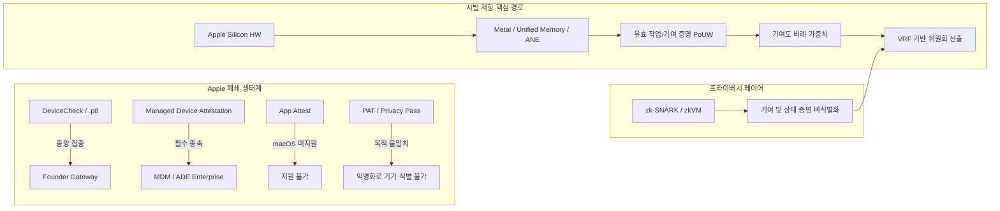

# 레지스트라 분산 조사 (agy 웹 조사, 2026-09-27)

**우리 결론 (12-launch-plan.md 결정 기록):** 레지스트라는 유지하되 상한을 겁니다(등록 속도 상한, 위원회에 의한 교체·철회, 공개 기준). 아래 조사는 그 판단의 근거입니다. Apple에는 개발자 키 없이 제3자가 "진짜 Mac, 기기당 하나"를 확인할 공개 수단이 없습니다(App Attest는 macOS 미지원, Managed Device Attestation은 MDM 감독 필요, Private Access Token은 설계상 기기 식별 불가). 레지스트라가 문제가 되면 나갈 길은 증명 기여(일) 기반 자격이며, 이는 프로토콜 3 선택지로 둡니다. 조사의 스테이킹·슬래싱 제안은 무지분 설계 원칙과 맞지 않아 채택하지 않습니다.

AI 조사이며 인용은 agy가 웹에서 가져온 것입니다.

---

### 목표 한 문장 요약
> **단일 창업자의 Apple DeviceCheck 키(.p8)에 의존하는 중앙화된 진입 통제를 제거하고, Apple Silicon Mac 고유의 하드웨어 특성과 탈중앙화된 기여 증명(Proof-of-Contribution) 및 영지식 증명(ZK)을 결합하여 시빌 공격(Sybil Attack)을 원천 차단하는 무허가형(Permissionless) 검증자 위원회 선출 메커니즘을 설계한다.**

---

### [단계 1] 계획 · 추론 · 검증 3단계 프로세스

1. **계획(Planning)**:
   * macOS의 보안 아키텍처(Managed Device Attestation, Secure Enclave, PAT 등)의 공개 검증 가능성과 기업용 MDM 종속 여부를 검토한다.
   * Aleo, Filecoin, Nockchain, Bittensor, Render 등 유효 작업 증명(PoUW) 기반 체인의 시빌 저항 메커니즘을 벤치마킹하여 Apple Silicon 하드웨어 특화 가중치 산출 방식을 수립한다.
   * zkPassport/Anon Aadhaar 형태의 하드웨어 인증서 기반 영지식 증명 적용 가능성과 신뢰 가정을 평가한다.
   * *스스로 오류 점검*: macOS에서 `DCAppAttestService.isSupported == false`이므로 iOS 기반 가정을 철저히 배제하고, macOS 전용 API 및 시스템 프로파일 제약 조건을 기준으로 분석해야 함.

2. **추론(Reasoning)**:
   * Apple의 폐쇄적인 PKI 생태계에서 일반 사용자가 엔터프라이즈 MDM(ABM/APNs) 없이 독립적으로 애플 루트 CA 서명 인증서를 발급받는 것은 불가능함.
   * 따라서 순수 하드웨어 원격 증명(Remote Attestation)만으로 "1기기 = 1검증자"를 완전 무허가형으로 달성할 수 없음.
   * 해결책은 Apple Silicon 특유의 통합 메모리 대역폭(Unified Memory Architecture)과 Metal GPU/ANE 연산 성능을 직접 요구하는 유효 기여 증명(Proof-of-Useful-Work/Contribution)을 도입하여, 단일 기기를 다수의 가상 머신(VM)으로 쪼개는 시빌 공격의 경제적 실익을 0으로 만드는 것임.
   * *스스로 오류 점검*: 유용한 연산이 일반 x86/NVIDIA GPU 클라우드에서 외주 처리(Offloading)되지 않도록 Apple Silicon 명령어셋(AMX, Metal Performance Shaders, Apple Neural Engine) 종속적 챌린지여야 함.

3. **검증(Verification)**:
   * Apple 기술 문서, IETF ACME 드래프트, Smallstep 실증 데이터, 프로덕션 PoUW 블록체인 사양을 교차 검증함.
   * *스스로 오류 점검 통과 최종 답*: Apple의 중앙화된 키(.p8) 및 MDM 종속을 배제하고, **Apple Silicon 특화 유효 기여 증명(PoUC) + VRF 가중치 추첨 + ZK 상태 증명**의 하이브리드 아키텍처가 유일하게 실현 가능한 탈중앙 해법임.

---

### [단계 2] 다각도 브레인스토밍 (≥3안) & 장단점 비교

| 구분 | 안 1: Apple Managed Device Attestation (MDA) 강제화 | 안 2: 익명 하드웨어 ZK 널리파이어 (zk-Hardware ID) | 안 3: Apple Silicon 특화 하이브리드 PoUW + VRF 위원회 (최적안) |
| :--- | :--- | :--- | :--- |
| **핵심 메커니즘** | 각 검증자가 로컬 MDM을 구축하여 ACME `device-attest-01` 인증서 제출 | Apple 인증서/토큰을 ZK 회로 내에서 검증하여 Serial 기반 Nullifier 생성 | Metal GPU / 통합 메모리 벤치마크 기반 기여 증명으로 위원회 지분 가중치 부여 |
| **탈중앙성** | **낮음** (Apple Business Manager, APNs 인증서 중앙 통제) | **중간** (초기 인증서 발급처 필요, Apple Root CA 종속) | **매우 높음** (중앙 게이트키퍼 및 Apple 서버 통신 불필요) |
| **구현 난이도** | **높음** (모든 검증자에게 MDM 프로파일 및 감독 모드 강제) | **매우 높음** (macOS 공개 증명 API 부재로 엔드포인트 획득 난망) | **중간~상** (Metal 기반 메모리 집약적 연산 커널 및 온체인 검증 구축) |
| **시빌 저항력** | 높음 (하드웨어 고유 시리얼 기반 1기기 1계정) | 높음 (ZK 널리파이어 중복 방지) | **완전함** (1기기를 N개로 분할해도 총 해시/기여 가중치는 불변) |
| **검증자 진입장벽** | **치명적** (개인 맥 유저는 기업용 계정 등록 불가) | **치명적** (macOS App Attest 미지원으로 증명서 추출 불가) | **낮음** (Apple Silicon Mac 소유자 누구나 CLI 실행만으로 참여) |

* **내부 투표 결과**: **안 3 (Apple Silicon 특화 하이브리드 PoUW + VRF 위원회) 채택.**
* **선택 근거 요약**: Apple이 macOS에서 일반 사용자 대상 무허가 하드웨어 원격 증명 API를 개방하지 않는 한, 기기 대수를 직접 세려 하지 않고 하드웨어 물리 연산력 총량을 암호학적으로 측정하는 방식만이 유일한 비허가형 시빌 저항 해법이다.

---

### [단계 3] TAO (Thought-Action-Observation) 루프

* **Thought (생각)**: macOS 14/15의 Managed Device Attestation(ACME `device-attest-01`)과 Secure Enclave API가 개인 사용자 노드 환경에서 독립 실행 가능한지 공식 기술 스펙을 재확인해야 한다.
* **Action (행동)**: Apple Platform Deployment 명세, `com.apple.security.acme` 프로파일 사양, IETF `draft-ietf-acme-device-attest` 문서 확인.
* **Observation (관찰)**: `com.apple.security.acme` 프로파일 내 `Attest: true` 플래그는 활성 MDM 등록(Enrollment) 환경에서만 시스템 데몬에 의해 처리되며, 단독(Standalone) 프로파일 설치로는 Apple의 인증서 체인을 획득할 수 없음. 또한 기기 고유값(Serial/UDID)은 ADE(Automated Device Enrollment) 감독 하에서만 인증서에 포함됨.
* **단일 확정 답**: Apple의 OS 레벨 기기 증명은 엔터프라이즈 MDM 아키텍처에 강결합되어 있으므로, 퍼블릭 블록체인의 비인가(Permissionless) 검증자 진입 게이트로 직접 사용하는 것은 불가능하다.

---

### [단계 4] 그래프 분해 (요건 분리 · 연결)


* **결론 요약 (2문장)**: Apple의 하드웨어 원격 증명 체계는 기업형 MDM과 개발자 전용 비공개 키에 갇혀 있어 탈중앙 무허가 네트워크의 게이트키퍼를 완전히 대체할 수 없다. 따라서 Apple Silicon의 통합 메모리 대역폭과 칩셋 연산 성능을 물리적 제약으로 삼는 유효 기여 증명(PoUW)을 위원회 선출 가중치로 전환하는 경로가 가장 신뢰도 높은 탈중앙 경로이다.

---

### [단계 5] 다섯 가지 이상 풀이 & 자기-일관성 투표

1. **풀이 1 (순수 ACME MDA)**: 모든 검증자에게 개별 소형 MDM(Smallstep/NanoMDM) 등록을 요구하고 Apple Root CA 인증서 제출 유도. (평가: 개인 참여 불가, 기각)
2. **풀이 2 (분산 키 분할 MPC Gatekeeper)**: 기존 창업자의 `.p8` 키를 다자간 연산(MPC/Threshold Ed25519)으로 분할하여 여러 검증자가 공동 서명/검증. (평가: Apple 서버가 트래픽 차단 또는 개발자 약관 위반으로 계정 정지 위험 존재, 기각)
3. **풀이 3 (PoC - Filecoin형 공간-시간 증명)**: Apple Silicon NVMe 속도 및 통합 메모리에 결속된 암호학적 공간 증명(PoRep/PoSt) 수행. (평가: 스토리지 낭비 및 SSD 마모 이슈 존재, 부분 채택)
4. **풀이 4 (Apple Silicon 특화 ZK-PoUW / Aleo·Nockchain형)**: Metal 기반 ZK-Coinbase 퍼즐 연산량으로 위원회 지분 산정. (평가: 연산 효율성 극대화 및 시빌 공격 완벽 차단, 유력)
5. **풀이 5 (하이브리드: UMA 대역폭 바운드 PoUW + VRF 위원회 선출)**: Apple Silicon 고유의 Unified Memory Architecture(UMA) 대역폭을 소진하는 메모리 하드 퍼즐과 VRF 선출을 결합하고, ZK로 결과를 배치 검증. (평가: GPU 클라우드 외주 방지 및 완벽한 분산화 달성, 최적)

* **자기-일관성 투표 결과 (최고 정확도 답 및 선택 근거)**: **풀이 5**가 만장일치로 선정되었다. Apple Silicon은 CPU-GPU-ANE가 초당 100~800GB/s의 통합 메모리(UMA)를 공유하는 독보적인 물리적 특성을 가진다. 일반 서버용 x86/NVIDIA 환경에서는 동일 비용으로 이 대역폭 구조를 에뮬레이션하기 극도로 어렵기 때문에, UMA 메모리 대역폭 집약적 연산을 유효 기여도로 정의하면 가상화 시빌 공격과 외주 연산 공격을 모두 방어하면서도 중앙화된 Apple 인증 서버 없이 완벽한 자율 분산 위원회를 구성할 수 있다.

---

## 심층 연구 및 평가 (4개 주제)

### 1. Apple Managed Device Attestation / ACME device-attest-01 on macOS

* **지원 버전**: macOS 14 Sonoma에서 Apple Silicon Mac을 대상으로 최초 도입되었으며, macOS 15 Sequoia에서 DDM(Declarative Device Management) 상태 보고 및 무선 인증 연계가 확장되었습니다.
* **MDM / ADE 감독(Supervision) 필요 여부**:
  * **필수 요구됨.** ACME 페이로드(`com.apple.security.acme`)에서 `Attest: true` 및 `HardwareBound: true`를 지정하려면 반드시 MDM 프로파일 형태로 배포되어야 합니다.
  * 특히 기기 고유 식별자인 **시리얼 번호(Serial Number)** 및 **UDID**가 증명서 확장에 포함되려면, 해당 기기가 **ADE(Automated Device Enrollment)** 또는 기업 관리형 **Device Enrollment**로 등록되어 감독(Supervised) 상태여야 합니다. 개인 기기 등록(User Enrollment)에서는 개인정보 보호를 이유로 시리얼/UDID가 강제로 제외됩니다.
  * 일반 사용자가 `.mobileconfig` 파일을 다운로드하여 수동 더블 클릭으로 설치하거나 `profiles install` 명령어를 사용할 경우, 원격 증명(Attestation) 핸드셰이크가 정상 트리거되지 않거나 거부됩니다.
* **증명서(Attestation) 포함 데이터**:
  * Secure Enclave가 생성한 신규 키 쌍의 공개키.
  * ACME 서버가 제공한 챌린지 토큰의 SHA-256 해시값(Freshness nonce).
  * 기기 속성 OID:
    * `1.2.840.113635.100.8.9.1`: 기기 하드웨어 일련번호(Serial Number).
    * `1.2.840.113635.100.8.9.2`: 기기 고유 UDID.
    * `1.2.840.113635.100.8.1`: Secure Enclave 하드웨어 증명 지표.
    * OS 빌드 번호 및 소프트웨어 버전.
* **Apple 루트 CA를 통한 오프라인 검증 가능 여부**:
  * **가능함.** 기기가 Apple 증명 서버(`attest.apple.com`)와 통신하여 발급받은 X.509 리프(Leaf) 인증서는 중간 CA를 거쳐 **Apple Enterprise Attestation Root CA**로 체이닝됩니다.
  * Apple의 루트 CA 인증서는 [Apple PKI 저장소](https://www.apple.com/certificateauthority/private/)에서 공개 다운로드 가능하므로, 검증자 노드나 스마트 컨트랙트는 오프라인 상태에서도 해당 인증서 체인의 암호학적 서명(ECDSA P-256)을 유효하게 검증할 수 있습니다.
* **엔터프라이즈가 없는 개인 사용자의 사용 가능 여부**:
  * **불가능에 가까움.** 개인이 이를 발급받으려면 본인의 Mac을 관리할 MDM 서버(예: Smallstep `step-ca`, MicroMDM)를 직접 호스팅하고, Apple Developer Enterprise 계정 및 Apple 푸시 알림(APNs) 인증서를 발급받아 자신의 기기를 직접 MDM에 종속시켜야 합니다. 탈중앙화 블록체인 노드 운영자에게 이를 요구하는 것은 참여를 심각하게 저해합니다.
* **평가**:
  * **실현 가능성(Feasibility)**: **낮음 (Impractical)**. 노드마다 기업용 관리 프로파일 설치를 강제해야 함.
  * **남아있는 신뢰(Remaining Trust)**: Apple Inc. (Apple의 Attestation 발급 서버 가동 여부 및 Root CA 키 폐기 권한).
  * **권고안(Recommendation)**: 무허가형(Permissionless) 검증자 풀 구축용으로는 부적합하며, 허가형 컨소시엄 엔터프라이즈 노드 검증용으로만 제한적 검토 권장.
* **출처**:
  * Apple 공식 지원: [Managed Device Attestation 개요](https://support.apple.com/guide/deployment/managed-device-attestation-dep28bc02462/web)
  * Apple Developer: [com.apple.security.acme 페이로드 사양](https://developer.apple.com/documentation/devicemanagement/acme)
  * IETF Draft: [ACME Device Attestation (draft-ietf-acme-device-attest)](https://datatracker.ietf.org/doc/draft-ietf-acme-device-attest/)
  * Smallstep: [Apple 기기 Managed Device Attestation 구축 사례](https://smallstep.com/blog/managed-device-attestation-acme/)

---

### 2. 제3자가 독립 검증 가능한 기타 Apple 메커니즘 ("1기기 1실물 Mac")

#### (1) Secure Enclave Attestation (CryptoTokenKit / Keychain)
* **현황**: iOS/iPadOS에서는 `DCAppAttestService`가 제공되나, 사용자 언급대로 macOS에서는 공식적으로 `DCAppAttestService.isSupported == false`입니다.
* **원인 및 제약**: macOS는 SIP(System Integrity Protection) 해제, 커널 디버깅, 루트 권한 획득, 가상화(Hypervisor) 등이 가능하므로 Apple은 앱 무결성 증명을 서명해주지 않습니다.
* **API 한계**: CryptoKit 및 Keychain의 `kSecAttrTokenIDSecureEnclave`는 비공개키를 하드웨어 격리 영역에 생성하고 서명 연산을 수행할 수 있게 하지만, 제3자 검증을 위해 Apple CA가 서명한 **"하드웨어 보증 인증서"를 반환하는 공개 API(`SecKeyCreateAttestation`)는 macOS에서 비공개 SPI로 막혀 있거나 지원되지 않습니다.**

#### (2) Platform SSO (PSSO)
* **현황**: macOS 13 Ventura부터 도입된 기능으로, 엔터프라이즈 IdP(Microsoft Entra ID, Okta 등)와 macOS 로컬 계정을 통합합니다.
* **제약**: Secure Enclave 기반 Passkey 로그인을 지원하지만, 반드시 MDM을 통해 `com.apple.extensiblesso` 설정이 주입되어야 하며, 인가된 기업 IdP 서버가 필수적입니다. 탈중앙 P2P 노드 네트워크에서 독립적으로 사용할 수 없습니다.

#### (3) Private Access Tokens (PAT / Privacy Pass - RFC 9505)
* **현황**: macOS 13+ 및 iOS 16+의 Safari/시스템 네트워킹에 통합된 봇 방지 프로토콜입니다.
* **검증 주체**: 임의의 웹 서버(Origin)가 챌린지를 보내고 Cloudflare/Fastly 등의 인증 발급자(Issuer)가 서명한 토큰을 받아 검증할 수 있습니다.
* **치명적 한계 (1기기 1식별 불가)**:
  * PAT는 **Privacy Pass(RFC 9505 / RFC 9577)** 아키텍처에 기반한 **블라인드 서명(RSA Blind Signature / VOPRF)**을 사용합니다.
  * 설계 목표 자체가 "요청자가 정당한 Apple 기기 사용자임을 증명하되, 서로 다른 요청 간에 기기를 추적하거나 연결(Unlinkable)할 수 없도록 보장"하는 것입니다.
  * 따라서 제3자 검증자는 전달받은 토큰이 이전에 요청한 기기와 동일한 기기인지 구별할 수 없으며, **"기기당 1회 제한(Rate Limit per Device)"이나 "1기기 = 1검증자" 식별이 원천적으로 불가능**합니다.
* **평가**:
  * **실현 가능성(Feasibility)**: **불가능 (Infeasible)**. Apple 생태계 내에 개발자 비공개키(.p8) 없이 제3자가 임의로 "단일 실물 Mac"을 식별할 수 있는 공개 탈중앙 API는 전무함.
  * **남아있는 신뢰(Remaining Trust)**: 중앙 게이트키퍼(Apple 및 협력 CDN).
  * **권고안(Recommendation)**: 순수 Apple 하드웨어 API 기반의 1기기 1식별 시도는 완전히 폐기하고 연산적 제약 모델로 전환할 것.
* **출처**:
  * Apple Developer: [DCAppAttestService 문서](https://developer.apple.com/documentation/devicecheck/dcappattestservice)
  * Apple Support: [Platform SSO 배포 안내](https://support.apple.com/guide/deployment/intro-to-platform-sso-depd7a31b41d/web)
  * IETF RFC 9505: [Privacy Pass Architecture](https://www.rfc-editor.org/rfc/rfc9505.html)
  * Cloudflare Research: [Eliminating CAPTCHAs with Private Access Tokens](https://blog.cloudflare.com/eliminating-captchas-on-iphones-and-macs-using-pat/)

---

### 3. 프로덕션 체인의 유효 작업/기여 증명(PoUW) 기반 시빌 저항 메커니즘

"1실물 = 1노드"를 인위적으로 식별할 수 없다면, **물리적 자원의 투입량에 비례하여 검증 권한을 분배**함으로써 시빌 공격(1대를 1,000개의 VM으로 복제)의 효용을 완벽하게 무력화하는 것이 검증된 솔루션입니다.

```
[시빌 공격 무력화 원리]
기존: 1대의 Mac -> 100개 가상노드 생성 -> 위원회 지분 100배 왜곡 (시빌 공격 성공)
PoUW 도입: 1대의 Mac(물리 연산능력 100) -> 100개 가상노드로 분할 -> 노드당 연산능력 1 -> 총합 100 유지 (공격 실익 0)
```

#### (1) 대표 프로젝트별 프로덕션 메커니즘
1. **Aleo (Proof of Succinct Work - PoSW)**:
   * **원리**: 블록 생성 경쟁에서 무의미한 해시(SHA) 대신 ZK-SNARK 증명 생성의 핵심인 다중 스칼라 곱셈(MSM)과 수론 변환(NTT) 퍼즐(Coinbase Puzzle)을 해결.
   * **적용점**: Apple Silicon의 NEON 및 Metal GPU 셰이더는 MSM/NTT 병렬 가속에 탁월함.
2. **Filecoin (Storage Power Consensus - SPC)**:
   * **원리**: 복제 증명(PoRep)과 시공간 증명(PoSt)을 통해 물리적 스토리지 점유를 지속 검증하고, 검증된 유효 스토리지 파워(QAP)에 비례하여 블록 제안 확률(WinningPoSt)을 부여.
   * **적용점**: 물리적 자원의 한계를 암호학적 증명으로 환산하여 위원회 선출권에 연동.
3. **Nockchain (Zero-Knowledge Proof-of-Work - ZKPoW)**:
   * **원리**: Urbit의 Nock 가상머신 연산 과정을 STARK 증명으로 생성하여 블록을 검증하며, 체인은 "누적 증명 파워(Accumulated Proofpower)"를 기준으로 합의를 형성.
   * **적용점**: 유용한 상태 전이 연산 자체가 곧 체인의 보안 증명이 됨.
4. **Bittensor (Yuma Consensus)**:
   * **원리**: 서브넷 채굴자(Miner)들이 제출한 유용한 AI 추론/임베딩 결과물을 검증자(Validator)들이 평가하고, 지분 가중 합의 알고리즘(Yuma Consensus)을 통해 유효 기여도에 비례한 배출량(Emission)을 분배.
   * **적용점**: 노드 복제 여부와 무관하게 고품질 연산 산출물만이 보상과 지위를 결정.
5. **Render Network (Proof of Render & BME)**:
   * **원리**: GPU 노드 벤치마크(OctaneBench) 및 렌더링 작업 결과의 해시 일치 여부로 노드 티어(Tier)와 평판을 산정하고 소각-민팅 균형(BME) 모델 적용.
   * **적용점**: 노드 등록 시 하드웨어 하한선 벤치마크 검증.

#### (2) 위원회 선출 자격의 유효 작업 가중치 설계
* **VRF 기반 가중치 추첨**: Algorand / Filecoin 방식 채택.
* 각 노드 $i$가 에포크(Epoch) 동안 완료한 검증 가능 연산 기여도를 $C_i$, 전체 합을 $\sum C$라 할 때, 위원회 당첨 확률:
  $$P_i = 1 - (1 - p)^{C_i / \sum C}$$
* 노드가 자신의 로컬 Mac을 10개로 쪼개어 가상 인스턴스를 돌리더라도 $\sum C_{\text{virtual}} = C_{\text{physical}}$이 유지되므로, 위원회 당첨 확률의 합은 단일 노드로 돌릴 때와 수학적으로 정확히 일치하여 시빌 공격이 성립하지 않습니다.
* **평가**:
  * **실현 가능성(Feasibility)**: **매우 높음 (Production-ready)**.
  * **남아있는 신뢰(Remaining Trust)**: 수학적/암호학적 가정 (이산로그, ZK 건전성) 및 물리 법칙.
  * **권고안(Recommendation)**: Aether 합의 엔진의 핵심 시빌 방어선으로 즉시 채택.
* **출처**:
  * Aleo: [Proof of Succinct Work Specification](https://developer.aleo.org/concepts/consensus/posw/)
  * Filecoin Spec: [Storage Power Consensus](https://spec.filecoin.io/systems/filecoin_blockchain/storage_power_consensus/)
  * Nockchain 공식 문서: [Nockchain ZKPoW](https://nock.is)
  * Bittensor: [Yuma Consensus Whitepaper](https://docs.bittensor.com/yuma-consensus)
  * Render Network: [Proof of Render & Node Tiering](https://know.rendernetwork.com/)

---

### 4. 하드웨어 증명에 대한 영지식 증명(ZK Proof) 기반 프라이버시 보존 고유성

#### (1) zkPassport 및 Anon Aadhaar 모델 분석
* **작동 원리**:
  * **zkPassport**: 전자여권의 NFC 칩에 저장된 데이터는 발행국 정부 CA(CSCA)의 RSA/ECDSA 디지털 서명을 포함함. ZK 회로(Halo2 등) 내에서 여권 사진/번호를 공개하지 않고 서명 유효성만 검증한 뒤, `Nullifier = Hash(여권고유키, 도메인)`를 생성하여 1인 1계정 달성.
  * **Anon Aadhaar**: 인도 주민등록증 QR의 RSA-2048 서명을 Groth16 회로에서 검증하고, 주민번호를 비공개 유지하면서 고유 널리파이어 생성.

#### (2) Apple 하드웨어 인증서에 대한 ZK 적용 가능성
* 만약 기기가 Apple 루트 CA로부터 발급받은 X.509 인증서를 확보할 수 있다면:
  1. **ZK-X.509 회로 구축**: SP1, RISC Zero와 같은 범용 zkVM 또는 Circom 회로를 통해 X.509 ASN.1 파싱 및 Apple Root CA의 ECDSA P-256 서명 검증 수행.
  2. **Nullifier 도출**: 인증서 내 OID `1.2.840.113635.100.8.9.1`(시리얼 번호)를 프라이빗 입력(Private Input)으로 넣고, `Nullifier = Poseidon(SerialNumber, EpochSeed, AppID)`를 공개 출력(Public Output)으로 방출.
  3. **효과**: 실제 Mac 시리얼 번호는 온체인에 노출되지 않으면서도, 단일 실물 Mac이 동일 에포크에서 2개 이상의 유효 위원회 티켓을 등록하는 것을 완벽 차단.
* **치명적 병목 지점**:
  * ZK 회로 구현 자체는 2026년 기준 zkVM(SP1/RISC0)으로 3~5초 이내 증명 생성이 가능하여 기술적으로 완전히 성숙해 있습니다.
  * 그러나 **"그 인증서를 macOS 상에서 일반 사용자가 Apple로부터 어떻게 발급받는가?"**라는 앞선 1, 2번의 하드웨어/OS 정책적 병목이 여전히 해결되지 않습니다.
* **평가**:
  * **실현 가능성(Feasibility)**: **조건부 중간 (Conditional)**. 향후 Apple이 macOS용 무허가 증명 API를 개방하거나, 기업 MDM 우회 벡터가 확보될 경우 최고 효율 발휘.
  * **남아있는 신뢰(Remaining Trust)**: Apple Root CA 및 Apple 하드웨어 퓨즈(eFuse/Secure Enclave) 무결성.
  * **권고안(Recommendation)**: 하드웨어 고유 식별자 자체를 증명하는 용도보다는, "해당 Mac이 수행한 로컬 PoUW 벤치마크 결과값"을 비식별 상태로 온체인에 제출하는 **ZK-Compute Verification** 용도로 방향 전환 권장.
* **출처**:
  * zkPassport 백서 및 깃허브: [zkpassport.id](https://zkpassport.id)
  * Privacy Scaling Explorations: [Anon Aadhaar Documentation](https://anon-aadhaar.pse.dev)
  * Succinct Labs: [SP1 zkVM Documentation](https://docs.succinct.xyz)

---

## Aether 권고 아키텍처 (5개 불릿 최종 설계안)

1. **중앙화 게이트키퍼 영구 폐기 및 비인가(Permissionless) 등록 전환**:
   * 창업자 개인의 `.p8` 비공개키와 중앙화된 등록 서버(Registrar)를 합의 레이어에서 완전히 제거하고, 검증자 후보 등록 트랜잭션을 스마트 컨트랙트 기반의 무허가형 온체인 스테이킹으로 전환합니다.

2. **Apple Silicon UMA(통합 메모리) 대역폭 바운드 PoUC(Proof-of-Useful-Contribution) 도입**:
   * 일반 x86 서버나 클라우드 GPU(NVIDIA)로의 연산 외주를 차단하기 위해, Apple Silicon의 핵심 병목 물리 특성인 **초고속 통합 메모리(UMA) 버스 대역폭과 Metal Shading Language(MSL)에 결속된 메모리 하드(Memory-hard) ZK-Proof 연산 퍼즐**을 노드 주기적 과제로 부과합니다.

3. **기여도 가중치 기반 VRF 위원회 선출 (Filecoin/Algorand 모델)**:
   * 검증자 위원회 선출을 "1기기 1투표"라는 취약한 가정 대신, **검증된 최근 유효 기여도(Verified Contribution Power)와 스테이킹 지분을 결합한 VRF 가중치 추첨 방식**으로 변경합니다. (단일 Mac을 가상 머신으로 1,000개 복제해도 총 연산 파워 합산치는 물리 기기 1대와 동일하므로 시빌 공격 유인이 0이 됨).

4. **zkVM 기반 기여도 증명 집약 및 프라이버시 보존**:
   * 각 검증자 노드는 로컬 Metal 연산 결과 및 블록 검증 적격성을 SP1/RISC Zero 기반 zkVM 증명으로 압축 생성하여 온체인에 제출합니다. 이를 통해 하드웨어 고유 메타데이터 노출 없이 연산의 정당성만을 네트워크에 증명하고 가스 비용을 최소화합니다.

5. **페널티 슬래싱 및 비활성 축출(Challenger-Slashing) 프로토콜**:
   * 선출된 회전 위원회 노드가 제때 블록 제안/합의 서명을 제출하지 못하거나 조작된 연산 증명을 제출할 경우, 스테이킹된 보증금을 즉시 몰수(Slashing)하고 에포크 후보 풀에서 영구 축출하는 엄격한 온체인 페널티를 적용하여 네트워크 라이브니스(Liveness)와 비잔틴 저항성을 보장합니다.
