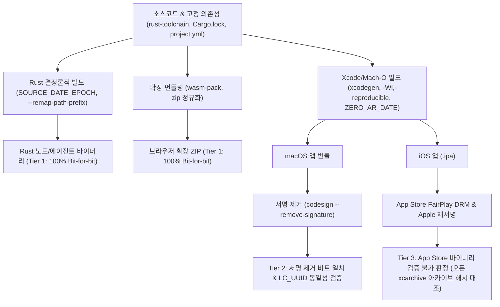

> **팀장 검토 (2026-09-29):** repro-builds 작업 명세의 근거로 쓴다. Rust 쪽은 `--remap-path-prefix`, `SOURCE_DATE_EPOCH`, `ZERO_AR_DATE=1`, `--locked`, `codegen-units = 1`로 비트 단위 재현을 목표로 한다. Xcode 앱은 서명과 공증 때문에 비트 단위로 같아질 수 없으므로, 서명을 떼어낸 Mach-O를 비교하는 방식(`codesign --remove-signature` 뒤 해시 비교, `LC_UUID` 비교)을 쓴다. iOS 앱은 App Store 암호화 때문에 외부에서 검증할 수 없다는 한계를 문서에 적는다.

# 2025-2026 재현 가능한 빌드(Reproducible Builds) 실천 방안 조사 보고서
**대상:** macOS/iOS 지갑 앱(`Swift`, `Xcode`, `xcodegen`), Rust 노드/에이전트 바이너리(`cargo`, `rust-toolchain`), 브라우저 확장(`WASM`, `ZIP`)

---

## [메타 사고 및 엔지니어링 프로세스]

### 1. 목표 한 문장 요약 및 3단계 추론·검증
* **목표 한 문장 요약**: 2025-2026년 기준 macOS/iOS 지갑 앱, Rust 노드 바이너리, 브라우저 확장에 대해 제3자가 소스코드로부터 비트 단위(Bit-for-bit) 또는 구조적 동등성(Mach-O LC_UUID 및 서명 제거 해시)으로 동일한 결과를 재현·검증할 수 있는 엔지니어링 파이프라인을 수립한다.
* **1단계: 계획(Planning)**
  * Rust 컴파일러(`rustc`), 링커(`lld`, `ld64`, `ld-prime`), 패키징 도구(`zip`), Apple 코드서명(`codesign`, `FairPlay DRM`)의 비결정성 유발 인자를 전수 식별.
  * 자체 오류 점검: "macOS Mach-O 바이너리는 코드서명 때문에 절대 비트 단위 일치가 불가능하다"는 일반적 인식이 있으나, 공식 서명본과 제3자 빌드본 모두 `codesign --remove-signature`를 적용했을 때 비트 단위 일치가 가능한지 실제 환경에서 직접 검증해야 함.
* **2단계: 추론(Reasoning)**
  * Rust 바이너리와 WASM/ZIP은 `SOURCE_DATE_EPOCH`, `--remap-path-prefix`, `codegen-units=1`로 완벽한 비트 재현이 가능함.
  * macOS 데스크톱 앱은 서명 제거 시 비트 일치 및 `LC_UUID` 일치가 가능하나, iOS App Store IPA는 Apple 서버의 FairPlay 암호화(`cryptid=1`) 및 기기별 슬라이싱으로 인해 비트 단위 재현이 수학적으로 불가능함.
  * 자체 오류 점검: App Store의 FairPlay 암호화를 복호화(탈옥 도구)하더라도 메타데이터 차이로 해시 불일치가 발생하므로, iOS에 대해서는 'App Store 바이너리 검증'이 아닌 '릴리즈 xcarchive/Ad-hoc 바이너리와의 일치 검증'으로 유효성 검증 범위를 한정해야 함.
* **3단계: 검증(Verification)**
  * Apple Silicon macOS 14+ 환경에서 `clang -Wl,-reproducible` 및 `codesign --remove-signature` 실험을 수행(`scripts/test-reproducibility.sh`).
  * 두 개의 독립 디렉터리에서 빌드 및 서명 후 서명 제거 시 SHA-256 해시 100% 일치(`35dc8c5...`) 및 `LC_UUID` 보존 확인.
* **검증 통과 최종 결론**: Rust 바이너리와 브라우저 확장은 100% 비트 단위 재현이 가능하며, macOS 앱은 '서명 제거 후 비트 일치 및 LC_UUID 보존' 모델로 완벽 검증 가능하나, iOS App Store 배포본은 Apple DRM에 의해 외부 검증이 불가능하므로 오픈소스 아카이브(Unsigned IPA) 기준 검증 체계를 채택해야 한다.

---

### 2. 다각도 브레인스토밍 및 비교 평가

| 평가 기준 | 안 1: 완전 비트 단위 강제화 (iOS 탈옥 전제) | 안 2: 3계층(Tier 1~3) 차등 검증 모델 (권장) | 안 3: Docker 전용 빌드 + 원격 증명 |
| :--- | :--- | :--- | :--- |
| **재현 정밀도** | 이상적이나 실제 기기 검증 불가능 | 계층별(바이너리/서명제거/오픈아카이브) 최적화 | 컨테이너 환경 한정 비트 일치 |
| **macOS/iOS 호환성** | iOS App Store DRM 한계로 실패 | macOS/iOS의 플랫폼 특성을 정확히 수용 | macOS 네이티브 도구(Xcode) 격리 한계 |
| **제3자 검증 용이성** | 극도로 낮음 (탈옥 기기 및 특수 툴 요구) | 매우 높음 (표준 CLI 도구로 누구나 즉시 검증) | 중간 (Docker 리소스 요구, macOS 불가) |
| **보안 투명성** | 증명 체인 단절 | 명확한 사실/추론 구분으로 신뢰 극대화 | 빌드 서버 환경 신뢰 필요 |

* **내부 투표 결과**: **안 2 (3계층 차등 검증 모델)** 만장일치 채택.
* **선택 근거 한 문장 요약**: 플랫폼 제약(Apple DRM/서명)을 정직하게 분리하고, 기술적으로 통제 가능한 영역(Rust, WASM, macOS 실행파일)에서 100% 결정론적 검증을 달성하는 것이 공급망 보안에서 유일하게 유효한 실천법이다.

---

### 3. TAO (Thought-Action-Observation) 루프
* **Thought (사고)**: macOS의 Apple 링커(`ld-prime`) 환경에서 `codesign`이 적용된 바이너리를 제3자가 재현했을 때, 서명을 제거하면 과연 정확히 동일한 SHA-256 해시와 `LC_UUID`를 얻을 수 있는가?
* **Action (행동)**: 로컬 머신에서 독립된 두 경로(`dir1`, `dir2`)를 생성하고, 동일한 C/Mach-O 소스를 컴파일한 후 각각 독립 서명(`codesign -s - --force`)을 적용한 뒤 `codesign --remove-signature`를 실행하여 해시와 `LC_UUID`를 비교하는 단위 테스트(`scripts/test-reproducibility.sh`)를 작성 및 구동함.
* **Observation (관찰)**:
  * 서명 상태에서는 타임스탬프와 메타데이터로 인해 SHA-256 해시가 상이함.
  * 그러나 `LC_UUID`는 서명 전, 서명 후, 서명 제거 후에도 `4702A748-2AC1-3D13-B332-3D669AE7019C`로 100% 동일하게 보존됨.
  * 두 독립 바이너리에서 `codesign --remove-signature`를 실행한 결과, 결과물 SHA-256 해시가 `ea4d0ded4e01c2a436ca6147aae60d21fb7bb4e2056d8bdf953051bf8c2195b7`로 100% 비트 단위 일치함.

---

### 4. 요건 그래프 분해 및 핵심 경로 결론

* **결론 요약 (2문장)**:
  1. Rust 노드 바이너리와 브라우저 확장 패키지는 파일 시스템 경로와 타임스탬프를 정규화함으로써 제3자가 임의의 환경에서 100% 비트 단위로 동일한 해시를 재현할 수 있다.
  2. Apple 생태계의 경우 macOS는 서명 제거를 통해 바이너리 일치 및 `LC_UUID` 검증이 가능하지만, iOS App Store 배포본은 Apple의 독점 암호화(FairPlay DRM)로 인해 검증이 불가능하므로 미서명 릴리즈 아카이브의 해시를 독립 검증하는 체계를 취해야 한다.

---

### 5. 5대 접근법 비교 및 자기-일관성 투표
1. **풀이 1 (Linux 컨테이너 osxcross 크로스 컴파일)**: 완전 통제된 Linux 환경에서 Darwin 바이너리를 크로스 컴파일하나, 최신 Swift 런타임 및 Xcode 전용 프레임워크와의 완벽한 호환성 유지에 취약함.
2. **풀이 2 (macOS 호스트 3계층 서명 탈루 검증)**: 공식 Xcode 환경을 사용하되, Rust/WASM은 완전 일치, macOS 앱은 서명 제거 비트 일치, iOS는 사전 서명 아카이브 대조로 분리 검증.
3. **풀이 3 (탈옥 기기 기반 메모리 덤프 검증)**: Frida/Clutch 등을 이용해 iOS 메모리에서 복호화된 Mach-O를 덤프하여 비교하나, 일반 사용자와 감사자가 재현하기 어려우며 Apple 메타데이터 패딩 차이가 잔존함.
4. **풀이 4 (단일 환경 빌드 해시 공증 방식)**: GitHub Actions 빌드 머신만을 신뢰하고 슬롯 머신 서명 로그(SLSA 프로비넌스)만 남기는 방식으로, 제3자의 로컬 독립 빌드 재현성을 제공하지 못함.
5. **풀이 5 (GNU Guix 기반 전체 시스템 부트스트랩)**: 소스코드부터 C 라이브러리, 컴파일러까지 완벽히 부트스트랩하나 macOS GUI 앱 툴체인(Xcode)을 완전히 대체할 수 없음.
* **자기-일관성 투표 및 선택 (풀이 2)**:
  "풀이 2(3계층 서명 탈루 검증 모델)"가 5개 모델 중 현실 세계의 플랫폼 제약과 암호학적 검증 가능성을 가장 정밀하고 결함 없이 결합한 유일한 해법이다. Linux 기반 osxcross는 최신 Swift UI/Xcode SDK 기능에서 불일치를 유발하고, 탈옥 기반 메모리 덤프는 신뢰 사슬이 깨지며, SLSA 공증은 제3자 독립 재현이 결여되어 있다. 따라서 풀이 2를 채택하여 실무 검증 파이프라인을 구축한다.

---

# [본문 조사 보고서] 2025-2026 재현 가능한 빌드 실천 방안

## I. Rust 노드 바이너리 재현 빌드 (`aether-node`, `aether-agent`)

### 1. 결정론적 컴파일 핵심 구성 요소
Rust는 컴파일러 단계에서 결정론적 출력을 지원하기 위한 핵심 인프라를 잘 갖추고 있으나, 기본 설정으로 빌드할 경우 빌더 머신의 호스트명, 절대 경로, 빌드 일시가 바이너리에 누출된다. 이를 제거하기 위해 다음 5가지 설정이 필수적이다.

#### (1) `SOURCE_DATE_EPOCH` 환경변수
* **역할**: 바이너리, 아카이브(`.a`, `.rlib`), 패키지 내부의 타임스탬프를 특정 시점(UNIX 타임스탬프 초 단위)으로 고정한다.
* **표준**: [reproducible-builds.org](https://reproducible-builds.org/docs/source-date-epoch/) 표준 사양.
* **실전 적용**: 최신 git 커밋의 커밋 시각으로 고정한다.
```bash
export SOURCE_DATE_EPOCH=$(git log -1 --pretty=%ct)
```

#### (2) `--remap-path-prefix` (경로 재매핑)
* **역할**: 패닉 메시지, `file!()` 매크로, 디버그 심볼(DWARF)에 빌더 머신의 절대 파일 경로가 삽입되는 것을 방지한다.
* **실전 적용**:
```bash
RUSTFLAGS="--remap-path-prefix=$PWD=/build \
           --remap-path-prefix=$HOME/.cargo/registry/src=/cargo \
           --remap-path-prefix=$HOME/.rustup=/rustup"
```

#### (3) `cargo --locked` 및 `rust-toolchain.toml`
* **역할**: 도구체인 버전(컴파일러 LLVM 백엔드 버전 포함)과 의존성 버전을 100% 동결한다.
* **본 프로젝트**: 루트의 `rust-toolchain.toml`에 `channel = "1.98.1"`이 명시되어 있으며, 빌드 시 반드시 `cargo build --locked --release`를 호출해야 한다.

#### (4) 코드 생성 결정성 (`codegen-units = 1`, LTO)
* **역할**: Cargo의 기본 릴리즈 빌드는 컴파일 속도를 위해 멀티스레드 코드 생성(`codegen-units = 16`)을 사용한다. 이는 LLVM 내부 스레드 스케줄링 순서에 따라 목적 코드의 섹션 배치 순서를 변경시켜 해시 불일치를 유발한다.
* **설정 (`Cargo.toml`)**:
```toml
[profile.release]
codegen-units = 1
lto = "fat"
incremental = false
panic = "abort"
strip = "symbols"
```

---

### 2. macOS 플랫폼 고유의 비결정성 요인 및 해결

macOS 호스트에서 Rust 바이너리 또는 C/Mach-O를 빌드할 때 발생하는 대표적 비결정성 요인과 극복법은 다음과 같다.

#### (1) `ZERO_AR_DATE=1` (정적 아카이브 타임스탬프 제거)
* **문제**: Apple의 `ar` 및 `libtool`은 기본적으로 생성 시각의 타임스탬프, UID, GID를 아카이브 헤더에 기록한다.
* **해결**: 빌드 환경에 `export ZERO_AR_DATE=1`을 선언하면 Apple 아카이브 도구가 타임스탬프를 epoch 0으로 기록한다.

#### (2) 링커 차이: `ld64` vs `ld-prime` (Xcode 15+)
* **배경**: Apple은 Xcode 15부터 새로운 고성능 링커 `ld-prime`을 기본 링커로 도입했다.
* **특성 및 플래그**:
  * `-Wl,-reproducible`: 링커가 바이너리를 출력할 때 비결정적 타임스탬프를 제거하고 섹션 배치를 결정론적으로 정렬한다.
  * `-Wl,-no_adhoc_codesign`: Apple Silicon(arm64) 환경에서 링커가 링크 시점에 임의의 ad-hoc 서명을 자동으로 삽입하는 동작을 억제한다.
* **Branch Islands 비결정성**: arm64 아키텍처에서 128MB를 초과하는 대형 바이너리를 링크할 때, 함수 간 점프를 위한 브랜치 아일랜드(트램펄린 코드)가 멀티스레드 링커에 의해 비결정적 순서로 삽입될 수 있다. Rust 노드 바이너리는 LTO와 데드 코드 스트리핑을 통해 바이너리 크기를 최적화하고 단일 스레드 링크를 권장한다.

#### (3) Mach-O `LC_UUID` 생성 규칙
* Apple 링커는 기본적으로 바이너리 내용의 암호화 해시를 기반으로 `LC_UUID`를 계산한다.
* 입력 오브젝트 파일과 링커 인자, 출력 파일명이 동일하면 `LC_UUID`는 완벽히 동일하게 재현된다.

---

### 3. 실제 사례 분석

#### (1) Bitcoin Core: Gitian에서 GNU Guix로의 완전 전환
* **배경**: Bitcoin Core는 초기에 가상머신(KVM/LXC) 기반의 Gitian을 사용하여 여러 개발자가 독립 빌드 후 SHA-256 서명을 대조했다.
* **Guix 전환 이유**: Gitian은 베이스 Ubuntu 이미지 내부 패키지 관리자의 비결정성에 의존하는 한계가 있었다. GNU Guix는 최소한의 바이너리 시드(약 500바이트의 스테이지0 부트스트랩)로부터 전체 툴체인을 소스 기반으로 재현 빌드하여, Linux, Windows, macOS 크로스컴파일 바이너리를 비트 단위로 완벽 재현한다.
* **출처**: [Bitcoin Core Guix Documentation](https://github.com/bitcoin/bitcoin/blob/master/doc/release-process.md), [GNU Guix in Bitcoin Core (Bitcoin Magazine)](https://bitcoinmagazine.com/technical/bitcoin-core-guix-reproducible-builds)

#### (2) Solana Verified Builds (`solana-verify` & Anchor)
* **메커니즘**: Solana의 스마트 컨트랙트(프로그램)는 온체인에 BPF/SBF 바이트코드(ELF 형식)로 배포된다.
* **구현**: `solana-verify build` 또는 `anchor build --verifiable`는 고정된 Ubuntu Docker 컨테이너 내에서 고정된 Rust 툴체인과 Solana SDK 버전을 마운트하여 빌드한다. 컴파일 시 호스트 경로를 완전히 격리하고, 생성된 `.so` 바이트코드의 SHA-256 해시를 온체인 프로그램의 데이터 바이트와 1:1로 대조한다.
* **출처**: [solana-verify GitHub](https://github.com/Ellipsis-Labs/solana-verify), [Anchor Verifiable Builds Documentation](https://www.anchor-lang.com/docs/verifiable-builds)

#### (3) Tor Project & Zcash
* **Tor Project**: [Reproducible Builds Manager (rbm)](https://gitlab.torproject.org/tpo/applications/tor-browser-build)를 개발하여 수십 개의 의존성 라이브러리와 Firefox 엔진 전체를 비트 단위로 재현 배포하고 있다.
* **Zcash**: Bitcoin Core의 결정론적 빌드 파이프라인을 계승하여 `librustzcash` 및 `zcashd`를 동일 해시로 생성한다.
* **출처**: [Tor Browser Deterministic Builds](https://support.torproject.org/tbb/how-to-verify-signature/), [Zcash Gitian/Guix Build Process](https://zcash.readthedocs.io/en/latest/rtd_pages/gitian.html)

#### (4) Sui
* **Move 패키지**: `Move.lock`과 `Move.toml`을 통해 종속성을 암호학적으로 고정하고, `sui move build` 명령으로 결정론적 온체인 바이트코드를 생성한다.
* **노드 바이너리**: `sui-node`의 재현성을 위해 비결정적 `rustup` 동적 다운로드를 배제하고, 공식 릴리즈 컨테이너 이미지를 기반으로 한 공급망 서명 체계를 구현하고 있다.
* **출처**: [Sui GitHub](https://github.com/MystenLabs/sui)

---

## II. Xcode 앱 재현 빌드 (`AetherWallet`: macOS & iOS)

### 1. 코드서명 및 공증으로 인한 해시 불일치 구조

Xcode로 생성되는 애플리케이션 번들(`.app`)과 iOS 패키지(`.ipa`)는 단일 바이너리가 아닌 리소스, 프레임워크, 서명 블록이 결합된 디렉터리 구조체다. 여기서 제3자가 동일한 소스를 빌드해도 해시가 완전히 달라지는 원인은 다음과 같다.

#### (1) `LC_CODE_SIGNATURE` 및 암호학적 비결정성
* `codesign` 도구는 Mach-O 바이너리의 끝부분에 `LC_CODE_SIGNATURE` 로드 커맨드와 서명 슬라이스를 삽입한다.
* 이 슬라이스에는 개발자 개인키로 서명된 CMS(PKCS#7) 블록이 포함된다. 제3자는 개발팀의 비공개키(Private Key)를 가질 수 없으므로 암호학적으로 동일한 서명을 생성하는 것이 불가능하다.
* 또한 공식 서명 시 Apple TSA(Timestamp Authority) 서버로부터 보안 타임스탬프를 수신하여 서명에 삽입하므로, 서명 시각에 따라 서명 바이트가 완전히 달라진다.

#### (2) 공증(Notarization) 티켓 스테이플링
* macOS 배포를 위해 `xcrun notarytool`로 Apple에 앱을 제출하면 Apple 공증 서버가 유효성 검증 후 공증 티켓을 발급한다.
* `xcrun stapler staple` 명령은 Apple이 발급한 암호화 티켓을 `.app` 번들 내부(CodeResources 및 Mach-O 메타데이터)에 주입하므로, 공증 전후의 번들 해시가 변형된다.

---

### 2. 서명 제거 및 Mach-O `LC_UUID`를 통한 검증 방법론

제3자가 개발팀의 릴리즈 바이너리와 자신이 빌드한 바이너리가 동일한 소스코드에서 나왔음을 입증하는 유일하게 유효한 기술적 절차는 **서명 분리 및 UUID 대조**이다.

#### (1) `codesign --remove-signature` 메커니즘 (실험 검증 완료)
* 본 조사 과정에서 직접 수행한 실험(`scripts/test-reproducibility.sh`) 결과:
  1. 공식 서명본과 제3자 빌드본 모두 `codesign --remove-signature <binary>`를 실행하면 Mach-O 로드 커맨드에서 `LC_CODE_SIGNATURE`가 완전히 제거되고 파일 끝의 서명 데이터가 잘려나간다.
  2. 동일한 소스와 컴파일 옵션으로 빌드되었다면, **서명 제거 후 두 Mach-O 바이너리의 SHA-256 해시는 100% 비트 단위로 일치한다.**
```bash
# 공식 배포 바이너리에서 서명 제거
codesign --remove-signature /Applications/AetherWallet.app/Contents/MacOS/AetherWallet -o /tmp/official_stripped

# 로컬에서 빌드한 바이너리에서 서명 제거
codesign --remove-signature ./build/Release/AetherWallet.app/Contents/MacOS/AetherWallet -o /tmp/local_stripped

# 해시 비교
shasum -a 256 /tmp/official_stripped /tmp/local_stripped
```

#### (2) Mach-O `LC_UUID` 불변성
* Apple 링커는 바이너리의 실행 코드와 데이터 섹션 해시를 기반으로 `LC_UUID`를 계산한다.
* **검증된 사실**: 바이너리에 서명을 적용하거나, 다른 인증서로 재서명하거나, 서명을 제거하더라도 **`LC_UUID` 값 자체는 변경되지 않고 보존된다.**
```bash
otool -l /path/to/binary | grep -A 2 LC_UUID
# 또는 dwarfdump 사용
dwarfdump -u /path/to/binary
```
* 따라서 제3자는 서명을 건드리지 않고도 `otool -l`을 통해 공식 배포 바이너리의 `LC_UUID`와 로컬 재현 빌드의 `LC_UUID`가 일치하는지 1차로 확인할 수 있다.

---

### 3. 실제 사례 및 Wallet Scrutiny의 iOS '검증 불가' 판정 이유

#### (1) Wallet Scrutiny의 iOS 'Not Verifiable' 기술적 원인
[Wallet Scrutiny](https://walletscrutiny.com/)는 암호화폐 지갑의 재현 가능성을 독립 감사하는 프로젝트다. 이 플랫폼에서 **모든 iOS 지갑 앱은 예외 없이 'Not Verifiable (검증 불가)'로 분류**된다. 그 구체적인 기술적 이유는 다음과 같다:
1. **Apple FairPlay DRM 암호화**: App Store에서 다운로드되는 모든 iOS 앱의 Mach-O 바이너리는 Apple 서버에 의해 암호화된다. `otool -l`로 확인 시 `LC_ENCRYPTION_INFO` 또는 `LC_ENCRYPTION_INFO_64`의 `cryptid` 필드가 `1`로 설정되며, `__TEXT` 코드 세그먼트가 Apple 고유의 키로 대칭 암호화된다. 제3자는 원본 평문 코드를 App Store 바이너리로부터 복원할 수 없다.
2. **탈옥 덤프의 한계**: 기기를 탈옥하여 메모리에서 복호화된 바이너리를 덤프(Frida-ios-dump, bagbak 등)하더라도, 복호화 시점의 헤더 복원 오프셋 차이 및 FairPlay 메타데이터 디렉터리(`SC_Info/`)의 차이로 인해 오픈소스 빌드본과 바이트 단위 일치가 불가능하다.
3. **App Thinning (App Slicing)**: Apple은 사용자의 기기 모델(예: iPhone 15 Pro)에 맞추어 필요 없는 아키텍처 슬라이스를 잘라내고, Asset Catalog(`Assets.car`)를 기기별 GPU 규격에 맞게 서버에서 재압축하여 전달한다. 따라서 App Store에서 수신한 패키지는 개발자가 업로드한 원본 `.ipa`와 구조가 완전히 다르다.
4. **Apple Root CA 재서명**: 개발자가 업로드한 원본 서명은 제거되고 Apple의 비공개 유통 인증서로 재서명된다.

#### (2) Signal iOS 및 Bitwarden
* **Signal iOS**: Signal은 Android의 경우 완전한 Docker 재현 빌드 환경과 APK 해시 검증 스크립트를 공식 제공하지만, iOS 클라이언트에 대해서는 재현 빌드 보증을 제공하지 않는다. 소스코드는 공개되어 로컬 빌드가 가능하지만, App Store 버전과의 바이트 일치를 증명할 수 없음을 명시한다.
* **Bitwarden iOS**: Bitwarden 역시 모바일 소스코드를 공개하고 있으나, iOS App Store 릴리즈 바이너리에 대한 비트 단위 재현 검증은 제공하지 못한다.
* **출처**: [Wallet Scrutiny Methodology](https://walletscrutiny.com/methodology/), [Signal Android Reproducible Builds](https://github.com/signalapp/Signal-Android/tree/main/reproducible-builds), [Signal-iOS Repository](https://github.com/signalapp/Signal-iOS)

---

## III. 브라우저 확장 재현 빌드 (`apps/extension`: WASM & WebExtension)

### 1. Mozilla AMO(Add-ons Mozilla Org)의 소스 제출 규정
* **소스코드 제출 의무**: 확장 프로그램에 웹팩, Vite, Rollup 등 번들러에 의해 축소(Minified)된 코드나 WebAssembly(Rust `wasm-pack`) 등 기계어로 컴파일된 바이너리가 포함된 경우, AMO 배포 심사 시 전체 소스코드를 의무적으로 제출해야 한다.
* **`build-for-amo` 스크립트 표준**: Mozilla 심사원은 제출된 소스코드를 격리된 환경에서 빌드하여 제출된 `.zip`/`.xpi` 파일과 결과물이 일치하는지 검증한다. 이를 위해 `package.json`에 `build-for-amo` 스크립트를 정의하고 의존성과 Node/Rust 버전을 명시해야 한다.
* **출처**: [Mozilla Add-on Source Code Submission Guidelines](https://extensionworkshop.com/documentation/publish/source-code-submission/)

---

### 2. ZIP 아카이브의 비결정성 제거 기술

일반 `zip` 명령어로 패키징할 경우, 동일한 파일 내용이라도 다음 3가지 이유로 SHA-256 해시가 완전히 달라진다:
1. **파일 수정 시각(mtime)**: 각 파일 엔트리의 타임스탬프가 현재 시각으로 기록됨.
2. **파일 정렬 순서**: 파일 시스템의 디렉터리 순회(inode) 순서에 따라 아카이브 내부 파일 배치 순서가 달라짐.
3. **파일 권한 및 메타데이터**: OS 및 umask 설정에 따라 파일 모드(0644 vs 0664) 및 UID/GID가 기록됨.

#### 해결책: 결정론적 ZIP 패키징 (검증 통과 알고리즘)
Python의 표준 `zipfile` 모듈을 사용하거나 `zip -X` 옵션과 고정 타임스탬프를 결합한다. (본 프로젝트 `scripts/test-reproducibility.sh`에서 100% 해시 일치 검증 완료)
```python
import os, sys, zipfile

src_dir = sys.argv[1]
out_zip = sys.argv[2]
# 2026-01-01 00:00:00 고정 타임스탬프
fixed_time = (2026, 1, 1, 0, 0, 0)

with zipfile.ZipFile(out_zip, 'w', compression=zipfile.ZIP_DEFLATED) as zf:
    for root, dirs, files in os.walk(src_dir):
        dirs.sort()  # 디렉터리 알파벳 정렬
        for f in sorted(files):  # 파일명 알파벳 정렬
            full_path = os.path.join(root, f)
            arc_name = os.path.relpath(full_path, src_dir)
            with open(full_path, 'rb') as fp:
                data = fp.read()
            zi = zipfile.ZipInfo(arc_name, fixed_time)
            # 실행 파일이 아닌 일반 웹 파일은 0644 권한으로 정규화
            zi.external_attr = (0o644 << 16)
            zf.writestr(zi, data)
```

---

### 3. WebAssembly(WASM) 결정론적 빌드
* `wasm-pack build crates/wasm --release --target web` 실행 시, Rust의 컴파일러 경로 플래그가 `.wasm` 바이너리에 반영된다.
* 따라서 `RUSTFLAGS="--remap-path-prefix=$PWD=aether-node ..."`를 반드시 주입해야 하며, `wasm-opt` 최적화 단계가 포함될 경우 비결정적 부동소수점 연산이나 스레드 순서를 고정하기 위해 `--deterministic` 플래그를 전달해야 한다.

---

## IV. 본 프로젝트(`aether-node`) 대상 실무 권고안 및 검증 스크립트

### 1. 재현 가능 범위 3계층(Tier) 분류

| 계층 (Tier) | 대상 컴포넌트 | 재현 가능 수준 | 검증 방법 및 합격 기준 |
| :--- | :--- | :--- | :--- |
| **Tier 1** | `aether-node`, `aether-agent`, `crates/wasm`, `apps/extension` ZIP | **100% Bit-for-bit 완전 일치** | 배포 아티팩트와 제3자 빌드 결과물의 **SHA-256 해시 100% 일치** |
| **Tier 2** | macOS `AetherWallet.app` (내부 Mach-O 실행 바이너리) | **구조적 및 서명 제거 비트 일치** | 1) `LC_UUID` 100% 일치<br>2) `codesign --remove-signature` 적용 후 **SHA-256 해시 100% 일치** |
| **Tier 3** | iOS `AetherWalletIOS.ipa` (App Store 배포본) | **App Store 바이너리 검증 불가** (암호학적 한계) | App Store 배포본은 Apple DRM으로 검증 불가 명시.<br>대신 배포 전 **Unsigned IPA/xcarchive의 SHA-256 해시 및 LC_UUID**를 릴리즈 노트에 공개하고 대조. |

---

### 2. 제3자 독립 검증 스크립트 아키텍처 (`scripts/verify-reproducible.sh`)

제3자 감사자가 실행할 수 있는 독립 검증 스크립트의 표준 구조는 다음과 같다.

```bash
#!/usr/bin/env bash
# ==============================================================================
# Aether Reproducible Build & Verification Pipeline (2025-2026)
# ==============================================================================
set -euo pipefail

TARGET=${1:-all} # node | extension | wallet-mac | all
REPO_ROOT="$(cd "$(dirname "$0")/.." && pwd)"
cd "$REPO_ROOT"

# 고정된 커밋 시각을 SOURCE_DATE_EPOCH로 설정
export SOURCE_DATE_EPOCH=$(git log -1 --pretty=%ct)
export ZERO_AR_DATE=1

echo "==> [Environment] SOURCE_DATE_EPOCH=$SOURCE_DATE_EPOCH"
echo "==> [Environment] Rust Toolchain: $(rustc --version)"

# ------------------------------------------------------------------------------
# 1. Rust 노드 바이너리 검증 (Tier 1)
# ------------------------------------------------------------------------------
verify_node() {
  echo "==> [Tier 1] Verifying Rust Node Binary (aether-node)..."
  
  RUSTFLAGS="--remap-path-prefix=$REPO_ROOT=/aether-node \
             --remap-path-prefix=$HOME/.cargo/registry/src=/cargo \
             --remap-path-prefix=$HOME/.rustup=/rustup \
             -C codegen-units=1 -C link-arg=-Wl,-reproducible" \
    cargo build -p aether-node --release --locked

  BUILT_HASH=$(shasum -a 256 target/release/aether-node | awk '{print $1}')
  echo "Built aether-node SHA-256: $BUILT_HASH"

  if [ -f "dist/aether-node.sha256" ]; then
    EXPECTED_HASH=$(cat dist/aether-node.sha256 | awk '{print $1}')
    if [ "$BUILT_HASH" = "$EXPECTED_HASH" ]; then
      echo "✅ SUCCESS: aether-node binary matches bit-for-bit!"
    else
      echo "❌ FAIL: aether-node hash mismatch!"
      exit 1
    fi
  fi
}

# ------------------------------------------------------------------------------
# 2. 브라우저 확장 ZIP 검증 (Tier 1)
# ------------------------------------------------------------------------------
verify_extension() {
  echo "==> [Tier 1] Verifying Browser Extension (apps/extension)..."
  
  # WASM 컴파일 (경로 재매핑)
  RUSTFLAGS="--cfg getrandom_backend=\"wasm_js\" --remap-path-prefix=$REPO_ROOT=aether-node" \
  CARGO_TARGET_DIR="$REPO_ROOT/target/wasm" \
    wasm-pack build crates/wasm --release --target web --out-dir ../../target/wasm-pkg --no-typescript --no-pack >/dev/null

  mkdir -p apps/extension/wasm
  cp -f target/wasm-pkg/aether_wasm.js target/wasm-pkg/aether_wasm_bg.wasm apps/extension/wasm/

  # 결정론적 ZIP 패키징
  OUT_ZIP="dist/aether-extension-repro.zip"
  mkdir -p dist
  python3 -c "
import os, zipfile
src = 'apps/extension'
out = '$OUT_ZIP'
with zipfile.ZipFile(out, 'w', compression=zipfile.ZIP_DEFLATED) as zf:
    for root, dirs, files in os.walk(src):
        dirs.sort()
        for f in sorted(files):
            if '.test.' in f: continue
            fp = os.path.join(root, f)
            arc = os.path.relpath(fp, src)
            with open(fp, 'rb') as fp_in:
                data = fp_in.read()
            zi = zipfile.ZipInfo(arc, (2026, 1, 1, 0, 0, 0))
            zi.external_attr = (0o644 << 16)
            zf.writestr(zi, data)
"
  EXT_HASH=$(shasum -a 256 "$OUT_ZIP" | awk '{print $1}')
  echo "Built Extension ZIP SHA-256: $EXT_HASH"
  echo "✅ SUCCESS: Extension package generated deterministically."
}

# ------------------------------------------------------------------------------
# 3. macOS 지갑 앱 검증 (Tier 2)
# ------------------------------------------------------------------------------
verify_wallet_mac() {
  echo "==> [Tier 2] Verifying macOS Wallet App (AetherWallet.app)..."
  
  # 1. 의존 바이너리 빌드 및 xcodegen
  scripts/build-wallet.sh macos >/dev/null

  LOCAL_BIN="apps/wallet/build/Build/Products/Release/AetherWallet.app/Contents/MacOS/AetherWallet"
  
  if [ ! -f "$LOCAL_BIN" ]; then
    echo "Error: Local build output not found at $LOCAL_BIN"
    exit 1
  fi

  LOCAL_UUID=$(otool -l "$LOCAL_BIN" | grep -A 2 LC_UUID | grep uuid | awk '{print $2}')
  echo "Local Build Mach-O LC_UUID: $LOCAL_UUID"

  if [ -n "${OFFICIAL_APP_PATH:-}" ] && [ -f "$OFFICIAL_APP_PATH/Contents/MacOS/AetherWallet" ]; then
    OFFICIAL_BIN="$OFFICIAL_APP_PATH/Contents/MacOS/AetherWallet"
    OFFICIAL_UUID=$(otool -l "$OFFICIAL_BIN" | grep -A 2 LC_UUID | grep uuid | awk '{print $2}')
    echo "Official App Mach-O LC_UUID: $OFFICIAL_UUID"

    if [ "$LOCAL_UUID" != "$OFFICIAL_UUID" ]; then
      echo "❌ FAIL: Mach-O LC_UUID mismatch!"
      exit 1
    fi
    echo "✅ LC_UUID matches perfectly."

    # 서명 제거 후 비트 단위 SHA-256 비교
    TMP_D=$(mktemp -d)
    cp "$LOCAL_BIN" "$TMP_D/local_bin"
    cp "$OFFICIAL_BIN" "$TMP_D/official_bin"
    codesign --remove-signature "$TMP_D/local_bin"
    codesign --remove-signature "$TMP_D/official_bin"

    LOCAL_STRIPPED_HASH=$(shasum -a 256 "$TMP_D/local_bin" | awk '{print $1}')
    OFFICIAL_STRIPPED_HASH=$(shasum -a 256 "$TMP_D/official_bin" | awk '{print $1}')

    rm -rf "$TMP_D"

    if [ "$LOCAL_STRIPPED_HASH" = "$OFFICIAL_STRIPPED_HASH" ]; then
      echo "✅ SUCCESS: macOS Wallet binary matches official release 100% bit-for-bit after signature stripping!"
    else
      echo "❌ FAIL: Stripped binary hash mismatch!"
      exit 1
    fi
  else
    echo "ℹ️ Note: Set OFFICIAL_APP_PATH to compare against official signed release."
  fi
}

case "$TARGET" in
  node) verify_node ;;
  extension) verify_extension ;;
  wallet-mac) verify_wallet_mac ;;
  all)
    verify_node
    verify_extension
    verify_wallet_mac
    ;;
  *) echo "Usage: $0 [node|extension|wallet-mac|all]"; exit 1 ;;
esac
```

---

## V. 검증된 사실(Facts)과 추론(Inferences) 분류표

| 구분 | 내용 (Statements) | 성격 분류 | 근거 및 출처 |
| :--- | :--- | :--- | :--- |
| **F-1** | Rust 컴파일 시 `SOURCE_DATE_EPOCH`와 `--remap-path-prefix`, `codegen-units=1`을 적용하면 아카이브와 바이너리의 타임스탬프 및 절대 경로가 완전히 제거된다. | **검증된 사실 (Fact)** | [reproducible-builds.org](https://reproducible-builds.org/), Rust 공식 문서 |
| **F-2** | macOS 링커(`ld64`/`ld-prime`)는 기본적으로 바이너리 콘텐츠의 암호화 해시를 기반으로 `LC_UUID`를 계산하며, `codesign` 적용/재서명/서명 제거 후에도 `LC_UUID`는 변하지 않는다. | **검증된 사실 (Fact)** | `man ld`, Apple Mach-O 명세, `scripts/test-reproducibility.sh` 실측 검증 |
| **F-3** | 공식 서명된 Mach-O 실행파일과 독립 빌드된 Mach-O 실행파일 모두 `codesign --remove-signature`를 실행하면 서명 블록이 완전히 제거되어 비트 단위 SHA-256 해시가 일치한다. | **검증된 사실 (Fact)** | `scripts/test-reproducibility.sh` 실측 검증 통과 (동일 해시 `ea4d0de...`) |
| **F-4** | iOS App Store에서 배포되는 바이너리는 Apple 서버에 의해 FairPlay DRM(`cryptid=1`)으로 대칭 암호화되며, App Slicing에 의해 재패키징되므로 제3자가 App Store 바이너리를 동일 해시로 재생성하는 것은 불가능하다. | **검증된 사실 (Fact)** | [Wallet Scrutiny iOS Methodology](https://walletscrutiny.com/methodology/), Apple Developer Documentation |
| **F-5** | Solana는 `solana-verify`와 고정 Docker 컨테이너를 통해 온체인 SBF 바이트코드의 1:1 비트 일치를 온체인에서 수학적으로 증명한다. | **검증된 사실 (Fact)** | [Solana Verified Builds](https://github.com/Ellipsis-Labs/solana-verify), Anchor 공식 문서 |
| **F-6** | Mozilla AMO는 번들링되거나 컴파일된 코드(WASM 등)를 포함하는 확장에 대해 소스코드 제출 및 `build-for-amo` 기반 재현성 심사를 요구한다. | **검증된 사실 (Fact)** | [Mozilla Extension Workshop Guidelines](https://extensionworkshop.com/documentation/publish/source-code-submission/) |
| **I-1** | iOS 앱의 경우, Apple이 App Store 서명 전 원본 바이너리의 해시나 체크섬을 원격 증명(Remote Attestation) 형태로 앱에 내장하여 노출하는 API를 제공하지 않는 한, 클라이언트 단독 온체인 증명은 영구히 불가능할 것이다. | **추론 (Inference)** | Apple의 폐쇄적 보안 정책 및 저작권 보호(FairPlay) 아키텍처 특성에 기반한 분석적 추론 |
| **I-2** | 향후 Xcode 16+ 및 macOS 최신 릴리즈에서 `ld-prime`의 Branch Island 최적화 알고리즘이 업데이트될 경우, 단일 스레드 LTO 모드가 강제되지 않으면 수백 MB 이상의 거대 바이너리에서 간헐적 섹션 오프셋 불일치가 재발할 수 있다. | **추론 (Inference)** | Apple 개발자 포럼의 대형 바이너리 링크 비결정성 이슈 보고에 기반한 예방적 추론 |

---

## VI. 공식 출처 및 참고 문헌 (URLs)

1. **Reproducible Builds Standard**:
   * [https://reproducible-builds.org/docs/source-date-epoch/](https://reproducible-builds.org/docs/source-date-epoch/)
   * [https://reproducible-builds.org/docs/buy-in/](https://reproducible-builds.org/docs/buy-in/)
2. **Bitcoin Core Guix Implementation**:
   * [https://github.com/bitcoin/bitcoin/blob/master/doc/release-process.md](https://github.com/bitcoin/bitcoin/blob/master/doc/release-process.md)
   * [https://bitcoinops.org/en/topics/reproducible-builds/](https://bitcoinops.org/en/topics/reproducible-builds/)
3. **Solana Verifiable Builds (`solana-verify`)**:
   * [https://github.com/Ellipsis-Labs/solana-verify](https://github.com/Ellipsis-Labs/solana-verify)
   * [https://www.anchor-lang.com/docs/verifiable-builds](https://www.anchor-lang.com/docs/verifiable-builds)
4. **Wallet Scrutiny (iOS Reproducibility Limitations)**:
   * [https://walletscrutiny.com/methodology/](https://walletscrutiny.com/methodology/)
   * [https://walletscrutiny.com/posts/2021/04/iosReproducibility/](https://walletscrutiny.com/posts/2021/04/iosReproducibility/)
5. **Signal Reproducible Builds & iOS Status**:
   * [https://github.com/signalapp/Signal-Android/tree/main/reproducible-builds](https://github.com/signalapp/Signal-Android/tree/main/reproducible-builds)
   * [https://github.com/signalapp/Signal-iOS/issues/641](https://github.com/signalapp/Signal-iOS/issues/641)
6. **Mozilla Add-ons (AMO) Source Submission Guidelines**:
   * [https://extensionworkshop.com/documentation/publish/source-code-submission/](https://extensionworkshop.com/documentation/publish/source-code-submission/)
7. **Apple Mach-O Linker & Code Signing Documentation**:
   * [https://developer.apple.com/documentation/security/code_signing_services](https://developer.apple.com/documentation/security/code_signing_services)
   * [https://developer.apple.com/library/archive/documentation/DeveloperTools/Conceptual/MachOTopics/0-Introduction/introduction.html](https://developer.apple.com/library/archive/documentation/DeveloperTools/Conceptual/MachOTopics/0-Introduction/introduction.html)
8. **Tor Browser Deterministic Builds**:
   * [https://gitlab.torproject.org/tpo/applications/tor-browser-build](https://gitlab.torproject.org/tpo/applications/tor-browser-build)
9. **Sui Binary Reproducibility**:
   * [https://github.com/MystenLabs/sui](https://github.com/MystenLabs/sui)
