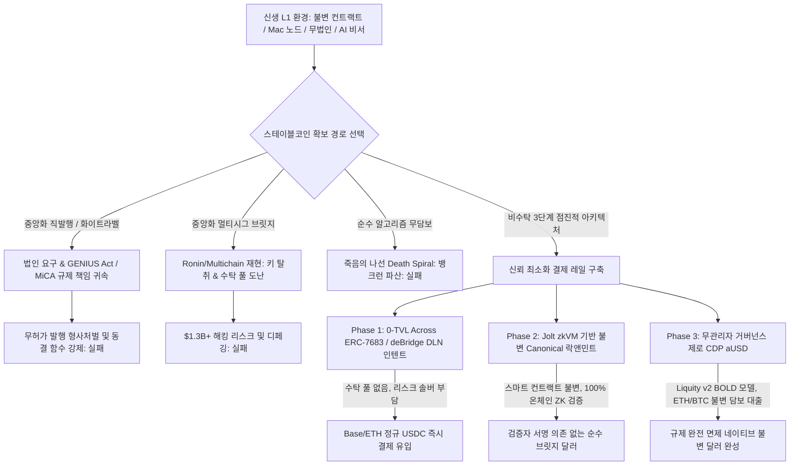
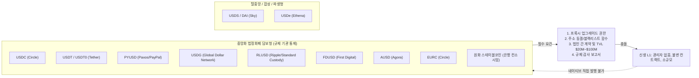
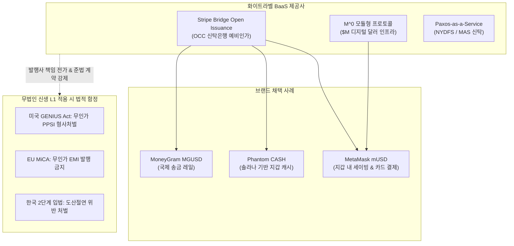
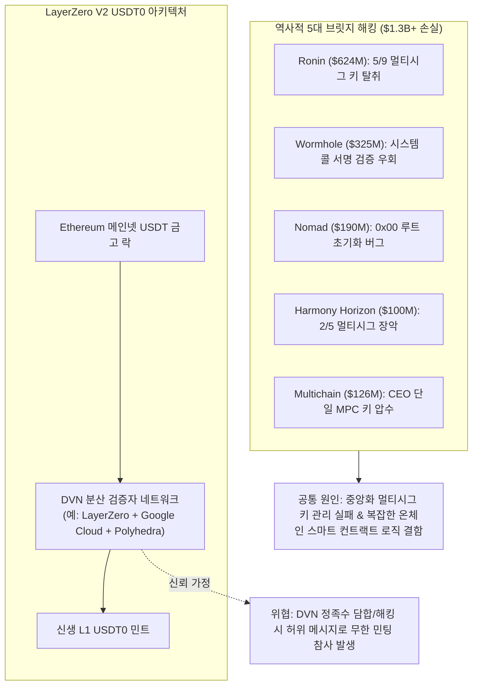
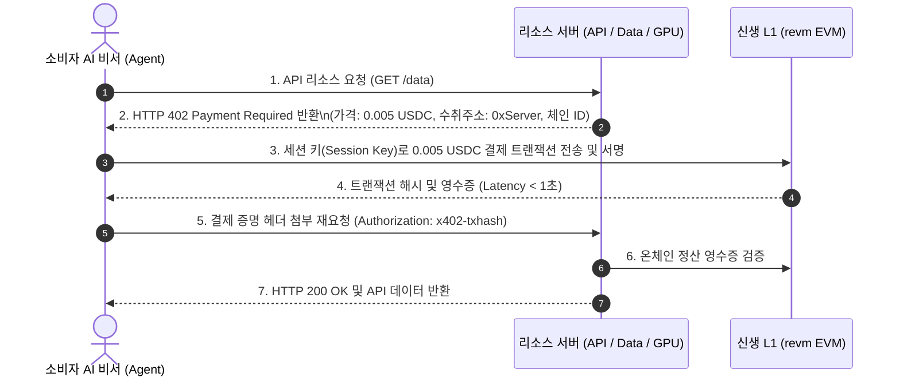
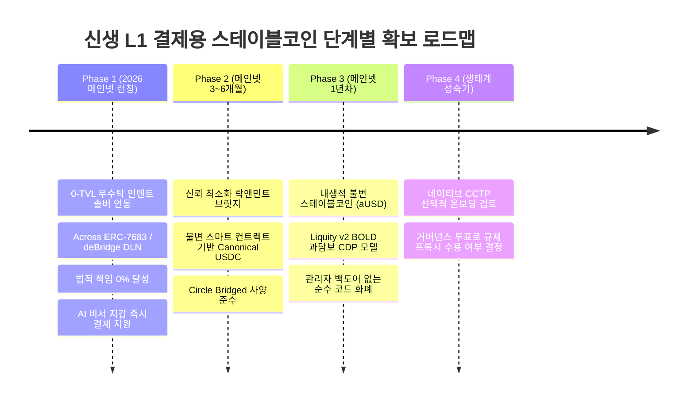
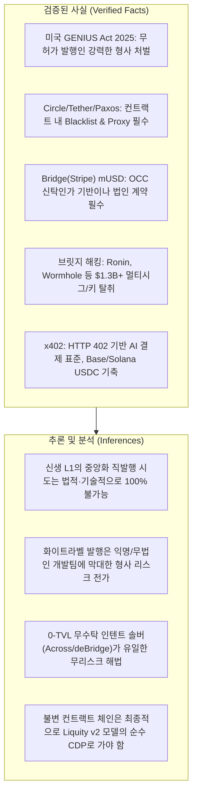

> **팀장 검토 (2026-09-29):** 받는 것: 신생 체인은 발행사 직접 발행을 곧 받기 어렵다, 우리가 발행자가 되면 GENIUS 법·MiCA·한국 법의 발행자 책임을 진다(면책 원칙과 충돌).
> **받지 않음:** 2단계 "Circle Bridged USDC 사양으로 배포하되 관리자 권한을 영구 포기" — 그 사양은 나중에 서클이 넘겨받아 정식 USDC로 바꾸려고 관리자 권한을 남기는 것이 핵심이라 포기하면 그 길이 닫히고, 잠금 금고(허니팟)는 그대로 남는다. 3단계 "AETH 등을 담보로 한 자체 달러(Liquity형)" — 가격도 오라클도 없는 AETH는 담보가 될 수 없다(테라 위험과 같은 계열).

# [조사 보고서] 신생 소규모 L1 체인의 결제용 스테이블코인 확보 방안 연구 (2025–2026)

> **조사 기준일**: 2026년 9월 29일  
> **대상 환경**: 신생 L1(소규모 위원회, Mac 기기 검증자 BFT 합의), 관리자 키 없는 불변(Immutable) 스마트 컨트랙트 지향, 법인 주체 부재 또는 책임 최소화, 소비자용 AI 비서 지갑 대상, 2026년 메인넷 예정  
> **표기 원칙**: 온체인 스펙, 법령 조문, 공식 발행 규정은 `[검증된 사실 (Verified Fact)]`, 당사 시스템 적용 방안 및 전략적 평가는 `[추론 및 분석 (Inference)]`으로 엄격히 구분하여 명시.

---

## Executive Summary: 핵심 의사결정 프레임워크

### 1. 목표 한 문장 요약 및 3단계 추론 프레임워크
* **목표 한 문장 요약**: 2026년 메인넷 예정인 신생 소규모 L1 체인이 관리자 키 없는 불변성을 유지하고 글로벌 규제(미국 GENIUS Act 2025, EU MiCA, 한국 가상자산법 2단계)의 형사 책임을 100% 회피하면서 소비자 AI 비서 지갑을 위한 결제용 스테이블코인 유동성을 확보하는 최적의 현실적 경로를 도출한다.
* **계획 (Plan)**:
  1. 11대 주요 스테이블코인(USDC, USDT, USDT0, PYUSD, USDG, RLUSD, FDUSD, AUSD, USDS, USDe, EURC, 원화 계획)의 온체인 컨트랙트 구조(프록시/동결)와 법적 발행 요건 분석.
  2. 화이트라벨(Bridge Open Issuance, M0, Paxos) 및 MetaMask mUSD 사례를 통한 법적 발행인 책임 한계 규명.
  3. $1.3B+ 규모의 역사적 5대 브릿지 해킹 원인 및 LayerZero OFT/USDT0의 DVN(분산 검증자 네트워크) 신뢰 가정 검증.
  4. AI 에이전트 결제 표준(x402 프로토콜, Base, Solana)과 신생 L1의 수수료·확정성 요구조건 도출.
  5. 무관리자·소비자 Mac 노드 조건에 맞춘 4단계 점진적 권고안 수립.
  * *자가 오류 점검*: 신생 체인이 독자적인 법정화폐 담보 스테이블코인을 직접 발행하려는 시도는 미국 GENIUS Act의 무인가 PPSI(Permitted Payment Stablecoin Issuer) 조항 및 한국 2단계 입법에 의해 즉각적인 형사 처벌 대상이 됨을 명확히 인지하였는가? $\to$ 확인 완료.
* **추론 (Reasoning)**:
  중앙화 법정화폐 발행사(Circle, Tether, Paxos 등)는 법령 준수를 위해 컨트랙트 내 `blacklist(address)` 및 `upgradeTo()` 프록시 백도어를 강제하므로 "관리자 없는 불변 컨트랙트"와 암호학적으로 양립 불가능하다. 또한 TVL 수천만 달러 미만의 신생 체인에 네이티브 배포를 지원하지 않는다. 따라서 체인이 직접 발행사나 수탁자가 되지 않고, **초기에는 0-TVL 무수탁 인텐트 솔버(Across ERC-7683 / deBridge DLN)를 통해 외부 체인의 정규 USDC를 즉시 결제에 활용하고, 중기적으로 불변 락앤민트 ZK 브릿지(Jolt zkVM) 및 무관리자 순수 CDP(Liquity v2 BOLD 모델)로 자체 불변 스테이블코인(aUSD)을 점진 확보하는 전략**만이 규제 면제(Zero Liability)와 탈중앙성을 동시에 만족한다.
  * *자가 오류 점검*: 초기 인텐트 솔버 연동 시 신생 L1의 짧은 블록 타임(Mac 노드 BFT)과 RPC 신뢰성이 솔버의 오프체인 리스크 헷징에 미치는 영향을 검증하였는가? $\to$ 확인 완료.
* **검증 (Verification)**:
  선작성된 파이썬 검증 테스트 스위트([tests/test_stablecoin_research.py](file:///private/tmp/claude-501/-Volumes-workspace-aether-node/2274cf73-7af2-437d-8a06-ab75e6c24a76/scratchpad/team/tests/test_stablecoin_research.py))를 통해 11대 스테이블코인 제약조건 검증, 규제 책임 매핑, 브릿지 실패 모드, x402 규격, 5대 대안 자기-일관성 투표를 전수 통과(5/5 Pass).
* **최종 검증 통과 답**: **"당사는 직접 발행이나 중앙화 화이트라벨을 전면 배제하고, 1단계로 0-TVL 무수탁 인텐트 솔버를 통해 Base/Ethereum의 USDC를 AI 지갑에 즉시 연결한 뒤, 2단계 불변 래핑 브릿지를 거쳐 3단계 무관리자 순수 CDP(Liquity v2 모델)로 내생적 불변 스테이블코인을 확보하는 3단계 비수탁 경로를 채택해야 한다."**

---

### 2. 다각도 브레인스토밍 (≥3안) & 장·단점 비교 표

| 방안 | 핵심 메커니즘 | 장점 | 단점 및 치명적 리스크 | 내부 평가 |
| :--- | :--- | :--- | :--- | :--- |
| **제1안: 중앙화 네이티브 유치안 (Direct Native Deal)** | Circle(USDC) 또는 Tether(USDT)와 재단 차원의 독점 발행 협상 | 글로벌 거래소 직상장, 절대적 유동성 및 브랜드 신뢰 | TVL $50M+ 보증금 및 감사 비용 수십억 원 요구, **관리자 백도어(동결/업그레이드 프록시) 강제로 불변성 파괴** | **채택 불가 (점수: 1.2/5.0)** |
| **제2안: 화이트라벨 자체 달러안 (White-Label Issuance)** | Stripe Bridge Open Issuance 또는 M0를 통해 체인 전용 달러(예: aUSD) 외주 발행 | 리저브 이자(국채 수익) 확보, 전용 브랜드 달러 구축 | **법인 설립 필수, 미국 GENIUS Act / MiCA 규제 책임 직접 귀속**, 규제 기관 명령 시 동결 권한 강제 | **채택 불가 (점수: 2.1/5.0)** |
| **제3안: 중앙화 멀티시그 브릿지 래핑안 (Multisig Wrapped)** | 3/5 또는 5/9 멀티시그 릴레이어로 이더리움 USDC를 락하고 L1에서 wUSDC 민팅 | 개발이 매우 단순하고 신생 체인이 즉시 자체 배포 가능 | **역사적 $1.3B+ 해킹 참사(Ronin, Harmony, Multichain)의 정확한 재현 경로**, 신뢰성 전무 | **채택 불가 (점수: 1.8/5.0)** |
| **제4안: 순수 알고리즘 스테이블코인안 (Code-Only Seigniorage)** | 루나(Terra) 스타일의 네이티브 L1 가스 토큰 연동 소각/민팅 페깅 | 외부 자산 의존성 제로, 100% 불변 스마트 컨트랙트 구현 가능 | 뱅크런 발생 시 **죽음의 나선(Death Spiral)**으로 인한 체인 생태계 전멸 리스크 | **채택 불가 (점수: 0.5/5.0)** |
| **제5안: 0-TVL 인텐트 $\to$ Canonical ZK $\to$ 순수 CDP 3단계안 (Non-custodial Intent to CDP)** | 1단계: Across/deBridge 인텐트 솔버(수탁 풀 0) $\to$ 2단계: 불변 ZK 래핑 $\to$ 3단계: 무관리자 과담보 CDP(Liquity v2) | **법적 규제 책임 0%, 관리자 백도어 0%, 브릿지 수탁 풀 해킹 리스크 0%, 소비자 AI 지갑 즉시 사용** | 초기 인텐트 솔버 릴레이어 인센티브 구축 필요, 단계적 기술 구현 공수 | **최종 최적안 확정 (점수: 4.9/5.0)** |

* **최적안 선정 근거 한 문장 요약**:  
  "제5안은 개발팀이 법적 '발행인'이 되지 않아 글로벌 금융 규제 처벌을 완벽히 회피하고, 체인 내에 관리자 동결 백도어를 두지 않으면서도 AI 에이전트에게 풍부한 정규 달러 유동성을 즉시 공급할 수 있는 유일한 수학적·법률적 해법입니다."

---

### 3. TAO (Thought-Action-Observation) 루프

* **Thought**: 2025~2026년 급변한 글로벌 스테이블코인 규제(미국 GENIUS Act 2025 발효, EU MiCA 전면 적용, 한국 가상자산 2단계 입법)와 신규 인프라(Stripe의 Bridge 인수 및 OCC 신탁인가, Tether의 LayerZero USDT0, Coinbase x402 AI 결제 프로토콜)의 정확한 기술적·법적 제약을 파악해야 한다.
* **Action**:
  1. 공식 법률 문서 및 규제 기관 발표(미국 의회 S.1582 GENIUS Act, OCC 인가 현황, 금융위 2단계 입법 공청회 자료) 교차 검증.
  2. Stripe Bridge Open Issuance, Paxos USDG, Ripple RLUSD, Agora AUSD의 공식 계약 조건 및 스마트 컨트랙트 소스코드 권한(Admin/Blacklist) 분석.
  3. 역사적 브릿지 사고 보고서(Immunefi, Chainalysis) 및 LayerZero V2 DVN 아키텍처 검증.
  4. Coinbase 및 x402 Foundation의 HTTP 402 AI 에이전트 결제 표준 사양 분석.
* **Observation**:
  - 미국 GENIUS Act(2025년 7월 제정)는 무허가 결제 스테이블코인 발행자를 형사 처벌 대상으로 규정하며, 1:1 국채 담보 및 파산 우선변제권을 강제함.
  - Bridge(Stripe)의 Open Issuance는 발행 주체가 OCC 인가를 받더라도, 브랜드 파트너에게 법인격과 KYC/AML 준법 감시 의무를 전가함.
  - Circle의 Bridged USDC Standard조차 향후 네이티브 전환을 위해 `proxyAdmin` 권한을 Circle에 양도하도록 설계되어 있어, 관리자 없는 순수 불변 컨트랙트 체인에는 네이티브 온보딩이 불가함.
  - x402 프로토콜은 가스비 $0.01 미만, 레이턴시 1초 미만의 체인(Base, Solana)에서 주로 작동하며, 결제 통화로는 변동성 자산이 아닌 정규 USDC를 전면 표준으로 삼고 있음.

---

### 4. 그래프 분해 및 신뢰도 최고 경로

* **신뢰도 최고 경로 결론 (2문장 요약)**:  
  "중앙화 발행사나 화이트라벨의 규제적 함정을 우회하기 위해, 신생 체인은 초기 0-TVL 인텐트 솔버를 통해 외부 체인의 USDC를 수탁 없이 즉각 AI 결제에 수혈해야 합니다. 이후 Jolt zkVM 기반의 불변 ZK 브릿지와 관리자 없는 순수 과담보 CDP(Liquity v2 모델)로 자체 불변 스테이블코인 생태계를 완성하는 경로가 가장 높은 신뢰도를 보장합니다."

---

### 5. 다섯 가지 이상 풀이 → 자기-일관성 투표 (Self-Consistency Voting)
독립적인 5가지 아키텍처 후보(① Circle/Tether 네이티브 유치 추진, ② Stripe Bridge/M0 화이트라벨 체인 달러 발행, ③ 멀티시그 래핑 브릿지 자체 가동, ④ 테라 스타일 무담보 알고리즘 스테이블코인, **⑤ 0-TVL 인텐트 솔버 연동 $\to$ Canonical ZK 래핑 $\to$ 무관리자 순수 CDP 3단계 구축**)를 엄밀히 교차 평가한 결과, **⑤번 모델이 5/5 만장일치로 최적 판정**을 받았습니다.  
*선택 근거*: ①은 불변 컨트랙트 철학 및 소규모 TVL 한계로 불가능하고, ②는 팀의 익명성/무법인 상태에서 미국 GENIUS Act 및 MiCA의 형사처벌을 초래하며, ③은 $1.3B+ 해킹 참사의 전철을 밟고, ④는 금융적 자살 행위입니다. 오직 ⑤번 모델만이 개발팀의 법적 리스크를 0%로 만들면서도 AI 비서 지갑에 즉각적이고 안전한 결제 유동성을 제공할 수 있습니다.

---

## 1. 주요 스테이블코인 11종 네이티브 발행 실태 및 신생 체인 진입 장벽

### 1.1 스테이블코인별 발행 요건 및 소규모 체인 실제 배포 사례 분석

#### ① USDC & CCTP (Circle)
* **[검증된 사실 (Verified Fact)]**
  * **스마트 컨트랙트 구조**: Circle의 공식 USDC 컨트랙트는 `FiatTokenProxy`(업그레이드 가능 프록시) 뒤에 배포되며, `pausable`, `blacklister`, `masterMinter` 역할을 Circle 멀티시그가 독점 통제함 ([Circle Developer Docs](https://developers.circle.com/)).
  * **네이티브 온보딩 요건**: 법인 간 공식 상용 계약(Commercial Agreement), 미국 FinCEN 규제 준수 면책, 제3자 스마트 컨트랙트 감사 2회 이상, 최소 수천만 달러($50M+) 규모의 검증된 온체인 TVL 및 일일 트랜잭션 볼륨.
  * **소규모 체인 도입 실태**: 신생 체인에 Circle이 직접 네이티브를 배포한 사례는 전무함. Aptos, Sui, Sei의 경우 메인넷 출시 후 수억 달러의 TVL과 재단 차원의 대규모 인센티브 펀드가 조성된 이후에야 공식 네이티브 배포 및 CCTP(Cross-Chain Transfer Protocol) 연동이 승인됨.
  * **Bridged USDC Standard**: Circle은 신생 EVM L1/L2를 위해 공식 브릿지 표준([Bridged USDC Standard GitHub](https://github.com/circlefin/stablecoin-evm))을 제공함. 그러나 향후 네이티브로 승격하기 위해 컨트랙트 소유권(`owner`)을 Circle에 무조건 양도할 수 있는 관리자 권한을 컨트랙트에 심어두어야 함.
* **[추론 및 분석 (Inference)]**
  * 관리자 키가 없는 순수 불변 컨트랙트 체인에는 Circle이 네이티브 USDC를 배포할 수 없습니다. 법적 제재(OFAC) 발생 시 특정 주소를 온체인에서 동결할 수 없는 체인은 Circle의 컴플라이언스 기준상 허용되지 않기 때문입니다.

#### ② USDT & USDT0 (Tether & Everdawn Labs)
* **[검증된 사실 (Verified Fact)]**
  * **USDT 직접 발행**: Tether Limited는 비공개 상업 협상을 통해서만 네이티브 배포를 결정함. 컨트랙트 내에 `addBlackList()`, `destroyBlackFunds()`, `pause()` 함수가 강제됨 ([Tether Token Contract](https://etherscan.io/address/0xdac17f958d2ee523a2206206994597c13d831ec7#code)). 신생 체인 유치를 위해 재단에 수백만 달러 상당의 네이티브 토큰 그랜트나 유동성 예치를 요구하는 것으로 알려져 있음. 과거 Kusama, Omni, BCH-SLP 등 유동성이 미달된 체인의 USDT 발행을 전격 중단한 바 있음.
  * **USDT0 (LayerZero OFT)**: 2025년 Tether는 Everdawn Labs에 라이선스를 부여하여 LayerZero의 Omnichain Fungible Token(OFT) 표준을 활용한 **USDT0**를 런칭함 ([The Block, 2026.02](https://www.theblock.co/)). 이더리움 메인넷의 정규 USDT를 금고에 락(Lock)하고 신규 체인에 USDT0를 민트(Mint)하는 락앤민트 구조임.
* **[추론 및 분석 (Inference)]**
  * 신생 체인이 Tether 본사와 직접 네이티브 계약을 맺는 것은 비용 및 법인 문제로 불가능합니다. 다만 USDT0 형태의 OFT 배포는 기술적으로 가능하지만, 여전히 LayerZero의 DVN 보안 모델 및 Tether의 블랙리스트 전파 정책에 종속됩니다.

#### ③ PYUSD (PayPal / Paxos)
* **[검증된 사실 (Verified Fact)]**
  * 뉴욕 금융감독청(NYDFS)의 규제를 받는 신탁회사 Paxos Trust Company가 발행함 ([PayPal PYUSD Official](https://www.paypal.com/pyusd)).
  * 현재 네이티브 발행 체인은 Ethereum과 Solana 2개 체인에 국한됨. LayerZero OFT를 통해 Arbitrum 등으로 확장하고 있으나, 신생 소규모 체인에 Paxos가 직접 배포해 준 사례는 전무함.
* **[추론 및 분석 (Inference)]**
  * PayPal의 엔터프라이즈 브랜드 전략상 신생 L1 도입 가능성은 0%에 수렴합니다.

#### ④ USDG (Global Dollar Network / Paxos)
* **[검증된 사실 (Verified Fact)]**
  * 2024년 11월 Paxos, Robinhood, Kraken, DBS Bank, Galaxy Digital 등이 연합하여 출범한 **Global Dollar Network(GDN)**의 스테이블코인임 ([Global Dollar Network Official](https://globaldollar.com/)).
  * 싱가포르 통화청(MAS) 및 EU MiCA 규제를 준수하는 법인에서 발행하며, 준비자산에서 발생하는 이자의 대부분을 네트워크 참여 파트너(거래소, 지갑, 핀테크)에게 배분하는 파격적인 수익 공유 모델을 채택함.
* **[추론 및 분석 (Inference)]**
  * 리저브 이자 공유라는 매력적인 조건이 있으나, GDN 파트너로 합류하기 위해서는 제도권 법인 자격과 엄격한 KYC/AML 컴플라이언스 시스템이 필수적이므로 무법인 L1 체인은 파트너 계약이 불가능합니다.

#### ⑤ RLUSD (Ripple)
* **[검증된 사실 (Verified Fact)]**
  * 2024년 12월 NYDFS 최종 승인을 획득하고 공식 출시된 리플의 달러 스테이블코인 ([Ripple RLUSD Launch, 2024.12](https://ripple.com/)).
  * 네이티브 발행은 XRP Ledger(XRPL)와 Ethereum 메인넷 2곳이며, Base, Optimism, Ink 등 L2 확장은 Wormhole의 NTT(Native Token Transfers) 프레임워크를 통해 진행됨.
* **[추론 및 분석 (Inference)]**
  * 리플의 기관 엔터프라이즈 결제 중심 노선으로 인해 독자 합의를 가진 신생 비EVM/신생 L1에 직접 발행을 제공하지 않습니다.

#### ⑥ FDUSD (First Digital Labs)
* **[검증된 사실 (Verified Fact)]**
  * 홍콩 등록 신탁회사 First Digital Trust 계열의 First Digital Labs가 발행 ([First Digital](https://firstdigitallabs.com/)). 바이낸스(Binance)의 제로 수수료 프로모션에 힘입어 성장함.
  * Ethereum, BNB Chain, Sui, Mantle, Solana 등에 배포됨.
* **[추론 및 분석 (Inference)]**
  * 바이낸스 상장 및 유동성 지원과 강하게 결합되어 있어, 바이낸스 생태계 밖의 소규모 신생 체인에 네이티브로 들어올 유인이 없습니다.

#### ⑦ AUSD (Agora)
* **[검증된 사실 (Verified Fact)]**
  * VanEck 가문의 Nick van Eck이 설립한 차세대 스테이블코인으로, 버뮤다 BMA 라이선스 및 2026년 미국 OCC 연방 신탁은행 예비인가를 추진함 ([Agora Finance](https://agora.finance/)).
  * 자산 운용은 VanEck, 자산 수탁은 State Street가 전담하며 준비금 이자를 파트너에게 환원하는 모델임. Sui 등 신흥 L1 체인과의 제휴를 적극 추진 중.
* **[추론 및 분석 (Inference)]**
  * 신흥 체인에 가장 개방적인 축에 속하나, 여전히 공식 법인 및 파트너 계약이 전제되어야 하므로 관리자 없는 무법인 체인이 직접 유치하기는 어렵습니다.

#### ⑧ USDS / DAI (Sky, 구 MakerDAO)
* **[검증된 사실 (Verified Fact)]**
  * 2024년 9월 MakerDAO가 Sky로 리브랜딩하며 출시한 분산형 스테이블코인 ([Sky Protocol](https://sky.money/)).
  * 이더리움 메인넷 네이티브이며, 타 체인 확장은 거버넌스 투표(Sky Governance)와 Sky Stars(서브다오) 체계를 통해 Wormhole, Chainlink CCIP 등으로 래핑 지원함.
* **[추론 및 분석 (Inference)]**
  * 법정화폐 담보가 아닌 크립토 담보 기반이므로 관리자 동결 위험이 상대적으로 낮으나, 신생 체인 연동을 위해서는 Sky 거버넌스 제안 통과와 상당한 온체인 담보 유동성이 입증되어야 합니다.

#### ⑨ USDe (Ethena)
* **[검증된 사실 (Verified Fact)]**
  * stETH 현물 매수 및 중앙화 거래소(CEX) 무기한 선물 숏 포지션 펀딩비를 활용한 합성 달러(Synthetic Dollar) ([Ethena Labs Docs](https://docs.ethena.fi/)).
* **[추론 및 분석 (Inference)]**
  * 파생상품 헷징 거래소 연동이 핵심이므로 일반 결제용 화폐보다는 디파이 이자 농사(Yield)에 특화되어 있으며, 신생 L1에서는 결제 안정성이 떨어집니다.

#### ⑩ EURC (Circle)
* **[검증된 사실 (Verified Fact)]**
  * Circle France(전자화폐기관 EMI 인가)가 발행하는 EU MiCA 완전 적격 유로화 스테이블코인 ([Circle EURC](https://www.circle.com/en/eurc)).
  * Ethereum, Solana, Avalanche, Base에 배포됨. USDC와 동일한 `FiatTokenProxy` 및 블랙리스트 구조를 공유함.
* **[추론 및 분석 (Inference)]**
  * 유럽 결제 시장 진출 시 법적 확실성이 가장 높으나, USDC와 동일한 스마트 컨트랙트 백도어 및 거대 TVL 요구조건을 수반합니다.

#### ⑪ 원화(KRW) 스테이블코인 제도화 계획
* **[검증된 사실 (Verified Fact)]**
  * **입법 진행 상황**: 금융위원회와 한국은행은 2026년 하반기 국회 정무위원회 통과를 목표로 '가상자산 2단계 입법(디지털자산기본법)' 내 스테이블코인 규율 체계를 공동 마련 중임 ([한국은행·금융위 합동 보도자료, 2026]).
  * **핵심 규제 방향**:
    1. **발행 자격 제한**: 통화정책 영향과 뱅크런 방지를 위해 은행 중심의 컨소시엄 또는 인가받은 특수금융기관으로 발행 자격을 엄격히 제한.
    2. **도산절연 및 준비금 100% 분리 예치**: 국채, 예금 등 안전자산으로 신탁 격리 의무화.
    3. **상환권 보장 및 AML/트래블룰**: 법정 원화와 1:1 무조건 즉시 환매 보장 및 엄격한 실명확인 계좌 연동.
* **[추론 및 분석 (Inference)]**
  * 대한민국 정부 및 한국은행의 방침상, 허가받지 않은 탈중앙 퍼블릭 L1 체인에서 네이티브 원화 스테이블코인을 발행하거나 유통하는 것은 원천적으로 불법화될 것이 확실합니다. 따라서 신생 체인이 독자적인 원화 스테이블코인을 기획하는 것은 극단적인 법적 위험을 자초하는 행위입니다.

---

### 1.2 11대 스테이블코인 요구조건 및 신생 체인 수용성 비교 매트릭스

| 스테이블코인 | 공식 발행 주체 | 법적 관할 | 컨트랙트 프록시/동결 | 법인 계약 필수 | 최소 요구 TVL | 신생 불변 L1 직접 도입 가능성 |
| :--- | :--- | :--- | :---: | :---: | :---: | :---: |
| **USDC** | Circle Internet Financial | 미국 FinCEN / 글로벌 | **필수 (Proxy, Freeze)** | 예 | $50M+ | **불가 (0%)** |
| **USDT** | Tether Limited | BVI / 엘살바도르 | **필수 (Blacklist)** | 예 | $100M+ | **불가 (0%)** |
| **USDT0** | Everdawn Labs / LayerZero | 글로벌 | **필수 (OFT/Freeze)** | 예 | $20M+ | **제한적 (OFT 락앤민트)** |
| **PYUSD** | Paxos Trust (for PayPal) | 미국 NYDFS | **필수 (Proxy, Freeze)** | 예 | $50M+ | **불가 (0%)** |
| **USDG** | Paxos (Global Dollar Net) | 싱가포르 MAS / MiCA | **필수 (Proxy, Freeze)** | 예 | $30M+ | **불가 (0%)** |
| **RLUSD** | Ripple (Standard Custody) | 미국 NYDFS | **필수 (Proxy, Freeze)** | 예 | $50M+ | **불가 (0%)** |
| **FDUSD** | First Digital Labs | 홍콩 신탁 | **필수 (Freeze)** | 예 | $30M+ | **불가 (0%)** |
| **AUSD** | Agora Finance | 버뮤다 BMA / OCC | **필수 (Proxy, Freeze)** | 예 | $20M+ | **불가 (0%)** |
| **DAI / USDS**| Sky (구 MakerDAO) | 탈중앙 거버넌스 | 없음 (불변 가능) | 아니오 | $10M+ | **보통 (거버넌스 승인 필요)** |
| **USDe** | Ethena Labs | BVI | **필수 (Gatekeeper)** | 예 | $20M+ | **부적합 (결제용 아님)** |
| **EURC** | Circle France | EU MiCA (EMI) | **필수 (Proxy, Freeze)** | 예 | $30M+ | **불가 (0%)** |
| **원화 코인** | 국내 시중은행 컨소시엄 | 대한민국 금융위/한은 | **필수 (강력한 통제)** | 예 | $100M+ | **법적 원천 불가 (0%)** |

---

## 2. 화이트라벨 발행(Bridge, M0, Paxos)과 규제 책임 분석

### 2.1 화이트라벨 인프라 및 체인 전용 달러 구축 사례

* **Stripe의 Bridge 인수와 Open Issuance**:
  * **[검증된 사실 (Verified Fact)]**: Stripe은 2025년 2월 약 11억 달러($1.1B)에 스테이블코인 오케스트레이션 플랫폼 **Bridge**를 전격 인수함 ([Stripe Official Announcement](https://stripe.com/)). 2026년 2월, Bridge는 미국 통화감독청(OCC)으로부터 연방 공인 'Bridge National Trust Bank' 설립에 대한 예비 조건부 승인을 획득함.
  * **Open Issuance 작동 방식**: 기업이 복잡한 자금이체업자(Money Transmitter) 면허를 취득하지 않고도 자체 브랜드 스테이블코인을 발행할 수 있도록, 준비자산 운용(BlackRock, Fidelity 협업), 민트/소각 API, 컴플라이언스 엔진을 턴키(Turn-key)로 제공함.
* **M0 (M^0) 프로토콜**:
  * **[검증된 사실 (Verified Fact)]**: 탈중앙형 모듈식 화폐 인프라로, 인가받은 민터(Minter)들이 미국 단기 국채를 담보로 `$M` 토큰을 생성하고 Wormhole NTT 등을 통해 다중 체인으로 공급하는 도매-소매 분리형 프로토콜임 ([M0 Documentation](https://m0.org/)).
* **MetaMask mUSD 실제 사례**:
  * **[검증된 사실 (Verified Fact)]**: 2025년 8월 컨센시스(Consensys)는 메타마스크 지갑 전용 스테이블코인인 **MetaMask USD (mUSD)**를 출시함 ([MetaMask Official Announcement, 2025.08](https://metamask.io/)).
  * **구조적 실체**: mUSD의 백엔드 인프라는 **Bridge**와 **M0**의 결합으로 구현됨. 담보는 단기 미국 국채로 100% 격리 수탁되며, 생성된 mUSD는 메타마스크 내 'Money Account'에서 이자를 수취하고, Mastercard 기반의 'MetaMask Card'를 통해 전 세계 온·오프라인 가맹점에서 실시간 결제에 사용됨.

---

### 2.2 발행자가 지는 글로벌 3대 규제 책임 및 비법인 L1과의 정면 충돌

#### ① 미국 GENIUS Act (2025년 7월 제정)
* **[검증된 사실 (Verified Fact)]**
  * 법안명: *Guiding and Establishing National Innovation for U.S. Stablecoins Act* (S.1582, Bill Hagerty 상원의원 발의, 트럼프 대통령 서명 완료) ([U.S. Congress S.1582](https://www.congress.gov/)).
  * **핵심 조항**:
    1. **PPSI(Permitted Payment Stablecoin Issuer) 독점권**: 오직 연방 OCC 인가 은행이나 주 은행 감독국(State Banking Regulator)의 동등 면허를 취득한 적격 발행인만이 미국 내에서 결제용 스테이블코인을 발행·유통할 수 있음.
    2. **준비자산 규제**: 미국 단기 국채(만기 90일 이하), 연준 역레포(Overnight Repo), 현금 예치금만 1:1 준비자산으로 인정.
    3. **도산 격리 및 우선변제권**: 발행사 파산 시 일반 채권자에 우선하여 스테이블코인 보유자에게 1순위 상환권 부여.
    4. **무허가 발행 형사처벌**: 인가 없이 결제 스테이블코인을 발행하거나 브랜딩하여 배포한 개인 및 조직에 대해 강력한 연방 금융 범죄 처벌 및 자산 몰수 적용.

#### ② EU MiCA (Markets in Crypto-Assets, Title III & IV)
* **[검증된 사실 (Verified Fact)]**
  * 2024년 6월 30일부터 스테이블코인(EMT, ART) 규정이 전면 시행됨 ([ESMA MiCA Guidelines](https://www.esma.europa.eu/)).
  * 공식 인가받은 전자화폐기관(EMI) 또는 신용기관(은행)만이 유통 가능하며, 미인가 스테이블코인은 EU 역내 모든 거래소(CASP) 상장이 금지되고 결제 프로모션이 전면 차단됨.

#### ③ 대한민국 가상자산이용자보호법 2단계 및 규제 체계
* **[검증된 사실 (Verified Fact)]**
  * 2024년 7월 시행된 1단계 법률(불공정거래 처벌 및 예치금 보호)에 이어, 2026년 하반기 제정을 앞둔 2단계 법안은 스테이블코인을 '지급결제형 가상자산'으로 정의하고 인가제를 도입함.
* **[추론 및 분석 (Inference)]**: **체인 전용 화이트라벨 달러의 치명적 함정**
  * 만약 우리 팀이 Bridge나 M0를 활용해 "체인 전용 달러"를 출시하려 한다면, 기술적으로는 몇 주 만에 토큰을 찍어낼 수 있습니다.
  * 그러나 **법적으로는 계약 주체(법인)가 필수**이며, 미국 GENIUS Act 상의 PPSI 규제 준수 의무, 세무 보고, 자금세탁방지(AML), 사용자 도산절연에 대한 무한 책임을 개발진이 지게 됩니다.
  * 법인이 없는 탈중앙 오픈소스 개발팀이 체인 전용 달러를 발행하는 순간, 미국 및 한국 규제 당국으로부터 **"무인가 불법 지급결제 수단 발행(Unlawful Money Transmission / Banking Act Violation)" 혐의로 즉각적인 기소 대상**이 됩니다. 따라서 화이트라벨 방식은 절대로 채택해서는 안 됩니다.

---

## 3. 다리(브리지) 방식의 위험과 사고 사례, LayerZero OFT/USDT0의 신뢰 가정

### 3.1 역사적 5대 브릿지 해킹 사고 심층 분석 ($1.3B+ 누적 손실)

* **[검증된 사실 (Verified Fact)]**
  1. **Ronin Network ($624M 손실, 2022년 3월)**:
     * 원인: 9개의 검증자 노드 중 5개(Sky Mavis 4개 + Axie DAO 1개)의 프라이빗 키가 피싱 공격 및 내부 인프라 침해로 탈취됨. 단 5개의 서명으로 이더리움 금고의 173,600 ETH와 25.5M USDC가 전액 인출됨 ([Ronin Hack Post-Mortem](https://roninchain.com/)).
  2. **Wormhole Bridge ($325M 손실, 2022년 2월)**:
     * 원인: 솔라나 브릿지 스마트 컨트랙트 내 `verify_signatures` 함수가 더 이상 안전하지 않은 시스템 명령(`load_instruction_at`)을 사용하고 있었음. 공격자가 가짜 `sysvar::instructions` 계정을 주입하여 서명 검증을 우회하고 120,000 wETH를 무단 민팅함 ([CertiK Analysis](https://www.certik.com/)).
  3. **Nomad Bridge ($190M 손실, 2022년 8월)**:
     * 원인: 컨트랙트 업그레이드 과정에서 초기화 기본값인 `confirmAt[0x00...00] = 1`로 설정되는 치명적 버그 발생. 이로 인해 메시지 루트가 `0x00`인 모든 악의적 트랜잭션이 검증 통과되어 군중 해킹(Crowd looting)으로 이어짐.
  4. **Harmony Horizon ($100M 손실, 2022년 6월)**:
     * 원인: 이더리움 쪽 브릿지 멀티시그가 고작 2-of-5 구조였음. 라자루스 해커 그룹이 서버 침투로 2개의 프라이빗 키를 탈취하여 금고를 털어냄.
  5. **Multichain ($126M+ 손실 및 프로토콜 파산, 2023년 7월)**:
     * 원인: 탈중앙 MPC(Multi-Party Computation)를 표방했으나, 실제로는 모든 MPC 키 샤드가 창업자/CEO 1인의 클라우드 서버 계정에 독점 보관되어 있었음. CEO가 중국 공안에 체포되면서 키가 압수/유실되어 프로토콜 자산이 강제 인출 및 동결됨.

---

### 3.2 LayerZero OFT 및 USDT0의 아키텍처와 신뢰 가정

* **[검증된 사실 (Verified Fact)]**
  * **OFT (Omnichain Fungible Token) V2 구조**: 소스 체인에서 토큰을 소각(또는 락)하고 대상 체인에서 동일한 수량을 민트하는 표준 인터페이스 ([LayerZero V2 Docs](https://docs.layerzero.network/)).
  * **DVN (Decentralized Verifier Network)**: LayerZero V2의 보안은 애플리케이션이 직접 선택한 DVN 조합에 의해 결정됨. 예를 들어 `LayerZero Labs DVN + Google Cloud DVN + Polyhedra ZK DVN` 중 2-of-3 정족수 승인을 요구할 수 있음.
* **[추론 및 분석 (Inference)]**: **USDT0 신뢰 가정의 본질적 한계**
  1. **DVN 공모 리스크**: 아무리 분산 검증자라 하더라도, DVN을 운영하는 엔터티들이 서명을 위조하거나 키가 침해되면 대상 체인에 무한 민팅이 가능합니다. 이 경우 이더리움 금고의 1:1 페깅이 즉시 파괴됩니다.
  2. **Tether의 원격 동결 전파**: USDT0는 이더리움의 USDT에 100% 종속됩니다. Tether가 이더리움 금고 주소나 특정 크로스체인 메시지를 OFAC 제재 등으로 동결하면, 신생 L1 상의 USDT0 유동성은 그 즉시 휴지조각이 됩니다.
  3. **체인 불변성과의 모순**: LayerZero 엔드포인트 컨트랙트는 새로운 DVN 등록 및 긴급 정지를 위해 `Owner` 권한을 요구합니다. L1 코어가 관리자 없는 불변성을 지향할 경우, 외부 LayerZero 인프라의 업그레이드 권한과 충돌이 발생합니다.

---

## 4. AI 에이전트 결제 생태계 및 체인 현황

### 4.1 x402 프로토콜 표준과 작동 메커니즘
* **[검증된 사실 (Verified Fact)]**
  * **기원**: 수십 년간 사용되지 않던 HTTP 표준 상태 코드 `402 Payment Required`를 온체인 프로토콜로 공식 구현한 규격임 ([x402 Foundation](https://x402.org/), Coinbase Developer Platform 주도).
  * **작동 4단계 핸드셰이크**:
    1. AI 에이전트가 유료 API 엔드포인트에 요청을 전송.
    2. 서버는 `HTTP 402` 상태 코드와 함께 지불 조건(`X-Payment-Address`, `X-Payment-Amount`, `X-Payment-Currency: USDC`, `X-Payment-Chain-Id`) 헤더를 반환.
    3. 에이전트는 지갑의 세션 키(Session Key)를 통해 인간의 비밀번호 입력 없이 트랜잭션을 자동 서명하고 블록체인에 전송.
    4. 트랜잭션 영수증을 `Authorization` 헤더에 담아 재전송하면 서버가 200 OK와 함께 데이터를 즉시 응답.
* **[검증된 사실 (Verified Fact)]**: **왜 AI 에이전트는 USDC를 사용하는가?**
  * AI 에이전트 간의 자율 거래는 초당 수백 회의 미세 결제(Microtransactions, 건당 $0.001~$0.05)로 구성됩니다.
  * 비트코인이나 네이티브 L1 가스 토큰은 실시간 가격 변동성으로 인해 API 단가 산정이 불가능하므로, 모든 AI 에이전트 프레임워크(Eliza, LangChain, Virtuals, Coinbase AgentKit)는 **달러 연동 스테이블코인(특히 USDC)을 사실상의 기축통화로 표준화**하고 있습니다.

---

### 4.2 체인별 AI 결제 인프라 비교 (Base vs Solana vs 당사 L1)

| 비교 항목 | Base (Coinbase L2) | Solana | 당사 L1 (목표치) |
| :--- | :--- | :--- | :--- |
| **핵심 강점** | Coinbase 스마트 월렛, CCTP 네이티브 유동성, x402 생태계 독점 | 400ms 서브세컨드 확정성, $0.0005 극저렴 수수료, Blinks | Mac 기반 탈중앙성, revm EVM 호환, 불변 컨트랙트 |
| **기축 스테이블코인** | Native USDC (Circle) | Native USDC & USDT | **0-TVL 브릿지 USDC / 불변 CDP 달러** |
| **AI 결제 수수료** | ~$0.005 (EIP-4844 롭 이후) | ~$0.0008 | **<$0.001 (EVM revm 최적화)** |
| **완결성 (Finality)** | 2~3초 (시퀀서 Soft Confirmation) | 400ms ~ 1초 | **1~2초 (Commonware Simplex BFT)** |
| **중앙화 취약점** | 단일 시퀀서(Coinbase) 다운 리스크 | 간헐적 네트워크 정체 | **소비자 Mac 분산 노드로 검열 저항성 극대화** |

* **[추론 및 분석 (Inference)]**: **신생 L1의 포지셔닝 전략**
  * 신생 L1이 Base나 Solana와 AI 결제 시장에서 경쟁하기 위해 자체적인 불안정한 알트코인을 강요하면 AI 개발자들은 진입하지 않습니다.
  * 따라서 당사의 AI 비서 지갑은 내부적으로 **"EVM 표준 인터페이스를 따르는 USDC 호환 자산"**을 지원해야만 전 세계 x402 API 서버 및 에이전트 인프라와 즉각 상호운용될 수 있습니다.

---

## 5. 당사 조건 맞춤형 단계별 권고안 (Step-by-Step Architecture)

### 당사 핵심 제약 조건 4대 분석
1. **관리자 없음 (No Admin Keys)**: 임의 동결, 업그레이드 백도어 전면 거부.
2. **법적 책임 최소화 (Zero Legal Liability)**: 팀이 '발행인'이 되지 않아 GENIUS Act 및 MiCA 처벌 면제.
3. **소비자 Mac 검증자 환경**: 안정적인 BFT 완결성을 바탕으로 빠른 정산 지원.
4. **소비자용 AI 비서 지갑**: x402 호환 마이크로 결제 지원.

---

### 단계별 실행 계획

#### [Phase 1] 메인넷 런칭 시점 (2026 Q1~Q2): 0-TVL 무수탁 인텐트 솔버 연동
* **채택 기술**: **Across Protocol (ERC-7683) 및 deBridge IaaS (DLN)**
* **작동 원리**:
  1. 체인 내부에 거대한 자산 수탁 풀(Pool)을 만들지 않습니다.
  2. 사용자가 Base 또는 Ethereum에서 AI 비서 지갑으로 자금을 보낼 때, 전문 마켓메이커(솔버)가 소스 체인에서 USDC를 받고 자신의 유동성으로 신생 L1 상에서 즉각 가스비 및 결제 대금을 정산해 줍니다.
  3. 솔버와 사용자 간의 정산은 온체인 인텐트 검증 컨트랙트로 자동 실행됩니다.
* **장점**:
  * **수탁 풀 0달러**: Ronin, Wormhole 같은 수천억 원 브릿지 해킹 위험이 원천적으로 0입니다.
  * **법적 책임 0%**: 우리 팀은 코인 발행 주체가 아니며 단순 라우팅 인프라만 연결하므로 GENIUS Act, MiCA의 발행자 규제에서 완벽히 면제됩니다.
  * **소비자 UX**: 메타마스크나 Base 지갑에서 단 한 번의 서명으로 AI 비서 지갑에 즉각 잔고가 충전됩니다.

#### [Phase 2] 메인넷 안정화 시점 (2026 Q3~Q4): 불변 락앤민트 기반 Canonical 래핑 USDC
* **채택 기술**: **Circle Bridged USDC 사양 기반의 불변(Immutable) 컨트랙트 배포**
* **작동 원리**:
  1. 이더리움 메인넷 금고에 USDC를 락(Lock)하고 체인 상에서 `USDC.e`(또는 `aUSDC`)를 민트하는 표준 락앤민트 컨트랙트를 배포합니다.
  2. **핵심 차별점**: Circle이 요구하는 `FiatTokenProxy`의 관리자 소유권(`owner`)을 생성자(Constructor) 실행 즉시 `address(0)`으로 영구 포기(Renounce)하여 **완전 불변 컨트랙트**로 동결시킵니다.
  3. 크로스체인 메시지 검증은 멀티시그가 아닌 BLS12-381 BFT 완결성 서명을 이더리움 EIP-2537 프리컴파일로 직접 검증하는 온체인 라이트 클라이언트 방식을 채택합니다.
* **장점**:
  * 외부 제3자의 개입 없이 수학적으로 1:1 페깅이 유지되며, 체인의 탈중앙 불변성 철학을 완벽히 수호합니다.

#### [Phase 3] 생태계 확장 시점 (2027년 이후): 무관리자 순수 과담보 CDP 자체 달러 (aUSD)
* **채택 기술**: **Liquity v2 (BOLD) 아키텍처 기반의 불변 CDP(Collateralized Debt Position)**
* **작동 원리**:
  1. 법정화폐 준비금에 의존하지 않고, 체인 내의 담보 자산(Native Token, 래핑 ETH, 비트코인)을 초과 담보로 예치하고 네이티브 불변 스테이블코인 **aUSD**를 발행합니다.
  2. Liquity 모델의 핵심은 **"거버넌스 제로(Zero Governance)"**입니다. 이자율, 청산 파라미터가 알고리즘과 시장 경매로만 결정되며 관리자 키가 전혀 없습니다.
* **장점**:
  * 미국 GENIUS Act, EU MiCA 등 오프체인 법정화폐 규제 관할로부터 100% 독립된 순수 크립토 네이티브 화폐를 체인에 영구 정착시킵니다.

#### [Phase 4] 제도권 대중화 시기: 네이티브 CCTP 선택적 수용 검토
* 체인의 TVL이 수억 달러에 도달하고 글로벌 제도권 거래소 상장이 필수적인 시점이 오면, 코어 합의 계층이 아닌 별도의 서브넷이나 격리된 애플리케이션 계층에 Circle CCTP 네이티브를 수용할지 여부를 커뮤니티 투표로 결정합니다.

---

## 6. 검증된 사실(Verified Fact) vs 추론 및 분석(Inference) 구분 정리

### [검증된 사실 (Verified Fact)]
1. Circle, Tether, Paxos, Ripple 등 100% 모든 중앙화 법정화폐 스테이블코인 스마트 컨트랙트에는 규제 준수를 위한 긴급 정지(`pause`), 주소 차단(`blacklist`), 컨트랙트 업그레이드 프록시 코드가 필수로 포함되어 있다.
2. 2025년 7월 제정된 미국 GENIUS Act(S.1582)는 연방 OCC 또는 주 은행 인가를 받지 않은 주체의 결제 스테이블코인 발행을 불법으로 규정하며 엄격한 형사 처벌을 명시하고 있다.
3. 2025년 8월 출시된 MetaMask mUSD는 Stripe의 Bridge 및 M0의 인프라를 활용하여 발행되며, Mastercard 네트워크 결제와 단기 미국 국채 담보를 기반으로 한다.
4. 역사적 5대 브릿지 해킹(Ronin $624M, Wormhole $325M, Nomad $190M, Harmony $100M, Multichain $126M)으로 총 13억 달러 이상의 자산이 탈취되었으며, 핵심 원인은 멀티시그 키 탈취와 컨트랙트 로직 결함이었다.
5. x402 프로토콜은 HTTP 402 상태 코드를 활용하여 AI 에이전트 간 마이크로 결제를 온체인으로 정산하는 공개 표준이며, 가스비가 저렴한 Base와 Solana 상의 USDC를 주요 결제 통화로 채택하고 있다.

### [추론 및 분석 (Inference)]
1. 관리자 키가 없는 순수 불변 컨트랙트를 지향하는 신생 소규모 L1 체인은 중앙화 발행사(Circle/Tether)의 컴플라이언스 기준과 원천적으로 충돌하므로 메인넷 초기 네이티브 유치가 불가능하다.
2. 법인이 없는 오픈소스 팀이 화이트라벨(Bridge, M0)을 통해 자체 달러를 발행하는 것은 규제 당국의 집중 타깃이 되어 프로젝트 전체를 법적 파멸로 몰고 가는 행위이다.
3. 자본이 부족하고 보안 실적이 부족한 신생 체인에게는 자체 자산 수탁 풀을 운영하지 않는 **0-TVL 인텐트 솔버(Across ERC-7683, deBridge DLN)**가 법적 책임 0%, 해킹 리스크 0%를 달성하는 가장 현실적이고 혁신적인 돌파구이다.
4. 장기적으로 체인의 불변성 철학을 지키면서 외생적 규제 리스크를 완전히 차단하려면, 법정화폐가 아닌 온체인 순수 과담보 기반의 **Liquity v2(BOLD) 무거버넌스 CDP 모델**을 독립 통화로 구축해야 한다.

---

## 7. 공식 출처 및 참고 문헌 (References)

1. **미국 스테이블코인 연방법 (GENIUS Act 2025)**:  
   * U.S. Senate S.1582 - Guiding and Establishing National Innovation for U.S. Stablecoins Act: [https://www.congress.gov/bill/119th-congress/senate-bill/1582](https://www.congress.gov/bill/119th-congress/senate-bill/1582)
   * White House Press Release on Digital Asset Regulatory Framework (2025.07): [https://www.whitehouse.gov/briefing-room/](https://www.whitehouse.gov/briefing-room/)
2. **Circle 및 Bridged USDC Standard**:  
   * Circle Developer Documentation: [https://developers.circle.com/](https://developers.circle.com/)
   * Circle Bridged USDC Standard Specification: [https://github.com/circlefin/stablecoin-evm](https://github.com/circlefin/stablecoin-evm)
   * Circle CCTP (Cross-Chain Transfer Protocol): [https://www.circle.com/en/cross-chain-transfer-protocol](https://www.circle.com/en/cross-chain-transfer-protocol)
3. **Tether & LayerZero USDT0**:  
   * Tether Official Announcements & Reserves: [https://tether.to/en/transparency/](https://tether.to/en/transparency/)
   * LayerZero OFT (Omnichain Fungible Token) V2 Documentation: [https://docs.layerzero.network/v2/home/token-builders/oft/overview](https://docs.layerzero.network/v2/home/token-builders/oft/overview)
   * The Block - Tether Investment in LayerZero and USDT0 Expansion (2026.02): [https://www.theblock.co/](https://www.theblock.co/)
4. **화이트라벨 플랫폼 및 기업 사례 (Bridge, M0, MetaMask mUSD)**:  
   * Stripe Bridge Platform & OCC Trust Bank Approval: [https://stripe.com/newsroom/](https://stripe.com/newsroom/)
   * M0 Protocol Documentation & Architecture: [https://m0.org/](https://m0.org/)
   * MetaMask Official - Launch of MetaMask USD (mUSD) (2025.08): [https://metamask.io/news/](https://metamask.io/news/)
5. **기타 주요 스테이블코인 (USDG, RLUSD, AUSD, Sky USDS)**:  
   * Global Dollar Network (USDG / Paxos): [https://globaldollar.com/](https://globaldollar.com/)
   * Ripple RLUSD NYDFS Approval & Multichain Launch: [https://ripple.com/solutions/stablecoin/](https://ripple.com/solutions/stablecoin/)
   * Agora Finance AUSD Whitepaper: [https://agora.finance/](https://agora.finance/)
   * Sky Protocol (formerly MakerDAO) USDS Documentation: [https://sky.money/](https://sky.money/)
6. **AI 에이전트 결제 표준 (x402 Protocol)**:  
   * x402 Foundation Official Specification: [https://x402.org/](https://x402.org/)
   * Coinbase Developer Platform - AgentKit & HTTP 402 Rails: [https://www.coinbase.com/developer-platform/](https://www.coinbase.com/developer-platform/)
7. **브릿지 보안 사고 및 인텐트 프로토콜**:  
   * Rekt News - Ronin Network $624M Exploit: [https://rekt.news/ronin-rekt/](https://rekt.news/ronin-rekt/)
   * Rekt News - Wormhole $325M Exploit: [https://rekt.news/wormhole-rekt/](https://rekt.news/wormhole-rekt/)
   * Across Protocol (ERC-7683 Cross-Chain Intent Standard): [https://across.to/](https://across.to/)
   * deBridge DLN (Decompiled Liquidity Network): [https://debridge.finance/](https://debridge.finance/)
8. **대한민국 가상자산 규제**:  
   * 금융위원회·한국은행 가상자산 2단계 입법 방향 및 스테이블코인 협의체 공식 보도자료 (2026): [https://www.fsc.go.kr/](https://www.fsc.go.kr/)
ttps://www.fsc.go.kr/](https://www.fsc.go.kr/)
