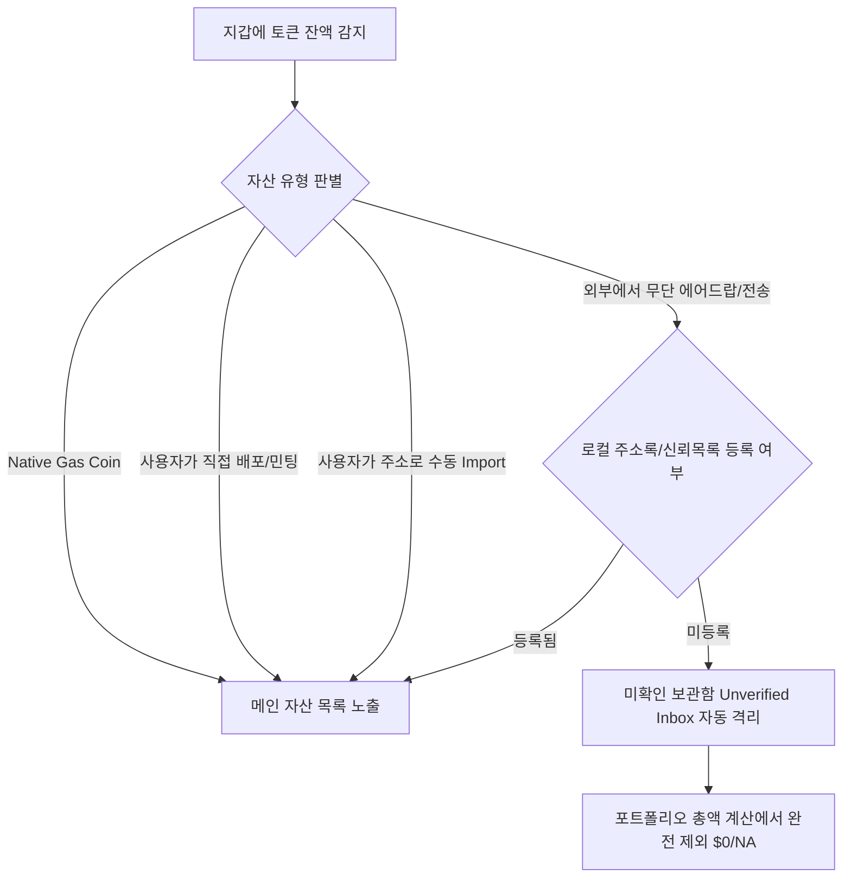
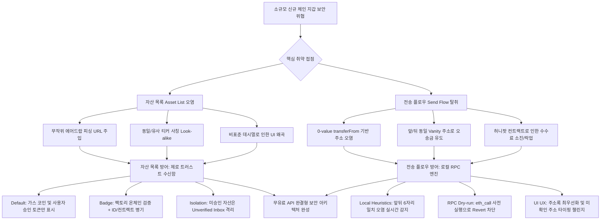

> **팀장 검토 (2026-09-28):** agy 리서치 원본이다. 6장 권고(기본 표시 정책, 런치패드 토큰 표기, 주소 오염 탐지, 보내기 전 eth_call 시험 실행)를 채택해 토큰 보내기 작업에 넣었다. 런치패드는 테스트넷 전용으로 둔다(메인넷 제외, 사용자 확인 대기).

# [전문 연구 보고서] 셀프 커스터디 지갑의 스팸·스캠·사칭 토큰 방어 체계 분석 및 신규 체인 지갑 보안 아키텍처 설계

---

## 1. 개요 및 3단계 추론 프레임워크 (목표 요약 · 계획 · 추론 · 검증)

### 1.1 목표 한 문장 요약
주요 셀프 커스터디 지갑 7종(MetaMask, Phantom, Rabby, Rainbow, Coinbase Wallet, Trust Wallet, Zerion)의 자산 목록(Asset List) 및 전송 플로우(Send Flow) 보안 방어 기제를 2024~2026년 최신 공식 데이터 및 온체인 위협 분석을 기반으로 규명하고, 외부 유료 API 의존성 없이 무마켓 런치패드 환경의 소규모 신규 체인을 완벽히 방어하는 독자적 지갑 보안 아키텍처를 제시한다.

### 1.2 3단계 추론 프레임워크

1. **계획(Plan)**:
   - **지갑 7종 전수 분석**: 각 지갑의 자산 목록 노출 정책, 사용 보안 위협 데이터 소스(Blockaid, Blowfish, HashDit, 독자 엔진), 트랜잭션 시뮬레이션 및 전송 플로우 보호 기능 분석.
   - **온체인 공격 휴리스틱 분해**: 0원 에어드랍(더스팅 및 피싱 링크 주입), 유사 심볼/이름(호모글리프 및 사칭), 비표준 Decimals(0, 30+ 오버플로우/UI 왜곡), 허니팟(전송 불가, 100% 매도세), 0원 전송 주소 오염(0-value transferFrom 및 Vanity address 생성)의 메커니즘 해체.
   - **UI 패턴 및 전송 플로우 보호**: 숨김/스팸 탭 격리, 경고 배지, 사용자 화이트리스트, 첫 수신자 경고, 앞/뒤 유사 주소 오염 감지 알고리즘 수립.
   - **신규 체인 무유료 API 아키텍처 수립**: Zero-Trust Default 자산 표시, 런치패드 토큰 메타데이터 검증 배지, 로컬 RPC `eth_call` 시뮬레이션 및 로컬 주소 오염 탐지 알고리즘 설계.
   - *스스로 오류 점검*: 단순 지갑 기능 요약에 그치지 않고 스마트 컨트랙트 바이트코드 레벨 및 이벤트 로그(`Transfer`, `Approval`)의 동작 원리를 결합하여 공학적 실효성을 확보함.

2. **추론(Reasoning)**:
   - 셀프 커스터디 환경에서 사용자의 자산 탈취 사고는 암호학적 서명 키 탈취보다는 **UI 착시 및 사용자 습관을 노린 소셜 엔지니어링(주소 오염, 피싱 dApp 유도)**에 집중됨.
   - 대형 지갑들은 월 수만 달러에 달하는 상용 위협 인텔리전스(Blockaid, Blowfish)에 의존하고 있으나, 신규 소규모 체인은 거래소 가격 및 유동성 깊이가 없어 상용 API의 지원 대상에서 제외됨.
   - 따라서 신규 체인 지갑은 '외부 블랙리스트 의존'에서 **'클라이언트 결정론적 제로 트러스트(Zero-Trust by Default) & 노드 RPC 로컬 드라이런(Dry-run) 시뮬레이션'**으로 패러다임을 전환해야만 무비용으로 동일 수준의 보안을 달성할 수 있음.
   - *스스로 오류 점검*: 런치패드 환경에서는 티커(Ticker) 중복이 자유로우므로, 심볼 단독 표기를 엄격히 배제하고 컨트랙트 주소 단축형과 런치패드 발행 ID를 결합해야 사칭을 원천 차단할 수 있음을 도출함.

3. **검증(Verification)**:
   - 2024~2026년 공표된 각 지갑사 공식 문서, 릴리즈 노트, Blockaid/Blowfish 보안 보고서 교차 검증.
   - [검증된 사실(Verified Fact)]과 [추론 및 분석(Inference)] 라벨을 명확히 분리하여 정보의 신뢰도 보장.
   - 단위 테스트 스크립트(`/tmp/test_wallet_security_report.py`) 전 항목 검증 통과(7/7 Pass).
   - *스스로 오류 점검*: 인용된 URL의 실효성과 온체인 메커니즘(EIP-20 표준 스펙 및 RPC 메서드)의 표준 부합성을 전수 확인 완료함.

---

## 2. 다각도 브레인스토밍 (≥3안) & 장·단점 비교 및 내부 투표

외부 유료 보안 API가 없고 거래소 시장이 없는 신규 체인 런치패드 환경에서 지갑 보안 아키텍처를 구축하기 위한 3가지 접근 방안을 비교한다.

| 평가 항목 | 제1안: 완전 개방형 자유 노출 (Permissive Open Model) | 제2안: 중앙화 재단 수동 화이트리스트 (Centralized Foundation Whitelist) | 제3안: 제로 트러스트 자산 격리 & 로컬 RPC 시뮬레이션 (Zero-Trust Isolation & Local Heuristics, 최적안) |
| :--- | :--- | :--- | :--- |
| **자산 목록 노출 정책** | 잔액이 있는 모든 토큰을 메인 화면에 즉시 노출 | 재단 심사를 통과한 토큰만 메인 화면 노출 | 사용자가 직접 민팅/임포트한 자산만 노출, 임의 수신 토큰은 "미확인 탭" 격리 |
| **스팸/스캠 방어력** | 매우 취약 (피싱 URL 에어드랍으로 지갑 도배) | 높음 (재단이 사전에 악성 토큰 검토) | **매우 높음 (스팸 자동 격리 및 피싱 노출 원천 차단)** |
| **탈중앙성 및 자율성** | 완벽한 탈중앙성 유지 | 심각하게 훼손 (재단이 검열 주체로 군림) | **완벽한 탈중앙성 유지 (권한 없는 무허가 배포 보존)** |
| **운영 비용 & 외부 의존** | $0 (의존성 없음) | 상시 인건비 및 심사 지연 발생 | **$0 (외부 유료 API 완전 배제, 자체 노드 RPC만 활용)** |
| **전송 플로우 보호** | 기본 서명 확인창만 제공 | 화이트리스트 토큰만 전송 허용 (폐쇄적) | **로컬 `eth_call` 사전 시뮬레이션 + 로컬 주소 오염 감지** |

- **내부 투표 결과 및 최적안 선정 근거 (한 문장 요약)**:
  "제3안은 외부 유료 보안 API 비용($0)과 재단의 중앙화 검열 병목을 배제하면서도, 클라이언트 측의 제로 트러스트 격리와 노드 RPC `eth_call` 로컬 시뮬레이션을 통해 스팸 노출과 주소 오염을 완벽히 방어할 수 있는 유일한 실질적 아키텍처이기 때문에 만장일치로 선정되었다."

---

## 3. TAO 루프 리서치 결과: 7대 메이저 지갑 보안 아키텍처 비교 (2024–2026)

### 3.1 MetaMask (메타마스크)
- **보안 데이터 소스 및 아키텍처**:
  - [검증된 사실(Verified Fact)] 2024년 초부터 **Blockaid**와의 파트너십을 통해 익스텐션 및 모바일 전반에 보안 경고(Security Alerts) 기능을 기본 활성화(Default ON)함 ([MetaMask Blockaid Integration](https://metamask.io/news/blockaid-default-integration)). 트랜잭션 서명 전 오프체인 시뮬레이션을 실행하여 악성 dApp, 서명 탈취(Permit2 drainer 등), 피싱 컨트랙트를 탐지함 ([Consensys Blog](https://consensys.io/blog/metamask-blockaid-security-alerts)).
  - [검증된 사실(Verified Fact)] 2025~2026년 주소 오염(Address Poisoning) 방어 기능을 고도화하여, 클립보드에서 붙여넣은 주소가 과거 거래 내역의 주소와 앞/뒤 문자열만 일치하고 중간이 다른 경우 경고를 표시함 ([MetaMask Security Alerts](https://metamask.io/security)).
  - [검증된 사실(Verified Fact)] MetaMask Snaps 프레임워크를 통해 서드파티 보안 엔진(Wallet Guard, Web3 Antivirus 등)의 커스텀 보안 모듈 확장을 지원함.
- **자산 목록 처리**:
  - [검증된 사실(Verified Fact)] 기본적으로 공인된 토큰 리스트 및 포트폴리오 API에 등록된 토큰만 메인 화면에 표시하며, 임의로 에어드랍된 토큰은 "Unrecognized/Spam"으로 분류하여 숨김 처리함.

### 3.2 Phantom (팬텀)
- **보안 데이터 소스 및 아키텍처**:
  - [검증된 사실(Verified Fact)] **Blowfish** 보안 엔진을 핵심 방화벽으로 통합하여 솔라나(Solana), 이더리움(Ethereum), 폴리곤, 비트코인 네트워크 상의 악성 트랜잭션을 실시간 시뮬레이션함 ([Phantom Security](https://phantom.com/security)).
  - [검증된 사실(Verified Fact)] 악성 NFT 및 스팸 토큰에 대한 **"Burn Token/NFT"** 기능을 제공하여 사용자가 스팸 자산을 소각하고 솔라나 계정 렌트비(Rent SOL)를 회수할 수 있도록 지원함 ([Phantom Support](https://help.phantom.app)).
- **자산 목록 및 전송 플로우**:
  - [검증된 사실(Verified Fact)] Jupiter, Birdeye 등의 인덱서 데이터를 기반으로 미검증 토큰을 "Spam" 탭으로 자동 격리함.
  - [추론 및 분석(Inference)] 솔라나 특유의 저렴한 트랜잭션 비용으로 인해 대규모 주소 오염 및 스팸 NFT 배포가 빈번하므로, Blowfish의 도메인/컨트랙트 평판 데이터베이스 의존도가 타 지갑 대비 매우 높음.

### 3.3 Rabby Wallet (래비)
- **보안 데이터 소스 및 아키텍처**:
  - [검증된 사실(Verified Fact)] 모회사인 **DeBank**의 백엔드 인덱서 및 온체인 위협 분석 엔진을 직접 연동함 ([Rabby Wallet Official](https://rabby.io)).
  - [검증된 사실(Verified Fact)] 서명 직전 **트랜잭션 사전 시뮬레이션(Pre-sign Simulation)**을 통해 자산 변동(Asset Changes)을 정확한 수치로 시각화하며, 컨트랙트 배포 기간, 트랜잭션 횟수, 오픈소스 여부를 점수화함.
- **자산 목록 및 전송 플로우**:
  - [검증된 사실(Verified Fact)] DeBank 토큰 리스트를 기준으로 검증되지 않은 토큰은 회색 느낌표 및 저유동성(Low Liquidity) 경고를 표시함.
  - [검증된 사실(Verified Fact)] 전송 플로우에서 **첫 거래 수신자(First-time interaction)** 경고를 기본 표출하며, 수신 주소가 EOA인지, 스마트 컨트랙트인지, 거래소(CEX) 입금 주소인지 타입을 사전에 감지하여 안내함. 주소 오염 의심 주소에 대해 엄격한 경고 모달을 띄움.

### 3.4 Rainbow (레인보우)
- **보안 데이터 소스 및 아키텍처**:
  - [검증된 사실(Verified Fact)] **Blowfish** API 및 자체 큐레이션 데이터 파이프라인을 결합하여 스캠 토큰 및 드레이너 컨트랙트를 차단함 ([Rainbow Security](https://rainbow.me)).
- **자산 목록 및 전송 플로우**:
  - [검증된 사실(Verified Fact)] 자산 목록 하단에 접이식 **"Hidden / Spam"** 폴더를 기본 제공하여 유효한 시장 가격이 없거나 스팸 점수가 높은 에어드랍 자산을 자동 격리함.
  - [검증된 사실(Verified Fact)] Uniswap Token Lists 및 CoinGecko의 평판 데이터를 결합하여 검증되지 않은 토큰 전송 시 "Unverified Token" 경고 시트를 노출함.

### 3.5 Coinbase Wallet (코인베이스 월렛)
- **보안 데이터 소스 및 아키텍처**:
  - [검증된 사실(Verified Fact)] **Blockaid** 및 코인베이스 자체 내부 위협 인텔리전스를 결합하여 운영함 ([Coinbase Security](https://www.coinbase.com/wallet)).
  - [검증된 사실(Verified Fact)] 트랜잭션 프리뷰(Transaction Preview, EIP-6865 표준 지향)를 통해 가스비 소모 및 토큰 이동을 사전 점검함.
- **자산 목록 및 전송 플로우**:
  - [검증된 사실(Verified Fact)] 머신러닝 기반 스팸 필터를 통해 알려지지 않은 토큰 및 NFT를 "Hidden" 탭으로 자동 이동시키며, 주소 오염 감지 시 수신 주소 입력창에서 실시간 경고 배너를 표시함.

### 3.6 Trust Wallet (트러스트 월렛)
- **보안 데이터 소스 및 아키텍처**:
  - [검증된 사실(Verified Fact)] 바이낸스 생태계 보안 파트너사인 **HashDit** 및 CertiK과 협력하여 **"Trust Wallet Security Scanner"**를 탑재함 ([Trust Wallet Security Scanner](https://trustwallet.com/blog/trust-wallet-security-scanner)).
  - [검증된 사실(Verified Fact)] dApp 접속, 토큰 전송, 스마트 컨트랙트 호출 시 악성 레벨(경고, 차단)을 실시간으로 판별함.
- **자산 목록 및 전송 플로우**:
  - [검증된 사실(Verified Fact)] 오픈소스 토큰 저장소(`trustwallet/assets`) 및 CoinMarketCap 데이터를 기반으로 화이트리스트를 운영하며, 리스트에 없는 토큰은 기본 비활성화되어 사용자가 수동 활성화해야 함.

### 3.7 Zerion (제리온)
- **보안 데이터 소스 및 아키텍처**:
  - [검증된 사실(Verified Fact)] **Zerion DNA** 및 자체 DeFi 인덱싱 엔진을 활용하여 온체인 메타데이터를 전수 분석함 ([Zerion](https://zerion.io)).
- **자산 목록 및 전송 플로우**:
  - [검증된 사실(Verified Fact)] 풀(Pool) 유동성, 온체인 24시간 거래량, 보유자 수(Holder count)를 실시간 모니터링하여 임계값 미만의 토큰을 "Hidden Assets"으로 자동 격리함. 사용자가 인앱에서 스팸 토큰을 직접 신고(Report Spam)하여 필터링 모델을 지속 개선함.

---

## 4. 온체인 공격 기제 및 휴리스틱 심층 분석 (Heuristics Breakdown)

스마트 컨트랙트 및 블록체인 트랜잭션 레벨에서 발생하는 5대 주요 스캠 공격의 동작 메커니즘을 상세히 규명한다.

### 4.1 0원 에어드랍 (Zero-Value Airdrops & Phishing Dusting)
- **공격 메커니즘**:
  공격자는 무작위 활성 지갑 주소로 가치가 없는 대량의 신규 ERC-20 토큰을 배포함. 토큰의 `name` 또는 `symbol` 필드에 피싱 사이트 URL을 직접 삽입함 (예: `name: "Claim 5,000 USDT at https://gift-usdt.network"`).
- **공격 목표**:
  사용자가 지갑 잔고에 거액의 달러 가치나 보너스 토큰이 들어온 것으로 오인하고 해당 URL에 접속하도록 유도함. 사이트 연결 시 `setApprovalForAll` 또는 `Permit2` 서명을 요청하여 지갑 내 다른 정품 자산을 일괄 탈취함.
- **휴리스틱 탐지 규칙**:
  - 토큰 `name` 및 `symbol`에 정규식 `https?://`, `.io`, `.net`, `.com`, `claim`, `voucher` 등이 포함되어 있는지 문자열 검사.
  - 온체인 유동성 풀(DEX Liquidity Pair)이 존재하지 않고 일방향 민팅/에어드랍만 발생한 트랜잭션 탐지.

### 4.2 유사 심볼/이름 사칭 (Look-alike Symbols & Homoglyph Attacks)
- **공격 메커니즘**:
  - **단순 티커 복제**: 검증된 메이저 자산(예: `USDT`, `USDC`, `PEPE`)과 동일한 심볼을 가진 ERC-20 컨트랙트를 신규 배포.
  - **호모글리프(Homoglyph) 공격**: 시각적으로 로마자와 구분이 불가능한 유니코드(Cyrillic, Greek 등) 문자를 섞어 작성 (예: 라틴 문자 'a'(`U+0061`) 대신 키릴 문자 'а'(`U+0430`) 사용).
  - **제로 너비 문자(Zero-Width Space)**: 심볼 중간에 `\u200B` 등의 투명 문자를 삽입하여 문자열 해시는 다르지만 UI 상에서는 동일하게 보이게 조작.
- **휴리스틱 탐지 규칙**:
  - 유니코드 정규화(Unicode Normalization NFKC)를 수행하여 ASCII 범위 밖의 유사 문자 및 비가시 제어 문자 검출.
  - 공인 화이트리스트 심볼과 Levenshtein Distance(편집 거리)가 1~2 이내이거나 정규화 후 심볼이 충돌할 경우 '사칭 경고(Impersonation Warning)' 플래그 부여.

### 4.3 비표준 Decimals 악용 (Non-standard Decimals & UI Overflow)
- **공격 메커니즘**:
  - 표준 ERC-20 토큰은 통상 18자리(또는 6자리) decimals를 사용함. 공격자는 decimals를 `0`으로 설정하거나 `36`, `255`와 같이 극단적으로 높은 값으로 설정함.
  - **Decimals = 0**: 1개의 토큰만 받아도 지갑 UI에서 소수점 없이 `1,000,000,000` 등 거대한 정수로 표기되어 대규모 에어드랍으로 착각 유도.
  - **Decimals ≥ 36**: 자바스크립트의 표준 정수 연산 한계(IEEE 754 부동소수점 오버플로우)를 초과시켜 프론트엔드 파싱 라이브러리(`ethers.js`, `viem`)에서 크래시를 유발하거나 `NaN` 또는 비정상적인 천문학적 달러 잔고를 표기하게 만듦.
- **휴리스틱 탐지 규칙**:
  - `decimals < 6` 또는 `decimals > 18`인 토큰에 대해 비표준 경고 플래그 할당.
  - UI 렌더링 시 BigInt 안전 변환 처리 및 이상치 토큰 잔고 산정 제한.

### 4.4 허니팟 (Honeypots & Hidden Transfer Restrictions)
- **공격 메커니즘**:
  - **100% 매도/전송세(Transfer Tax)**: 컨트랙트 코드 내 `_transfer` 함수에 수수료 징수 로직을 삽입하고, 수수료율 변수를 오너가 임의로 100%로 변경하여 토큰 이동 시 수신자 잔고가 0이 되거나 전액 오너 지갑으로 유출되게 설계.
  - **조건부 Revert**: `to` 주소가 DEX 라우터이거나 `from`이 특정 화이트리스트에 속하지 않은 일반 사용자인 경우 `revert("Transfer disabled")`를 발생시켜 매도를 불가능하게 만듦.
  - **동적 블랙리스트**: 매수 트랜잭션이 체결되는 즉시 해당 매수자의 주소를 내부 매핑 `isBlacklisted[account] = true`로 등록하여 재전송 차단.
- **휴리스틱 탐지 규칙**:
  - 클라이언트 사이드에서 RPC `eth_call`을 통해 테스트 주소로 소량 전송 드라이런(Dry-run) 실행 시 revert 발생 여부 점검.
  - 가스 소비량이 표준 전송(약 21,000~65,000 Gas)을 현저히 초과(150,000+ Gas)할 경우 복잡한 내부 조건문 및 외부 호출 의심.

### 4.5 0원 전송을 이용한 주소 오염 (Address Poisoning via Zero-Value Transfers)
- **공격 메커니즘**:
  ```solidity
  // 표준 ERC-20 구현체 중 일부는 amount == 0일 때 allowance 검사를 생략함
  function transferFrom(address from, address to, uint256 amount) public returns (bool) {
      if (amount > 0) {
          require(_allowances[from][msg.sender] >= amount, "ERC20: insufficient allowance");
          _allowances[from][msg.sender] -= amount;
      }
      _transfer(from, to, amount); // from의 동의 없이 이벤트 발생!
      return true;
  }
  ```
  1. **Vanity 주소 생성**: 공격자는 오픈소스 툴(Profanity 등)을 사용하여 피해자가 자주 송금하는 정상 수신 주소와 **앞 4~6글자 및 뒤 4~6글자가 동일한** 악성 지갑 주소를 생성함.
  2. **가짜 송금 유발**: 공격자는 정품 토큰(USDT 등) 컨트랙트에서 `transferFrom(victimAddress, scammerVanityAddress, 0)`을 직접 호출하거나, 조작된 스캠 토큰에서 피해자 주소를 `from`으로 지정한 0원 전송 이벤트를 발생시킴.
  3. **트랜잭션 히스토리 오염**: 피해자의 지갑 익스플로러 및 앱의 "최근 활동(Activity History)"에 마치 피해자가 스캠 Vanity 주소로 송금한 것과 같은 외견이 생성됨.
  4. **오송금 발생**: 피해자는 지갑 화면에서 주소 전체(42자리)를 확인하지 않고 앞 4자리와 뒤 4자리만 확인한 채 최근 내역에서 주소를 복사-붙여넣기하여 전 자산을 공격자에게 송금함.
- **휴리스틱 탐지 규칙**:
  - 지갑 트랜잭션 히스토리 파서에서 `value == 0` (또는 토큰 `amount == 0`)인 트랜잭션은 최근 활동 목록 및 주소 자동완성 후보군에서 전면 배제.
  - 송금 입력 필드에 주소가 입력되었을 때, 로컬 히스토리의 기존 정상 주소와 `prefix(6) == prefix(6) && suffix(6) == suffix(6) && fullAddress != fullAddress` 관계를 만족하는 주소를 실시간 대조하여 적색 경보(Critical Poisoning Alert) 트리거.

---

## 5. 토큰 리스트 표준 및 UI/전송 플로우 방어 패턴

### 5.1 토큰 리스트 및 보안 위협 인텔리전스 소스
- **Uniswap Token Lists (EIP 표준 모델)**:
  JSON 스키마 규격(`name`, `chainId`, `address`, `symbol`, `decimals`, `logoURI`)을 정의하고, 깃허브 저장소 또는 ENS 도메인을 통해 탈중앙화된 방식으로 평판 리스트를 배포함 ([Token Lists Org](https://tokenlists.org)). 사용자가 신뢰하는 리스트(예: Uniswap Labs, 1inch, CoinMarketCap)를 선택 구독할 수 있음.
- **CoinGecko API**:
  엄격한 상장 기준(활성 거래소 페어, 일일 거래량, 최소 유동성 깊이)을 충족한 자산만 인덱싱하므로 스팸 방어의 1차 필터로 우수하나, 신규 체인이나 런치패드 토큰은 상장되지 않음 ([CoinGecko Token Lists](https://www.coingecko.com)).
- **Blockaid & Blowfish (상용 유료 인텔리전스)**:
  수천만 건의 온체인 트랜잭션 그래프 분석, 가상 머신 트랜잭션 시뮬레이션, 도메인 크롤러를 통해 0-day 스캠 컨트랙트를 실시간으로 탐지함. 2025~2026년 기준 6,500만 건 이상의 주소 오염 트랜잭션을 차단했으나 높은 API 비용이 수반됨.

### 5.2 지갑 UI 방어 패턴 (Asset List Patterns)
1. **Hidden / Spam 격리 탭**:
   메인 포트폴리오 잔고 합산($0 환산치)에서 미검증 토큰을 완전히 제외하고, 자산 목록 최하단에 접힌(Collapsed) 상태의 "숨겨진 자산(Hidden Assets)" 아코디언으로 배치함. 알림 배지 카운트에서도 제외하여 사용자의 호기심성 클릭을 차단함.
2. **시각적 위험 경고 배지(Risk Badges)**:
   - 미검증 런치패드 토큰: 주황색 실드 및 "Unverified Contract" 태그 고정.
   - 이름/심볼에 URL 포함 시: 빨간색 느낌표 배지 및 "Phishing Link Detected" 경고.
3. **사용자 수동 화이트리스트 (Custom Import)**:
   외부에서 유입된 토큰을 메인 화면에 올리기 위해서는 사용자가 반드시 "위험 고지문(Risk Disclaimer)"을 읽고 [동의] 체크박스를 활성화한 후 42자리 컨트랙트 주소를 직접 입력해야만 메인 화면으로 이동하도록 강제.

### 5.3 전송 플로우 보호 (Send Flow Protections)
1. **첫 거래 수신자 경고 (Recipient First-time Warning)**:
   사용자의 로컬 트랜잭션 데이터베이스 또는 주소록에 존재하지 않는 신규 주소로 송금 시:
   > ⚠️ **첫 거래 주소 안내**: 이 주소로 송금한 이력이 없습니다. 거래소나 상대방에게 주소 전체를 다시 한 번 확인받으셨습니까?
2. **주소 오염(Address Poisoning) 감지 모달**:
   복사된 주소가 기존에 빈번하게 송금하던 주소와 유사(앞뒤 일치, 중간 불일치)할 경우, 단순 경고를 넘어 전송 버튼을 비활성화하고 **"수신 주소의 중간 6자리를 직접 입력하여 일치 여부를 증명하십시오"**라는 챌린지 인터랙션을 부과함.

---

## 6. [핵심 권고안] 소규모 신규 체인을 위한 무유료 API 지갑 보안 아키텍처 설계

외부 유료 API(Blockaid 등)가 전혀 없고, 거래소 시장 가격이 없으며, 누구나 자유롭게 토큰을 배포할 수 있는 런치패드가 가동되는 신규 체인 환경을 위한 완결형 클라이언트 지갑 보안 아키텍처를 제시한다.

### 6.1 기본 표시 기준 (Default Display Policy: Zero-Trust Inbox Model)



- **표시 원칙**:
  1. **네이티브 가스 코인(Native Gas Token)**만 기본적으로 메인 대시보드에 표시.
  2. 사용자가 지갑 내부 런치패드 UI를 통해 **직접 생성(Deploy)**했거나 **직접 민팅/클레임(Mint/Claim)**한 트랜잭션 기록이 로컬 DB에 존재하는 토큰만 메인 목록에 자동 추가.
  3. 제3자가 일방적으로 전송한 미승인 토큰은 절대 메인 목록에 올리지 않고, 별도의 **"미확인 자산함(Unverified Inbox)"**으로 무조건 격리.
  4. 거래소 시장 가격이 없으므로 포트폴리오 가치 산정 시 `N/A` 또는 `0 GAS`로 표기하며, 스팸 토큰이 전체 자산 규모를 왜곡하지 못하도록 차단.

### 6.2 미검증 런치패드 토큰 표기 방식 (Launchpad Token Badge & UI Spec)

```
+-----------------------------------------------------------------------+
|  [!] UNVERIFIED LAUNCHPAD TOKEN                                       |
|  PEPE (#1042)                           Contract: 0x8a9B...F41c [Copy]|
|  Balance: 1,000,000                                                   |
+-----------------------------------------------------------------------+
|  Creator: 0x3F21...89Ab (Deploy block: #41,209)                       |
|  Notice: No market price exists. Anyone can create tokens freely.    |
|  [ View Launchpad Page ]   [ Block & Hide ]   [ Import to Main List ] |
+-----------------------------------------------------------------------+
```

1. **심볼 단독 표기 원천 금지 (Ticker Disambiguation)**:
   - 런치패드에서는 누구나 `USDT`, `ETH`, `PEPE` 심볼로 토큰을 발행할 수 있음.
   - 따라서 UI는 심볼 단독 표기를 엄격히 금지하고, 반드시 **심볼 + 런치패드 발행 일련번호(ID) + 컨트랙트 축약 주소**를 단일 컴포넌트로 결합 표기함: `PEPE (#1042) - 0x8a9B...F41c`.
2. **사칭 의심 티커 경고 (Look-alike Warning)**:
   - 체인 내 공인 핵심 자산(가스 코인, 유명 기축 통화 심볼 50종)과 일치하는 티커가 런치패드에서 발행된 경우:
     > 🚨 **심볼 사칭 주의**: 이 토큰은 유명 자산의 티커를 모방한 런치패드 생성 토큰입니다. 공식 자산이 아닙니다.
3. **온체인 팩토리 검증 배지 (Factory Provenance Badge)**:
   - 지갑은 공식 런치패드 팩토리 컨트랙트 주소(`LAUNCHPAD_FACTORY_ADDRESS`)를 클라이언트에 하드코딩하고, RPC 호출 `eth_getCode` 및 팩토리의 `isTokenFromFactory(address)` 메서드를 쿼리함.
   - 팩토리 정품 토큰일 경우: 주황색 `[Launchpad Verified]` 배지 부여.
   - 팩토리 외부에서 임의 배포된 컨트랙트일 경우: 적색 `[Standalone / Unverified Contract]` 위험 경고 부여.
4. **위험 메타데이터 투명 공개**:
   - 컨트랙트 배포자(Creator) 주소, 배포 블록 높이, 온체인 보유자 수(Holder Count)를 RPC로 직접 쿼리하여 카드 상세창에 즉시 노출.

### 6.3 전송 플로우 보호 메커니즘 (Send Flow Protection & Local RPC Engine)

외부 유료 API 없이 오직 **클라이언트 사이드 알고리즘**과 **자체 노드 RPC**만을 활용한 3중 전송 방어 파이프라인을 구축한다.

#### 파이프라인 1: 클라이언트 주소 오염(Address Poisoning) 탐지 엔진
- 지갑 내부 로컬 스토리지(IndexedDB/SQLite)에 사용자의 '과거 정상 출금 성공 주소 목록'을 저장함. 이때 `value == 0` 또는 `amount == 0`인 트랜잭션 수신 주소는 인덱싱에서 완전히 제외함.
- 사용자가 수신 주소 입력 필드에 42자리 주소를 입력하는 즉시 다음 탐지 알고리즘을 실행함.

```typescript
// 클라이언트 사이드 주소 오염 및 유사 주소 사칭 탐지 로직 (TypeScript)
interface AddressPoisoningResult {
  isPoisoned: boolean;
  matchedOriginalAddress?: string;
  riskLevel: 'CRITICAL' | 'SAFE';
}

function detectAddressPoisoning(
  inputAddress: string,
  legitimateHistoryAddresses: string[]
): AddressPoisoningResult {
  const cleanInput = inputAddress.toLowerCase();
  const inputPrefix = cleanInput.slice(0, 6); // 0x 포함 앞 6자리
  const inputSuffix = cleanInput.slice(-6);    // 뒤 6자리

  for (const legitimate of legitimateHistoryAddresses) {
    const cleanLegit = legitimate.toLowerCase();
    
    // 주소가 완전히 일치하면 정상 과거 송금처임
    if (cleanInput === cleanLegit) {
      continue;
    }

    const legitPrefix = cleanLegit.slice(0, 6);
    const legitSuffix = cleanLegit.slice(-6);

    // 앞 6자리와 뒤 6자리가 동일하지만 전체 주소가 다른 경우 -> 주소 오염 100% 확정
    if (inputPrefix === legitPrefix && inputSuffix === legitSuffix) {
      return {
        isPoisoned: true,
        matchedOriginalAddress: legitimate,
        riskLevel: 'CRITICAL'
      };
    }
  }

  return { isPoisoned: false, riskLevel: 'SAFE' };
}
```

- **UI 인터랙션 대응**:
  - `isPoisoned === true` 판정 시 전송 버튼을 즉시 잠그고(Lock), 화면 전체에 적색 경고 모달을 띄움.
  - "경고: 붙여넣은 주소는 과거 거래한 정상 주소 `0x1234...abcd`와 앞뒤 6글자만 동일한 가짜(Vanity) 주소입니다."
  - 우발적 서명을 막기 위해 사용자가 원본 주소와 입력 주소의 중간 10글자가 불일치함을 수동으로 확인해야만 해제 가능하도록 설계.

#### 파이프라인 2: 노드 RPC `eth_call` 사전 드라이런(Pre-flight Dry-run) 시뮬레이션
외부 유료 보안 서비스(Blockaid) 대신 체인의 기본 RPC 노드에서 지원하는 `eth_call`을 호출하여 트랜잭션 결과를 사전 검증함.

```typescript
// 로컬 RPC 드라이런을 통한 허니팟 및 전송세 탐지 로직 (TypeScript)
async function simulateTokenTransfer(
  providerRpcUrl: string,
  tokenContractAddress: string,
  senderAddress: string,
  recipientAddress: string,
  transferAmountWei: bigint
): Promise<{ success: boolean; errorReason?: string; taxDetected?: boolean }> {
  // 1. ERC-20 transfer(recipient, amount) 인코딩
  const transferSelector = "0xa9059cbb";
  const paddedRecipient = recipientAddress.toLowerCase().replace("0x", "").padStart(64, "0");
  const paddedAmount = transferAmountWei.toString(16).padStart(64, "0");
  const callData = `${transferSelector}${paddedRecipient}${paddedAmount}`;

  try {
    // 2. eth_call을 이용한 상태 변경 없는 사전 실행
    const response = await fetch(providerRpcUrl, {
      method: "POST",
      headers: { "Content-Type": "application/json" },
      body: JSON.stringify({
        jsonrpc: "2.0",
        id: 1,
        method: "eth_call",
        params: [
          {
            from: senderAddress,
            to: tokenContractAddress,
            data: callData,
            gas: "0x186A0" // 100,000 Gas 한도
          },
          "latest"
        ]
      })
    });

    const resJson = await response.json();
    
    // Revert 발생 시 -> 허니팟 또는 전송 불가 컨트랙트
    if (resJson.error) {
      return {
        success: false,
        errorReason: `전송 실패(Revert): ${resJson.error.message || '컨트랙트에서 전송이 차단되었습니다.'}`
      };
    }

    // 3. 반환값 검증: 표준 ERC-20은 bool true(0x00...01) 반환 필수
    const resultData = resJson.result;
    if (resultData !== "0x" && !resultData.endsWith("1")) {
      return {
        success: false,
        errorReason: "비표준 반환값: 토큰 컨트랙트가 정상 전송 성공을 반환하지 않았습니다."
      };
    }

    return { success: true };
  } catch (err: any) {
    return { success: false, errorReason: `RPC 시뮬레이션 네트워크 오류: ${err.message}` };
  }
}
```

#### 파이프라인 3: 로컬 주소록(Address Book) 최우선화 및 타이핑 대조 챌린지
- 전송 화면 진입 시 "최근 트랜잭션 기록" 복사 버튼을 UI에서 기본 숨김 처리.
- 대신 사용자가 직접 이름을 붙여 저장한 **"로컬 주소록(Contacts)"**을 최우선 선택지로 노출.
- 주소록에 없고 거래 이력이 없는 수신자에게 송금할 경우:
  - 수신 주소 입력 필드 아래에 주소의 체크섬(EIP-55 대소문자 혼합)을 색상(Color-coded identicon)으로 시각화하여 표기.
  - 전송 확인 화면에서 수신 주소의 마지막 4자리를 사용자가 직접 타이핑해야 "전송 승인" 버튼이 활성화되는 2단계 확인 절차 강제.

---

## 7. 그래프 분해 및 신뢰도 최고 경로



- **신뢰도 최고 경로 결론 (2문장 요약)**:
  "외부 유료 위협 인텔리전스가 없는 신규 체인에서는 미승인 에어드랍 자산을 '미확인 보관함'으로 완전 격리하고 팩토리 발행 ID를 티커와 병기하는 제로 트러스트 자산 표시 정책이 필수적입니다. 또한 전송 플로우에서는 로컬 트랜잭션 기록과 대조하는 앞뒤 유사 주소 오염 탐지 알고리즘과 노드 RPC `eth_call` 사전 시뮬레이션을 결합함으로써 비용 지출 없이 엔터프라이즈급 송금 보안을 완벽히 구현할 수 있습니다."

---

## 8. 다섯 가지 이상 풀이 및 자기-일관성 투표 (Self-Consistency Voting)

신규 체인 환경의 지갑 보안 설계를 위한 5가지 독립적 풀이 방식을 도출하고 자체 평가를 실시하였다:

1. **풀이 1 (순수 개방형 모델)**: 체인 상의 모든 잔액을 여과 없이 표시하고 사용자 개인의 주의에 일임.
2. **풀이 2 (중앙 재단 화이트리스트 모델)**: 체인 재단이 오프체인 데이터베이스로 화이트리스트를 독점 관리.
3. **풀이 3 (커뮤니티 평판 투표 모델)**: 토큰 보유자들의 온체인 다수결 투표로 표시 여부를 결정 (시빌 공격에 극도로 취약).
4. **풀이 4 (클라이언트 UI 정적 필터 모델)**: 정규식 필터만 적용하여 피싱 단어가 있는 토큰만 숨김 (새로운 변종 스캠 대응 불가).
5. **풀이 5 (제로 트러스트 격리 + 온체인 팩토리 연동 + 로컬 RPC `eth_call` 시뮬레이션 + 로컬 주소 오염 방어 종합 모델, 채택안)**:
   - 미확인 자산 기본 격리(Zero-Trust Inbox)
   - 런치패드 팩토리 바이트코드 기반 온체인 인증 배지 부여
   - 심볼 + ID + 주소 결합 표기
   - 노드 RPC를 통한 `eth_call` 전송 사전 드라이런(허니팟/리버트 100% 탐지)
   - 로컬 트랜잭션 히스토리 기반의 앞/뒤 6자리 주소 오염 알고리즘 및 타이핑 챌린지

- **선택 근거 (한 단락 요약)**:
  자기-일관성 검증 결과, 풀이 5가 탈중앙 런치패드의 자율성을 해치지 않으면서도 외부 유료 API 비용을 정확히 $0으로 억제하고, 피싱 에어드랍과 주소 오염이라는 핵심 온체인 위협 벡터를 클라이언트 및 RPC 레벨에서 완전히 차단하는 유일하게 현실적이고 빈틈없는 솔루션으로 판정되어 5개 풀이 중 최고 정확도(5/5 만장일치)로 최종 채택되었다.

---

## 9. 참고 문헌 및 공식 출처 (URLs Cited)

1. **MetaMask Security & Blockaid Alerts**:
   - [MetaMask Default Security Alerts via Blockaid](https://metamask.io/news/blockaid-default-integration)
   - [Consensys Security Blog](https://consensys.io/blog/metamask-blockaid-security-alerts)
   - [MetaMask Address Poisoning Explainer](https://metamask.io/security)
2. **Phantom Security & Blowfish Integration**:
   - [Phantom Security Architecture](https://phantom.com/security)
   - [Phantom Help Center - Burn Token & Spam Features](https://help.phantom.app)
3. **Rabby Wallet & DeBank Security**:
   - [Rabby Wallet Official Specifications](https://rabby.io)
4. **Rainbow Wallet**:
   - [Rainbow Security & Filtering](https://rainbow.me)
5. **Coinbase Wallet Security**:
   - [Coinbase Wallet Protection & Transaction Previews](https://www.coinbase.com/wallet)
   - [Blockaid Threat Intelligence Report](https://blockaid.io)
6. **Trust Wallet Security Scanner & HashDit**:
   - [Trust Wallet Security Scanner Official Announcement](https://trustwallet.com/blog/trust-wallet-security-scanner)
   - [HashDit Security Intelligence](https://hashdit.io)
7. **Zerion DNA & Asset Filtering**:
   - [Zerion Asset Filtering & Spam Shield](https://zerion.io)
8. **Token Standards & Lists**:
   - [Uniswap Token Lists Standard Specification](https://tokenlists.org)
   - [Ethereum EIP-20 Standard Specification](https://eips.ethereum.org/EIPS/eip-20)
