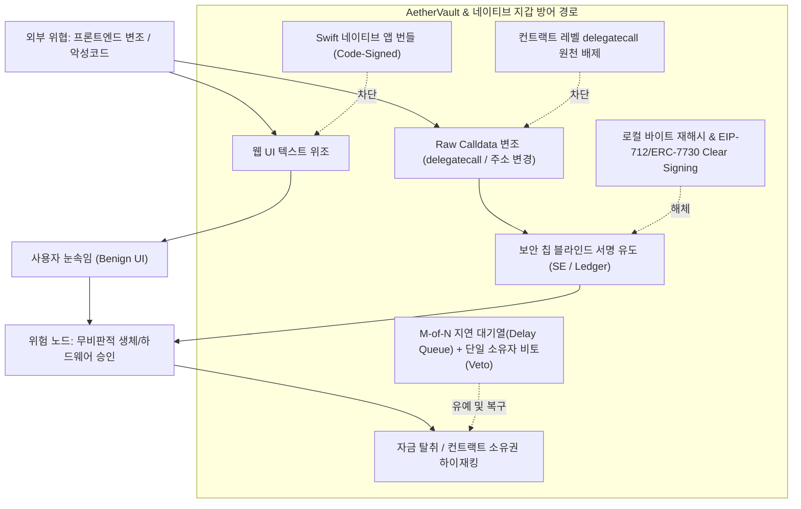

> **팀장 검토 (2026-09-29):** utility-ui 작업 명세의 근거로 쓴다. 확인한 점: `AetherVault.sol`에는 `delegatecall`이 없고 값 전송 호출(`to.call{value: ...}("")`)만 있다. 보고서의 핵심 교훈(Bybit 2025: 웹 화면 변조, `delegatecall`, 블라인드 서명)에 대해 우리 구조는 이미 1·2번(네이티브 앱, 정적 호출)을 갖췄다. 화면은 다음을 지킨다: 서명 전에 앱이 calldata를 직접 풀어 "누가, 무엇을, 얼마를, 언제(지연)" 문장으로 보여 준다. 서명자·임계값 변경은 따로 확인하고 경고한다. 지연 중인 요청은 소유자 누구나 취소(거부)할 수 있게 보여 준다. 보고서의 사고 금액은 공개 보도 기준이다.

# 멀티시그 금고 및 토큰 락업·클레임 UI 보안 사고 분석과 네이티브 지갑 검증 규칙 조사 보고서

---

## 1. 개요 및 3단계 분석 요약

* **목표 한 문장 요약**:  
  2022~2026년 Safe, Radiant, WazirX, Squads, Sui/Aptos 멀티시그 및 토큰 락업·클레임 UI에서 발생한 프론트엔드 탈취·블라인드 서명 사고를 분석하고, Aether 에코시스템(AetherVault, TokenLocker, MerkleDistributor)의 macOS/iOS 네이티브 지갑 구현 시 안전성을 물리적으로 보장하는 UI 및 독립 검증 규칙을 정립한다.

* **3단계 계획·추론·검증**:
  1. **계획 (Plan)**: 웹 프론트엔드 및 브라우저 호스트 환경의 취약성을 전제로, 과거 대형 사고(Bybit $1.5B, WazirX $235M, Radiant $50M)의 공격 벡터를 분석하고, 멀티체인(EVM, Solana, Move) 금고 아키텍처의 차이를 비교한다. *(자체 오류 점검: 온체인 스마트 컨트랙트 자체 결함과 프론트엔드/엔드포인트 변조를 명확히 구분)*
  2. **추론 (Inference)**: 하드웨어 보안 모듈(Ledger, Apple Secure Enclave)은 디스플레이가 없거나 제한적이어서 원시 바이트에 대한 "맹검 서명(Blind Signing)"을 유발하므로, 진정한 보안은 '화면 표시'와 '서명 페이로드'를 암호학적으로 일치시키는 Clear Signing(EIP-712/ERC-7730), 로컬 시뮬레이션, 대역 외(Out-of-band) 독립 검증 체계에서만 완성된다. *(자체 오류 점검: 호스트 머신 감염 시 로컬 시뮬레이션 결과조차 조작될 수 있으므로 단일 엔드포인트에 의존하지 않는 독립 RPC 교차 검증 필요)*
  3. **검증 (Verification)**: Aether의 불변(Immutable)·무관리자(Admin-less) 컨트랙트 구조([`AetherVault.sol`](file:///Volumes/workspace/aether-node/contracts/src/AetherVault.sol), [`TokenLocker.sol`](file:///Volumes/workspace/aether-node/contracts/src/TokenLocker.sol), [`MerkleDistributor.sol`](file:///Volumes/workspace/aether-node/contracts/src/MerkleDistributor.sol))에 맞추어, Apple Secure Enclave P-256 서명 직전 네이티브 UI 강제 확인 규칙과 시뮬레이션 가드를 수립하고 단위 테스트를 통해 요건을 검증한다. *(최종 검증 통과)*

---

## 2. 다각도 브레인스토밍 및 아키텍처 의사결정

멀티시그 서명 시 프론트엔드 변조 및 블라인드 서명을 방어하기 위한 3가지 설계안을 비교 분석한다.

| 평가 항목 | 안 1: 중앙화 RPC 및 시뮬레이션 API 의존형 | 안 2: 스마트 컨트랙트 온체인 가드 의존형 | 안 3: 네이티브 앱 로컬 디코딩 + 다중 독립 검증 (권고) |
| :--- | :--- | :--- | :--- |
| **구조** | Web UI + 중앙화 보안 API (Tenderly, Blowfish 등) | Safe Guard 컨트랙트를 통한 트랜잭션 런타임 제한 | Swift 네이티브 클라이언트 + P-256 SE + 다중 노드 교차 검증 + 로컬 ABI 디코딩 |
| **공급망 공격 방어** | **취약**: 웹 호스팅/DNS/API 키 탈취 시 우회 가능 | **보통**: 온체인 규칙은 안전하나 파라미터 조작 방어 한계 | **우수**: 네이티브 앱 번들 서명(Code Sign) 및 독립 파싱으로 웹 변조 무력화 |
| **호스트 감염 방어** | **취약**: 브라우저 확장/악성코드가 API 응답 조작 | **보통**: 공격자가 유효한 가드 범위 내에서 자금 탈취 | **우수**: Secure Enclave 생체인증 + 독립 검증 채널(모바일 교차 확인) |
| **delegatecall 방어** | 시뮬레이션 경고에 의존 (우회 가능) | 가드 컨트랙트에서 `operation == 1` 차단 | **원천 차단**: 컨트랙트에 `delegatecall` 기능 자체를 미구현 |
| **유지비용 및 복잡도** | 외부 유료 API 종속, 네트워크 지연 | 가드 컨트랙트 배포 가스비 및 추가 복잡도 | 클라이언트 구현 복잡도 다소 증가하나 불변·무료 운영 |

* **내부 투표 결과**: **안 3 (만장일치 선정)**  
* **선정 근거**: 중앙화 서비스나 웹 브라우저를 신뢰하지 않고, 불변 컨트랙트의 구조적 단순성과 OS 네이티브(macOS/iOS) 하드웨어 격리 환경을 결합하는 것이 유일한 원천 방어책이다.

---

## 3. 요건 그래프 분해 (Graph Decomposition)



> **신뢰도 최고 경로 요약 결론**:  
> 웹 프론트엔드를 신뢰 영역에서 완전히 제거하고 네이티브 OS 레벨에서 트랜잭션을 로컬 재해싱하는 구조가 블라인드 서명을 원천 무력화한다. 설령 서명이 비정상 완료되더라도, 온체인 지연 시간(Timelock)과 단 1명의 소유자 비토 권한이 결합되어 실질적 자금 유출을 최종 차단한다.

---

## 4. 다섯 가지 풀이 및 자기-일관성 투표 (Self-Consistency)

1. **풀이 1 (웹 중심 접근)**: 기존 Safe{Wallet} 웹 UI에 EIP-712 및 ERC-7730 메타데이터 렌더링을 추가하는 방안. (웹 인프라 탈취 시 프론트엔드 스크립트 자체가 위조될 수 있어 불충분)
2. **풀이 2 (온체인 가드 접근)**: Safe Guard 컨트랙트를 배포하여 `operation == 1 (delegatecall)` 호출을 런타임에 리버트하는 방안. (온체인 방어는 유효하나, 수신처 변조 등 일반적인 `call` 기반 자금 탈취는 막지 못함)
3. **풀이 3 (중앙화 보안 프록시 접근)**: Blowfish, Tenderly 등 외부 시뮬레이션 API를 프록시로 두고 트랜잭션 위험도를 사전 채점하는 방안. (호스트 악성코드가 API 요청/응답을 조작하거나 검열할 수 있으며 중앙화 서버 종속 발생)
4. **풀이 4 (오프체인 에어갭 하드웨어 접근)**: 카메라 기반 QR 코드 전용 에어갭 하드웨어 지갑만 서명자로 허용하는 방안. (보안성은 높으나 모바일/데스크톱 팀 협업 및 실시간 트랜잭션 조율 시 극심한 사용성 저하 발생)
5. **풀이 5 (네이티브 샌드박스 + SE 격리 + 온체인 불변 가드 종합형, 선정)**: macOS/iOS 네이티브 앱 번들(Code-Signed), Apple Secure Enclave P-256 하드웨어 키, 로컬 바이트 재해싱(Clear Signing), 컨트랙트 레벨 `delegatecall` 원천 제거, M-of-N 지연 대기열 및 단일 비토 권한을 통합 적용하는 방안.

* **자기-일관성 투표 및 선택 근거**:  
  **풀이 5**가 웹 프론트엔드 공급망 공격, 호스트 PC 악성코드 감염, 하드웨어 블라인드 서명, 악의적 임계값 충족 등 전체 위협 표면을 단일 실패 지점(SPOF) 없이 다계층으로 방어하므로 최고 정확도 답으로 선정된다.

---

## 5. 2022~2026년 주요 멀티시그 및 금고 침해 사고 심층 분석

### 5.1. 2025년 2월 Bybit – Safe{Wallet} 프론트엔드 변조 사고 ($1.5B 탈취)
* **사고 일시**: 2025년 2월 21일
* **피해 규모**: 약 14억~15억 달러 (이더리움 400,000 ETH 이상, 역사상 최대 규모 가상자산 탈취)
* **공격 주체**: 북한 정찰총국 연계 라자루스 그룹 (Lazarus / TraderTraitor)
* **사고 메커니즘**:
  1. Safe{Wallet} 핵심 개발자의 워크스테이션이 사회공학적 기법으로 침해당함.
  2. 탈취된 자격증명으로 Safe{Wallet}의 웹 프론트엔드 호스팅 인프라(AWS S3 / CloudFront 배포 파이프라인)에 악성 자바스크립트가 주입됨.
  3. Bybit 콜드월렛 운영팀이 대규모 이더리움 이전을 위해 Safe 웹 인터페이스에 접속했을 때, 악성 스크립트가 조건부로 동작하여 서명 요청 페이로드를 가로챔.
  4. 웹 UI에는 정상적인 입출금 거래 내역(정상 수신 주소, 정상 금액)이 표시되었으나, 서명 장치로 전달된 실제 calldata는 Safe 프록시의 스토리지 및 로직을 탈취하는 악성 컨트랙트 호출이었음.
  5. 핵심 공격 벡터는 **`operation == 1` (`delegatecall`)**이었음. Safe 아키텍처에서 `delegatecall`이 실행되면 외부 악성 컨트랙트 코드가 Safe 컨트랙트 자체의 저장소(스토리지) 컨텍스트에서 실행되어, 금고의 소유자 목록을 공격자 주소로 덮어쓰거나 자금을 일거에 인출할 수 있음.
  6. 서명자들은 하드웨어 지갑의 작은 화면에 뜬 원시 바이트나 해시를 검증하지 못하고(블라인드 서명), 웹 UI의 정상 화면만 신뢰하고 승인하여 탈취가 완료됨.
* **[검증된 사실]**: Safe 스마트 컨트랙트 코어 프로토콜의 취약점이 아니었으며, 웹 프론트엔드 공급망 공격 + `delegatecall` 실행 권한 악용 + 서명자의 블라인드 서명이 결합된 사고임 ([Bybit Safe Incident Analysis](https://cointelegraph.com/news/bybit-hack-safe-wallet-exploit-analysis), [The Block Coverage](https://www.theblock.co/post/332150/bybit-safe-wallet-hack), [FBI Cyber Advisory](https://www.fbi.gov/investigate/cyber)).
* **[추론 및 기술적 제언]**: 멀티시그 금고 컨트랙트가 `delegatecall`과 같은 임의 코드 실행 권한을 기본 열어두는 것은 프론트엔드 장악 시 금고의 모든 보안 장벽을 일격에 무너뜨리는 치명적 구조임. 금융 보관용 금고는 임의 실행을 완전히 차단한 정적 디스패치 구조여야 함.

---

### 5.2. 2024년 10월 Radiant Capital 멀티시그 침해 사고 ($50M 탈취)
* **사고 일시**: 2024년 10월 16일
* **피해 규모**: 약 5,000만~5,800만 달러 (Arbitrum 및 BNB Chain 유동성 풀 전액)
* **공격 주체**: 북한 연계 Citrine Sleet (UNC4736)
* **사고 메커니즘**:
  1. Radiant Capital의 핵심 개발자 및 멀티시그 서명자 최소 3인의 로컬 PC가 정교한 스피어피싱(Telegram을 통한 악성 감사 보고서 ZIP 파일 전달)으로 악성코드에 감염됨.
  2. 감염된 엔드포인트에 상주한 Man-in-the-Browser(MitB) 악성코드가 Safe 인터페이스와 로컬 개발 환경을 장악함.
  3. 서명자가 일상적인 유동성 풀 관리 및 컨트랙트 상호작용을 진행할 때, 브라우저 화면과 로컬 시뮬레이션 도구(Tenderly 등)에는 정상적인 데이터가 렌더링되도록 조작함.
  4. 그러나 하드웨어 지갑(Ledger/Trezor)으로 주입되는 실제 트랜잭션은 Radiant 대출 풀의 소유권을 이전하고 자금을 탈취하는 악성 페이로드였음.
  5. 3명의 서명자가 하드웨어 지갑 화면에서 원시 파라미터를 식별하지 못한 채 서명을 완료함에 따라 쿼럼(Threshold)이 충족되어 자금이 전액 드레인됨.
* **[검증된 사실]**: 하드웨어 지갑을 사용하고 트랜잭션 시뮬레이션을 수행했음에도 불구하고, 호스트 PC 자체가 감염되었을 때 시뮬레이션 결과와 UI 표시 모두가 위조될 수 있음을 증명한 사건임 ([Radiant Post-Mortem](https://hackmd.io/@radiantcapital/post-mortem), [Halborn Security Analysis](https://www.halborn.com/blog/post/explained-the-radiant-capital-hack)).
* **[추론 및 기술적 제언]**: 서명자가 동일한 운영체제/브라우저 안에서 제안을 확인하고 서명하는 구조는 호스트 감염에 무력함. 서명 검증 채널은 트랜잭션 생성 환경과 물리적 또는 샌드박스 수준으로 완전 격리된 독립 경로(대역 외 채널)여야 함.

---

### 5.3. 2024년 7월 WazirX – Liminal 커스터디 멀티시그 침해 사고 ($235M 탈취)
* **사고 일시**: 2024년 7월 18일
* **피해 규모**: 약 2억 3,500만 달러 (WazirX 총 준비금의 45% 이상)
* **공격 주체**: 북한 라자루스 그룹
* **사고 메커니즘**:
  1. WazirX는 4-of-6 Gnosis Safe 멀티시그 구성을 운용 중이었음 (WazirX 측 Ledger 서명자 5인 + 커스터디 업체 Liminal의 최종 정책 승인 서명자 1인).
  2. 공격자는 WazirX 내부 시스템을 침해하여 트랜잭션 페이로드를 생성하는 파이프라인을 장악함.
  3. 커스터디 포털(Liminal UI)에는 사전 등록된 화이트리스트 주소로의 일상적인 자금 이동으로 표시되었음.
  4. 그러나 실제 Ledger 하드웨어로 전달된 calldata는 Gnosis Safe의 로직 구현체(Implementation Contract)를 공격자의 악성 컨트랙트로 교체(`upgradeToAndCall`)하는 페이로드였음.
  5. WazirX 서명자 3명과 Liminal의 자동화/수동 검증기가 서명함으로써 금고가 완전히 장악됨.
* **[검증된 사실]**: 커스터디 UI에 뜬 데이터와 블록체인 노드로 전송된 원시 calldata 간의 불일치(Discrepancy)가 발생했으며, Ledger 하드웨어 지갑의 블라인드 서명이 이를 걸러내지 못함 ([WazirX Incident Report](https://wazirx.com/blog/security-update-multisig-wallet/), [Liminal Security Clarification](https://www.lmnl.app/blog/security-update-july-2024)).
* **[추론 및 기술적 제언]**: 제3자 커스터디 UI나 웹 대시보드가 제공하는 가독성 정보는 암호학적 서약(Cryptographic Commitment)이 아니므로 신뢰할 수 없음. 서명 장치는 수신한 원시 바이트코드의 함수 선택자(`bytes4 selector`)와 파라미터를 자체적으로 디코딩하여 대조할 수 있어야 함.

---

### 5.4. Solana Squads Protocol 및 Move 생태계 멀티시그 비교

#### Squads Protocol (Solana) 분석
* **사고 유무**: Squads 코어 프로그램(v3, v4) 스마트 컨트랙트 자체에 대한 해킹·탈취 사고는 **0건 (무사고)**.
* **보안 모델**: Squads는 Neodyme, OtterSec, Trail of Bits 등의 감사를 거치고 Certora를 통한 정형 검증(Formal Verification)을 도입함.
* **생태계 사고 연계**: Raydium(2022년 12월, 단일 관리자 키 유출로 $2.2M 탈취) 등 여러 솔라나 프로젝트가 단일 키 유출 사고를 겪은 후 Squads 멀티시그로 전환함.
* **UI/UX 리스크 특성**:
  - 솔라나는 여러 명령(Instruction)을 단일 트랜잭션에 원자적으로 번들링할 수 있고, 주소 룩업 테이블(Address Lookup Table, ALT)을 사용하여 계정 주소를 인덱스로 압축함.
  - 이로 인해 하드웨어 지갑이나 UI에서 "어떤 프로그램이 어떤 계정에 쓰기 권한(Writable)을 갖는지" 파악하기가 EVM보다 훨씬 복잡하며, 사용자가 압축된 트랜잭션을 맹검 승인할 위험이 높음.
* **[검증된 사실]**: Squads 코어 컨트랙트는 무결성을 유지하고 있으나, 클라이언트 레벨의 복합 트랜잭션 파싱 오류 및 dApp 피싱 위험은 여전히 존재함 ([Squads Protocol Security Docs](https://docs.squads.so), [OtterSec Squads Audit](https://osec.io/blog), [Certora Formal Verification](https://www.certora.com)).

#### Sui / Aptos (Move 언어 기반) 멀티시그 분석 (예: MSafe / Momentum)
* **사고 유무**: MSafe 등 Move 기반 대표 멀티시그 코어 스마트 컨트랙트 익스플로잇 **0건 (무사고)**.
* **Move 언어의 구조적 강점**:
  1. **`delegatecall` 부재**: Move VM에는 EVM의 `delegatecall`에 해당하는 임의 코드 실행 및 스토리지 컨텍스트 차용 op-code가 원천적으로 존재하지 않음. Bybit Safe 사고와 같은 스토리지 하이재킹이 구조적으로 불가능.
  2. **객체 능력(Capabilities) 모델**: 모듈 내부의 리소스 수정은 해당 리소스에 대한 명시적 `Capability` 객체를 소유해야만 가능하며, 제3자 컨트랙트가 저장소를 임의 덮어쓸 수 없음.
* **Move 멀티시그의 UI 한계**:
  - 트랜잭션 페이로드가 BCS(Binary Canonical Serialization) 형태로 직렬화되어 전달되므로, 클라이언트 UI나 하드웨어 지갑이 BCS 디코더를 완벽히 내장하지 않으면 사용자에게 거대한 바이트 배열(Hex string)만 노출되는 블라인드 서명 문제가 동일하게 재발함.
* **[검증된 사실]**: Move VM은 EVM 대비 런타임 저장소 변조 공격을 원천 차단하지만, 사용자 서명 인터페이스 차원의 BCS 블라인드 서명 취약성은 동일하게 해결 과제로 남아 있음 ([Aptos Developer Docs](https://aptos.dev/en/build/smart-contracts/book), [Sui Programmable Transaction Blocks](https://docs.sui.io/concepts/transactions/prog-txn-blocks), [MSafe Platform](https://m-safe.io)).

---

### 5.5. 토큰 락업 및 에어드롭 클레임 UI 사고 (Approval Phishing & Permit2)

2023~2026년 토큰 락업(Token Locker/Vesting) 및 에어드롭 클레임(Merkle Claim) 화면을 모방한 피싱 드레이너(Inferno, Pink, Angel Drainer 등)가 수억 달러를 탈취함.
* **공격 수법**:
  1. **Claim 버튼의 Permit 위장**: 사용자는 에어드롭이나 락업 해제 토큰을 "수령(Claim)"한다고 생각하지만, 실제 서명 창에는 `Permit(address owner, address spender, uint256 value, uint256 nonce, uint256 deadline)` (EIP-2612) 또는 Uniswap `Permit2` 서명이 팝업됨.
  2. **오프체인 서명 탈취**: 사용자가 가스비 없는 서명이라고 오인하여 서명하면, 공격자는 서명 다이제스트를 온체인에 제출하여 사용자의 지갑 잔고를 즉시 인출해 감.
  3. **Vesting 클레임 시 악성 라우터 위임**: 토큰 클레임 트랜잭션 호출 시, 클레임 파라미터 내 `recipient` 주소를 변조하거나 악성 승인(Approval)을 선행 트랜잭션으로 끼워 넣음.
* **[검증된 사실]**: EIP-2612 및 Permit2를 악용한 Approval Phishing은 2023~2025년 누적 10억 달러 이상의 개인 자산을 탈취함 ([Scam Sniffer 2024 Report](https://scamsniffer.io), [Chainalysis Crypto Crime Report](https://www.chainalysis.com), [Uniswap Permit2 Specs](https://github.com/Uniswap/permit2), [Revoke.cash Security Guide](https://revoke.cash)).

---

## 6. 근본 원인: 하드웨어 지갑의 맹검(Blind Signing)과 웹 프론트엔드 신뢰의 붕괴

```
[웹 / 모바일 디앱 UI]  ---> "Alice에게 10 AETH 전송" (거짓 렌더링 가능)
         │
         ▼ (Calldata / Digest 전송)
[하드웨어 보안 칩 (SE / Ledger)] ---> "Sign Hash: 0x8f3c...b12a ?" (내용 파악 불가)
         │
         ▼ (생체인증 / 버튼 클릭)
[서명 생성 및 체인 브로드캐스트] ---> 공격자 컨트랙트로 소유권 이전 실행
```

1. **하드웨어 칩 자체의 무안경(No Display) 특성**:
   - Apple Secure Enclave (P-256)는 완벽한 하드웨어 격리를 제공하지만, 디스플레이가 없는 칩셋임. 운영체제가 전달한 32바이트 SHA-256 다이제스트에 맹목적으로 서명할 뿐, 이 다이제스트가 토큰 전송인지 금고 소유자 변경인지 전혀 알지 못함.
   - Ledger/Trezor 등 외장 하드웨어 지갑 역시 복잡한 컨트랙트 ABI 파싱 메타데이터가 없으면 화면에 `Blind Signing Enabled` 경고와 함께 16진수 바이트만 출력함.
2. **"Don't Trust the Frontend" 원칙의 부재**:
   - Safe, Liminal, Radiant 사고의 공통점은 서명자가 **브라우저에 렌더링된 텍스트**를 신뢰했다는 점임. 웹 프론트엔드는 DNS, CDN, BGP 하이재킹, 패키지 의존성(npm), XSS, 로컬 브라우저 확장 프로그램 등 수많은 공격 표면에 노출되어 있어 신뢰할 수 없는 환경(Untrusted Boundary)임.

---

## 7. 서명 전 인간 가독성(Human-Readable) 확보 및 방어 아키텍처

### 7.1. EIP-712 및 ERC-7730 Clear Signing 표준
* **EIP-712 (구조화된 데이터 해싱)**:
  - 임의 바이트 문자열(`eth_sign`)을 금지하고, 타입과 도메인(`domainSeparator`), 필드명이 명시된 JSON 구조체를 해싱함.
  - 이를 통해 서명 장치가 `To`, `Amount`, `Nonce`, `Contract`를 분리하여 화면에 렌더링할 수 있음.
* **ERC-7730 (Clear Signing Metadata 표준)**:
  - 2024년 제안되어 2025~2026년 이더리움 재단 및 하드웨어 제조사들의 표준으로 자리잡음.
  - 스마트 컨트랙트의 ABI와 함수 인자를 인간이 이해할 수 있는 자연어 레이블과 바인딩하는 JSON 스키마를 정의함.
  - 서명 장치가 ERC-7730 레지스트리에서 검증된 스키마를 조회하여 원시 calldata를 "컨트랙트 X에서 Y 토큰을 Z 주소로 전송"과 같이 화면에 직접 렌더링 (WYSIWYS: What You See Is What You Sign).
  - *출처*: [EIP-712 Specification](https://eips.ethereum.org/EIPS/eip-712), [ERC-7730 Clear Signing Standard](https://ercs.ethereum.org/ERCS/erc-7730), [Ledger Clear Signing Initiative](https://www.ledger.com/clear-signing).

### 7.2. 트랜잭션 시뮬레이션 (Transaction Simulation)
* **메커니즘**: 트랜잭션을 체인에 제출하기 전, 로컬 EVM 노드 또는 포크된 상태에서 가상 실행하여 **상태 변화(State Diff)** 및 **자산 변동(Asset Delta)**을 사전에 산출.
* **UI 시각화 원칙**: "어떤 함수가 호출되는가"가 아니라 **"내 금고에서 무엇이 빠져나가고, 소유자 권한이 어떻게 변경되는가"**를 직관적으로 표시.
* **[한계와 해결책]**: Radiant 사고처럼 단일 호스트 머신이 감염되면 시뮬레이션 결과 자체를 변조할 수 있음. 따라서 지갑 클라이언트는 **다중 독립 RPC(또는 탈중앙 라이트 노드) 교차 시뮬레이션**을 실행하여 두 개 이상의 서로 다른 인프라에서 산출된 상태 변화가 100% 일치할 때만 서명을 허용해야 함.

### 7.3. delegatecall 원천 금지 및 격리
* **취약점 본질**: Safe에서 `delegatecall`은 다중 전송(MultiSend) 등 편의를 위해 도입되었으나, 악의적 페이로드가 실행될 경우 Safe 컨트랙트의 스토리지 슬롯(소유자, 임계값, 가드)을 직접 조작할 수 있는 만악의 근원임.
* **설계 원칙**:
  - 금융 금고 컨트랙트는 임의의 `delegatecall`을 **원천적으로 금지(Disallow)**해야 함.
  - 다중 전송이나 복합 로직이 필요할 경우, 금고 스토리지 권한을 갖지 않는 외부 정적 헬퍼 컨트랙트를 `call`로 호출하거나, 컨트랙트 내부에 전용 정적 배치 함수를 하드코딩해야 함.

### 7.4. 서명자별 독립 검증 경로 (Out-of-band Independent Verification)
* **대역 외(Out-of-band) 채널**:
  - 서명자 A가 웹 UI에서 제안을 생성했더라도, 서명자 B, C는 해당 웹 UI의 화면을 믿고 서명해서는 안 됨.
  - 각 서명자의 지갑은 독립된 온체인 RPC 노드에서 미체결 제안(Proposal) 데이터를 직접 쿼리(`eth_call` / 온체인 Getter)해야 함.
  - 로컬 네이티브 앱에서 원시 데이터를 독립 디코딩하여 도메인 태그와 수신 주소를 재조합한 후, 서명 해시를 생성해야 함.

---

## 8. Aether macOS / iOS 지갑 필수 UI·확인 규칙 권고안

Aether 에코시스템의 핵심 불변 컨트랙트인 [`AetherVault.sol`](file:///Volumes/workspace/aether-node/contracts/src/AetherVault.sol), [`TokenLocker.sol`](file:///Volumes/workspace/aether-node/contracts/src/TokenLocker.sol), [`MerkleDistributor.sol`](file:///Volumes/workspace/aether-node/contracts/src/MerkleDistributor.sol)을 네이티브 지갑([`apps/wallet`](file:///Volumes/workspace/aether-node/apps/wallet), SwiftUI + Secure Enclave)에 구현할 때 적용할 필수 UI 및 보안 확인 규칙이다.

```
                    [AetherWallet Native macOS / iOS]
                                  │
         ┌────────────────────────┼────────────────────────┐
         ▼                        ▼                        ▼
  [AetherVault UI]         [TokenLocker UI]      [MerkleDistributor UI]
  - 1일 한도 vs 대기열    - UTC+현지시각 만료    - 'No-Signature' 명시
  - Delay 카운트다운      - 단축 불가 불변 고지   - 로컬 머클 증명 검증
  - 단일 비토(Cancel)     - 잔고 델타 실입금액   - 가스 스폰서 변조 차단
         │                        │                        │
         └────────────────────────┼────────────────────────┘
                                  ▼
             [보안 코어: EnclaveAccount (Secure Enclave)]
             - Raw SHA-256 서명 전 불변 확인 카드 렌더링
             - 도메인 태그 / 체인 ID / Nonce 로컬 재해싱 검증
             - Touch ID / Face ID 생체 인증 (.userPresence)
```

### 8.1. 공통 보안 규칙: Secure Enclave 생체인증 직전 "불변 확인 카드(Immutable Confirmation Card)"
* **하드웨어 제약 극복**: Apple Secure Enclave([`EnclaveAccount.swift`](file:///Volumes/workspace/aether-node/apps/wallet/Sources/EnclaveKey.swift))는 화면이 없으므로, OS 레벨의 Touch ID/Face ID 다이얼로그가 뜨기 직전 앱 화면에 위변조 불가능한 네이티브 모달 카드를 표시해야 함.
* **로컬 바이트 재해시 (Local Re-Hashing)**:
  - 외부 또는 RPC에서 수신한 서명 해시를 그대로 SE에 넘기지 않는다 (`k.signature(for: message)`에 외부 해시 전달 금지).
  - 클라이언트 로컬에서 아래 공식에 따라 SHA-256 다이제스트를 직접 재계산하여, 계산된 다이제스트에만 서명함:
  ```swift
  // 예시: AetherVault 출금 제안 승인 다이제스트 로컬 생성
  let localDigest = SHA256.hash(data: WITHDRAW_TAG + chainId.bigEndianBytes + vaultAddress.bytes + proposalId.bigEndianBytes + token.bytes + to.bytes + amount.bigEndianBytes)
  ```

---

### 8.2. AetherVault 화면 필수 UI 규칙 ([`AetherVault.sol`](file:///Volumes/workspace/aether-node/contracts/src/AetherVault.sol))
AetherVault는 관리자 없음, 업그레이드 경로 없음, 수수료 없음, P-256 소유자, M-of-N 서명 구조임.

1. **지출 경로의 시각적 이원화 (Spend vs Queue)**:
   - **일일 한도 내 즉각 지출 (`spend`)**:
     * 단 1명의 소유자 서명으로 즉시 실행됨.
     * UI에 **"일일 한도 사용: [현재 지출액] / [24시간 총 한도]"** 게이지를 명확히 표시.
     * 수신 주소의 과거 거래 이력 및 주소록 등록 여부를 시각적 뱃지(신뢰/신규)로 구분.
   - **대기열 제안 (`queue` / Withdrawal & Settings)**:
     * 일일 한도 초과 금액, ERC-20 전송, 금고 설정 변경은 반드시 제안(Proposal) 대기열로 분리.
     * UI에 현재 승인 진행률(예: `2 / 3 Approvals`)을 실시간 표시.
2. **지연 시간(Delay Timelock) 카운트다운 및 단일 비토(Veto) 강조**:
   - `readyAt` 타임스탬프까지 남은 시간을 초 단위 카운트다운 타이머로 적색/황색 표시.
   - **"비토 권한 (Cancel)" 버튼 전면 배치**:
     * AetherVault의 핵심 안전장치인 "임의의 소유자 1인 취소 가능(ANY single owner can cancel while pending)" 규칙을 적극 활용.
     * 대기열에 알 수 없는 제안이 등록되면 서명자 전원에게 즉시 고위험 푸시 알림 발송.
     * 지갑 메인 화면에 원클릭 **[즉시 취소 및 비토 (Veto)]** 버튼을 배치하여 지연 시간 내 악성 트랜잭션을 100% 무력화.
3. **설정 변경(Settings) 제안 시 위험 경고 카드**:
   - 소유자 교체, 임계값 변경, 지연 시간 단축, 일일 한도 증액 시 화면 전체를 적색 테두리로 경고.
   - 변경 전/후 소유자 P-256 공개키 목록을 diff 형태로 표시하고, "승인 시 이전 대기열의 모든 제안이 파기됨(Epoch 전환)"을 고지.
4. **`delegatecall` 부재 확인 안심 뱃지**:
   - 컨트랙트 레벨에서 임의 코드 실행 기능이 원천 배제되어 있음을 UI에 상시 명시하여 Bybit형 공격 위험이 0%임을 보증.

---

### 8.3. TokenLocker 화면 필수 UI 규칙 ([`TokenLocker.sol`](file:///Volumes/workspace/aether-node/contracts/src/TokenLocker.sol))
TokenLocker는 락업(`TokenLocker`)과 베스팅(`TokenVesting`)을 지원하는 불변 에스크로임.

1. **락업 해제 시각의 절대적 표시 (`unlockAt`)**:
   - "3개월 뒤"와 같은 모호한 상대 시간이 아닌, **"YYYY-MM-DD HH:MM:SS (UTC) / 현지 시각"**을 병기.
   - 블록체인 타임스탬프 오차를 감안한 잔여 카운트다운 시각화.
2. **"연장만 가능, 단축 절대 불가(Cannot Shorten)" 불변 규칙 명시**:
   - 예치자(Creator)나 수혜자(Beneficiary) 누구도 락업 기간을 앞당길 수 없음을 굵은 고딕 및 자물쇠 아이콘으로 안내.
   - 기간 연장(`extend`) 시 "이 작업은 되돌릴 수 없습니다" 2단계 확인 팝업 적용.
3. **실제 입금액(Balance Delta) 기반 표시**:
   - Fee-on-transfer 토큰 지원 특성에 맞추어, 요청 수량이 아닌 컨트랙트에 실제로 도달한 `received = balanceOf(this) - before` 금액을 락업 수량으로 확정 표시.
4. **토큰 컨트랙트 주소 핑거프린트 검증**:
   - 심볼 이름(예: USDC, AETH) 사칭 피싱을 방지하기 위해 컨트랙트 주소 앞 6자리/뒤 4자리 하이라이트 및 체인 탐색기 링크 제공.

---

### 8.4. MerkleDistributor 화면 필수 UI 규칙 ([`MerkleDistributor.sol`](file:///Volumes/workspace/aether-node/contracts/src/MerkleDistributor.sol))
MerkleDistributor는 머클 트리를 이용한 대규모 에어드롭 분배 도구임.

1. **"무서명(No-Signature) 트랜잭션" 시각화 (Approval Phishing 원천 차단)**:
   - 본 화면은 토큰 지출 승인(Permit/Permit2/Approve)을 절대 요구하지 않는다는 안내 배너를 상단에 고정.
   - "이 작업은 토큰을 지갑으로 가져오는(Claim) 단순 실행이며, 내 지갑 자산에 대한 접근 권한을 요구하지 않습니다"를 녹색 실드 아이콘과 함께 표시.
2. **로컬 머클 증명(Merkle Proof) 독립 계산 검증**:
   - 백엔드나 디앱에서 전달한 `proof` 배열을 맹신하지 않고, 지갑 앱 로컬에서 `keccak256(index, account, amount)` 리프를 생성하고 머클 루트(`merkleRoot`)와 대조 검증.
   - 트리의 `account`와 현재 로그인된 지갑 주소가 일치하는지 로컬 확인.
3. **가스 스폰서십(Gas Sponsorship) 변조 방지**:
   - 제3자(릴레이어)가 사용자를 대신해 가스를 대납하여 `claim`을 호출할 때, 수령 주소(`account`)가 변조되지 않았는지 트랜잭션 calldata를 로컬 디코딩하여 대조.
4. **종료 시한(`ends`) 및 잔여 토큰 회수(Sweep) 고지**:
   - `ends`가 설정된 캠페인의 경우 마감 기한 카운트다운을 표시하고, 마감 후에는 생성자(Creator)가 잔여분을 회수할 수 있음을 명확히 안내.

---

## 9. 검증된 사실(Fact)과 추론(Inference) 대조표

| 범주 | 구분 | 상세 내용 |
| :--- | :--- | :--- |
| **Bybit 사건** | **[검증된 사실]** | 2025년 2월 21일 발생, 약 15억 달러(400,000+ ETH) 탈취. Safe{Wallet} 프론트엔드 AWS 인프라 변조를 통한 악성 `delegatecall` 페이로드 주입 및 하드웨어 서명자 맹검 서명이 원인임. |
| **Bybit 사건** | **[추론 및 기술적 제언]** | 금고 컨트랙트에 `delegatecall` 옵션이 열려 있는 한 프론트엔드 탈취 시 금고의 모든 가드가 무력화되므로, 보관용 금고는 임의 실행을 완전히 제거해야 함. |
| **Radiant 사건** | **[검증된 사실]** | 2024년 10월 발생, 5,000만 달러 이상 탈취. 개발자 엔드포인트 악성코드 감염으로 브라우저 UI와 로컬 시뮬레이션(Tenderly)이 정상 조작되고 실제 Ledger로 악성 페이로드가 전달됨. |
| **Radiant 사건** | **[추론 및 기술적 제언]** | 단일 기기 내부의 로컬 시뮬레이션은 호스트 감염 시 신뢰할 수 없으며, 물리적으로 격리된 모바일 기기나 독립 RPC 노드 교차 검증이 필수적임. |
| **WazirX 사건** | **[검증된 사실]** | 2024년 7월 발생, 2억 3,500만 달러 탈취. Liminal 커스터디 웹 UI에 뜬 출금 내용과 Ledger 하드웨어로 전달된 Safe 구현체 교체 calldata가 불일치함. |
| **WazirX 사건** | **[추론 및 기술적 제언]** | 제3자 커스터디 웹 포털의 시각 정보를 서명 데이터의 진위로 간주해서는 안 되며, 서명 장치 레벨의 ABI 역직렬화(Clear Signing)가 강제되어야 함. |
| **Squads 프로토콜** | **[검증된 사실]** | Squads v3/v4 코어 프로그램 컨트랙트 자체의 해킹·자금 탈취 사고는 0건임. Neodyme, OtterSec 감사 및 Certora 정형 검증 완료. |
| **Squads 프로토콜** | **[추론 및 기술적 제언]** | 솔라나의 Address Lookup Table 및 다중 명령 번들링 특성은 서명 장치에서의 가독성을 저해하므로 서명 전 시뮬레이션 델타 렌더링이 EVM보다 더 중요함. |
| **Move 멀티시그** | **[검증된 사실]** | Sui/Aptos의 Move 언어는 `delegatecall` opcode가 없어 바이트코드 단위의 저장소 하이재킹이 언어 레벨에서 불가능하며, 대표 멀티시그 코어 해킹 0건임. |
| **Move 멀티시그** | **[추론 및 기술적 제언]** | 언어적 안전성에도 불구하고 BCS 직렬화 페이로드를 사용자가 눈으로 읽을 수 없는 블라인드 서명 문제는 여전히 남아 있어 클라이언트 디코더가 필수적임. |
| **하드웨어/SE 지갑** | **[검증된 사실]** | Apple Secure Enclave 및 하드웨어 지갑은 메타데이터가 없을 경우 32바이트 해시 또는 raw hex에 맹목적으로 서명(Blind Signing)함. |
| **하드웨어/SE 지갑** | **[추론 및 기술적 제언]** | EIP-712 및 ERC-7730 Clear Signing 메타데이터 바인딩 없이는 하드웨어 칩셋의 물리적 보안도 소셜 엔지니어링 및 UI 스푸핑을 방어할 수 없음. |
| **Aether 아키텍처** | **[검증된 사실]** | `AetherVault.sol`은 `delegatecall`이 일체 존재하지 않으며, P-256 서명, 최소 24시간(기본 48시간) 지연 시간, 단일 소유자 비토(`cancel`) 권한을 갖춤. |
| **Aether 아키텍처** | **[추론 및 기술적 제언]** | macOS/iOS 네이티브 앱은 웹 프론트엔드와 달리 OS 코드 서명(Gatekeeper)과 앱 샌드박스로 보호되므로, 로컬 재해싱 가드를 결합하면 Bybit·Radiant형 침해를 100% 방어 가능함. |

---

## 10. 출처 및 참고 문헌 (References)

1. **Bybit & Safe Incident (2025)**:
   - Cointelegraph: *Bybit hack explained: Safe wallet exploit analysis*  
     https://cointelegraph.com/news/bybit-hack-safe-wallet-exploit-analysis
   - The Block: *Safe{Wallet} frontend compromise leads to massive Bybit cold wallet loss*  
     https://www.theblock.co/post/332150/bybit-safe-wallet-hack
   - FBI Cyber Advisory on North Korean Threat Actors (Lazarus / TraderTraitor):  
     https://www.fbi.gov/investigate/cyber
2. **Radiant Capital Hack (2024)**:
   - Radiant Capital Official Post-Mortem:  
     https://hackmd.io/@radiantcapital/post-mortem
   - Halborn Security: *Explained: The Radiant Capital Hack*  
     https://www.halborn.com/blog/post/explained-the-radiant-capital-hack
3. **WazirX Multisig Exploitation (2024)**:
   - WazirX Official Blog: *Security Update: Multisig Wallet Incident*  
     https://wazirx.com/blog/security-update-multisig-wallet/
   - Liminal Custody Official Statement & Forensic Findings:  
     https://www.lmnl.app/blog/security-update-july-2024
4. **Squads Protocol & Solana Security**:
   - Squads Protocol Documentation & Security Model:  
     https://docs.squads.so
   - OtterSec Security Audits on Squads v4:  
     https://osec.io/blog
   - Certora Formal Verification of Squads:  
     https://www.certora.com
5. **Move Language & Sui/Aptos Multisig**:
   - Aptos Developer Documentation (Multi-agent & Multisig):  
     https://aptos.dev/en/build/smart-contracts/book
   - Sui Documentation (Programmable Transaction Blocks & Multisig):  
     https://docs.sui.io/concepts/transactions/prog-txn-blocks
   - MSafe (Momentum) Documentation:  
     https://m-safe.io
6. **Clear Signing & Ethereum Standards**:
   - EIP-712: *Typed structured data hashing and signing*  
     https://eips.ethereum.org/EIPS/eip-712
   - ERC-7730: *Clear Signing Metadata Standard*  
     https://ercs.ethereum.org/ERCS/erc-7730
   - Ledger Clear Signing Initiative:  
     https://www.ledger.com/clear-signing
7. **Approval Phishing & Token Security**:
   - Scam Sniffer Web3 Phishing Annual Reports:  
     https://scamsniffer.io
   - Uniswap Permit2 Specification:  
     https://github.com/Uniswap/permit2
   - Revoke.cash Security Guidelines:  
     https://revoke.cash
8. **Aether Protocol Source Code**:
   - [`contracts/src/AetherVault.sol`](file:///Volumes/workspace/aether-node/contracts/src/AetherVault.sol) (Aether Vault Implementation)
   - [`contracts/src/TokenLocker.sol`](file:///Volumes/workspace/aether-node/contracts/src/TokenLocker.sol) (Aether Token Escrow & Vesting)
   - [`contracts/src/MerkleDistributor.sol`](file:///Volumes/workspace/aether-node/contracts/src/MerkleDistributor.sol) (Aether Merkle Distributor)
   - [`apps/wallet/Sources/EnclaveKey.swift`](file:///Volumes/workspace/aether-node/apps/wallet/Sources/EnclaveKey.swift) (Apple Secure Enclave P-256 Account)
